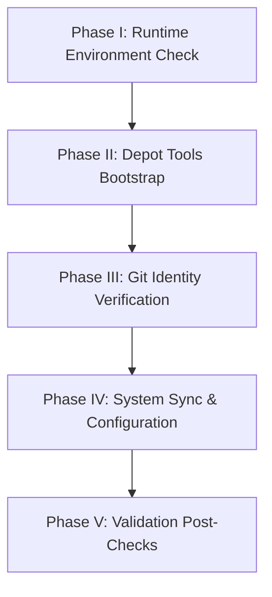

# Skill: Cobalt New Checkout Setup

Orchestrates environment analysis, workspace validation, persistent state recording, and post-checks execution across checked out working directories.

## Workspace Architecture Topology

Projects operating through `gclient` need structured directory bounds:

```
workspace/
  ├── .gclient                    <- Declarative dependencies configuration
  ├── .setup_checkpoints.json     <- Persistent execution checkpoints state
  ├── tools/
  │   └── depot_tools/            <- Native chromium build utilities
  └── src/                        <- Repository checkout root
      └── .agent/
          └── skills/
              └── cobalt-new-checkout/
                  └── scripts/
                      └── cobalt_new_checkout.py  <- Setup automation orchestrator
```

> [!IMPORTANT]
> Script logic executes mutations inside the directory enclosing the `src/` project code root. Verify runtime constraints allow write tasks inside matching paths.

---

## Sequential Execution Milestones

AI Assistants run actions by completing 5 primary configuration milestones:



### Phase I: Verification of Prerequisite Runtime Context

Validate execution dependencies and script parameters:
- Ensure `python3` availability.
- Check project repository root holds initialized `.git` state tracking.
- Check required arguments inside non-interactive executions (like `--github-user`).

### Phase II: Depot Tools Initialization & Installation

Establish Chromium infrastructure components:
- Confirm presence of `tools/depot_tools` sibling directory.
- Inject target path into session environment parameters.
- Perform confirmation test by calling validation check commands (`gclient --version`).

### Phase III: Repository Fork Binding & Connection Validation

Register development origins and configure tracking parameters:
- Verify connection accessibility (e.g. using `git ls-remote`).
- Configure Git tracking endpoints: `_gclient` and remote fork.

### Phase IV: External Engine Sync & Local Configurations

Execute heavy infrastructure synchronization workflows:
- Trigger `gclient sync` tasks.
- Write configuration matrices to local `.gclient` setup.
- Run build setup transformations (`cobalt/build/gn.py`).

### Phase V: Verification & System Post-Check Steps

Confirm stability metrics on completed compilation workspace environments:
- Validate static lint configurations execution via `pre-commit`.
- Verify source build tasks compile.

---

## Operational Modes

### Programmatic / Non-Interactive Operation (Recommended)

```bash
python3 .agent/skills/cobalt-new-checkout/scripts/cobalt_new_checkout.py --non-interactive --internal --github-user "<github_user>"
```

Options:
*   `--non-interactive`: Restricts prompt logic blocking from execution.
*   `--internal` / `--no-internal`: Specifies access configurations matching workspace context.
*   `--github-user`: Fork integration target parameter.
*   `--reset-checkpoints`: Drops tracking status markers to perform clean runs.

### Standalone User Interaction

```bash
python3 .agent/skills/cobalt-new-checkout/scripts/cobalt_new_checkout.py
```

---

## Recovery Strategies

System milestones persist to storage file `.setup_checkpoints.json`. In the event of underlying platform failure conditions:
1. Study generated exception output diagnostics.
2. Correct environmental faults.
3. Re-run setup orchestrations. The system begins tasks at the broken checkpoint.
