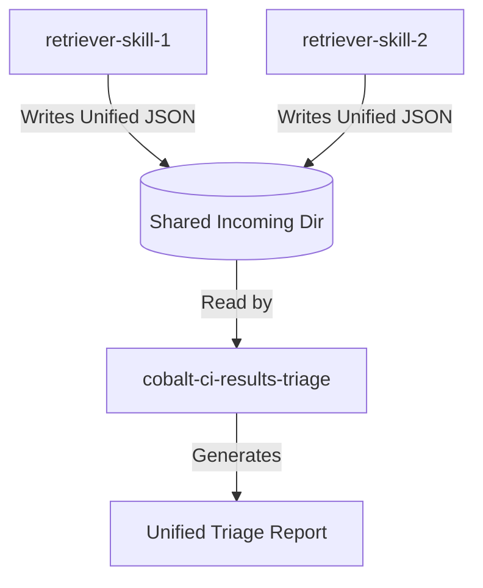

# CI Results Triage System Design

This document details the design of the refactored CI triage system for Cobalt.

## Goals
- **Separation of Concerns**: Retriever skills are only responsible for finding jobs and downloading logs. The triage skill is only responsible for analyzing logs and reporting.
- **Source Idempotency**: The triage processing is independent of the source of the results. The analyzer treats all results uniformly.
- **Unified Reporting**: A single report containing all failures, grouped by branch, with the source noted.

## Data Flow



1.  **Result Retrieval**: Retriever skills run and download logs.
2.  **Serialization**: They write metadata and local log paths to JSON files in the shared directory `/tmp/cobalt_gardener_${USER}/incoming/`.
3.  **Triage**: The `cobalt-ci-results-triage` skill reads all JSON files in the shared directory.
4.  **Analysis**: The analyzer processes the runs and jobs in the JSONs using unified rules.
5.  **Reporting**: A unified markdown report is generated.

## Unified Results Schema

Both retrieval skills must output JSON files conforming to this schema.

```json
{
  "$schema": "http://json-schema.org/draft-07/schema#",
  "title": "CIResults",
  "type": "object",
  "properties": {
    "source": {
      "type": "string",
      "description": "Identifier of the source CI system (e.g. 'github', 'kokoro')"
    },
    "total_jobs_fetched": {
      "type": "integer"
    },
    "runs": {
      "type": "array",
      "items": {
        "$ref": "#/definitions/Run"
      }
    }
  },
  "required": ["source", "total_jobs_fetched", "runs"],
  "definitions": {
    "Run": {
      "type": "object",
      "properties": {
        "run_id": {
          "type": "string"
        },
        "job_name": {
          "type": "string",
          "description": "Name of the workflow or parent job"
        },
        "branch": {
          "type": "string"
        },
        "event": {
          "type": "string"
        },
        "createdAt": {
          "type": "string",
          "format": "date-time"
        },
        "url": {
          "type": "string",
          "format": "uri"
        },
        "conclusion": {
          "type": "string",
          "description": "Conclusion of the run (e.g. 'success', 'failure', 'timed_out', 'cancelled', 'FAILED')"
        },
        "ignore_age": {
          "type": "boolean",
          "description": "Whether to bypass the recency check during triage analysis"
        },
        "failed_jobs": {
          "type": "array",
          "items": {
            "$ref": "#/definitions/FailedJob"
          }
        }
      },
      "required": ["run_id", "job_name", "branch", "url", "failed_jobs"]
    },
    "FailedJob": {
      "type": "object",
      "properties": {
        "name": {
          "type": "string",
          "description": "Name of the failed job or test target"
        },
        "url": {
          "type": "string",
          "format": "uri"
        },
        "local_log_path": {
          "type": "string",
          "description": "Absolute path to the downloaded log file"
        },
        "log_type": {
          "type": "string",
          "description": "Type of log (e.g. 'platform_log', 'test_log', 'synthetic')"
        },
        "device_system_log_path": {
          "type": "string",
          "description": "Absolute path to the downloaded device system log (if any)"
        },
        "device_logs_status": {
          "type": "string"
        }
      },
      "required": ["name", "url", "local_log_path"]
    }
  }
}
```

## Source Idempotent Processing

The `cobalt-ci-results-triage` analyzer (`unified_analyzer.py`) processes the unified schema as follows:

1.  **Read**: Load all JSON files matching `/tmp/cobalt_gardener_${USER}/incoming/*.json`.
2.  **Flatten**: Iterate over `runs` and then `failed_jobs` within each run.
3.  **Analyze**: For each job, read `local_log_path` (and `device_system_log_path` if present) and run regex-based classification rules.
4.  **Group**: Group the matches by `branch` (from the run metadata).
5.  **Report**:
    - For each branch, list the failures.
    - Note the `source` next to the job/run name.
    - The categorization of errors (infra, compile, test, etc.) is based on unified rules and is independent of the source.
