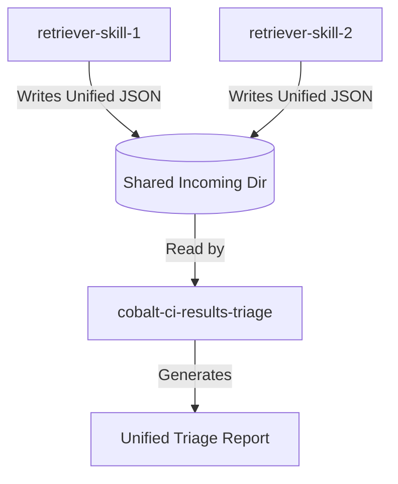

# CI Results Triage System Design

This document details the design of the refactored CI triage system for Cobalt.

## Goals
- **Separation of Concerns**: Retriever skills are only responsible for finding jobs and downloading logs. The triage skill is only responsible for analyzing logs and reporting.
- **Source Idempotency**: The triage processing is independent of the source of the results. The analyzer treats all results uniformly.
- **Unified Reporting**: A single report containing all failures, grouped by branch, with the source noted.

## Data Flow



1.  **Result Retrieval**: Retriever skills run and download logs.
2.  **Serialization**: They write metadata and local log paths to JSON files in the shared directory `/tmp/cobalt_gardener_${USER}/incoming/`.
3.  **Triage**: The `cobalt-ci-results-triage` skill reads all JSON files in the shared directory.
4.  **Analysis**: The analyzer processes the runs and jobs in the JSONs using unified rules.
5.  **Reporting**: A unified markdown report is generated.

## Unified Results Schema

All result retrieval skills must output JSON files conforming to the [Unified Results Schema](unified_results_schema.json).


## Source Idempotent Processing

The `cobalt-ci-results-triage` analyzer (`unified_analyzer.py`) processes the unified schema as follows:

1.  **Read**: Load all JSON files matching `/tmp/cobalt_gardener_${USER}/incoming/*.json`.
2.  **Flatten**: Iterate over `runs` and then `failed_jobs` within each run.
3.  **Analyze**: For each job, read `local_log_path` (and `device_system_log_path` if present) and run regex-based classification rules.
4.  **Group**: Group the matches by `branch` (from the run metadata).
5.  **Report**:
    - For each branch, list the failures.
    - Note the `source` next to the job/run name.
    - The categorization of errors (infra, compile, test, etc.) is based on unified rules and is independent of the source.

## Example Report Format

Below is an example of the unified markdown report generated by the triage system:

```markdown
# Unified CI Build Status Triage Report

## Job Stats

### Source: GITHUB
*   **Total Jobs Fetched**: 10
*   **Failed Jobs (Recent)**: 1
*   **Outdated Failed Runs**: 1
*   **Log Files Downloaded**: 1

### Source: KOKORO
*   **Total Jobs Fetched**: 5
*   **Failed Jobs (Recent)**: 1
*   **Outdated Failed Runs**: 0
*   **Log Files Downloaded**: 1

## Branch Health Report

### Branch: main (Unhealthy)
*   **Failed Jobs**: 1
*   **Outdated Failed Runs**: 1 (retrigger suggested)

### Branch: 25.lts.1.master (Unhealthy)
*   **Failed Jobs**: 1

### Branch: 25.lts.2.master (Healthy)
*   All runs completed successfully.

## Detailed Branch Failures

### Branch: main

#### Run: Nightly Build (ID: 123456) [GITHUB]
*   **URL**: https://github.com/youtube/cobalt/actions/runs/123456
*   **Failed Jobs**:
    *   **Job**: cobalt_linux_x64_test
        *   **URL**: https://github.com/youtube/cobalt/actions/runs/123456/job/1
        *   **Cached Log**: `/tmp/cobalt_gardener_user/incoming/github_logs/123456_cobalt_linux_x64_test.log`
        *   **Error Location(s)**:
            *   [github_log] [test_failure] Line 452: `[  FAILED  ] SbPlayerTest.GetPreferredVideoCodec/0`
                *   Log Slice Command: `tail -n +447 "/tmp/cobalt_gardener_user/incoming/github_logs/123456_cobalt_linux_x64_test.log" | head -n 11`

#### Outdated Failed Runs (Retrigger Suggested)

*   **Periodic Check** (ID: 123400, Event: schedule) [GITHUB] - Failed 2 day(s) ago.
    *   URL: https://github.com/youtube/cobalt/actions/runs/123400

### Branch: 25.lts.1.master

#### Run: Core Build (ID: 987654) [KOKORO]
*   **URL**: https://kokoro.googleplex.com/job/cobalt-25-lts-1-master/987654
*   **Failed Jobs**:
    *   **Job**: build-linux
        *   **URL**: https://kokoro.googleplex.com/job/cobalt-25-lts-1-master/987654/job/build-linux
        *   **Cached Log**: `/tmp/cobalt_gardener_user/incoming/kokoro_logs/987654_build-linux.log`
        *   **Error Location(s)**:
            *   [kokoro_log] [compilation_error] Line 87: `src/starboard/common/log.cc:23:10: fatal error: 'missing_header.h' file not found`
                *   Log Slice Command: `tail -n +82 "/tmp/cobalt_gardener_user/incoming/kokoro_logs/987654_build-linux.log" | head -n 11`
```
