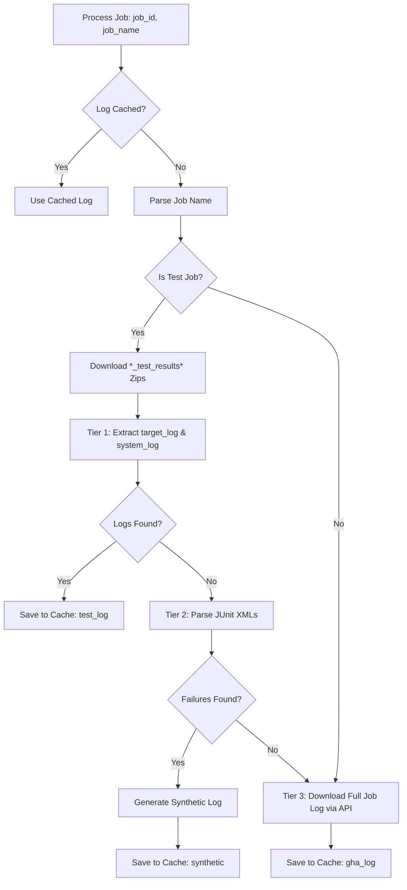

# GitHub Actions CI Results Retriever Design

> [!IMPORTANT]
> These scripts are specifically created for and should only be used by this skill. They are not intended to be used as a general library.

## Table of Contents

- [Overview](#overview)
- [Workflows and Job Graph](#workflows-and-job-graph)
- [Scripts Directory Tree](#scripts-directory-tree)
- [Tools and Dependencies](#tools-and-dependencies)
- [Detailed Implementation](#detailed-implementation)
    - [1. Discovery Phase](#1-discovery-phase)
    - [2. Triage & Download Phase](#2-triage--download-phase)
    - [3. Log Extraction & Parsing](#3-log-extraction--parsing)
    - [4. Output Generation](#4-output-generation)
- [Concurrency Model](#concurrency-model)
- [Caching and Performance](#caching-and-performance)
- [Error Handling and Resilience](#error-handling-and-resilience)
- [Updating the Script](#updating-the-script)

## Overview

The GitHub Actions (GHA) CI Results Retriever is designed to automatically discover recent completed workflow runs for Cobalt, identify failed jobs, and download their corresponding logs. It optimizes this process by caching logs and extracting specific test logs from build artifacts to avoid downloading massive full job logs when possible.

## Workflows and Job Graph

Cobalt runs several CI workflows on GitHub Actions, triggered by different events:
- **Postsubmit (Push)**: Triggered on pushes to main and release branches (e.g., `27.lts`, `26.android`). These are standard CI runs.
- **Nightly (Schedule / Workflow Dispatch)**: Triggered on a schedule or manually. These run more extensive tests.

The workflows are platform-specific (e.g., `android.yaml`, `evergreen.yaml`, `linux.yaml`, `raspi-2-modular.yaml`, `tvos.yaml`).

### Job Graph Structure

A single workflow run consists of multiple jobs, which can be grouped into:
1.  **Meta/Orchestration Jobs**: Jobs that setup environments or trigger other jobs.
2.  **Build Jobs**: Compile Cobalt for specific configurations.
3.  **Test Jobs**: Run test suites (GTest, WebPlatformTests, BlackBoxTests, etc.).
    *   Some test jobs run directly on GHA runners.
    *   Other test jobs might deploy to external device pools (e.g., Android emulator/devices) and run tests there,
        uploading results from GCS to GitHub as job artifacts.

### Artifacts Produced

-   **Job Logs**: Standard stdout/stderr from the runner. Available via GitHub API.
-   **Test Results Artifacts**: Named matching `*_test_results*`. These are zip files containing:
    *   JUnit XML files (e.g., `<target_name>_testoutput.xml`) containing structured test results (passes, failures, errors).
    *   Target-specific log files (e.g., `<target_name>_log.txt`).
    *   Device system logs (e.g., `<target_name>_device_logcat.txt` or `<target_name>_device_log.txt`) if run on a device/emulator.

## Scripts Directory Tree

```
scripts/
├── github_download.py          # Main execution script
└── github_download_test.py     # Unit tests
```

## Tools and Dependencies

-   **`gh` (GitHub CLI)**: The primary tool for interacting with GitHub. Must be authenticated.
    -   Commands used:
        -   `gh run list`: Lists workflow runs.
        -   `gh run view`: Views details of a specific run (including jobs).
        -   `gh run download`: Downloads artifacts for a run.
        -   `gh api`: Accesses raw GitHub REST API endpoints (used for downloading job logs).
-   **Python 3 Standard Library**:
    -   `subprocess`: To run `gh` CLI commands.
    -   `concurrent.futures`: For parallel execution (`ThreadPoolExecutor`).
    -   `xml.etree.ElementTree`: To parse JUnit XML files.
    -   `json`, `re`, `glob`, `tempfile`, `shutil`, `datetime`, `getpass`.

> [!IMPORTANT]
> Do NOT use MCP servers directly in the scripts. Scripts should rely on standard CLI tools or APIs. MCP servers are intended for use by the agent.

## Detailed Implementation

### 1. Discovery Phase

The script discovers which runs to triage. It operates in two modes:

#### A. Default Mode (Metadata Discovery)
1.  **Parse Build Status**: Read `cobalt/BUILD_STATUS.md` to identify active workflows.
    -   Uses regex to find workflow links
    -   Extracts: `workflow` (e.g., `android.yaml`), `event` (e.g., `push`), and `branch` (e.g., `main`).
2.  **Query Latest Runs**: For each discovered workflow configuration, query the latest completed run:
    ```bash
    gh run list \
      --workflow <workflow> \
      --branch <branch> \
      --event <event> \
      --limit 1 \
      --status completed \
      --json databaseId,status,conclusion,url,createdAt \
      -R youtube/cobalt
    ```
3.  **Age Check**:
    -   Parse `createdAt` (e.g., `2026-07-29T20:00:00Z`).
    -   Compare with current time.
    -   Nightly limit (`schedule` or `workflow_dispatch` events): **24 hours**.
    -   Postsubmit limit (all other events): **7 days**.
    -   If the run is older than the limit, it is skipped.
4.  **Skip Successful Runs**: If the run conclusion is `success`, it is skipped (no jobs fetched).
5.  **Fetch Jobs**: For failing, non-outdated runs, fetch the list of jobs:
    ```bash
    gh run view <run_id> --json jobs -R youtube/cobalt
    ```
    -   Extracts `databaseId`, `name`, and `url` for jobs where `conclusion` is `failure`.

#### B. Direct Run Mode (By Run ID)
If `--run-id <ID>` is provided:
1.  Query the specific run details:
    ```bash
    gh run view <run_id> --json databaseId,workflowName,headBranch,event,createdAt,url,jobs,conclusion -R youtube/cobalt
    ```
2.  Bypass the age check (sets `ignore_age: True`).
3.  Extract failed jobs directly from the `jobs` field in the response.

### 2. Triage & Download Phase

For each failed job in a run, the script attempts to retrieve logs in a tiered manner:



#### Job Classification
Parse the job name to determine if it is a test job:
-   `target_name`: The part after `:` in the job name (e.g., `build_and_test : base_unittests` -> `base_unittests`).
-   `platform`: The part before `/` in the job name (if present).
-   `is_test_job`: True if "test" or "results" is in the name, OR `target_name` is present.

#### Tier 1: Artifact Log Extraction (Test Jobs Only)
If the job is a test job and logs are not cached:
1.  **Download Test Results Artifacts**:
    ```bash
    gh run download <run_id> -p '*_test_results*' -D <temp_dir> -R youtube/cobalt
    ```
2.  **Extract Specific Logs**:
    -   Search `<temp_dir>` recursively for log files matching:
        -   With platform: `<temp_dir>/**/<platform>/**/<target_name>_log.txt`
        -   Without platform: `<temp_dir>/**/<target_name>_log.txt`
    -   Search for device/system logs matching:
        -   `.../<target_name>_device_logcat.txt`
        -   `.../<target_name>_device_log.txt`
    -   If found, copy to cache:
        -   Test log -> `<cache_dir>/<job_id>.log` (set `log_type` to `test_log`).
        -   System log -> `<cache_dir>/<job_id>_system_log.txt`.

#### Tier 2: JUnit XML Parsing & Synthetic Log (Test Jobs Fallback)
If Tier 1 fails to find log files but artifacts were downloaded:
1.  Search `<temp_dir>` recursively for JUnit XML files:
    -   With target: `<temp_dir>/**/<target_name>_testoutput.xml`
    -   Fallback: `<temp_dir>/**/*.xml`
2.  Parse XML files using `xml.etree.ElementTree`.
3.  Look for `<failure>` and `<error>` tags inside `<testcase>` elements.
4.  If failures are found, generate a **Synthetic Log** at `<cache_dir>/<job_id>.log` (set `log_type` to `synthetic`):
    ```
    JUnit Failure: {testsuite}.{testcase}
    Message: {message}
    Details:
    {details}
    ----------------------------------------
    ```

#### Tier 3: Full Job Log Download (Fallback for all jobs)
If Tier 1 & 2 do not yield logs (or if it is not a test job):
1.  Download the full console log via GitHub API:
    ```bash
    gh api repos/youtube/cobalt/actions/jobs/<job_id>/logs
    ```
2.  Save the stdout to `<cache_dir>/<job_id>.log` (set `log_type` to `gha_log`).

### 3. Log Extraction & Parsing

-   **JUnit XML**: Extracts `testsuite` name, `testcase` name, failure `message`, and failure `details` (stack trace).
-   **Log Caching**: Checked before any download. If `<cache_dir>/<job_id>.log` exists and is non-empty, it is used.
    -   Log type is determined by reading the first line (starts with `JUnit Failure:` -> `synthetic`) or checking for the companion system log (`test_log`), otherwise `gha_log`.

### 4. Output Generation

Writes a structured JSON to `--output` conforming to the [Unified Results Schema](<SKILLS_DIR>/cobalt_ci_results_triage/references/unified_results_schema.json):

```json
{
  "source": "github",
  "total_jobs_fetched": 45,
  "runs": [
    {
      "run_id": "102938475",
      "job_name": "linux.yaml",
      "branch": "main",
      "event": "push",
      "createdAt": "2026-07-29T18:30:00Z",
      "url": "https://github.com/youtube/cobalt/actions/runs/102938475",
      "conclusion": "failure",
      "failed_jobs": [
        {
          "job_id": 29384756,
          "name": "linux-x64x11 / test : base_unittests",
          "url": "https://github.com/youtube/cobalt/actions/jobs/29384756",
          "local_log_path": "/home/user/.cache/github_gardener_user/29384756.log",
          "log_type": "test_log",
          "device_system_log_path": "/home/user/.cache/github_gardener_user/29384756_system_log.txt"
        }
      ]
    }
  ]
}
```

## Concurrency Model

To handle I/O bottlenecks from heavy tool calls:
-   **Discovery Concurrency**: Uses `ThreadPoolExecutor` with `max_workers=10` to query workflow runs in parallel.
-   **Processing Concurrency**: Uses `ThreadPoolExecutor` with `max_workers=10` to process discovered runs in parallel.
-   Each run processing handles its own artifact downloads and job log downloads.

## Caching and Performance

-   **Cache Location**: Default is `~/.cache/github_gardener_{user}`, configurable via `--cache-dir`.
-   **Atomic Writes**: To prevent cache corruption during parallel writes or interruption, all files are written to `<filepath>.tmp` first and then atomically moved to `<filepath>` using `os.replace`.
-   **Avoid Redundant Downloads**:
    -   If a run is successful, it is skipped immediately.
    -   If a run is outdated, it is skipped immediately.
    -   If all failed jobs for a run already have logs in the cache, the script skips downloading the run artifacts (`*_test_results*`) entirely.

## Error Handling and Resilience

-   All subprocess executions (`gh` commands) capture stderr and raise `RuntimeError` on failure.
-   JUnit XML parsing is wrapped in try-except to handle malformed XML.
-   Temporary directories are managed using `tempfile.TemporaryDirectory` (as a context manager in `process_run` or cleaned up manually in `main` if using futures) to ensure they are cleaned up even if exceptions occur.

## Updating the Script

1.  **Test Coverage**: All critical logic (parsing, age check, cache detection, classification) is covered in `github_download_test.py`.
2.  **Add Tests First**: When modifying the script, add or update corresponding unit tests in `github_download_test.py` first.
3.  **Run Tests**: Execute tests using `pytest` before deploying changes.
