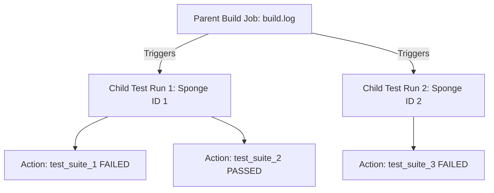
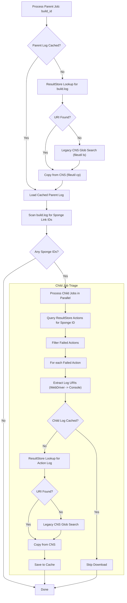

# Kokoro CI Results Retriever Design

> [!IMPORTANT]
> These scripts are specifically created for and should only be used by this skill. They are not intended to be used as a general library.

## Table of Contents

- [Overview](#overview)
- [Workflows and Job Graph](#workflows-and-job-graph)
- [Scripts Directory Tree](#scripts-directory-tree)
- [Tools and Dependencies](#tools-and-dependencies)
- [Detailed Implementation](#detailed-implementation)
    - [1. Discovery Phase](#1-discovery-phase)
    - [2. Status Retrieval](#2-status-retrieval)
    - [3. Parent Log Download](#3-parent-log-download)
    - [4. Child Job Expansion](#4-child-job-expansion)
    - [5. Output Generation](#5-output-generation)
- [Concurrency and Throttling](#concurrency-and-throttling)
- [Caching and Performance](#caching-and-performance)
- [Security Considerations](#security-considerations)
- [Updating the Script](#updating-the-script)

## Overview

The Kokoro CI Results Retriever is designed to discover failed Cobalt nightly builds run on Kokoro, download their main build logs from CNS, parse those logs to find child on-device test runs (Sponge invocations), query ResultStore for failed actions within those child runs, and download the corresponding test logs.

## Workflows and Job Graph

Cobalt uses Kokoro for nightly builds and on-device testing.
-   **Nightly Workflows**: Triggered periodically. Configured via GCL (Google Configuration Language) files.
-   **Platforms**: Includes configurations for various target platforms and build types (e.g., release, debug, evergreen).

### Job Graph Structure

Kokoro runs use a parent-child relationship:
1.  **Parent Build Job**: The main Kokoro job (e.g., `cobalt/main/build/linux/nightly`).
    *   Compiles Cobalt.
    *   Triggers on-device tests or emulator tests.
    *   Writes test trigger details (Sponge links) to its build log.
2.  **Child Test Jobs**: On-device test runs managed by a separate execution service (e.g., Cobalt On-Device Test runner).
    *   Represented by separate Sponge/ResultStore invocations.
    *   Run individual test suites (e.g., `web_platform_tests`, `gtests`).



### Artifacts Produced

-   **Parent Build Log (`build.log`)**: Console output of the main build. Contains compilation logs and links to child Sponge invocations. Stored in CNS.
-   **Child Test Logs**:
    *   **WebDriver Test Logs (`webDriverTestLog.ERROR`)**: Error logs from webdriver-based tests.
    *   **Test Output Logs (`test_output.txt` or `test.log`)**: Standard output from test execution.
-   All artifacts are stored in CNS (Colossus) and indexed by ResultStore.

## Scripts Directory Tree

```
scripts/
├── kokoro_download.py          # Main execution script
└── kokoro_download_test.py     # Unit tests
```

## Tools and Dependencies

-   **`stubby`**: Used to make RPC calls to Google internal services.
    -   `blade:kokoro-api` -> `KokoroApi.GetLatestBuild`: Queries job status.
    -   `blade:google.devtools.resultstore.v2.corpresultstoredownload-prod` -> `CorpResultStoreDownload.GetInvocation` and `ExportInvocation`: Queries ResultStore for artifacts and child actions.
-   **`fileutil`**: Used to interact with CNS.
    -   `fileutil ls`: Lists files in CNS (used for legacy path fallback).
    -   `fileutil cp`: Copies files from CNS to the local filesystem.
-   **`cs` (Code Search CLI)**: Used to discover GCL config files in the codebase.
-   **Python 3 Standard Library**:
    -   `subprocess`: To run `stubby`, `fileutil`, and `cs` commands.
    -   `concurrent.futures`: For parallel execution (`ThreadPoolExecutor`).
    -   `threading`: For thread-safe throttling (Semaphore, Lock).
    -   `json`, `re`, `glob`, `tempfile`, `datetime`, `getpass`, `logging`, `stat`.

> [!IMPORTANT]
> Do NOT use MCP servers directly in the scripts. Scripts should rely on standard CLI tools or APIs. MCP servers are intended for use by the agent.

## Detailed Implementation



### 1. Discovery Phase

Discovers active Kokoro jobs.

#### A. Discovery Mode (Default)
1.  **Code Search for GCLs**: Search for nightly GCL configurations:
    ```bash
    cs -l -f=nightly.gcl$ devtools/kokoro/config/prod/cobalt
    ```
2.  **Fallback to Local Directory**: If `cs` fails, scan the local depot path (if available):
    `/google/src/files/head/depot/google3/devtools/kokoro/config/prod/cobalt/**/nightly.gcl`
3.  **Parse Job Name and Branch**:
    -   Regex: `devtools/kokoro/config/prod/(?P<name>cobalt/(?P<branch>[^/]+)/.+)\.gcl`
    -   Extracts: Unique `job_name` (e.g., `cobalt/main/build/linux/nightly`) and `branch` (e.g., `main`).

#### B. Direct Queries (Bypasses Discovery)
-   `--job <job_name>`: Triage only the specified job name.
-   `--build <build_id>`: Directly triage the given Sponge invocation ID (skips status check and parent discovery).

### 2. Status Retrieval

For each discovered job, query the latest build status using Stubby:
-   **Service**: `blade:kokoro-api`
-   **Method**: `KokoroApi.GetLatestBuild`
-   **Request**: `full_job_name: "<job_name>"`
-   **Response Parsing**:
    -   `status`: Mapped to `FAILED` if the response status is 2 (FAILED), 4 (NOT_BUILT), 5 (ABORTED), or matching string representations. Otherwise, mapped to `SUCCESS`.
    -   `build_id`: Extracted to identify the parent run.
    -   `createdAt`: Parsed from `build_finish_time.seconds` or fallback to `build_start_time` (ms) and converted to UTC ISO format.

### 3. Parent Log Download

For failed parent builds, download the `build.log` from CNS.

#### Method 1: ResultStore Lookup (Preferred)
1.  Query ResultStore for the invocation's files. Uses a stubby field mask to limit response size to only file metadata.
    -   **Field Mask File Content**:
        ```
        [google.rpc.context.field_mask_context] {
          response_mask {
            paths: "files"
          }
        }
        ```
    -   **Command**:
        ```bash
        stubby call \
          --globaldb \
          --request_extensions_file=<temp_field_mask_file> \
          --output_json \
          blade:google.devtools.resultstore.v2.corpresultstoredownload-prod \
          CorpResultStoreDownload.GetInvocation \
          'name:"invocations/<build_id>"'
        ```
2.  Parse the response, find the file where `uid` is `build.log` (or ends with it), and extract its `uri`.
3.  Convert `googlefile:/cns/...` to `/cns/...`.

#### Method 2: Legacy CNS Pattern Search (Fallback)
If ResultStore lookup fails, search CNS using a glob pattern:
1.  **Command**:
    ```bash
    fileutil ls -- "/cns/vq-d/home/kokoro-dedicated/jenkins/spongeV2/prod/cobalt/*/build/*/*/<build_id>/build.log"
    ```
2.  Take the first matching path starting with `/cns/`.

#### Copying from CNS
1.  Create a secure temporary file in the cache directory.
2.  **Command**:
    ```bash
    fileutil cp -f -- <cns_path> <temp_local_path>
    ```
3.  Move to destination: `os.replace(temp_local_path, local_path)`.
    -   Destination: `<cache_dir>/sponge_log_<build_id>_build.log`

### 4. Child Job Expansion

If the parent `build.log` is successfully downloaded, check it for child runs.

1.  **Scan for Sponge Links**: Parse `build.log` using regex to find child invocation IDs:
    ```regex
    (?:http://goto\.google\.com/cobalt-on-device-tests/|http://sponge2(?:\.corp\.google\.com)?/|https://sponge\.corp\.google\.com/invocation\?id=)([a-fA-F0-9-]+)
    ```
2.  **Query Child Actions**: For each unique child `sponge_id`, query ResultStore for actions (individual test suites) using Stubby with a field mask.
    -   **Field Mask File Content**:
        ```
        [google.rpc.context.field_mask_context] {
          response_mask {
            paths: "next_page_token"
            paths: "actions.id"
            paths: "actions.status_attributes.status"
            paths: "actions.files"
          }
        }
        ```
    -   **Command**:
        ```bash
        stubby call \
          --globaldb \
          --request_extensions_file=<temp_field_mask_file> \
          --output_json \
          blade:google.devtools.resultstore.v2.corpresultstoredownload-prod \
          CorpResultStoreDownload.ExportInvocation \
          'name:"invocations/<sponge_id>"'
        ```
3.  **Identify Failed Actions**: Filter actions where status is FAILED, FAILED_TO_BUILD, or TOOL_FAILED (status codes 3, 6, 9).
4.  **Download Child Logs**: For failed actions, extract log URIs from `action.files`:
    -   Look for `webDriverTestLog.ERROR` (WebDriver test log) first.
    -   Fallback to `test_output.txt` or `test.log` (infra/console log).
    -   Download the chosen log from CNS using `fetch_sponge_log` (ResultStore lookup -> fallback pattern -> `fileutil cp`).
    -   Save to `<cache_dir>/sponge_log_<child_id>_<sanitized_filename>`.

### 5. Output Generation

Writes a structured JSON to `--output` conforming to the unified schema. It maps the parent-child structure into flat run objects:

```json
{
  "source": "kokoro",
  "total_jobs_fetched": 12,
  "runs": [
    {
      "run_id": "1a2b3c4d-5e6f-7a8b-9c0d-1e2f3a4b5c6d",
      "job_name": "cobalt/main/build/linux/nightly",
      "branch": "main",
      "event": "nightly",
      "createdAt": "2026-07-29T02:15:00Z",
      "url": "https://sponge.corp.google.com/invocation?id=1a2b3c4d-5e6f-7a8b-9c0d-1e2f3a4b5c6d",
      "conclusion": "FAILED",
      "failed_jobs": [
        {
          "name": "cobalt/main/build/linux/nightly (parent)",
          "url": "https://sponge.corp.google.com/invocation?id=1a2b3c4d-5e6f-7a8b-9c0d-1e2f3a4b5c6d",
          "local_log_path": "/tmp/kokoro_triage_user/sponge_log_1a2b3c4d-5e6f-7a8b-9c0d-1e2f3a4b5c6d_build.log",
          "log_type": "kokoro_log"
        },
        {
          "name": "black_box_test",
          "url": "https://sponge.corp.google.com/invocation?id=9f8e7d6c-5b4a-3f2e-1d0c-9b8a7f6e5d4c",
          "local_log_path": "/tmp/kokoro_triage_user/sponge_log_9f8e7d6c-5b4a-3f2e-1d0c-9b8a7f6e5d4c_webDriverTestLog.ERROR",
          "log_type": "test_log"
        }
      ]
    }
  ]
}
```

## Concurrency and Throttling

To achieve high performance without overloading internal services:
-   **Job Triage Concurrency**: Uses `ThreadPoolExecutor` with `max_workers=8` to query job statuses and process parent builds in parallel.
-   **Child Job Concurrency**: Within each parent build triage, child Sponge IDs are processed in parallel using a `ThreadPoolExecutor` with `max_workers=min(len(sponge_ids), 16)`.
-   **Subprocess Throttling**: A global semaphore `SUBPROCESS_SEMAPHORE = threading.Semaphore(16)` restricts the number of concurrent external processes (`stubby`, `fileutil`, `cs`) running at any given time across all threads.

## Caching and Performance

-   **Cache Location**: Defaults to `tempfile.gettempdir()/kokoro_triage_{user}` (typically `/tmp/kokoro_triage_{user}` on Linux).
-   **Avoid Re-downloads**: Checks if the target log file exists in cache and is non-empty before initiating ResultStore lookup or CNS copies.
-   **Atomic Writes**: Saves downloaded files to a temporary file (`tempfile.mkstemp`) inside the cache directory first, then renames it using `os.replace` to ensure thread safety and prevent corruption.

## Updating the Script

1.  **Test Coverage**: Core logic (discovery parsing, status translation, log URI extraction, security checks) is covered in `kokoro_download_test.py`.
2.  **Add Tests First**: When modifying the script, add or update corresponding unit tests in `kokoro_download_test.py` first.
3.  **Run Tests**: Execute tests using `pytest` before deploying changes.
