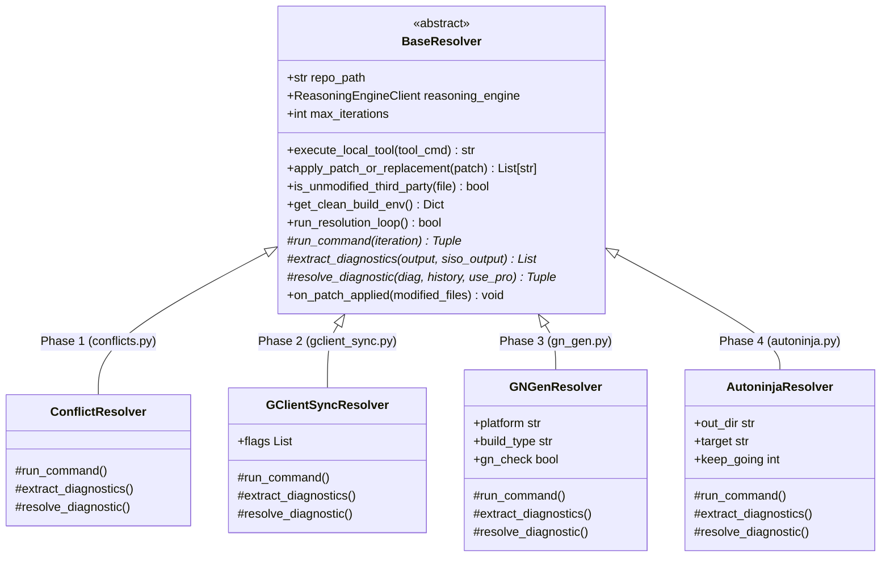

# Automated Cobalt Chromium Rebase & Self-Healing Pipeline

An autonomous, multi-phase AI-driven engineering pipeline powered by Google Cloud Vertex AI and Gemini. Designed to resolve merge conflicts, repair GN build definitions, and heal C++/Java compilation breaks across Chromium milestone upgrades (e.g. M138 to M139, M139 to M140) for Cobalt.

---

## 1. Architecture Overview

The pipeline decomposes rebase automation into five sequential, object-oriented self-healing phases built upon an extensible `BaseResolver` architecture and a decoupled Client–Server design:

```
┌─────────────────────────────────────────────────────────────────────────────┐
│ LOCAL CLIENT RUNNER (Developer Machine / CI Runner)                         │
│                                                                             │
│ Phase 1: Unified Conflict Resolution (conflicts.py -> ConflictResolver)     │
│   - Resolves DEPS merge conflicts & validates Python AST syntax             │
│   - Resolves C++, Java, GN, and config file conflict blocks                 │
│   - Multi-turn tool inspection (Read, Find, Grep, Git Show)                 │
│                                      │                                      │
│                                      v                                      │
│ Phase 2: Toolchain & Dependency Sync (gclient_sync.py -> GClientSyncResolver)│
│   - Synchronizes Clang, Rust, NDK, node_modules, and CIPD packages          │
│   - Auto-recovers with --force --reset and heals DEPS syntax errors         │
│                                      │                                      │
│                                      v                                      │
│ Phase 3: GN Generation & Header Verification (gn_gen.py -> GNGenResolver)   │
│   - Executes `cobalt/build/gn.py -p <platform> -C <build_type> --check`     │
│   - Deep 32KB trace parsing, target bridge resolution, import repair        │
│   - Callback hook: Auto-reruns Phase 2 sync if DEPS is modified             │
│                                      │                                      │
│                                      v                                      │
│ Phase 4: Compiler Self-Healing Loop (autoninja.py -> AutoninjaResolver)     │
│   - Invokes `autoninja -k 1 -C out/<dir> <target>`                          │
│   - Third-party source protection guardrail (routes fixes to BUILD.gn)      │
│   - Generates surgical SEARCH/REPLACE code patches via Vertex AI            │
│   - Escalates to Pro model (gemini-2.5-pro) on repeat diagnostics           │
│   - Callback hooks: Auto-reruns Phase 2 on DEPS and Phase 3 on build files  │
│                                      │                                      │
│                                      v                                      │
│ Phase 5: Comprehensive Report Generation (M140_rebase_summary.md)           │
│   - Generates final execution metrics and verification summary              │
└──────────────────────────────────────┬──────────────────────────────────────┘
                                       │
                ReasoningEngineClient (engine_client.py)
                - Automatic Connection Retries
                - Exponential Backoff for 429/503/Transient Errors
                                       │
                                       ▼
┌─────────────────────────────────────────────────────────────────────────────┐
│ HOSTED VERTEX AI REASONING ENGINE (reasoning_engine/engine.py in GCP)       │
│                                                                             │
│ - CobaltReasoningEngine service running in Vertex AI Container              │
│ - Server-Side GCS Knowledge Memory Bank (gs://.../knowledge_bank.json)      │
│ - Declarative Domain Skills (skills/*.md)                                   │
│ - Gemini 2.5 Flash / Pro LLM Execution via google.genai SDK                 │
└─────────────────────────────────────────────────────────────────────────────┘
```

---

## 2. Directory Structure

```
.github/rebase/
│
├── base_resolver.py       # [CORE] Abstract base class (loop, tools, guards, patch engine)
├── engine_client.py       # [CLIENT] ReasoningEngineClient proxy with retries & backoff
├── conflicts.py           # [PHASE 1] ConflictResolver library (DEPS & source conflicts)
├── gclient_sync.py        # [PHASE 2] GClientSyncResolver library (toolchain sync)
├── gn_gen.py              # [PHASE 3] GNGenResolver library (GN build verification)
├── autoninja.py           # [PHASE 4] AutoninjaResolver library (compiler feedback loop)
├── run_rebase_pipeline.py # [ORCHESTRATOR] Clean orchestrator managing Phase 1-5 execution
├── token_usage.py         # Token tracking and cost metrics
├── test_rebase_suite.py   # Comprehensive unit test suite (26 unit tests)
│
└── reasoning_engine/      # [DEPLOYED TO VERTEX AI]
    ├── engine.py          # CobaltReasoningEngine service & native GCS memory bank
    ├── deploy.py          # Vertex AI deployment & lifecycle CLI
    ├── chat.py            # Interactive terminal debugger
    └── skills/            # Declarative domain instructions (Markdown)
        ├── cobalt_rebase.md       # Master guidelines & behavior preservation
        ├── compiler_healing.md    # Compiler & linker break repair heuristics
        ├── gn_healing.md          # GN build rules & visibility repair
        └── conflict_resolution.md # DEPS AST & merge conflict rules
```

---

## 3. Quick Start & Execution

### Prerequisites
1. **Google Cloud Authentication**:
   ```bash
   gcloud auth application-default login
   export GCP_PROJECT="your-gcp-project-id"
   export GCP_LOCATION="us-central1"
   ```
2. **Environment**:
   Ensure `depot_tools` is in your `PATH`.

---

### Running the End-to-End Pipeline

To execute all phases sequentially for Android (`cobalt_apk`) connected to your hosted Reasoning Engine:
```bash
python3 .github/rebase/run_rebase_pipeline.py \
  --platform android-arm \
  --build-type devel \
  --target cobalt_apk \
  --reasoning-engine-id "<YOUR_REASONING_ENGINE_RESOURCE_ID>"
```

For Linux Desktop:
```bash
python3 .github/rebase/run_rebase_pipeline.py \
  --platform linux-x64x11 \
  --build-type devel \
  --target cobalt \
  --reasoning-engine-id "<YOUR_REASONING_ENGINE_RESOURCE_ID>"
```

---

### Selective Phase Execution via Flags

You can skip or run specific phases using orchestrator flags:

* **Skip merge conflict phase (start directly at toolchain sync)**:
  ```bash
  python3 .github/rebase/run_rebase_pipeline.py --skip-conflicts ...
  ```

* **Skip toolchain sync**:
  ```bash
  python3 .github/rebase/run_rebase_pipeline.py --skip-sync ...
  ```

* **Skip GN generation**:
  ```bash
  python3 .github/rebase/run_rebase_pipeline.py --skip-gn ...
  ```

* **Skip compiler build (e.g. only run conflict resolution & sync)**:
  ```bash
  python3 .github/rebase/run_rebase_pipeline.py --skip-build ...
  ```

---

## 4. Object-Oriented Resolver Design (`BaseResolver`)

Every phase is a subclass of `BaseResolver` in `base_resolver.py`:



### Inter-Phase Callbacks (`on_patch_applied_fn`)
Resolvers communicate dynamically without hardcoded coupling via callbacks configured in `run_rebase_pipeline.py`:
- **Phase 3/4 $\to$ Phase 2**: When a patch modifies `DEPS`, `sync_resolver` is automatically triggered.
- **Phase 4 $\to$ Phase 3**: When a compiler patch modifies `.gn`, `.gni`, or `.star` files, `gn_resolver` is automatically triggered to refresh the build graph.

---

## 5. Domain Skills (`reasoning_engine/skills/`)

Rebase heuristics and error patterns are maintained in declarative Markdown files loaded directly into Vertex AI prompts:

* **`reasoning_engine/skills/cobalt_rebase.md`**: Master behavior preservation principles, Starboard macros (`USE_STARBOARD_MEDIA`, `IS_COBALT`), and investigation workflows using Chromium Code Search (`source.chromium.org`) and Gitiles (`chromium.googlesource.com`).
* **`reasoning_engine/skills/compiler_healing.md`**: C++/Java header splits (e.g. `base/notimplemented.h`, `base/timer/elapsed_timer.h`), method signature updates, and Mojo union patterns (`blink::mojom::MatchResponse`).
* **`reasoning_engine/skills/gn_healing.md`**: GN visibility rules, target bridge synthesis (`group("freetype")`), and duplicate argument import rules.
* **`reasoning_engine/skills/conflict_resolution.md`**: Upstream roll priority, DEPS syntax rules, and multi-turn tool commands.

---

## 6. Long-Term Knowledge Bank & Server-Side GCS Memory

The Reasoning Engine natively manages the knowledge memory bank on Google Cloud Storage (`gs://<bucket>/rebase_memory/knowledge_bank.json`).
* **Zero Client Setup**: Rebase workers and Cloudtop instances do not need to pull or manage memory files locally.
* **Auto-Retrieval**: When diagnosing errors, the Reasoning Engine automatically queries its cloud memory bank and injects relevant past lessons into prompts.
* **Real-time Synchronization**: When an AI fix is verified and passes compilation, `CobaltReasoningEngine` records the resolution directly into GCS in real-time.

Configure your GCS bucket URI (or set default `$GCS_MEMORY_URI`):
```bash
export GCS_MEMORY_URI="gs://your-bucket-name/rebase_memory/knowledge_bank.json"
```

---

## 7. Running Unit Tests & Quality Checks

* **Run Unit Tests**:
  ```bash
  python3 -m unittest discover -s .github/rebase -p "test_*.py"
  ```

* **Run Code Quality Check**:
  ```bash
  ~/depot_tools/pylint-3.2 .github/rebase/*.py .github/rebase/reasoning_engine/*.py
  ```
