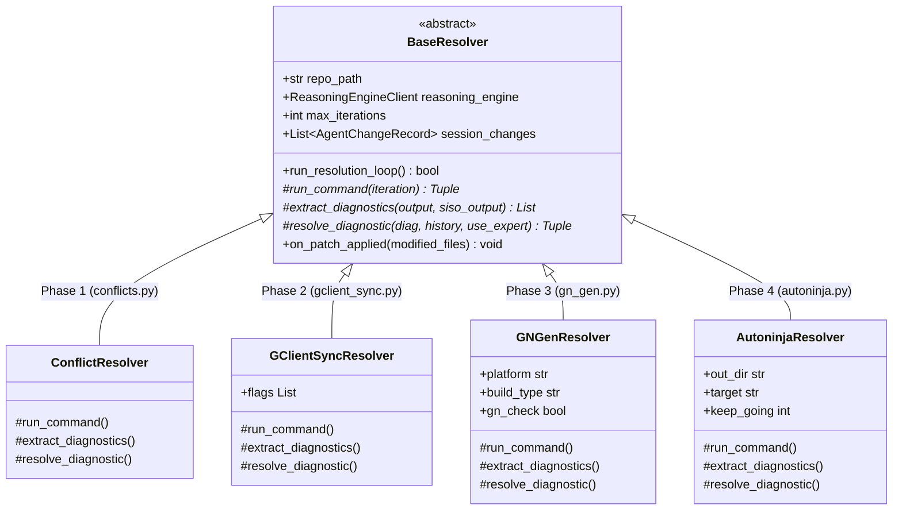

# Automated Cobalt Chromium Rebase & Self-Healing Pipeline

An autonomous, multi-phase AI-driven engineering pipeline powered by Google Cloud Vertex AI and Gemini. Designed to resolve merge conflicts, repair GN build definitions, and heal C++/Java compilation breaks across Chromium milestone upgrades (e.g. M138 to M139, M139 to M140) for Cobalt.

---

## 1. Architecture Overview

The pipeline decomposes rebase automation into five self-healing phases built upon an extensible `BaseResolver` architecture:

```
┌─────────────────────────────────────────────────────────────────────────────┐
│ LOCAL CLIENT RUNNER (Developer Machine / CI Runner)                         │
│                                                                             │
│ Phase 1: Unified Conflict Resolution (conflicts.py -> ConflictResolver)     │
│   - Resolves DEPS merge conflicts & validates Python AST syntax             │
│   - Resolves C++, Java, GN, and config file conflict blocks                 │
│   - Multi-turn tool inspection (Read, Find, Grep, Git Show)                 │
│                                      │                                      │
│                                      v                                      │
│ Phase 2: Toolchain/Dependency Sync (gclient_sync.py -> GClientSyncResolver) │
│   - Synchronizes Clang, Rust, NDK, node_modules, and CIPD packages          │
│   - Auto-recovers with --force --reset and heals DEPS syntax errors         │
│                                      │                                      │
│                                      v                                      │
│ Phase 3: GN Generation & Header Verification (gn_gen.py -> GNGenResolver)   │
│   - Executes `cobalt/build/gn.py -p <platform> -C <build_type> --check`     │
│   - Callback hook: Auto-reruns Phase 2 sync if DEPS is modified             │
│                                      │                                      │
│                                      v                                      │
│ Phase 4: Compiler Self-Healing Loop (autoninja.py -> AutoninjaResolver)     │
│   - Invokes `autoninja -k 1 -C out/<dir> <target>`                          │
│   - Generates surgical SEARCH/REPLACE code patches via Vertex AI            │
│   - Escalates expert role on repeat diagnostics                             │
│   - Callback hooks: Auto-reruns Phase 2 on DEPS and Phase 3 on build files  │
│                                      │                                      │
│                                      v                                      │
│ Phase 5: Comprehensive Report Generation (e.g. M140_rebase_summary.md)      │
│   - Generates final execution metrics and verification summary              │
└─────────────────────────────────────────────────────────────────────────────┘
```

---

## 2. Directory Structure

```
.github/rebase/
│
├── base_resolver.py       # [CORE] BaseResolver: shared self-healing loop & change records
├── diagnostics.py         # [CORE] Diagnostic dataclasses parsed from failed commands
├── tools.py               # [CORE] TOOL_* investigation directives (read, grep, git, gh)
├── repo_guards.py         # [CORE] Repo path confinement & patch-target validation
├── patching.py            # [CORE] SEARCH/REPLACE, DELETE & unified-diff patch engine
├── engine_client.py       # [CLIENT] ReasoningEngineClient proxy with retries & backoff
├── conflicts.py           # [PHASE 1] ConflictResolver library (DEPS & source conflicts)
├── gclient_sync.py        # [PHASE 2] GClientSyncResolver library (toolchain sync)
├── gn_gen.py              # [PHASE 3] GNGenResolver library (GN build verification)
├── autoninja.py           # [PHASE 4] AutoninjaResolver library (compiler feedback loop)
├── run_rebase_pipeline.py # [ORCHESTRATOR] Clean orchestrator managing Phase 1-5 execution
├── token_usage.py         # Per-model token totals (from engine-reported usage)
├── test_rebase_suite.py   # Unit test suite (python3 -m unittest)
├── requirements.in        # Top-level Python dependencies
├── requirements.txt       # Hash-pinned lock file (pip --require-hashes)
│
└── reasoning_engine/      # [DEPLOYED TO VERTEX AI]
    ├── engine.py          # CobaltReasoningEngine service (prompts & model calls)
    ├── deploy.py          # Vertex AI deployment & lifecycle CLI
    ├── chat.py            # Interactive terminal debugger
    ├── requirements.txt   # Packages installed into the hosted engine
    └── skills/            # Declarative domain instructions (Markdown)
        ├── cobalt_rebase.md           # Master guidelines & behavior preservation
        ├── cobalt_rebase_patterns.md  # Recurring Cobalt-specific rebase patterns
        ├── compiler_healing.md        # Compiler & linker break repair heuristics
        ├── gn_healing.md              # GN build rules & visibility repair
        ├── conflict_resolution.md     # DEPS AST & merge conflict rules
        └── roll_history.md            # Using past roll PRs as ground truth
```

---

## 3. Quick Start & Execution

### Prerequisites
1. **Google Cloud Authentication**:
   ```bash
   gcloud auth application-default login
   export GCP_PROJECT="your-gcp-project-id"
   export GCP_LOCATION="us-central1"
   ```
2. **Environment**:
   Ensure `depot_tools` is in your `PATH`.
3. **Python dependencies**:
   ```bash
   python3 -m pip install --require-hashes -r .github/rebase/requirements.txt
   ```

---

### Running the End-to-End Pipeline

To execute all phases sequentially for Android (`cobalt_apk`) connected to your hosted Reasoning Engine:
```bash
python3 .github/rebase/run_rebase_pipeline.py \
  --platform android-arm \
  --build-type devel \
  --target cobalt_apk \
  --reasoning-engine-id "<YOUR_REASONING_ENGINE_RESOURCE_ID>"
```

For Linux Desktop:
```bash
python3 .github/rebase/run_rebase_pipeline.py \
  --platform linux-x64x11 \
  --build-type devel \
  --target cobalt \
  --reasoning-engine-id "<YOUR_REASONING_ENGINE_RESOURCE_ID>"
```

---

### Selective Phase Execution via Flags

You can skip or run specific phases using orchestrator flags:

* **Skip merge conflict phase (start directly at toolchain sync)**:
  ```bash
  python3 .github/rebase/run_rebase_pipeline.py --skip-conflicts ...
  ```

* **Skip toolchain sync**:
  ```bash
  python3 .github/rebase/run_rebase_pipeline.py --skip-sync ...
  ```

* **Skip GN generation**:
  ```bash
  python3 .github/rebase/run_rebase_pipeline.py --skip-gn ...
  ```

* **Skip compiler build (e.g. only run conflict resolution & sync)**:
  ```bash
  python3 .github/rebase/run_rebase_pipeline.py --skip-build ...
  ```

Or pick a preset with `--mode`:

| `--mode` | Phases |
|---|---|
| `resolve-conflicts` | Phase 1 only |
| `gn-gen` | Phases 1-3 |
| `build-only` | Phase 4 only |
| `full-pipeline` | Phases 1-4 |

---

### Models and Local (In-Process) Runs

* `--model` (workhorse) and `--expert-model` (escalations on repeated
  diagnostics) are both required; the pipeline has no built-in model
  defaults. In CI they come from the `ai_rebase_resolver.yaml` inputs.
* `--local` (or `REBASE_LOCAL=1`) runs `CobaltReasoningEngine` in-process
  instead of calling the hosted Reasoning Engine, so no
  `--reasoning-engine-id` is needed:
  ```bash
  python3 .github/rebase/run_rebase_pipeline.py --local \
    --platform android-arm --build-type devel --target cobalt_apk
  ```

---

### Running in CI (GitHub Actions)

`.github/workflows/ai_rebase_resolver.yaml` (manual `workflow_dispatch`) runs
the pipeline from the in-tree copy of this directory, i.e.
`src/.github/rebase` of the PR / commit being resolved; no separate agent
checkout is needed. Inputs: `pr_number` and/or `commit_sha`, `mode`, `model`,
`expert_model`, `ai_branch_prefix` and `dry_run` (default `true`, skips
pushing the AI branch and opening a PR).

---

## 4. Object-Oriented Resolver Design (`BaseResolver`)

Every phase is a subclass of `BaseResolver` in `base_resolver.py`:


```mermaid
classDiagram
    class BaseResolver {
        <<abstract>>
        +str repo_path
        +ReasoningEngineClient reasoning_engine
        +int max_iterations
        +List~AgentChangeRecord~ session_changes
        +run_resolution_loop() bool
        #run_command(iteration)* Tuple
        #extract_diagnostics(output, siso_output)* List
        #resolve_diagnostic(diag, history, use_expert)* Tuple
        +on_patch_applied(modified_files) void
    }

    class ConflictResolver {
        #run_command()
        #extract_diagnostics()
        #resolve_diagnostic()
    }
    class GClientSyncResolver {
        +flags List
        #run_command()
        #extract_diagnostics()
        #resolve_diagnostic()
    }
    class GNGenResolver {
        +platform str
        +build_type str
        +gn_check bool
        #run_command()
        #extract_diagnostics()
        #resolve_diagnostic()
    }
    class AutoninjaResolver {
        +out_dir str
        +target str
        +keep_going int
        #run_command()
        #extract_diagnostics()
        #resolve_diagnostic()
    }

    BaseResolver <|-- ConflictResolver : Phase 1 (conflicts.py)
    BaseResolver <|-- GClientSyncResolver : Phase 2 (gclient_sync.py)
    BaseResolver <|-- GNGenResolver : Phase 3 (gn_gen.py)
    BaseResolver <|-- AutoninjaResolver : Phase 4 (autoninja.py)
```

### Inter-Phase Callbacks (`on_patch_applied_fn`)
Resolvers communicate dynamically without hardcoded coupling via callbacks configured in `run_rebase_pipeline.py`:
- **Phase 3/4 $\to$ Phase 2**: When a patch modifies `DEPS`, `sync_resolver` is automatically triggered.
- **Phase 4 $\to$ Phase 3**: When a compiler patch modifies `.gn`, `.gni`, or `.star` files, `gn_resolver` is automatically triggered to refresh the build graph.

### Safety Guardrails
`repo_guards.py` enforces these before any AI tool call or patch runs:
- **Repository confinement**: `resolve_repo_file_path` returns `""` for any
  path that resolves outside the repo (absolute paths, `../` traversal), so
  `TOOL_READ_FILE`, `TOOL_LIST_DIR` and SEARCH/REPLACE / DELETE / diff targets
  cannot touch files elsewhere on the host.
- **Patch target validation** (`patch_target_rejection`): rejects build
  outputs and binaries, generated files under `out/` / `gen/`, global build
  configs (`cobalt/build/configs/`, `args.gn`), and unmodified third-party
  sources. The rejection reason is stored in the change record, so the
  model sees why its patch was not applied on the next attempt.

---

## 5. Domain Skills (`reasoning_engine/skills/`)

Rebase heuristics and error patterns are maintained in declarative Markdown files loaded directly into Vertex AI prompts:

* **`reasoning_engine/skills/cobalt_rebase.md`**: Master behavior preservation principles, Starboard macros (`USE_STARBOARD_MEDIA`, `IS_COBALT`), and investigation workflows using Chromium Code Search (`source.chromium.org`) and Gitiles (`chromium.googlesource.com`).
* **`reasoning_engine/skills/compiler_healing.md`**: C++/Java header splits (e.g. `base/notimplemented.h`, `base/timer/elapsed_timer.h`), method signature updates, and Mojo union patterns (`blink::mojom::MatchResponse`).
* **`reasoning_engine/skills/gn_healing.md`**: GN visibility rules, target bridge synthesis (`group("freetype")`), and duplicate argument import rules.
* **`reasoning_engine/skills/conflict_resolution.md`**: Upstream roll priority, DEPS syntax rules, and multi-turn tool commands.
* **`reasoning_engine/skills/cobalt_rebase_patterns.md`**: Recurring Cobalt-specific patterns (e.g. Privacy Sandbox pruning) to preserve across rolls.
* **`reasoning_engine/skills/roll_history.md`**: How to use merged roll PRs (bot baseline commits vs. human fix commits) as ground truth.

Skills are loaded once when the engine starts, so edits take effect on the
next run (or after redeploying the hosted engine with `reasoning_engine/deploy.py`).

---

## 6. Change History (`AgentChangeRecord`)

Every patch the agent applies, fails to apply or reverts during a run is kept
as an `AgentChangeRecord` (phase, iteration, target file, file changes,
resulting error and command output). The records are shared by all phases and
are visible to the model through `TOOL_GET_HISTORY`. Nothing is carried over
between runs; domain knowledge lives in the skills (section 5).

At the end of every run, successful or not, the pipeline writes the records to
`out/rebase_results/change_history.json`. In CI, `ai_rebase_resolver.yaml`
uploads that file to
`gs://cobalt-actions-prod-agent/rebase_changes/<run_id>-<run_attempt>/change_history.json`
(`CHANGE_HISTORY_GCS_DIR` in the job `env`).

---

## 7. Running Unit Tests & Quality Checks

* **Run Unit Tests**:
  ```bash
  python3 -m unittest discover -s .github/rebase -p "test_*.py"
  ```

* **Run Code Quality Check** (same hooks as CI: yapf, pylint, ...):
  ```bash
  pre-commit run --files .github/rebase/*.py .github/rebase/reasoning_engine/*.py
  ```
