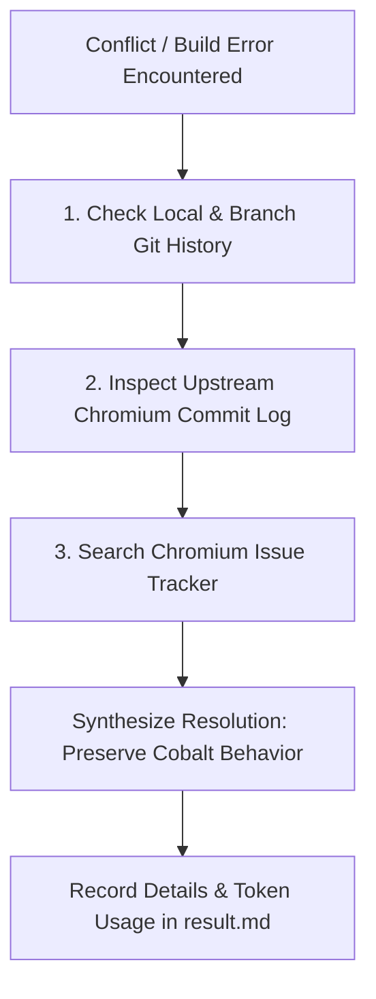

# Cobalt Chromium Rebase & Conflict Resolution Skill

When rebasing Cobalt onto a new Chromium milestone (e.g., M138 -> M139) or resolving autoroll conflicts, use this skill to understand the root cause of conflicts, preserve Cobalt's existing behavior, and record metrics in `result.md`.

---

## 1. Pipeline Iteration & Retry Budget Guidelines (Empirical M139 Rebase Data)

Based on empirical data from the M139 rebase (56 merge conflicts resolved, ~50 breaking API/linker issues fixed, and 62 `autoninja` invocations across Desktop Linux and Android):

| Pipeline Phase | Recommended Retry / Iteration Budget | Rationale & Progress Tracking |
| :--- | :---: | :--- |
| **API / Network Glitches** | **5 attempts** | Exponential backoff (3s, 6s, 9s, 12s, 15s) for transient HTTP 429 rate limits and network timeouts. |
| **Conflict File Splicing** | **5 attempts** | Syntax repair attempts with `ast.parse()` (for `DEPS`) or compiler verification. |
| **`gclient sync -D` Self-Healing** | **10 attempts** | Resolves submodule index drift (e.g. `fuzztest`), obsolete directory purges, and `DEPS` revision pins. |
| **`autoninja` Target Build (Linux)** | **60 iterations** | Fixes multi-stage breaking C++ API migrations, GN check rules, header splits, and component visibility across `content_shell` and `cobalt`. |
| **`autoninja` Target Build (Android)** | **20 iterations** | Fixes Android JNI delegates, Java templates (`StarboardFeatures.java.tmpl`), and platform linker guards. |
| **Global Compiler Safety Guard** | **75 iterations total** | Stop early only if stuck on the **exact same** compiler diagnostic for >5 consecutive cycles without progress. |

---

## 2. Investigation Workflow (When Unsure How to Resolve)

If the resolution is ambiguous or involves complex API churn, **do not guess**. Follow this 3-step investigation process:



### Step 1: Check Local Git History
Understand how Cobalt previously modified the conflicted file:
* **View file history in Cobalt**:
  ```bash
  git log -n 5 -p -- <conflicted_file>
  ```
* **Inspect the conflicted commit metadata**:
  ```bash
  git log -1 --format="%H %B" HEAD
  ```
* **Check prior rebase/roll commits**:
  Identify how previous rolls added special Cobalt shims, build flags, or submodule mappings.

---

### Step 2: Inspect Upstream Chromium via Code Search & Gitiles
Determine why Chromium upstream modified the file, interface, or dependency:

1. **Chromium Code Search (source.chromium.org)**:
   * **Symbol Search**: Find class definitions, callers, and new method signatures:
     `https://source.chromium.org/chromium/chromium/src/+/main:?q=symbol:<SymbolName>`
   * **Header Moves & Splits**: Locate where deleted/moved headers migrated:
     `https://source.chromium.org/chromium/chromium/src/+/main:?q=file:<path>+"<keyword>"`
   * **Milestone-Scoped Search**: Inspect exact milestone implementations:
     `https://source.chromium.org/chromium/chromium/src/+/refs/tags/139.0.7244.0:?q=class:<ClassName>`

2. **Chromium Gitiles (chromium.googlesource.com)**:
   * **View Exact Commit Diff**: Extract upstream commit SHA from commit message:
     `https://chromium.googlesource.com/chromium/src/+/<upstream_sha>`
   * **View File History**: Trace all changes to an upstream source file:
     `https://chromium.googlesource.com/chromium/src/+log/main/<relative_filepath>`
   * **Raw File at Specific Tag**: View clean upstream file without conflict markers:
     `https://chromium.googlesource.com/chromium/src/+/refs/tags/139.0.7244.0/<relative_filepath>`

3. **Local Git Exploration**:
   ```bash
   git show <upstream_sha>
   git log -n 5 -p origin/main -- <relative_filepath>
   ```

---

### Step 3: Search Chromium's Public Issue Tracker (issues.chromium.org)
When upstream changes deprecate APIs or remove interfaces:
* **Extract Bug IDs**: Look for `Bug: <id>` or `Fixed: chromium:<id>` in the commit message.
* **Query Issue Tracker**:
  * Navigate to: `https://issues.chromium.org/issues/<id>`
  * Search keywords: `https://issues.chromium.org/issues?q=<symbol_or_error_message>`
* **Look for**:
  * Intent-to-Ship / Intent-to-Remove notices.
  * Design documents and API migration guides.
  * Related Chromium CLs providing replacement patterns.

---

## 3. Core Behavior Preservation Principles

> [!IMPORTANT]
> **Preserve Cobalt Behavior**: If an upstream Chromium API changed or runtime behavior shifted, **always strive to preserve current Cobalt behavior** rather than silently accepting upstream behavioral regressions.

1. **Preserve Cobalt Semantics with Shims / Macro Guards**:
   * If a method was removed or altered in Chromium, adapt the call site or introduce a compatibility wrapper to retain Cobalt's runtime semantics.
   * Preserve Cobalt macro blocks:
     * `#if BUILDFLAG(USE_STARBOARD_MEDIA)`
     * `#if BUILDFLAG(IS_COBALT)`
     * Starboard platform bridges and media decoders.
   * Preserve custom Cobalt variables in `DEPS` (`checkout_cobalt_internal`, `checkout_copybara`, Cobalt submodules).

2. **Upstream Priority for Standard Toolchains & Repos**:
   * For standard Chromium third-party dependencies, CIPD packages, tools, and build configurations, adopt upstream revisions unless Cobalt has an explicit override.

3. **Syntactic & Functional Verification**:
   * **DEPS**: Verify with `ast.parse()` and run `gclient sync --nohooks --no-history`.
   * **Source Files**: Run `autoninja -C out/Default cobalt:cobalt` to verify compilation.

4. **Milestone build flags**
   * You may see build flag like `CHROMIUM_MILESTONE_LE_138`, which means the edit is only for milestone less than 138. For milestone larger than 138,
   use upstream code. It is mostly used with `BUILDFLAG(ENABLE_PRIVACY_SANDBOX_APIS)`, because a lot of Privacy Sandbox APIs are removed before M152.
   Therefore, if the conflicts are due to the removel, just use upstream changes.

---

## 4. Known M139 Breaking Patterns & Resolutions Reference

* **`base/notimplemented.h` Separation:** In M139, `NOTIMPLEMENTED()` and `NOTIMPLEMENTED_LOG_ONCE()` were moved from `notreached.h` to `base/notimplemented.h`. Add `#include "base/notimplemented.h"` wherever used.
* **Skia `pathops` Merge:** Removed `//third_party/skia/modules/pathops/pathops.gni` imports (Skia integrated `pathops` into core).
* **Deleted Tracing Flags:** Removed deleted `enable_base_tracing` from GN build targets.
* **`NavigationThrottle` Signature:** Updated constructor signature to `content::NavigationThrottleRegistry& registry`.
* **CapturedSurfaceController Linker Duplication:** Added desktop screen capture files to `sources -=` under `if (is_cobalt)` in `content/browser/BUILD.gn`.
* **Java Feature Template Parsing:** Ensure `package ...` declaration starts at column 0 in `StarboardFeatures.java.tmpl`.
* **`JavascriptInjector` API:** Use the updated 3-argument signature (`addPossiblyUnsafeInterface`).
* **Submodule Index Drift:** Align Git index with DEPS (`git add third_party/fuzztest/src && git commit --amend --no-verify --no-edit`).

---

## 5. Reporting in `result.md`

Whenever the AI resolves conflicts or performs a rebase iteration, it **MUST generate or update `result.md`** in the rebase workspace root with:
1. Target roll commit & upstream SHA.
2. Conflicts resolved and behavioral shims applied.
3. Code diff summary.
4. Token consumption metrics (prompt tokens, completion tokens, total tokens, model calls).
5. Build and sync verification status.
