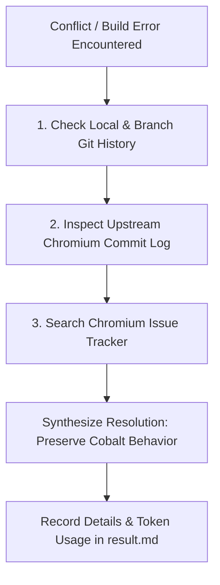

# Cobalt Chromium Rebase & Conflict Resolution Skill

When rebasing Cobalt onto a new Chromium milestone (e.g., M138 -> M139) or resolving autoroll conflicts, use this skill to understand the root cause of conflicts, preserve Cobalt's existing behavior, and record metrics in `result.md`.

---

## 1. Pipeline Iteration & Retry Budget Guidelines (Empirical M139 Rebase Data)

Based on empirical data from the M139 rebase (56 merge conflicts resolved, ~50 breaking API/linker issues fixed, and 62 `autoninja` invocations across Desktop Linux and Android):

| Pipeline Phase | Recommended Retry / Iteration Budget | Rationale & Progress Tracking |
| :--- | :---: | :--- |
| **API / Network Glitches** | **5 attempts** | Exponential backoff (3s, 6s, 9s, 12s, 15s) for transient HTTP 429 rate limits and network timeouts. |
| **Conflict File Splicing** | **5 attempts** | Syntax repair attempts with `ast.parse()` (for `DEPS`) or compiler verification. |
| **`gclient sync -D` Self-Healing** | **10 attempts** | Resolves submodule index drift (e.g. `fuzztest`), obsolete directory purges, and `DEPS` revision pins. |
| **`autoninja` Target Build (Linux)** | **60 iterations** | Fixes multi-stage breaking C++ API migrations, GN check rules, header splits, and component visibility across `content_shell` and `cobalt`. |
| **`autoninja` Target Build (Android)** | **20 iterations** | Fixes Android JNI delegates, Java templates (`StarboardFeatures.java.tmpl`), and platform linker guards. |
| **Global Compiler Safety Guard** | **75 iterations total** | Stop early only if stuck on the **exact same** compiler diagnostic for >5 consecutive cycles without progress. |

---

## 2. Investigation Workflow (When Unsure How to Resolve)

If the resolution is ambiguous or involves complex API churn, **do not guess**. Follow this 3-step investigation process:



### Step 1: Check Local Git History
Understand how Cobalt previously modified the conflicted file:
* **View file history in Cobalt**:
  ```bash
  git log -n 5 -p -- <conflicted_file>
  ```
* **Inspect the conflicted commit metadata**:
  ```bash
  git log -1 --format="%H %B" HEAD
  ```
* **Check prior rebase/roll commits**:
  Identify how previous rolls added special Cobalt shims, build flags, or submodule mappings.

---

### Step 2: Inspect Upstream Chromium via Code Search & Gitiles
Determine why Chromium upstream modified the file, interface, or dependency:

1. **Chromium Code Search (source.chromium.org)**:
   * **Symbol Search**: Find class definitions, callers, and new method signatures:
     `https://source.chromium.org/chromium/chromium/src/+/main:?q=symbol:<SymbolName>`
   * **Header Moves & Splits**: Locate where deleted/moved headers migrated:
     `https://source.chromium.org/chromium/chromium/src/+/main:?q=file:<path>+"<keyword>"`
   * **Milestone-Scoped Search**: Inspect exact milestone implementations:
     `https://source.chromium.org/chromium/chromium/src/+/refs/tags/139.0.7244.0:?q=class:<ClassName>`

2. **Chromium Gitiles (chromium.googlesource.com)**:
   * **View Exact Commit Diff**: Extract upstream commit SHA from commit message:
     `https://chromium.googlesource.com/chromium/src/+/<upstream_sha>`
   * **View File History**: Trace all changes to an upstream source file:
     `https://chromium.googlesource.com/chromium/src/+log/main/<relative_filepath>`
   * **Raw File at Specific Tag**: View clean upstream file without conflict markers:
     `https://chromium.googlesource.com/chromium/src/+/refs/tags/139.0.7244.0/<relative_filepath>`

3. **Local Git Exploration**:
   ```bash
   git show <upstream_sha>
   git log -n 5 -p origin/main -- <relative_filepath>
   ```

4. **Pure Upstream Roll Commit (Commit #3 Inspection)**:
   * In every Cobalt autoroll PR, **Commit #3 (e.g., `Update to 140.7298.` or `Update to 140.7339.`)** contains the **pure upstream Chromium changes**.
   * Use this commit to see the exact changes upstream Chromium authors introduced before Cobalt conflicts were introduced:
     * **Tool Command**: `TOOL_UPSTREAM_DIFF: <filepath>` (extracts pure upstream changes for that file)
     * **Git CLI**: `git show $(git log -n20 --grep="Update to 14" --format=%H | grep -v CONFLICTED | head -n1) -- <filepath>`

---

### Step 3: Search Chromium's Public Issue Tracker (issues.chromium.org)
When upstream changes deprecate APIs or remove interfaces:
* **Extract Bug IDs**: Look for `Bug: <id>` or `Fixed: chromium:<id>` in the commit message.
* **Query Issue Tracker**:
  * Navigate to: `https://issues.chromium.org/issues/<id>`
  * Search keywords: `https://issues.chromium.org/issues?q=<symbol_or_error_message>`
* **Look for**:
  * Intent-to-Ship / Intent-to-Remove notices.
  * Design documents and API migration guides.
  * Related Chromium CLs providing replacement patterns.

---

## 3. Core Behavior Preservation Principles

> [!IMPORTANT]
> **Preserve Cobalt Behavior**: If an upstream Chromium API changed or runtime behavior shifted, **always strive to preserve current Cobalt behavior** rather than silently accepting upstream behavioral regressions.

1. **Preserve Cobalt Semantics with Shims / Macro Guards**:
   * If a method was removed or altered in Chromium, adapt the call site or introduce a compatibility wrapper to retain Cobalt's runtime semantics.
   * Preserve Cobalt macro blocks:
     * `#if BUILDFLAG(USE_STARBOARD_MEDIA)`
     * `#if BUILDFLAG(IS_COBALT)`
     * Starboard platform bridges and media decoders.
   * Preserve custom Cobalt variables in `DEPS` (`checkout_cobalt_internal`, `checkout_copybara`, Cobalt submodules).

2. **Upstream Priority for Standard Toolchains & Repos**:
   * For standard Chromium third-party dependencies, CIPD packages, tools, and build configurations, adopt upstream revisions unless Cobalt has an explicit override.

3. **Syntactic & Functional Verification**:
   * **DEPS**: Verify with `ast.parse()` and run `gclient sync --nohooks --no-history`.
   * **Source Files**: Run `autoninja -C out/Default cobalt:cobalt` to verify compilation.

4. **Milestone build flags**
   * You may see build flag like `CHROMIUM_MILESTONE_LE_138`, which means the edit is only for milestone less than 138. For milestone larger than 138,
   use upstream code. It is mostly used with `BUILDFLAG(ENABLE_PRIVACY_SANDBOX_APIS)`, because a lot of Privacy Sandbox APIs are removed before M152.
   Therefore, if the conflicts are due to the removel, just use upstream changes.

---

## 4. Known M139 Breaking Patterns & Resolutions Reference

* **`base/notimplemented.h` Separation:** In M139, `NOTIMPLEMENTED()` and `NOTIMPLEMENTED_LOG_ONCE()` were moved from `notreached.h` to `base/notimplemented.h`. Add `#include "base/notimplemented.h"` wherever used.
* **Skia `pathops` Merge:** Removed `//third_party/skia/modules/pathops/pathops.gni` imports (Skia integrated `pathops` into core).
* **Deleted Tracing Flags:** Removed deleted `enable_base_tracing` from GN build targets.
* **`NavigationThrottle` Signature:** Updated constructor signature to `content::NavigationThrottleRegistry& registry`.
* **CapturedSurfaceController Linker Duplication:** Added desktop screen capture files to `sources -=` under `if (is_cobalt)` in `content/browser/BUILD.gn`.
* **Java Feature Template Parsing:** Ensure `package ...` declaration starts at column 0 in `StarboardFeatures.java.tmpl`.
* **`JavascriptInjector` API:** Use the updated 3-argument signature (`addPossiblyUnsafeInterface`).
* **Submodule Index Drift:** Align Git index with DEPS (`git add third_party/fuzztest/src && git commit --amend --no-verify --no-edit`).

---

## 5. Reporting in `result.md`

Whenever the AI resolves conflicts or performs a rebase iteration, it **MUST generate or update `result.md`** in the rebase workspace root with:
1. Target roll commit & upstream SHA.
2. Conflicts resolved and behavioral shims applied.
3. Code diff summary.
4. Token consumption metrics (prompt tokens, completion tokens, total tokens, model calls).
5. Build and sync verification status.


---

## Expert Review Insights

### M140 API Migrations & Behavioral Preservation

1. **Privacy Sandbox Milestone Flag Shift**:
   - In M140, update all `CHROMIUM_MILESTONE_LE_138` guards to `CHROMIUM_MILESTONE_LE_150` in `services/network/` files to preserve Cobalt's Privacy Sandbox behavior.
   - Update `UpdateMaskedDomainList` to use the new flatbuffer signature (`base::File`, `uint64_t`).

2. **`MediaClient` Allocator Initialization**:
   - The `DecoderBuffer::Allocator` must no longer be installed in the `MediaClient` constructor.
   - Add `void InstallDecoderBufferAllocator();` to `media/base/media_client.h`.
   - Implement it in `media/base/media_client.cc` under `#if BUILDFLAG(USE_STARBOARD_MEDIA)`.
   - Call `client->InstallDecoderBufferAllocator();` in `content/renderer/media/render_media_client.cc` inside `RenderMediaClient::Initialize()`.

3. **`absl::optional` to `std::optional` Migration**:
   - In Cobalt-specific Blink modules (e.g., `h5vcc_system`), replace `absl::optional` with `std::optional` and update includes from `"third_party/abseil-cpp/absl/types/optional.h"` to `<optional>`.

4. **Android JNI `ScopedJavaGlobalRef` Safety**:
   - In `starboard/android/shared/media_codec_video_decoder.cc`, add a `SurfaceViewToGlobalRef` helper to convert raw `jobject` to `jni_zero::ScopedJavaGlobalRef` via `NewLocalRef` to satisfy `jni_zero` type requirements.


---

## Expert Review Insights

### Reviewer Fallback Procedure When Diff Tools Fail

If the interactive diff/upstream-diff tools return empty or malformed results for all probed files (including historically high-conflict files like `DEPS`), the final `result.md` / post-mortem report MUST:
- Explicitly state that file-level comparative analysis is **UNVERIFIED** due to tooling failure, rather than reporting a false "no differences found" or "parity" conclusion.
- Still surface the empirically known M139/M140 breaking-pattern checklist (Section 4 of this skill) as a manual verification checklist for the reviewer/human to re-run once tooling is restored.
- Recommend escalation to fix the dispatcher's argument-parsing (tool-call isolation from prose) before resuming automated comparative reviews.


---

## Expert Review Insights

### Semantic Conflict Resolution vs. Cherry-Pick Artifacts

1. **Standard Rolls (Default Policy)**:
   - **Never** blindly choose `ours` (Cobalt HEAD) or `theirs` (Chromium upstream) wholesale.
   - Perform **3-way semantic reconciliation**:
     * Adopt upstream Chromium API signature evolutions, new source files, GN flag changes, and security updates.
     * Strictly preserve Cobalt-specific architectural shims (`#if BUILDFLAG(USE_STARBOARD_MEDIA)`, `#if BUILDFLAG(IS_COBALT)`, Starboard decoders, and `# Cobalt: imported` DEPS markers).

2. **Revert / Cherry-Pick Artifacts (Special Edge Case)**:
   - When a commit explicitly indicates a mechanical cherry-pick or revert artifact (e.g. `CONFLICTED Chromium Cherry pick: Revert Cobalt.`):
     * **Do not blindly discard all upstream changes.**
     * Only reject incoming hunks that are demonstrably re-introducing stale/obsolete code that Cobalt or Chromium explicitly superseded.
     * **Always Interleave Non-Overlapping Additions**: Independent additions in the same hunk (e.g. GN source lists, `TestExpectations`, new includes, feature flags) must be merged/interleaved together rather than discarded wholesale.

### Post-Conflict-Resolution Checklist: Beyond Conflict Markers

A rebase is not complete once every `<<<<<<<` marker is resolved and `autoninja` succeeds. The following categories of files historically require changes **with zero conflict-marker footprint and zero upstream diff overlap**, and must be checked explicitly every roll:

| Category | Example paths | Verification method |
|---|---|---|
| Cobalt-only media/starboard logic | `media/starboard/*` | Run targeted USE_STARBOARD_MEDIA build + smoke test |
| Cobalt runtime switch defaults | `cobalt/app/*switch_defaults*` | Diff against Human ground-truth commit range; run corresponding `_test.cc` |
| Submodule gitlink pins | `third_party/fuzztest/src`, and any other gitlink dep | `git ls-files -s <path>` vs DEPS-pinned rev |
| CI/CD roll-tracking infra | `.github/AUTOROLL_CHROMIUM`, `.github/actions/*`, `.github/workflows/main.yaml` | `git diff --stat .github/` against Human range; mirror version bumps |
| Browser/unit test adaptations | `*_browsertest.cc`, `*_unittest.cc`, `*.filelist` | Run affected test binaries, not just compile |

**Rule of thumb:** If the Human ground-truth PR touches a file that never appeared in `git status` conflict output and has zero lines in `TOOL_UPSTREAM_DIFF`, it is a downstream-behavioral fix triggered by testing — the AI process must extend past `autoninja`/`gclient sync` success into this checklist before declaring the rebase complete.

### Edit Scope Guardrail (Anti-Hallucination)

Before applying any file edit, confirm the file satisfies at least one of:
- It appears in `git status` as conflicted (`UU`/`AA`/etc.), or
- It is named explicitly in a build/test error log generated during this rebase session, or
- It is identified in the post-conflict checklist above as an active Cobalt dependency.

If none of these are true, do **not** edit the file. Unrelated `third_party/*` doc/library files (e.g., `third_party/six/src/documentation/index.rst`) have no business being touched in a Chromium version roll and are a known hallucination pattern — treat any such edit as a bug requiring justification. Fixes for API changes must be relevant to the specific set of changes introduced in the current Chromium roll, not future versions.


---

## Expert Review Insights

### CONFLICTED File Manifest as Ground-Truth Checklist Source

Every Cobalt bot roll PR commit message embeds an authoritative, explicit list of CONFLICTED files inside a fenced code block (e.g., `CONFLICTED files:\n...`). Treat this manifest as the mandatory ground-truth checklist for the rebase session.

---

## Expert Review Insights

### Pre-Submission Empty-Diff Hard Gate

Before an AI rebase attempt is finalized, packaged, or surfaced as a completed PR, the pipeline MUST enforce the following hard gate:

1. **Non-Empty Diff Check**: Compute `git diff --stat` against the merge-base. If the diff is empty (0 files changed) while the roll commit's CONFLICTED file manifest lists 1+ files, HALT and mark the attempt as **FAILED — no resolution attempted**, not as a completed (if minimal) rebase.
2. **DEPS Canary Check**: For any named/versioned milestone roll (`Update to <milestone>.<build>`), require that `DEPS` appears in the produced diff. A missing `DEPS` diff on a named roll PR is near-certain evidence of an incomplete or aborted rebase — treat as a blocking defect requiring retry, not a silent pass.
3. **AUTOROLL_CHROMIUM Canary Check**: Require `.github/AUTOROLL_CHROMIUM` to reflect the new target milestone/revision. Its absence is a fast, cheap signal that the roll was never actually advanced.
4. **Cherry-Pick Revert Detection**: If the roll commit message contains `Cherry pick` and `Revert Cobalt`, explicitly flag this as a special-case conflict pattern (see Section 3.2, "Revert / Cherry-Pick Artifacts") requiring semantic (not wholesale ours/theirs) reconciliation of Cobalt-specific DEPS overrides (`siso_version`, `icu`, `perfetto`, `webrtc`, and similar `# Cobalt: imported` blocks).

**Escalation**: If any of the above gates fail, the orchestrator must NOT close/merge the AI PR as a completed attempt. Instead, log a pipeline-failure diagnostic (last known state, last successful tool call, retry count) and either auto-retry within the budget (Section 1 iteration guidelines) or escalate to human review with an explicit "ZERO-DIFF FAILURE" tag.


---

## Expert Review Insights

### Tool Dispatcher Argument Hygiene (Reviewer-Side Enforcement)

Extending the existing Diff-Tooling Sanity Check Protocol: reviewers and orchestrators MUST treat any `TOOL_DIFF_FILE:` / `TOOL_UPSTREAM_DIFF:` invocation whose argument exceeds a plausible file path length (e.g., >120 characters, contains sentence punctuation, or contains markdown backticks/parentheses typical of prose) as **malformed at dispatch time**, and should refuse to issue the call rather than let the dispatcher silently echo a garbled header back.

**Practical guard**: Before emitting a `TOOL_DIFF_FILE: <arg>` line, validate `<arg>` against a simple heuristic: it should look like a relative file path (contains `/` or a known root-level filename, no whitespace-separated prose words beyond directory/file tokens, no trailing period-terminated sentences). If the heuristic fails, split the call: emit the bare tool call first, and defer all commentary to the next turn.
