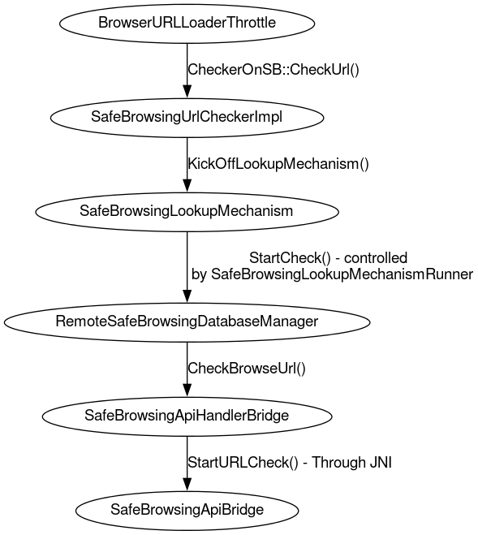

# Android WebView Safe Browsing

[TOC]

Android WebView has supported core Safe Browsing features since 2017.

## What is Safe Browsing?

Safe Browsing launched in 2005 to protect users across the web from phishing attacks.
It has evolved to give users tools to help protect themselves from web-based threats
like malware, unwanted software, and social engineering across desktop and mobile
platforms. For info on the feature, see https://safebrowsing.google.com/.

## How does Safe Browsing in WebView work?

WebView’s Safe Browsing implementation is built on top of Chromium’s Safe Browsing
interfaces and library. For each navigation in Android apps when Safe Browsing is enabled,
since a single page can contain multiple threats WebView gets the most
severe threat for the navigation chain and shows an interstitial.

For WebView versions prior to M126, Safe Browsing on WebView uses the
"Local Blocklist" or "V4" protocol. URLs are checked for malware, phishing etc
against an on-device blocklist that is periodically updated by Google's servers.

From M126 onwards, WebView uses a "Real-Time" or "V5" protocol for Safe Browsing.
URLs are checked in real-time against blocklists maintained by our servers.
This [blog post](https://blog.google/products/chrome/google-chrome-safe-browsing-real-time/)
highlights the motivation behind real-time safe browsing and
[go/androidSBv5](http://go/androidSBv5) explains this protocol in detail.
Real-time Safe Browsing can be disabled by the user.

## Safe Browsing in //components

Safe Browsing has many components; for brevity, we will only discuss the ones most
relevant to WebView. Based on Safe Browsing’s version (v4 or v5) we have different
lookup mechanisms to check if the URL is safe, it all starts from
`BrowserUrlLoaderThrottle::WillStartRequest` which creates the Safe Browsing checker
to start the check for url, that checker creates the appropriate lookup mechanism
based on some conditions, the following diagram shows the flow in a bigger picture:

<br>



<br>

`SafeBrowsingLookupMechanism` is the base class and we have three implementations
for it, hash_realtime == V5 (send partial hash of the URL to the server through
a proxy), url_realtime == Protego (send URL to the server), hash_database == V4
(check against the local blocklist), worth mentioning that `SafeBrowsingLookupMechanismRunner`
controls LookUpMechanism and  sets a timeout for the mechanism to run within.
The timeout is defined at the top of the class.

When the check is required in the remote DB, it delegates the call to `ApiHandlerBridge`,
which uses JNI to call StartURLCheck on SafeBrowsingApiBridge. ApiBridge uses
the `SafetyNetApiHandler` (Soon to be SafeBrowsingApiHandler) to make the `startUriLookup`
call, the next section talks about WebView specifics.

See the relevant Chromium classes in
[//components/safe\_browsing/](/components/safe_browsing).

## WebView Implementation

One of the main classes in WebView implementation is
[AwUrlCheckerDelegateImpl](https://source.chromium.org/chromium/chromium/src/+/main:android_webview/browser/safe_browsing/aw_url_checker_delegate_impl.cc)
which defines the 4 threat types WebView support in the constructor, it calls
[WebViewClient#onSafeBrowsingHit](https://developer.android.com/reference/android/webkit/WebViewClient#onSafeBrowsingHit(android.webkit.WebView,%20android.webkit.WebResourceRequest,%20int,%20android.webkit.SafeBrowsingResponse))
to allow the app to respond, also it handles the app’s response to the
[callback](https://developer.android.com/reference/android/webkit/SafeBrowsingResponse),
the default behavior is to show interstitial by calling
`ui_manager->DisplayBlockingPage`. When the callback returns backToSafety()
or the user clicks “back to safety” button in the interstitial the class triggers
`onReceivedError()` callback.

WebView has its own allowlisting mechanism which lives in AwSafeBrowsingAllowlistManager,
it was implemented to serve a specific API,
[setSafeBrowsingAllowlist](https://developer.android.com/reference/androidx/webkit/WebViewCompat#setSafeBrowsingAllowlist(java.util.Set%3Cjava.lang.String%3E,android.webkit.ValueCallback%3Cjava.lang.Boolean%3E)),
and that doesn’t have anything to do with the allowlisting in //components
(WebView uses both of them but they are unaffiliated).

Any WebView Safe Browsing UI specific logic is being managed by AwSafeBrowsingUIManager,
that includes creating the interstitial based on the error.

## Building your own WebView

Depending on which Safe Browsing features you need to test, you may need to
build WebView from an upstream (public) or a downstream (internal) build target.

### Upstream

Upstream (public) WebView targets support a limited form of Safe Browsing.
WebView only supports blocking [hard-coded URLs](#hard_coded-urls), but this is
sufficient if all you need is to create an interstitial for testing. You can
build and install `system_webview_apk` (see [quick
start](/android_webview/docs/quick-start.md)).

### Downstream

The WebView we ship to users is based on downstream (private) build targets. If
you need to test the GMS-based implementation which we use to block real
malware, you need to build one of the downstream targets. See [Google-internal
instructions](http://go/clank-webview/build_instructions.md).

## Opt-in/consent/requirements

### Google Play Services

*** note
**Note:** this is only relevant for the GMS-based implementation in downstream
WebView targets.
***

If Google Play Services (AKA GMSCore) is uninstalled, disabled, or out-of-date,
WebView cannot perform Safe Browsing checks (with the exception of [hard-coded
URLs](#hard_coded-urls)). Before trying Safe Browsing locally, make sure this is
up-to-date:

```shell
$ adb shell am start -a "android.intent.action.VIEW" -d "market://details?id=com.google.android.gms"
# Then, manually update GMS in the UI.
```

If Google Play Services is installed, the user must opt into Google Play
Protect's "Verify Apps" setting. This is a single setting, however it can be
accessed by your choice of two different routes:

* In the Play Store app: `Launch the Play Store app > User icon > Play Protect >
  Settings (gear icon) > Scan apps with Play Protect`, or
* In the Android Settings app: `Launch the Settings app > Security & Privacy >
  App Security > Google Play Protect > Gear icon > Scan apps with Play Protect`


### Real-time Safe Browsing user opt-in

*** note
**Note:** this is only relevant for the GMS-based implementation in downstream
WebView targets.
***

To enable real-time Safe Browsing, which is available M126 onwards, ensure that
you have opted into it.

`Launch Settings > Security & Privacy > More Security & Privacy >
Android Safe Browsing > Use live threat protection`

If this toggle is off, WebView will still perform Safe Browsing, but will use
the "Local Blocklist" (V4) protocol instead of the "Real-time" (V5) protocol.

### Application opt-in

Safe Browsing is enabled by default, but applications can explicitly disable it
with a manifest tag:

```xml
<manifest>
    <application>
        <meta-data android:name="android.webkit.WebView.EnableSafeBrowsing"
                   android:value="false" />
        ...
    </application>
</manifest>
```

## Hard-coded URLs

WebView supports Safe Browsing checks (for testing purposes) on hard-coded WebUI
URLs defined in
[`//components/safe_browsing/core/common/web_ui_constants.cc`](/components/safe_browsing/core/common/web_ui_constants.cc)
(ex. `chrome://safe-browsing/match?type=malware`).

These URLs don't show meaningful content, but will trigger an interstitial when
trying to navigate to them. WebView relies on these URLs in our CTS tests, so
they **must never change** (but more URLs may be added).

## Differences in support and types of interstitials

See [this page](docs/differences.md).

## Testing Safe Browsing

Automated tests live
[here](/android_webview/javatests/src/org/chromium/android_webview/test/SafeBrowsingTest.java).

You can manually test Safe Browsing with the [WebView
Shell](/android_webview/docs/webview-shell.md). Navigate to one of the
[hard-coded URLs](#hard_coded-urls) mentioned above.

To test more complex scenarios and WebView's Safe Browsing APIs, please try out
the [open source WebView demo
app](https://android.googlesource.com/platform/frameworks/support/+/HEAD/webkit/integration-tests/testapp).

*** note
**Note:** if testing Safe Browsing manually, make sure to [update GMS and
opt-into Google Play Protect](#Google-Play-Services).
***

## Supporting new threat types

As Chrome supports more threat types, so can WebView. The steps are:

1. Create quiet interstitial resources for the new threat type ([example
   CL](https://chromium-review.googlesource.com/c/chromium/src/+/1256021)).
1. Add IDs to their respective allowlist files:
   [resources](/android_webview/ui/grit_resources_allowlist.txt) and
   [strings](/android_webview/ui/grit_strings_allowlist.txt) ([general
   docs](/android_webview/ui/README.md), [example
   CL](https://chromium-review.googlesource.com/c/chromium/src/+/1270476/12/android_webview/ui/grit_strings_whitelist.txt)).
1. Add the new threat type to our list of threats ([example
   CL](https://chromium-review.googlesource.com/c/chromium/src/+/1270476/12/android_webview/browser/aw_url_checker_delegate_impl.cc)).
1. Add a hard-coded URL ([example
   CL](https://chromium-review.googlesource.com/c/chromium/src/+/1270476/12/components/safe_browsing/web_ui/constants.cc)).
1. Write integration tests ([example
   CL](https://chromium-review.googlesource.com/c/chromium/src/+/1270476/12/android_webview/javatests/src/org/chromium/android_webview/test/SafeBrowsingTest.java)).
1. Add a new threat type constant to the Android SDK (constants are defined in
   `WebViewClient.java`, please [consult a WebView team
   member](https://groups.google.com/a/chromium.org/forum/#!forum/android-webview-dev)
   before this step). The new threat type constant should only be used when the
   application targets the new Android SDK: use
   [SAFE\_BROWSING\_THREAT\_UNKNOWN](https://developer.android.com/reference/android/webkit/WebViewClient.html#SAFE_BROWSING_THREAT_UNKNOWN)
   for apps with older targetSdkVersions (see http://crbug.com/887186#c15 and
   http://b/117470538).
