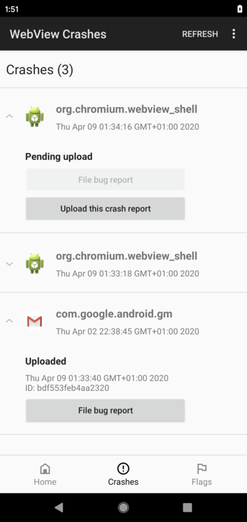
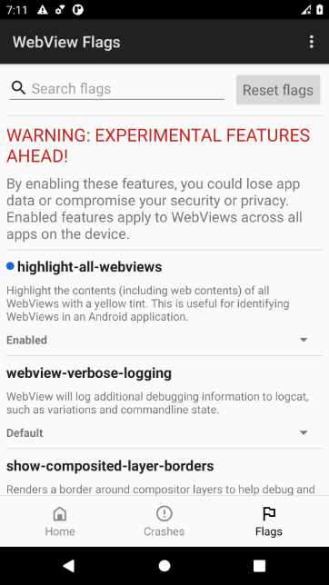
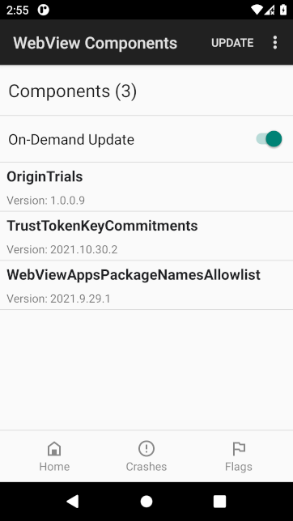

# WebView DevTools user guide

[TOC]

## Launching WebView DevTools

WebView DevTools is an on-device suite of tools that ships with WebView itself.
You can launch WebView DevTools by any of the following:

### Launcher icon on pre-stable channels (preferred)

The best way to launch WebView DevTools is to [download WebView Beta, Dev, or
Canary](prerelease.md). These channels will have a launcher icon which will
launch WebView DevTools.

*** note
**Note:** the WebView DevTools icon does not appear by default on Android 7
through 9 (Nougat/Oreo/Pie). To enable the launcher icon, first [change your
WebView provider](prerelease.md#Android-7-through-9-Nougat_Oreo_Pie) and then
launch the same Chrome channel or any WebView app (ex. [WebView shell
browser](webview-shell.md), or open an email in Gmail).
***

### Launch via adb

If you have adb installed, you can connect your Android device to launch
DevTools:

```sh
adb shell am start -a "com.android.webview.SHOW_DEV_UI"
```

### Launch via WebView Shell

Newer versions of [WebView shell](webview-shell.md) have a menu option to launch
WebView DevTools. If your copy of WebView shell doesn't have this option, you
may need to rebuild it yourself.

## Crash UI

Crash UI shows recent WebView-caused crashes from apps on the device, similar
to `chrome://crashes`. You can access it by tapping the "Crashes" option in the
bottom navigation bar.

*** note
**Note:**
You have to opt in android crash collection in order for crash reports to show
up in the UI. An error message will show up if you haven't opted-in. To opt-in,
go to the device settings > Google > three-dotted menu > Usage & diagnostics
and make sure it's enabled. For AOSP builds, you can enable crash collection
by enabling the `enable-crash-reporter-for-testing` flag from the
[Flags UI](#Flag-UI).
***



Tap a crash entry to expand it for more info and actions for that crash.

*** note
**Note:** Some types of crashes such as renderer crashes can show up instantly
in the UI. However, most WebView crashes will require relaunching the
application where the crash happened so it can be detected and appear in the
UI.
***

### Force upload a crash report

Crash reports are automatically reported to WebView's crash collection server.
Sometimes a crash report may not be automatically uploaded. For instance, when
the device is not connected to Wifi (will show in the crashes list with
"pending upload" status). The crash report can also skip upload due to random
sampling (will appear with "skipped" status). You can force upload that crash
report by pressing the "Upload this crash report" button. After the crash
report is uploaded you can then use the upload ID to open a bug report to
provide more info about that crash.

### Provide more info about a crash

While the crash server has most of the information we need to solve issues, it
is helpful if you can provide additional details in a bug report, such as steps
to reproduce the crash. To do so press the "File bug report" button which will
open https://issues.chromium.org/issues/new?component=1456456&template=1923373
in the browser. You can use the bug report template to provide additional info
about the crash for the WebView engineering team. Make sure to fill all the
relevant fields in the bug report and leave the crash upload ID in the bug
description so that the WebView team can effectively investigate the crash.

## Flag UI

While WebView supports [toggling arbitrary flags](commandline-flags.md) on
debuggable devices, we also support toggling a curated set of experimental
flags/features on production Android devices. We expose these features as part
of WebView's on-device DevTools. This is similar to Chrome's `chrome://flags`
tool.



Tap the "Flags" option in the bottom navigation bar. You can scroll through the
list to find your desired feature/flag (ex. "highlight-all-webviews"), tap the
dropdown (look for "Default"), and tap "Enabled" in the dialog popup. You can
enable (or disable) as many flags as you need.

*** promo
**Tip:** enabling "highlight-all-webviews" (which tints all WebView objects
yellow) in addition to your desired flag is a great way to verify apps have
picked up WebView flags.
***

Kill and restart WebView apps so they pick up the new flags.

When you're done, open the notification tray and tap the WebView DevTools
notification to go back to the flag UI. Tap "Reset all to default" and kill and
restart WebView apps to go back to the default behavior.

*** aside
[Starting in
M84](https://chromiumdash.appspot.com/commit/f5ee8b7f1d23d2a915ea234bdd4e49e4c908b267),
toggled flags will be restored after WebView updates or rebooting your device.
This is convenient if you want to try out features for longer periods of time,
such as for dogfooding or compatibility testing.
***

### Overriding variations/Field Trials

Like Chrome, WebView supports A/B experiments and feature rollouts through
variations (AKA "field trials" or "Finch"). The flag UI can override the field
trial config, either to **enable** an experimental feature to ensure your app
works correctly, or to **disable** an experiment to determine if this is the
root cause for a WebView behavior change breaking your app. Simply tap "Enabled"
or "Disabled" in the UI; "Default" means WebView will pick up the random field
trial experiment.

If you find an experiment is the root cause for app breakage, please [file a
bug](https://issues.chromium.org/issues/new?component=1456456&template=1923373),
mention which experiment, and link to your app's Play Store page for our team to
investigate.

### Accelerating field trial config download

You can also use the flag UI to download new field trial configs ("seeds") more
quickly, to verify the next seed will fix app breakage. Enable all of the
following:

* `finch-seed-expiration-age=0`
* `finch-seed-min-update-period=0`
* `finch-seed-min-download-period=0`
* `finch-seed-ignore-pending-download`

Restart your app, kill it, and restart it a second time. Your app should be
running with the latest WebView variations seed.

Downloading new seeds requires the device to be charging. To bypass this, enable
the flag: `finch-seed-no-charging-requirement`

### Adding your flags and features to the UI

If you're intending to launch a feature in WebView or start a field trial (AKA
Finch experiment), we **highly encourage** you to [add to
ProductionSupportedFlagList](/android_webview/java/src/org/chromium/android_webview/common/ProductionSupportedFlagList.java):

1. Add your feature to ProductionSupportedFlagList.java. You can list the
   feature name as a string (This will be autochecked when sending a Finch
   change to ensure it's not misspelt) or you can use a Java constant (e.g.,
   `BlinkFeatures.NAME_OF_FEATURE`).
   * If you're adding a feature which doesn't have an autogenerated constant,
     you can either add the name as a string or you can follow instructions for
     how to autogenerate the Java constants:
     [instructions for switches](/docs/android_accessing_cpp_switches_in_java.md),
     [instructions for features](/docs/android_accessing_cpp_features_in_java.md#generating-foo-feature-list-java)
     (skip the "Checking if a Feature is enabled" section, start at the
     "Auto-generating FooFeatureList.java" section).
2. **Optional:** you can write a user-visible description of what the flag does.
   This is completely optional and you may land a flag without a
   description.
3. **Optional:** See
   [this doc](/tools/metrics/histograms/README.md#Flag-Histograms) for more info
   about flag labels if you want histogram data about usage. This involves
   updating the "LoginCustomFlags" field in
   `/tools/metrics/histograms/enums.xml`.
4. Create a CL. Any chromium committer can approve changes to
   ProductionSupportedFlagList.java.
5. If you've also made a Finch change, you can remove `WEBVIEW_FLAG_EXEMPT` from
   that change. You don't need a flag exemption if you've exposed the flag in
   ProductionSupportedFlagList.java. Alternatively, you may link to the CL which
   updated ProductionSupportedFlagList.java:
   `WEBVIEW_FLAG_EXEMPT=https://crrev.com/c/YOUR_CL_NUMBER`.

Exposing your feature this way has several benefits:

- This improves the manual test process. Testers can enable your feature with a
  button click instead of an adb command.
- Because this works on production Android devices, test team can validate your
  feature on devices from other OEMs.
- You (and teammates) can dogfood your feature.
- If users or third-party app developers report bugs, this UI is the only way
  they can toggle your feature to help root-cause the regression.

### See also

- [Design doc](http://go/webview-dev-ui-flags-design) (Google-only)

## Components UI

Components UI shows all the registered components and their respective installed
versions, similar to `chrome://components`. Components are config files downloaded
via chrome's [component updater](https://chromium.googlesource.com/chromium/src/+/lkgr/components/component_updater/README.md). This can be accessed by opening the 3-dotted
menu and tapping the "Components" option.

Tapping the "Update" button located in the options menu will download new versions
of the components if any are available.

*** note
**Note:** Updating components via the UI runs in "on-demand" or "user-visible"
mode by default which may have [different behavior](https://crbug.com/1250837)
from automated updates. To simulate the behaviour of the automated update
service, on-demand updates can be turned off using the toggle provided
below the Components Summary.
***



## More cool stuff

### Switching WebView provider

Since Android 7 (Nougat), Android supports installing [multiple WebView
packages](prerelease.md) side by side and switching between them. After
installing the WebView channel you want, launch WebView DevTools, open the
three-dotted menu, and select "Change WebView Provider." This launches the
system UI where you can select your new WebView channel.

### Filing a bug report

You can file general bug reports for the WebView engineering team. Launch
WebView DevTools, open the three-dotted menu, and select "Report WebView Bug."
Similar to filing bug reports for crashes, this will open the system browser to
[our bug
tracker](https://issues.chromium.org/issues/new?component=1456456&template=1923373)
(requires sign-in), where you can describe the issue.

### Check for WebView updates

*** aside
This was [added in M84](https://chromiumdash.appspot.com/commit/f23d4aa70857ce71a44a2341584461feae95b8a6).
***

You can check for WebView updates directly from WebView DevTools. This is handy
if you've applied flags, since the Play Store may pause automatic updates while
WebView's persistent service is running.

## Looking for Chrome DevTools?

You can debug WebView even more with Chrome DevTools! For detailed instructions,
check out [Remote Debugging
WebViews](https://developers.google.com/web/tools/chrome-devtools/remote-debugging/webviews).
