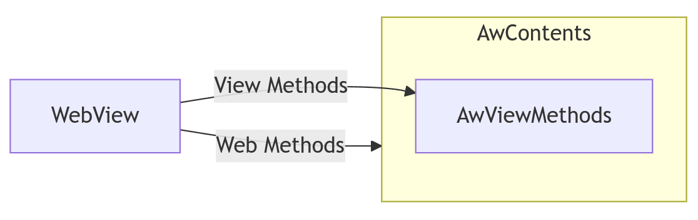
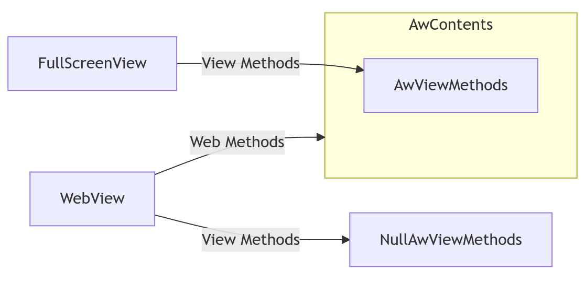

# How WebView Full Screen Works

[TOC]

Note: In this doc, `WebView` in code font means the `WebView` class that's a
subclass of `View`, whereas WebView in normal font means the WebView product in
general.

## How apps use full screen

You can see an example of how to support WebView full screen in your application
in [the WebView
shell](https://source.chromium.org/chromium/chromium/src/+/main:android_webview/tools/system_webview_shell/apk/src/org/chromium/webview_shell/WebViewBrowserFragment.java;l=500;drc=cfb4fb0b1658a915db8c470751f511bb8360a9bc).
The app overrides `WebChromeClient#onShowCustomView` to do something like:

```java
@Override
public void onShowCustomView(
        View view, WebChromeClient.CustomViewCallback callback) {
    if (mFullscreenView != null) {
        ((ViewGroup) mFullscreenView.getParent()).removeView(mFullscreenView);
    }
    mFullscreenView = view;
    requireActivity()
            .getWindow()
            .addFlags(WindowManager.LayoutParams.FLAG_FULLSCREEN);
    requireActivity()
            .getWindow()
            .addContentView(
                    mFullscreenView,
                    new FrameLayout.LayoutParams(
                            ViewGroup.LayoutParams.MATCH_PARENT,
                            ViewGroup.LayoutParams.MATCH_PARENT,
                            Gravity.CENTER));
}
```

Essentially, when the web contents requests to go full screen, WebView creates a
`View` (a
[FullScreenView](https://source.chromium.org/chromium/chromium/src/+/main:android_webview/java/src/org/chromium/android_webview/FullScreenView.java))
and hands it to the app to attach to the window. Usually the existing `WebView`
remains attached to the window, but obscured by the full screen `View`.

When the user exits full screen through the web contents, or through invoking
the callback, `onHideCustomView` is called, where the app should remove
`mFullscreenView` from the window.

```java
@Override
public void onHideCustomView() {
    if (mFullscreenView == null) {
        return;
    }
    requireActivity()
            .getWindow()
            .clearFlags(WindowManager.LayoutParams.FLAG_FULLSCREEN);
    ((ViewGroup) mFullscreenView.getParent()).removeView(mFullscreenView);
    mFullscreenView = null;
}
```

Of all the apps that override `WebChromeClient`, ~85% of them override
`onShowCustomView`. If an app does not, WebView reports to the web page that
fullscreen mode is not supported.

## How this works

Broadly speaking, the API on the `WebView` class can be split into two parts -
stuff to do with the web content (eg, `loadUrl`, `goBack`) and stuff to do with
integrating into the View hierarchy (eg, `onDraw`, `requestFocus`). Inside
`AwContents`, the View responsibilities are collected in the `AwViewMethods`
interface, so we end up with the following:



When full screen is triggered, the web page starts being drawn through
[FullScreenView](https://source.chromium.org/chromium/chromium/src/+/main:android_webview/java/src/org/chromium/android_webview/FullScreenView.java)
instead, so all the integration with the View hierarchy must come from there
instead. At the same time, we don’t want `AwViewMethods` being triggered by both
the `FullScreenView` and the `WebView`, so we attach the `WebView` to a
[NullAwViewMethods](https://source.chromium.org/chromium/chromium/src/+/main:android_webview/java/src/org/chromium/android_webview/NullAwViewMethods.java),
where everything is effectively a no-op.



This means that a call to `WebView#loadUrl` will trigger a page load, but it
will still be drawn through the `FullScreenView`.

## What you need to know

The main thing you need to keep in mind is that `AwContents` can be moved
between Views (between `WebView` and `FullScreenView`).

Currently, the code is a little confused, with
[AwContents#onAttachedToWindow](https://source.chromium.org/chromium/chromium/src/+/main:android_webview/java/src/org/chromium/android_webview/AwContents.java;l=3366;drc=71a590f3fd3c3c34f1fd48bbaf9e5357f2df4832)
tying features (such as the window coverage tracker, the display cutout
controller, the frame metrics listener) to the `WebView` that should be moved
over to the `FullScreenView` when it’s used, but aren’t. These should get fixed
soon.
