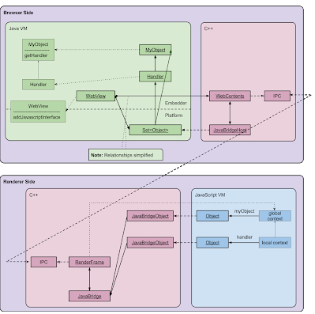
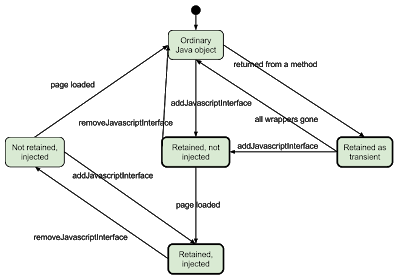

# WebView Java Bridge (WebView#addJavascriptInterface())

[TOC]

## Overview

This page explains ideas behind the Java ↔ JavaScript bridge
implementation. This is to ensure that important use cases and scenarios, which
must be preserved regardless of how the bridge is implemented, are captured. The
need for this description arose while migrating the NPAPI-based implementation
to a [Gin](/gin/)-based implementation. Although a vast number of unit tests
already existed, they still didn't cover all important aspects of the bridge
behavior and we had to add some new tests to ensure we are preserving
compatibility.

The Gin implementation was introduced in Chromium M37 (initial Android Lollipop
release), with the threading issue fixed in M39 (L MR1).

## The API

An API for embedders is exposed on
[android.webkit.WebView](https://developer.android.com/reference/android/webkit/WebView.html)
class:

- [public void **addJavascriptInterface**(Object **object**, String
  **name**)](https://developer.android.com/reference/android/webkit/WebView.html#addJavascriptInterface(java.lang.Object,%20java.lang.String))
   -- injects a Java **object** into a WebView under the given **name**;
- [public void **removeJavascriptInterface**(String
  **name**)](https://developer.android.com/reference/android/webkit/WebView.html#removeJavascriptInterface(java.lang.String))
   -- removes an object previously injected under the **name**.

Important notes as defined by the API:
- adding or removing an injected object is not reflected on the JavaScript side
  until the next page load;
- only methods annotated as
  [`@JavascriptInterface`](https://developer.android.com/reference/android/webkit/JavascriptInterface.html)
  are exposed to JavaScript code; Java object fields are never exposed;
- methods of Java objects are invoked on a private, background thread of
  WebView; this effectively means, that the interaction originated by the page
  must be served entirely on the background thread, while the main application
  thread (browser UI thread) is blocked;

Argument and return values conversions are handled after [Sun Live Connect 2
spec](https://www.oracle.com/java/technologies/javase/liveconnect-docs.html). In
fact, there are lots of deviations from it (probably, to preserve compatibility
with earlier WebView versions). What can pass the boundary between VMs is
somewhat limited. This is what is allowed:
- primitive values;
- single-dimentional arrays;
- "array-like" JavaScript objects (possessing "length" property, and also typed
  arrays from ES6);
- previously injected Java objects (from JS to Java);
- new Java objects (from Java to JS), those are "injected" into JavaScript as if
  one called **addJavascriptInterface**, but w/o providing a name; also, the
  lifecycle of such transient objects is different (see below).

## Objects Lifecycle

The purpose of Java bridge is to establish interaction between two virtual
machines (VMs): Java and JavaScript. Both VMs employ a similar approach to
managing objects lifetime—VMs gather and dispose unreferenced objects during
garbage collection (GC) cycles. The twist that Java bridge adds is that objects
in one VM can now virtually reference (and prevent from being disposed) objects
from another VM. Let us consider the following Java code:

```Java
// in Java
webView.addJavascriptInterface(new MyObject(), "myObject");
```

The instantiated MyObject is now being virtually hold by its JavaScript
counterpart, and is not garbage-collected by Java VM despite the fact that there
are no explicit references to it on the Java side. The MyObject instance is kept
referenced until the action of the **addJavascriptInterface** call is cancelled
by a call to **removeJavascriptInterface**:

```Java
// in Java
webView.removeJavascriptInterface("myObject");
```

A more interesting situation is with transient objects returned from methods of
an injected Java object. Consider the following example:

```Java
// in Java
class MyObject {
    class Handler {
    }

    @JavascriptInterface
    public Object getHandler() { return new Handler(); }
}
```

Again, the object returned from **`getHandler`** method is not explicitly
referenced on the Java side, albeit it should not be disposed until it is in use
on the JavaScript side. The "in use" period is determined by the lifetime of the
JavaScript interface object that has been implicitly created as a result of a
call to **getHandler** from JavaScript. That means, the instance of Handler on
the Java side should be kept alive during the period while the corresponding
JavaScript interface object is still referenced:

```JavaScript
// in JavaScript
{
   ...
   let handler = myObject.getHandler();
   ...
}
```

The following figure illustrates relationships between Java and JavaScript
objects created in the previous examples:


Note that Java and JavaScript VMs are absolutely independent and unaware of each
other's existence. They can work in different processes and, in theory, even on
different physical machines. Thus, the depicted references from JavaScript
objects to Java objects are virtual—they don't exist directly. Instead, it is
the Java bridge who holds the Java objects for as long as it is needed. We would
like to depict that, but first we need to consider the whole picture.

So far, we were thinking about Java bridge in abstract terms. But in fact, it is
used in the context of a WebView-based application. The Java side of the bridge
is tightly coupled to an instance of WebView class, while bridge's JavaScript
side is bound to a HTML rendering engine. This is further complicated by the
facts that in the Chromium architecture renderers are isolated from their
controlling entities, and that Chromium is mainly implemented in C++, but needs
to interact with Android framework which is implemented in Java.

Thus, if we want to depict the architecture of Java bridge, we also need to
include parts of the Chromium framework that are glued to Java bridge:



The figure is now much scarier. Let's figure out what is what here:
- In Java VM (browser side):
  **WebView** is android.webkit.WebView class. It is exposed to the embedder and
  interacts with Chromium rendering machinery. WebView owns a retaining set
  (**`Set<Object>`**) that holds all injected objects to prevent their
  collection. Note that WebView class manages a C++ object called
  **WebContents** (in fact, the relationship is more complex, but these details
  are not relevant for us). As Java Bridge implementation is in C++, the
  retaining set is actually managed by the C++ side, but objects from the
  native side do not hold any strong references to it, as that would create a
  cyclic reference and will prevent the WebView instance from being collected.
- On the C++ browser side:
  Here we have the aforementioned **WebContents** object which delegates Java
  Bridge-related requests to **JavaBridgeHost**. WebContents talks to the
  objects on the renderer side via Chromium's IPC mechanism.
- On the C++ renderer side:
  **RenderFrame** corresponds to a single HTML frame and it "owns" a JavaScript
  global context object (aka **window**). For each JavaScript interface object,
  a corresponding **JavaBridgeObject** instance is maintained. In Chromium
  terminology, this object is called "wrapper". In the Gin-based implementation,
  wrappers don't hold strong references to their corresponding JavaScript
  interface objects, also to prevent memory leaks due to cycles of
  references. Wrappers receive a notification from the JavaScript VM after the
  corresponding JavaScript objects has been garbage-collected.

The diagram above misses one more important detail. WebView can load a complex
HTML document consisting of several frames (typically inserted using <iframe>
tags). Each of these frames in fact has it own global context (and can even be
prevented from accessing other frames). According to Java Bridge rules, each
named object is injected into contexts of all frames. So if we imagine that we
have loaded an HTML document with an <iframe> into WebView, and then repeated
the calls from above in both main document and the <iframe>, we will have the
following picture:


Note that as **MyObject.getHandler()** returns a new **Handler** instance every
time, we have two instances of Handler (one per frame), but still have only one
instance of **MyObject**.

Would **getHandler** return the same instance of Handler every time, the latter
will also have multiple JavaScript interface referencing it. Thus, transient
Java object must be kept alive by Java Bridge until there is at least one
corresponding JavaScript interface object (note that Java side could keep only a
weak reference to the single Handler instance it returns, so Java Bridge must
keep its own strong reference anyway).

To summarize the lifecycle topic, here is a state diagram of a Java object
lifecycle from the Java Bridge's perspective:



In the states with bold borders, the Java object is retained by Java Bridge to
prevent its collection. It is possible that a garbage-collected object still has
JavaScript wrappers (that is, remains "injected"). In that case, attempts to
call methods of this object will fail.

The only difference between "Not retained, injected" and "Ordinary Java object"
states is that in the former, the Java object is still "known" to the JavaScript
side, so it can still make calls to it.

Please also note that there is no way for a named injected object to become a
transient one, although the opposite is possible.

## Arguments and Return Values Conversions

Three major problems must be addressed by Java Bridge:
1. Java primitive types are different from JavaScript types:
    a. JavaScript only has Number, while Java offers a range of numeric types;
    a. JavaScript has 'null' and 'undefined';
    a. JavaScript has "array-like" objects that can also have string keys.
1. Java methods accept fixed number of arguments and can be overloaded, while
   JavaScript methods accept any number of arguments and thus can't be
   overloaded.
1. Java objects can be returned from Java methods, and previously injected Java
   objects can be passed back to JavaScript interface methods.

The first problem is in fact the easiest one. Type conversions are described in
Sun Live Connect 2 spec, the only issue is that Java Bridge doesn't closely
follow the spec (for compatibility with earlier versions?). Such deviations are
marked as LIVECONNECT_COMPLIANCE in Java Bridge code and tests.

When coercing JavaScript "array-like" objects into Java arrays, only indexed
properties are preserved, and named properties are shaved off. Also, passing an
arbitrary JavaScript dictionary object via an interface method is impossible—it
is simply converted into 0, "", or null (depending on the destination Java
type).

For dealing with method overloading, the spec proposes a cost-based model for
methods resolution, where the "most suitable" Java overloaded method version is
selected. Android Java Bridge implementation in fact simply selects **an
arbitrary** overloaded method with the number of arguments matching the actual
number of parameters passed to the interface method and then tries to coerce
each value passed into the destination Java type. If there is no method with
matching number of arguments, the method call fails.

The problem with passing references to objects is to preserve the correspondence
between Java objects and JavaScript interfaces. Curiously, the NPAPI-based Java
Bridge implementation was failing to do that properly when returning Java
objects from methods. With the following Java object:

```Java
// in Java
class MyObject {
    @JavascriptInterface
    public Object self() { return this; }
}
...
webView.addJavascriptInterface(new MyObject(), "myObject");
```

The following equality check in JavaScript would fail (in the NPAPI
implementation):

```JavaScript
// in JavaScript
myObject.self() === myObject;
```

This is because the NPAPI Java Bridge implementation creates a new JavaScript
wrapper every time an object is returned. This issue was fixed in the Gin-based
implementation.

## Threading

Threading issues need to be considered when dealing with invocations of methods
of injected objects. In accordance with the API definition, methods are invoked
on a dedicated thread maintained by WebView.

Calls to interface methods are synchronous—JavaScript VM stops and waits for
a result to be returned from the invoked method. In Chromium, this means that
the IPC message sent from a renderer to the browser must be synchronous (such
messages are in fact rarely used in Chromium).

The requirement for serving the requests on the background thread means that the
following code must work (see
[https://crbug.com/438255](https://crbug.com/438255)):

```Java
// in Java
class Foo {
  @JavascriptInterface
  void bar() {
    // signal the object
  }
}

webview.addJavascriptInterface(new Foo(), "foo");
webview.loadUrl("javascript:foo.bar()");
// wait for the object
```

To fulfill this, the browser UI thread must not be involved in the processing of
requests from the renderer.

## Security Issues

From the very beginning, Java Bridge wasn't very much secure. Until JellyBean
MR1 (API level 17), all methods of injected Java objects were exposed to
JavaScript, including methods of java.lang.Object, most notably getClass, which
provided an elegant way to run any system command from JavaScript:

```JavaScript
// in JavaScript
function execute(bridge, cmd) {
   return bridge.getClass().forName('java.lang.Runtime')
      .getMethod('getRuntime',null).invoke(null,null).exec(cmd);
}
```

In JB MR1, the `@JavascriptInterface` annotation was introduced to explicitly
mark methods allowed to be exposed to JavaScript. But this restriction only
applied to applications targeting API level 17 or above, so old apps remained
insecure even on new Android versions. To fix that, in KitKat MR2 we are
forbidding to call `getClass` of `java.lang.Object` for all applications.

The next issue comes from the fact that injected Java objects are shared between
frames. This allows frames, otherwise isolated (for example, due to cross-origin
policy), to interact. For example, if an injected object has methods
'storePassword' and 'getPassword', then a password stored from one frame can be
retrieved by another frame. To prevent this, instead of injecting an object
itself, a stateless factory must be injected, so each frame will be creating its
own set of Java objects.
