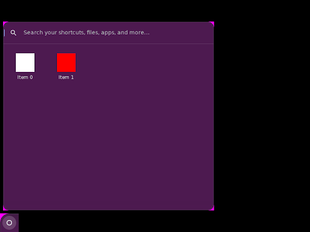
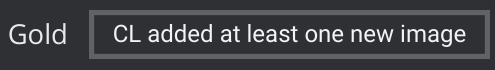
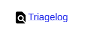
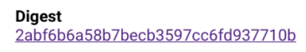
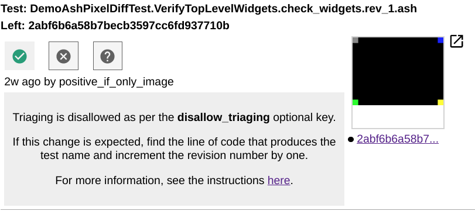

# Ash Pixel Unit Testing

## 1. Overview

This is a guide to write pixel unit tests to verify Ash UI. Ash pixel unit
testing is image-based testing. It takes screenshots in test code then compares
the captured screenshots with benchmark images pixel-by-pixel. Therefore, ash
pixel unit testing can check the UI features that could be hard to verify
through ordinary ash unit tests, such as the appearance of a gradient shader.

Ash pixel unit testing is stable. Supported by the
[Skia Gold][1] as the backend, it is straightforward to add or change benchmark
images. Users can use Skia Gold to tell the difference in a failed test run.

## 2. Your First Pixel Diff Test

This section teaches how to add a simple test that verifies widgets on the
primary screen. The code below can be found [here][2]. If you are unfamiliar
with Chrome testing, read this [doc][3] first.

### 2.1 Sample Code

~~~c++
class DemoAshPixelDiffTest : public AshTestBase {
 public:
  // AshTestBase:
  std::optional<pixel_test::InitParams> CreatePixelTestInitParams()
      const override {
    return pixel_test::InitParams();
  }

  // … unrelated code
 };

// Create top level widgets at corners of the primary display. Check the
// screenshot on these widgets.
TEST_F(DemoAshPixelDiffTest, VerifyTopLevelWidgets) {
  auto widget1 = …
  auto widget2 = …
  auto widget3 = …
  auto widget4 = …
  EXPECT_TRUE(GetPixelDiffer()->CompareUiComponentsOnPrimaryScreen(
      "check_widgets",
      /*revision_number=*/0, widget1.get(), widget2.get(), widget3.get(),
      widget4.get()));
}
~~~

DemoAshPixelDiffTest is a subclass of AshTestBase, just like the ordinary ash
unit tests. There is one difference: DemoAshPixelDiffTest overrides
CreatePixelTestInitParams() to return pixel test initialization params. When
pixel test init params are existent, an AshPixelDiffer instance is built during
test setup. AshPixelDiffer is a wrapper of Skia Gold APIs that capture
screenshots, upload screenshots to the Skia Gold server and return pixel
comparison results. AshTestBase exposes the AshPixelDiffer instance by
GetPixelDiffer().

The sample code’s test body adds four widgets then it checks these widgets by
calling CompareUiComponentsOnPrimaryScreen(), an API provided by AshPixelDiffer
to compare the pixels of the given UI components (such as views::view,
views::widget and aura::Window) with the benchmark image’s. [Section 3.3][4]
will give more details on this and other APIs.

### 2.2 Run Locally

The build target of ash pixel unit tests is `ash_pixeltests`. A sample command
to build tests:

~~~bash
.../chrome/src $ autoninja -C out/debug ash_pixeltests
~~~

The command to run the sample pixel unit test:

~~~bash
.../chrome/src $ out/debug/ash_pixeltests --gtest_filter=DemoAshPixelDiffTest.
VerifyTopLevelWidgets
~~~

Options of running pixel tests:

- --skia-gold-local-png-write-directory=DIR: this option specifies a directory
to save the screenshots captured in pixel testing. DIR is an absolute path to
an existing directory. Note that a relative file path does not work. The saved
screenshots’ names follow the rule illustrated in
[section 2.4][5]. The screenshots
generated by local runs could be slightly different from those generated by CQ
runs due to different hardware.

- --bypass-skia-gold-functionality: when this option is given, the image
comparison functions such as AshPixelDiffTestHelper::ComparePrimaryFullScreen()
always return true. Usually this option is used along with
skia-gold-local-png-write-directory when comparing with benchmark is not needed,
e.g. a user is developing a new test case, which means that the benchmark image
does not exist yet.

### 2.3 Add Benchmarks

Developers do not need any extra work to add benchmarks other than writing pixel
test code. (NOTE: approving benchmarks through Gold digests mentioned in the old
user guide doc is not required anymore). When the CL that contains any new pixel
test case is merged, the corresponding new benchmarks will be generated
automatically.

Developers can follow [Section 4.2][6] to preview the benchmarks generated by
CQ runs before CL merge.

### 2.4 Where to Find the Committed Benchmarks

All committed benchmarks are listed in this [link][7]. Each benchmark’s name
follow this rule: {Test Suite Name}.{Test Case Name}.{Screenshot Name}.
{Platform Suffix}, where:

- {Test Suite Name}: it is the test class’s name. In the sample code, it is
“DemoAshPixelDiffTest”.
- {Test Case Name}: In the sample code, it is “VerifyTopLevelWidgets”.
- {Screenshot Name}: it is the string specified when taking the screenshot.
In the sample code, it is “check_widgets”.
- {rev_#number}: it is the concatenation between the constant “rev_” and the
revision number you set in the test code. [Section 5.1][8] will explain what it
is used for.
- {Platform Suffix}: it indicates the platform on which the screenshot is taken.
For ash pixel tests, it is always “ash”.

Therefore, the full name of the benchmark image added by the sample code is
`DemoAshPixelDiffTest.VerifyTopLevelWidgets.check_widgets.rev_0.ash`.

In a parameterized test, “/” used by the TEST_P macro is replaced by “.” since a
backlash leads to an illegal file path. Take the following code as an example:

~~~c++
INSTANTIATE_TEST_SUITE_P(RTL, AppListViewPixelRTLTest, testing::Bool());

TEST_P(AppListViewPixelRTLTest, Basics) {
  // … unrelated code
  EXPECT_TRUE(GetPixelDiffer()->CompareUiComponentsOnPrimaryScreen(
    "bubble_launcher_basics", /*revision_number=*/0, …);
}
~~~

The names of the committed screenshots are:

- RTL.AppListViewPixelRTLTest.Basics.0.bubble_launcher_basics.rev_0.ash
- RTL.AppListViewPixelRTLTest.Basics.1.bubble_launcher_basics.rev_0.ash

## 3. More Use Cases

### 3.1 Update Benchmarks

Updating benchmarks refers to updating the benchmarks of the existing pixel
tests. It happens, for example, when a CL under construction touches any product
feature then breaks the corresponding pixel tests.

To update a benchmark, a developer should:

1. Find the broken test code and locate the code line that generates this
benchmark.

2. Increase the revision number by one in code.

For example, the original test code is

~~~c++
EXPECT_TRUE(GetPixelDiffer()->CompareUiComponentsOnPrimaryScreen(
      "check_widgets",
      /*revision_number=*/1, widget1.get(), widget2.get(), widget3.get(),
      widget4.get()));
~~~

Then the code after change is

~~~c++
EXPECT_TRUE(GetPixelDiffer()->CompareUiComponentsOnPrimaryScreen(
      "check_widgets",
      /*revision_number=*/2, widget1.get(), widget2.get(), widget3.get(),
      widget4.get()));
~~~

The benchmark image will update when the CL is merged. The updated benchmark can
still be previewed following the procedure in [Section 4.2][6].

Read [Ash pixel test failure triage][9] for more information.

### 3.2 Customize Test Setup

You can customize the `pixel_test::InitParams` structure. For example, you can
create a pixel test to verify the right-to-left UI layout in the code below:

~~~c++
class DemoRTLTest : public AshTestBase {
 public:
  // AshTestBase:
  std::optional<pixel_test::InitParams> CreatePixelTestInitParams()
      const override {
    pixel_test::InitParams init_params;
    init_params.under_rtl = true;
    return init_params;
  }
  // … unrelated code
};
~~~

### 3.3 Screenshot Capture APIs

#### 3.3.1 AshPixelDiffer::CompareUiComponentsOnPrimaryScreen()

Use AshPixelDiffer::CompareUiComponentsOnPrimaryScreen() to get the result of a
pixel comparison between a screenshot of the primary display that is taken when
the test runs and a previously-verified benchmark image.

The first parameter is the screenshot’s name.

The second parameter is the revision number. Please use “0” as the first
version number when adding a new benchmark. After each benchmark update,
increase the version number by one in the test code. [Section 5.1][8] explains
why we should do this.

Besides the screenshot name string and the revision number, this function
accepts any number of views::view pointers, aura::window pointers and/or
views::widget pointers. In the screenshot taken by this API, only the pixels
within the screen bounds of the objects referred to by the given pointers are
visible. Note that the screenshot will always be the size of the primary
display. The benchmark image generated by the sample code only shows the widgets
at the corners while the remaining area is blacked out (see Fig 1).

Here is another [example][10] that compares the pixels within the app list bubble
view and the shelf navigation widget:

~~~c++
// Verifies the app list view under the clamshell mode.
TEST_P(AppListViewPixelRTLTest, Basics) {
  // …
  EXPECT_TRUE(GetPixelDiffer()->CompareUiComponentsOnPrimaryScreen(
                   "bubble_launcher_basics",
       /*revision_number=*/0,
      GetAppListTestHelper()->GetBubbleView(),
      GetPrimaryShelf()->navigation_widget()));
}
~~~

See Its benchmark image in Fig 1.

|                   
| :----------------------------------------------------------------------: |
| Fig 1: benchmark image generated by CompareUiComponentsOnPrimaryScreen() |

#### 3.3.2 AshPixelDiffer::CompareUiComponentsOnSecondaryScreen()

This API is identical to
[AshPixelDiffer::CompareUiComponentsOnPrimaryScreen()][16] except that it takes
a screenshot of the secondary display rather than the primary display. Note that
there must be exactly two displays present to use this API.

Here is an example usage:

~~~c++
// Tests the UI of the notification center tray on a secondary display.
TEST_F(NotificationCenterTrayPixelTest,
       NotificationTrayOnSecondaryDisplayWithTwoNotificationIcons) {
  // …

  // Add a secondary display.
  UpdateDisplay("800x799,800x799");

  // Check the UI of the notification center tray on the secondary display.
  EXPECT_TRUE(GetPixelDiffer()->CompareUiComponentsOnSecondaryScreen(
      "check_view", /*revision_number=*/0,
      test_api()->GetTrayOnDisplay(display_manager()->GetDisplayAt(1).id())));
}
~~~

#### 3.3.3 AshPixelDiffer::CompareUiComponentsOnRootWindow()

Use AshPixelDiffer::CompareUiComponentsOnRootWindow() to get the result of a
pixel comparison between a screenshot of the specified root window (not
necessarily the primary display's root window) that is taken when the test runs
and a previously-verified benchmark image.

This API is nearly identical to
[AshPixelDiffer::CompareUiComponentsOnPrimaryScreen()][16] except that the first
parameter is the root window of which the screenshot will be taken. The other
parameters are the same.

Here is an example usage (note that this example is just a slight more
cumbersome version of the previous example for
AshPixelDiffer::CompareUiComponentsOnSecondaryScreen()):

~~~c++
// Tests the UI of the notification center tray on a secondary display.
TEST_F(NotificationCenterTrayPixelTest,
       NotificationTrayOnSecondaryDisplayWithTwoNotificationIcons) {
  // …

  // Add a secondary display.
  UpdateDisplay("800x799,800x799");
  const display::Display& display =
      display::test::DisplayManagerTestApi(Shell::Get()->display_manager())
          .GetSecondaryDisplay();
  aura::Window* root_window = Shell::GetRootWindowForDisplayId(display.id());

  // Check the UI of the notification center tray on the secondary display.
  EXPECT_TRUE(GetPixelDiffer()->CompareUiComponentsOnRootWindow(
      root_window, "check_view", /*revision_number=*/0,
      test_api()->GetTrayOnDisplay(secondary_display_id)));
}
~~~

## 4. Best Practices

### 4.1 Flakiness

If a screenshot is unstable, its associated pixel test could be flaky. To ensure
a stable UI, pixel test during setup does the following jobs:

- Use a predefined value in the time view
- Use a predefined battery state so that battery icon in the shelf is constant
- Use a predefined wallpaper

Despite this, there are still some factors leading to flaky pixel tests. Some
common flakiness sources are listed below:

- Blinking views: some views are designed to blink, such as text field cursors.
A quick fix is to hide the blinking views.
- gfx::Animation: The duration of gfx::Animation (including its subclass such as
gfx::SlideAnimation) may not be zero even under
ScopedAnimationDurationScaleMode::ZERO_DURATION. A running animation often makes
a pixel test flaky. A quick fix is to ensure gfx::Animation’s duration to
respect ScopedAnimationDurationScaleMode. Here is an [example][11].

Test writers should ensure that the UI is stable when taking screenshots.

### 4.2 Preview the benchmarks generated by CQ runs

A developer can preview the benchmarks generated by CQ runs before CL merge
through the following steps:

1. Run `linux-chromeos-rel` and wait until `ash_pixeltests` completion.

2. Left click at the Gold UI that shows “CL added at least one new image”
(demonstrated as below) to jump to a Skia Gold website.

|                   
| :----------------------------------------------------------------------: |
| Fig 2: Gold UI example |

3. Left click at the TriageLog button (demonstrated as below). NOTE: Sometimes,
you need to wait for several seconds before the TriageLog button shows.

|                   
| :----------------------------------------------------------------------: |
| Fig 3: Triage log icon example |

4. Left click at a digest link (demonstrated as below). One triage log
opened by the previous step can have multiple digest links. Each digest
link corresponds to one new benchmark image your CL generates.

|                   
| :----------------------------------------------------------------------: |
| Fig 4: Digest link example |

5. A generated screenshot is attached to each digest (an example shown
below).

|                   
| :----------------------------------------------------------------------: |
| Fig 5: The generated benchmark example |

### 4.3 Use the script to detect flakiness

Developers are encouraged to use the script [check_pixel_test_flakiness.py][12]
to detect the flakiness in newly created pixel tests before landing their CLs.

This script detects flakiness by running the specified pixel test executable
file multiple iterations and comparing screenshots generated by neighboring
iterations through file hash code.

A sample usage with the demo pixel test:

~~~bash
./tools/pixel_test/check_pixel_test_flakiness.py --gtest_filter=\
DemoAshPixelDiffTest.VerifyTopLevelWidgets --test_target=out/debug/\
ash_pixeltests --root_dir=../.. --output_dir=var
~~~

This command verifies DemoAshPixelDiffTest.VerifyTopLevelWidgets. If it
detects flakiness, the screenshots generated by the pixel test are saved
under a directory called “var” in the same directory with the Chromium
project directory (i.e. a file path like .../chromium/../var).

Please read the comment in the script for further details.

### 4.4 Use Screenshots for Debugging

[TakePrimaryDisplayScreenshotAndSave()][13] is a debugging helper function
that takes a screenshot of full screen. You can use it for debugging even
on non-pixel ash unit tests.

## 5. FAQs

## 5.1 Why should we update the revision number when updating the benchmark

Skia Gold does not map the set of benchmark images with code revision.
In other words, Skia Gold is not branch based (read [Section 5.5][14] for more
details).

To handle branches in Ash pixel tests (such as CL reverting and cherry-picking),
developers are required to set the benchmark version number in the test code.
Please use “0” as the first version number when adding a new benchmark. After
each benchmark update, increase the version number by one in the test code.

Use the following scenarios to explain how this method works:

- Scenario 1: Land the CL on the main branch. After landing, the screenshots
generated by Foo in CQ runs are compared with “Foo.rev_1”, which is expected.

- Scenario 2: Revert the CL on the main branch. After reverting, the
screenshots generated by Foo in CQ runs are compared with “Foo.rev_0”, which is
expected.

- Scenario 3: Similar to Scenario 1 but Foo also runs in the CQ of an old
branch. After landing, the screenshots generated by the old branch CQ runs are
compared with “Foo.rev_0” while the screenshots from the main branch CQ runs
are compared with “Foo.rev_1”. All these behaviors are expected.

- Scenario 4: Continue with Scenario 3 but also cherry-pick this CL into an old
branch. After cherry-picking, the screenshots generated by the old branch CQ
runs are compared with “Foo.rev_1”, which is expected.

## 5.2 Why does a red box indicate that my CL broke an unrelated pixel test?

The red box, or Skia Gold UI, is a feature created and maintained by the Skia
Gold team. Ash pixel testing is not the first user. There are already many pixel
tests on Windows and Android. It is a [known issue][15] that Skia Gold UI shows
due to flaky tests even if these flaky tests actually do not block a CL from
landing. One way to check whether your CL breaks any pixel test is to click on
the red box. If the untriaged digest does not show any image, your CL should be
good. Also, if your CL can land, your CL is good.

## 5.3 Why does a red box show even if my CL is landed?

If your CL is landed, your CL is good. CQ should reject a CL that breaks pixel
tests. See the answer to question 5.2 for more information.

## 5.4 I know how to add a benchmark but how do I remove a benchmark?

We cannot remove benchmarks of Ash pixel tests manually. But if a benchmark has
not been matched in the most recent 2000 test CQ runs, this benchmark is removed
from the Skia Gold server automatically.

## 5.5 How does Skia Gold handle branches? I would like to know more

Skia Gold is not branch based. In other words, Skia Gold is not aware of
branches. Explain it by the following example.

Let’s say there is a pixel test called Foo whose benchmark image is image A.
There is an incoming CL that updates product code. With this CL, Foo generates a
different screenshot denoted by image B.

Scenario 1: The CL is landed on the main branch. In this scenario, Skia Gold
treats both A and B as the valid benchmarks of test Foo. Therefore any CL that
generates a screenshot identical to either image A or image B in CQ runs passes
test Foo.

Scenario 2: The CL is landed then gets reverted. In this scenario, Skia Gold
treats both A and B as the valid benchmarks of test Foo, same with Scenario 1.
This is why it is important to change benchmark names in tests after each
update.

[1]: https://skia.org/docs/dev/testing/skiagold/
[2]: https://source.chromium.org/chromium/chromium/src/+/main:ash/test/pixel/demo_ash_pixel_diff_test.cc
[3]: https://www.chromium.org/developers/testing/running-tests/
[4]: ##3_3-screenshot-capture-apis
[5]: #2_4-where-to-find-the-committed-benchmarks
[6]: #4_2-preview-the-benchmarks-generated-by-cq-runs
[7]: https://chrome-gold.skia.org/list?corpus=gtest-pixeltests
[8]: #5_1-why-should-we-update-the-revision-number-when-updating-the-benchmark
[9]: https://source.chromium.org/chromium/chromium/src/+/main:ash/test/pixel/test_failure_triage.md
[10]: https://source.chromium.org/chromium/chromium/src/+/main:ash/app_list/views/app_list_view_pixeltest.cc;l=194;bpv=1;bpt=0;drc=178679eb7bd4437b913372fc4f876bdc992f4aa8
[11]: https://chromium-review.googlesource.com/c/chromium/src/+/3806105
[12]: https://source.chromium.org/chromium/chromium/src/+/main:tools/pixel_test/check_pixel_test_flakiness.py
[13]: https://source.chromium.org/chromium/chromium/src/+/main:ash/test/ash_test_util.h;l=35;drc=b0602450683de8115bb413845212d68789d9a0b1;bpv=1;bpt=
[14]: #5_5-how-does-skia-gold-handle-branches_i-would-like-to-know-more
[15]: https://bugs.chromium.org/p/skia/issues/detail?id=13901
[16]: #3_3_1-ashpixeldiffer_compareuicomponentsonprimaryscreen
