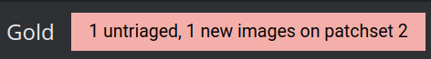
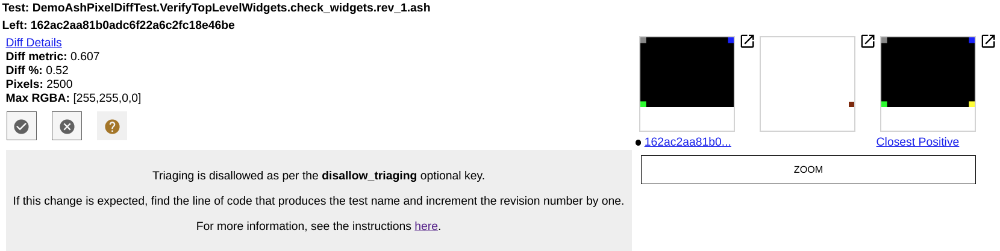

# Ash Pixel Unit Testing: Test Failure Triage

TL;DR: If you made a UI change that you expect to change ash_pixeltests, you
need to increment the revision number of the test by 1 in the C++ test source.

## 1. Introduction

`ash_pixeltests` is the test suite of image-based testing. If your CL breaks
`ash_pixeltests`, it means that the CL touches product UI features (including
but not limited to colors or view locations) and generates the screenshots
different from the benchmark images. This doc teaches you how to handle
`ash_pixeltests` failure.

If you have any questions, please reach out to //ash/test/pixel/OWNERS.

## 2. Finding Failed Tests

When `ash_pixeltests` is broken, the Gerrit review UI will display a redbox with
the message "X untriaged, Y new images on patchset Z". For example:

|        |
| :---------------------------------------: |
| Fig 1: the red box |

To view the details of the failed tests, click on the redbox. This will
open a list of records, each of which corresponds to a failed test. Here
is one example record:

|        |
| :---------------------------------------: |
| Fig 2: an example record |

Each record provides numerous information. As a CL author, you only need to
focus on the benchmark image name and the images.

In one record, the string following **Test** specifies the benchmark image that
your CL breaks. In the example record, the benchmark image name is
DemoAshPixelDiffTest.VerifyTopLevelWidgets.check_widgets.rev_1.ash.

There are always three images in a record. The images from left to right are:
- The new screenshot
- The image difference
- The original benchmark image.

If the new screenshot seems wrong to you, the pixel test could catch a bug in
your CL.

## 3. Locating the Test Code Line

Each benchmark’s name follows this rule:
~~~txt
{Test Suite Name}.{Test Case Name}.{Screenshot Name}.{rev_#number}.
{Platform Suffix}
~~~

where:
- {Test Suite Name}: it is the test class’s name. In the example record, it is
“DemoAshPixelDiffTest”.
- {Test Case Name}: In the example record, it is “VerifyTopLevelWidgets”.
- {Screenshot Name}: it is the string specified when taking the screenshot. In
the example record, it is “check_widgets”.
- {rev_#number}: it is the concatenation between the constant “rev_” and the
revision number given in the test code. We will revisit this revision number in
the doc later.
- {Platform Suffix}: it indicates the platform on which the screenshot is taken.
For ash pixel tests, it is always “ash”. **NOTE**: this doc only covers ash
pixel tests. If the platform suffix is not “ash”, you are reading the wrong doc.

To locate the test file, you can search `{Test Suite Name}` in the Chromium code
base. In that test file, you can search `{Test Case Name}` to find the test
case. In that test case, you can search `{Screenshot Name}` to find the code
line that generates the benchmark image.

Use the previous record as an example. To locate the test code that generates
DemoAshPixelDiffTest.VerifyTopLevelWidgets.check_widgets.rev_1.ash, you should:
- First, search “DemoAshPixelDiffTest” in the Chromium code base. You will find
ash/test/pixel/demo_ash_pixel_diff_test.cc; then
- Second, search “VerifyTopLevelWidgets” in that file. You will find the test
case defined by TEST_F(DemoAshPixelDiffTest, VerifyTopLevelWidgets); then
- Third, search "check_widgets" in the test case. You will find the exact code
line that generates the screenshot.

## 4. Locating the Test Code Line

Assume that the new screenshot generated by your CL is expected. Recall the
revision number mentioned in Section 3. Add a one-line change in your CL:
increase the revision number by one.

For example, the original test code could be

~~~c++
EXPECT_TRUE(GetPixelDiffer()->CompareUiComponentsOnPrimaryScreen(
      "check_widgets",
      /*revision_number=*/1, widget1.get(), widget2.get(), widget3.get(),
      widget4.get()));
~~~

Then the code after your change should be

~~~c++
EXPECT_TRUE(GetPixelDiffer()->CompareUiComponentsOnPrimaryScreen(
      "check_widgets",
      /*revision_number=*/2, widget1.get(), widget2.get(), widget3.get(),
      widget4.get()));
~~~

The only difference in the pixel test code should be the revision number.

Submit your new CL and wait for LGTM from the test owner.
