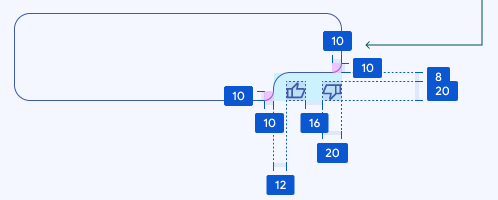

# Ash Utility

## Arc Curve Corner

Here is an example arc curve corner:

An arc curve corner is a corner shape consisting of arcs and lines. It can be
specified with the following parameters:
- **width**: The width of the arc curve corner. In this example, the width is
          10+12+16+20*2=78.
- **height**: The height of the arc curve corner. In this example, the height
          is 8+20+10=38.
- **convex radius**: The radius of the convex rounded corner. In this example,
          this value is 10.
- **concave radius**: The radius of the concave rounded corner. In this example,
          this value is 12.

NOTE: A valid arc curve corner must satisfy
- width >= 2*convex_radius+concave_radius
- height >= 2*convex_radius+concave_radius

### Draw an arc curve corner in code

`GetArcCurveRectPath()` accepts three parameters:
- size: The size of the bounding rectangle with an arc curve corner.
- arc_curve_corner: An arc curve corner specified by the aforementioned
    parameters.
- corner_radius: If given, specifies the corner radius of the corners that are
    not shaped with an arc curve.

Typically, we clip a view with the path returned by `GetArcCurveRectPath()`
in the overridden `OnBoundsChanged()` function. For example:

~~~c++
class ViewWithArcCurveCorner : public views::View {
  // ...

  // views::View:
  void OnBoundsChanged(const gfx::Rect& previous_bounds) override {
    SetClipPath(GetArcCurveRectPath(
                            GetContentsBounds().size(),
                            ArcCurveCorner(/*parameters...*/),
                            kCornerRadius));
  }
};
~~~
