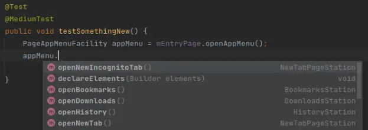

#  Public Transit

Public Transit is a framework for integration tests that models application
states and transitions between them.

[TOC]

## How to Use Public Transit?

See the [Getting Started with Public Transit](getting_started.md) guide.

## Why Use Public Transit?

**Scalability**

Public Transit introduces a framework for sharing code between tests, such
that UI affordances are modelled once in the Transit Layer, and then reused
between tests. When app behavior changes, the matching test changes will
often be limited to the Transit Layer (instead of individual tests).
Furthermore, when systemic issues are found, fixes for them can often be
made in the Framework Layer without the need to update individual tests.

**Debuggability**

Chrome's integration test failures have historically been difficult to diagnose,
especially when not reproducible with local debugging. Public Transit's
extensive logging and assertions provides more upfront information about test
failures.

**Consistency**

Integration tests are complex, and often so is the code behind them. Public
Transit's clear distinction between "Transit Layer" and "Test Layer" guides
tests to be written in a consistent way, making them easier to understand.

**Discoverability**

The Transit Layer makes heavy use of concrete types, such that all transitions
between states are discoverable through auto-complete:



## Primary Framework Features

### State Management

* All transitions between states are synchronous operations, which means it is
  impossible to forget to wait on conditions.
* Most conditions are modelled in the Transit Layer, which means it is harder
  for individual tests to miss a condition compared with adhoc tests.

### Logging and Error Messages {#logging}

Public Transit emits detailed logs to Android's Logcat for each transition and
active condition. When transitions fail (due to timeouts), the state of all
conditions are logged. This step-by-step logging helps contextualizing failures
like native crashes and allows comparing failing runs with successful runs.

Example Logs Output:

```
Conditions fulfilled:
    [1] [ENTER] [OK] View: (with id: org.chromium.chrome.tests:id/tab_switcher_button and is displayed on the screen to the user) (fulfilled after 0-25 ms)
    [3] [ENTER] [OK] View: (with id: org.chromium.chrome.tests:id/menu_button and is displayed on the screen to the user) (fulfilled after 0-33 ms)
...
    [9] [ENTER] [OK] URL of activity tab contains "/chrome/test/data/android/navigate/two.html (fulfilled after 5401-5671 ms)
         34- 2908ms ( 48x): NO | ActivityTab url: "http://127.0.0.1:33010/chrome/test/data/android/popup_test.html"
       3073- 5401ms ( 41x): NO | ActivityTab url: "http://127.0.0.1:33010/chrome/test/data/android/navigate/one.html"
       5671- 5726ms (  2x): OK | ActivityTab url: "http://127.0.0.1:33010/chrome/test/data/android/navigate/two.html"
Trip 4: Arrived at <S4: PageStation>
...
org.chromium.base.test.transit.TravelException: Did not complete Trip 11 (<S9: WebPageStation> to <S10: WebPageStation>)
    at org.chromium.base.test.transit.Transition.newTransitionException(Transition.java:164)
    at org.chromium.base.test.transit.Transition.waitUntilConditionsFulfilled(Transition.java:140)
    at org.chromium.base.test.transit.Transition.performTransitionWithRetries(Transition.java:95)
    at org.chromium.base.test.transit.Transition.transitionSync(Transition.java:55)
    at org.chromium.base.test.transit.Station.travelToSync(Station.java:102)
    at org.chromium.chrome.test.transit.page.PageStation.loadPageProgrammatically(PageStation.java:358)
    at org.chromium.chrome.test.transit.testhtmls.PopupOnLoadPageStation.loadInCurrentTabExpectPopups(PopupOnLoadPageStation.java:70)
    at org.chromium.chrome.browser.PopupPTTest.test900PopupWindowsAppearWhenAllowed(PopupPTTest.java:130)
    ... 47 trimmed
Caused by: org.chromium.base.test.util.CriteriaNotSatisfiedException: Did not meet all conditions:
    [1] [ENTER] [OK  ] Activity exists and is RESUMED: ChromeTabbedActivity {fulfilled after 0~0 ms}
            0-10113ms (141x): OK   | matched: org.chromium.chrome.browser.ChromeTabbedActivity@d416c1d (state=RESUMED)
    [2] [ENTER] [OK  ] View: (view.getId() is <2130773031/org.chromium.chrome.tests:id/home_button>) {fulfilled after 0~12 ms}
    [3] [ENTER] [OK  ] View: (view.getId() is <2130774255/org.chromium.chrome.tests:id/tab_switcher_button>) {fulfilled after 0~14 ms}
    [4] [ENTER] [OK  ] View: (view.getId() is <2130773254/org.chromium.chrome.tests:id/menu_button>) {fulfilled after 0~15 ms}
    [5] [ENTER] [OK  ] View: (view.getId() is <2130774443/org.chromium.chrome.tests:id/url_bar>) {fulfilled after 0~17 ms}
    [6] [ENTER] [OK  ] Received 2 didAddTab callbacks {fulfilled after 1790~2242 ms}
           17- 1790ms ( 23x): NO   | Called 0/2 times
         2242- 3523ms ( 23x): OK   | Called 1/2 times
         3800-10118ms ( 95x): OK   | Called 2/2 times
    [7] [ENTER] [OK  ] Received 2 didSelectTab callbacks {fulfilled after 1790~2242 ms}
           17- 1790ms ( 23x): NO   | Called 0/2 times
         2242- 3523ms ( 23x): OK   | Called 1/2 times
         3800-10118ms ( 95x): OK   | Called 2/2 times
    [8] [ENTER] [OK  ] Activity tab is the expected one {fulfilled after 1790~2242 ms}
           17- 1790ms ( 23x): WAIT | waiting for suppliers of: ExpectedTab
         2242- 3523ms ( 23x): OK   | matched expected activityTab: org.chromium.chrome.browser.tab.TabImpl@7eaa6a7
         3800-10119ms ( 95x): OK   | matched expected activityTab: org.chromium.chrome.browser.tab.TabImpl@4a72320
    [9] [ENTER] [OK  ] Regular tab loaded {fulfilled after 3523~3808 ms}
           17- 1790ms ( 23x): WAIT | waiting for suppliers of: ActivityTab
         2242- 3523ms ( 23x): NO   | incognito false, isLoading true, hasWebContents true, shouldShowLoadingUI true
         3808-10119ms ( 95x): OK   | incognito false, isLoading false, hasWebContents true, shouldShowLoadingUI false
    [10] [ENTER] [OK  ] Page interactable or hidden {fulfilled after 3885~4428 ms}
           17- 3523ms ( 46x): WAIT | waiting for suppliers of: LoadedTab
         3812- 3885ms (  2x): NO   | isUserInteractable=false, isHidden=false
         4428-10119ms ( 93x): OK   | isUserInteractable=true, isHidden=false
    [11] [ENTER] [OK  ] Title of activity tab is "Two" {fulfilled after 3523~3814 ms}
           17- 3523ms ( 46x): WAIT | waiting for suppliers of: LoadedTab
         3814-10119ms ( 95x): OK   | ActivityTab title: "Two"
    [12] [ENTER] [FAIL] URL of activity tab contains "http://127.0.0.1:45439/chrome/test/data/android/popup_test.html" {unfulfilled after 10119 ms}
           17- 3523ms ( 46x): WAIT | waiting for suppliers of: LoadedTab
         3815-10119ms ( 95x): NO   | ActivityTab url: "http://127.0.0.1:45439/chrome/test/data/android/navigate/two.html"
    [13] [ENTER] [OK  ] WebContents present {fulfilled after 3523~3815 ms}
           18- 3523ms ( 46x): WAIT | waiting for suppliers of: LoadedTab
         3815-10120ms ( 95x): OK   | 
```

### Code Reuse

Public Transit increases code reuse between test classes that go through the
same test setup and user flow by putting common code in the Transit Layer,
including:

* Conditions to ensure certain states are reached
* Transition methods to go to other states
* Espresso `ViewMatchers` for the same UI elements

The transition methods shows the "routes" that can be taken to continue from the
current state, increasing discoverability of shared code.


## Additional Framework Features {#features}


### Batching {#batching}

It is recommended to batch Public Transit tests to reduce runtime and save CQ/CI
resources.

#### How to Batch a Public Transit Test

1. Add `@Batch(Batch.PER_CLASS)` to the test class.
2. Add the [`BatchedPublicTransitRule<>`] specifying the home station. The *home
   station* is where each test starts and ends.
3. Get the first station in each test case from a batched entry point, e.g.
   `ChromeTabbedActivityPublicTransitEntryPoints#startOnBlankPage()`.
4. Each test should return to the home station. If a test does not end in the
   home station, it will fail (if it already hasn't) with a descriptive message.
   The following tests will also fail right at the start.

In Chrome, in many situations, [`BlankCTATabInitialStatePublicTransitRule`] is
more practical to use to automatically reset Tab state. It also acts as entry
point.

[`BatchedPublicTransitRule<>`]: https://source.chromium.org/search?q=symbol:BatchedPublicTransitRule&ss=chromium
[`BlankCTATabInitialStatePublicTransitRule`]: https://source.chromium.org/search?q=symbol:BlankCTATabInitialStatePublicTransitRule&ss=chromium

### ViewPrinter

[`ViewPrinter`] is useful to print a View hierarchy to write ViewElements and
debug failures. The output with default options looks like this:

```
@id/control_container | ToolbarControlContainer
├── @id/toolbar_container | ToolbarViewResourceFrameLayout
│   ╰── @id/toolbar | ToolbarPhone
│       ├── @id/home_button | HomeButton
│       ├── @id/location_bar | LocationBarPhone
│       │   ├── @id/location_bar_status | StatusView
│       │   │   ╰── @id/location_bar_status_icon_view | StatusIconView
│       │   │       ╰── @id/location_bar_status_icon_frame | FrameLayout
│       │   │           ╰── @id/loc_bar_status_icon | ChromeImageView
│       │   ╰── "about:blank" | @id/url_bar | UrlBarApi26
│       ╰── @id/toolbar_buttons | LinearLayout
│           ├── @id/tab_switcher_button | ToggleTabStackButton
│           ╰── @id/menu_button_wrapper | MenuButton
│               ╰── @id/menu_button | ChromeImageButton
╰── @id/tab_switcher_toolbar | StartSurfaceToolbarView
    ├── @id/new_tab_view | LinearLayout
    │   ├── AppCompatImageView
    │   ╰── "New tab" | MaterialTextView
    ╰── @id/menu_anchor | FrameLayout
        ╰── @id/menu_button_wrapper | MenuButton
            ╰── @id/menu_button | ChromeImageButton
```

[`ViewPrinter`]: https://source.chromium.org/search?q=symbol:ViewPrinter%20f:base%2Ftest&ss=chromium

### Debugging Options {#debugging}

[`PublicTransitConfig`] configures the test to run differently for debugging:

* `setTransitionPauseForDebugging()` causes the test to run more slowly, pausing
  for some time after each transition and displaying a Toast with which Station
  is active. 1500ms is a good default.
* `setOnExceptionCallback()` runs the given callback when an Exception happens
  during a Transition. Useful to print debug information before the test fails
  and the app is closed.
* `setFreezeOnException()` freezes the test when an Exception happens during a
  Transition. Useful to see what the screen looks like before the test fails and
  the instrumented app is closed.

[`PublicTransitConfig`]: https://source.chromium.org/search?q=symbol:PublicTransitConfig%20f:base%2Ftest&ss=chromium

## Overview

### Metaphor

The metaphor for the framework is that a Transit Layer provides tests with
routes to navigate the app using shared code, as opposed to each test driving
its private car (writing its own private code) to set up the test.

A Public Transit test moves around the app by going from `Station` to `Station`,
and the stations are connected by routes (transition methods). `Stations` are
marked by `Elements`, which are recognizable features of the destination station
(features such as Android Views), which the test takes as evidence that it has
arrived and is ready to perform any test-specific operation, checking or further
navigation.

At a `Station` there are `Facilities` that can be entered, such as menus,
dialogs, or more abstract substates, such as data loaded from disk. Transition
methods are also used to enter and exit those `Facilities`.

The metaphor is not very accurate in that **`Stations` and `Facilities` instances
are snapshots of the app state** that the test is expected to reach. A user action
that changes a selection in a form, for example, would be modeled not by mutating
the dialog's `Facility`, but creating a second instance of the dialog `Facility`
with a property. `Stations` and `Facilities` are mostly immutable objects.

### Structure and Layers {#layers}

Public Transit is structured as follows:

|Layer|Contents|File names|Location|Width (how many files)
|-|-|-|-|-|
|Test Layer|Instrumentation test classes|`*PTTest.java`|`//chrome/**/javatests`|wide|
|Transit Layer|Concrete `Stations`, `Facilities`|`*Station.java`, `*Condition.java`, etc.|`//chrome/test/android/javatests`|wide|
|Framework Layer|Public Transit classes|All classes with package `org.chromium.base.test.transit.*`|[`//base/test/.../transit`]|narrow|

[`//base/test/.../transit`]: https://source.chromium.org/chromium/chromium/src/+/main:base/test/android/javatests/src/org/chromium/base/test/transit/

#### Test Layer

The **Test Layer** contains the JUnit test classes with `@Test` methods. It should
be readable at a high level and delegate the logic that can be shared with other
tests to the to Transit Layer.

Code in the Test Layer that uses the Transit Layer should contain no explicit
waits; the waits should be modeled as transition methods.

An example of Test Layer code:

```java
@Test
public void testOpenTabSwitcher() {
    BasePageStation page = mTransitEntryPoints.startOnBlankPage();
    AppMenuFacility appMenu = page.openAppMenu();
    page = appMenu.openNewIncognitoTab();
    TabSwitcherStation tabSwitcher = page.openTabSwitcher();
}
```

Most of the time these transition methods, such as
`BasePageStation#openAppMenu()`, should be in the Transit Layer for sharing with
other tests. Transitions specific to the test can be written in the Test Layer.

#### Transit Layer

The **Transit Layer** contains the app-specific `Stations`, `Faciltiies`,
`Transitions` and `Conditions`, as well as entry points. This is the bulk of the
test code.

The Transit Layer is a representation of what the app looks like in terms of
possible states, and how these states can be navigated.

#### Framework Layer

The **Framework Layer** is the Public Transit library code, which is
app-agnostic. It contains the Public Transit concepts of `Station`,
`Transition`, `Condition`, etc.


## Classes and Concepts {#concepts}

### Stations

A [**`Station`**] represents one of the app's "screens", that is, a full (or
mostly full) window view. Only one `Station` can be active at any time.

For each screen in the app, a concrete implementation of `Station` should be
created in the Transit Layer, implementing:

* **`declareElements()`** declaring the `Views` and other enter/exit conditions
  define this `Station`.
* **transition methods** to travel to other `Stations` or to enter `Facilities`.
  These methods are synchronous and return a handle to the entered
  `ConditionalState` only after the transition is done and the new
  `ConditionalState` becomes `ACTIVE`.

Example of a concrete `Station`:

```java
/** The tab switcher screen, with the tab grid and the tab management toolbar. */
public class TabSwitcherStation extends Station {
    public static final ViewSpec NEW_TAB_BUTTON =
            viewSpec(withId(R.id.new_tab_button));
    public static final ViewSpec INCOGNITO_TOGGLE_TABS =
            viewSpec(withId(R.id.incognito_toggle_tabs));

    protected ActivityElement<ChromeTabbedActivity> mActivityElement;

    @Override
    public void declareElements(Elements.Builder elements) {
        mActivityElement = elements.declareActivity(ChromeTabbedActivity.class);
        elements.declareView(NEW_TAB_BUTTON);
        elements.declareView(INCOGNITO_TOGGLE_TABS);
    }

    public NewTabPageStation openNewTabFromButton() {
        NewTabPageStation newTab = new NewTabPageStation();
        return travelToSync(this, newTab, () -> NEW_TAB_BUTTON.perform(click()))
    }
}
```

[**`Station`**]: https://source.chromium.org/search?q=symbol:org.chromium.base.test.transit.Station&ss=chromium

### Facilities

A [**`Facility`**] represents things like pop-up menus, dialogs or messages that
are scoped to one of the app's "screens".

Multiple `Facilities` may be active at one time besides the active Station that
contains them.

As with `Stations`, concrete, app-specific implementations of Facility should be
created in the Transit Layer overriding **`declareElements()`** and **transition
methods**.

[**`Facility`**]: https://source.chromium.org/search?q=symbol:org.chromium.base.test.transit.Facility&ss=chromium

### CarryOn

A [** CarryOn **] represents something not tied to a Station, like data written
to disk, or a popup that persists through different `Stations`.

Multiple `CarryOns` may be active at one time.

As with `Stations`, concrete, app-specific implementations of CarryOn should be
created in the Transit Layer overriding **`declareElements()`**. It often won't
have any transition methods.

### ConditionalStates

`Station`, `Facility` and `CarryOn` extend [**`ConditionalState`**], which means
they declare enter and exit conditions as `Elements` and have a linear
lifecycle:

* `NEW` -> `TRANSITIONING_TO` -> `ACTIVE` -> `TRANSITIONING_FROM` -> `FINISHED`

Once `FINISHED`, a `ConditionalState` should not be navigated to anymore. If a
test comes back to a previous screen, it should be represented by a new
`Station` instance.

[**`ConditionalState`**]: https://source.chromium.org/search?q=symbol:org.chromium.base.test.transit.ConditionalState&ss=chromium

### Conditions

**`Conditions`** are checks performed to ensure a certain transition is
finished.

Common `Condition` subclasses are provided by the Framework Layer (e.g.
[`ViewConditions`] and [`CallbackCondition`]).

A lightweight way to wait for multiple `Conditions` without creating any
concrete `Stations`, `Facilities` or `CarryOns` is to use
`Condition#runAndWaitFor()`.

[`ViewConditions`]: https://source.chromium.org/search?q=symbol:org.chromium.base.test.transit.ViewCondition&ss=chromium
[`CallbackCondition`]: https://source.chromium.org/search?q=symbol:org.chromium.base.test.transit.CallbackCondition&ss=chromium

##### Custom Conditions

Custom app-specific Conditions should be implemented in the Transit Layer by
extending [`UIThreadCondition`] or [`InstrumentationThreadConditions`].

A Condition should implement `checkWithSuppliers()`, which should check the
conditions and return `fulfilled()`, `notFulfilled()` or `awaiting()`. An
optional but encouraged status message can be provided as argument. These
messages are aggregated and printed to logcat with the times they were output in
the transition summary. `whether()` can also be returned as a convenience
method.

Custom Conditions may require a dependency to be checked which might not exist
before the transition's trigger is run. They should take the dependency as a
constructor argument of type `Condition` that implements `Supplier<DependencyT>`
and call `dependOnSupplier()`. The dependency should supply `DependencyT` when
fulfilled.

An example of a custom condition:

```java
class PageLoadedCondition extends UiThreadCondition {
    private Supplier<Tab> mTabSupplier;

    PageLoadedCondition(ConditionWithResult<Tab> tabCondition) {
        mTabSupplier = dependOnCondition(tabCondition, "Tab");
    }

    @Override
    public String buildDescription() {
        return "Tab loaded";
    }

    @Override
    public ConditionStatus checkWithSuppliers() {
        Tab tab = mTabSupplier.get();

        boolean isLoading = tab.isLoading();
        boolean showLoadingUi = tab.getWebContents().shouldShowLoadingUI();
        return whether(
                !isLoading && !showLoadingUI,
                "isLoading %b, showLoadingUi %b",
                isLoading,
                showLoadingUi);
    }
}
```

[`UIThreadCondition`]:  https://source.chromium.org/search?q=symbol:org.chromium.base.test.transit.UIThreadCondition&ss=chromium
[`InstrumentationThreadConditions`]: https://source.chromium.org/search?q=symbol:org.chromium.base.test.transit.InstrumentationThreadCondition&ss=chromium
[crbug.com/343244345]: https://crbug.com/343244345

### Transitions

From the point of view of the Test Layer, transitions methods are blocking. When
a `Station` or `Facility` is returned by one of those methods, it is always
`ACTIVE` and can be immediately acted upon without further waiting.

#### Transition APIs

Transitions between `Stations` are done by calling `travelToSync()`.

Transitions into and out of `Facilities` are done by calling
`enterFacilitySync()`, `exitFacilitySync()` or `swapFacilitySync()`. If the app
moves to another `Station`, any active `Facilities` have their exit conditions
added to the transition conditions.

Transitions into and out of `CarryOns` are done by calling `CarryOn#pickUp()`
and `CarryOn#drop()`. `Condition#runAndWaitFor()` is a convenience shortcut for
`CarryOn#pickUp()`.

These methods takes as parameter a [`Trigger`], which is the code that should be
run to actually make the app move to the next state. Often this will be a UI
interaction like `() -> BUTTON_ELEMENT.perform(click())`.

[`Trigger`]: https://source.chromium.org/search?q=symbol:org.chromium.base.test.transit.Transition.Trigger%5Cb&ss=chromium

#### Enter, Exit and Transition Conditions {#transition-conditions}


The Conditions of a transition are the aggregation of:
* The **enter Conditions** of a `ConditionalState` being entered.
* The **exit Conditions** of a `ConditionalState` being exited unless the same
  Element is in a state being entered too.
* Any extra **transition Conditions** specific to that transition.
  * Most transitions don't need to add extra special Conditions.


#### Implementation Details


The way a Transition works is:
1. The states being exited go from Phase `ACTIVE` to `TRANSITIONING_FROM` and
   the states being entered go from Phase `NEW` to `TRANSITIONING_TO`.
2. The `Conditions` to complete the Transition are determined by comparing
   `Elements` of states being exited and the ones being entered.
3. A pre-check is run to ensure at least one of the Conditions is not fulfilled.
4. The provided `Trigger` lambda is run.
5. `ConditionWaiter` polls, checking the Conditions each cycle.
6. If ConditionWaiter times out before all Conditions are fulfilled:
    1. The test fails with an exception that contains the Transition, the status
       of all Conditions, and the stack up until the Test Layer.
7. If the Conditions are all fulfilled:
    1. The states being exited go from Phase `TRANSITIONING_FROM` to `FINISHED`
       and the states being entered go from Phase `TRANSITIONING_TO` to
       `ACTIVE`.
    2. A summary of the Condition statuses is printed to logcat.
    3. The entered ConditionalState, now `ACTIVE`, is returned to the transit
       layer and then to the test layer.


### TransitionOptions

[`TransitionOptions`] let individual Transitions be customized, adjusting
timeouts, adding retries, or disabling the pre-check.

[`TransitionOptions`]: https://source.chromium.org/search?q=symbol:org.chromium.base.test.transit.Transition.TransitionOptions&ss=chromium

## General Guidance {#guidance}

### Ownership of the Transit Layer {#ownership}

The Chrome-specific `Stations`, `Facilities`, `CarryOns` and `Conditions` that
comprise the Transit Layer should be owned by the same team responsible for the
related production code.

The exception is the core of the Transit Layer, for example `PageStation`, which
is not owned by specific teams, and will be owned by Clank Build/Code Health.

### Hopping Off

It is possible to write tests that start as a Public Transit test and use the
Transit layer to navigate to a certain point, then "hop off" framework and
continue navigating the app as a regular instrumentation test.

While it is preferable to model all transitions in the Transit Layer, a test
that uses Public Transit partially also realizes its benefits partially and
there should be no framework impediment to doing so.

Metaphorically, if there is no public transit to an address, you ride it as
close as possible and continue on foot.
