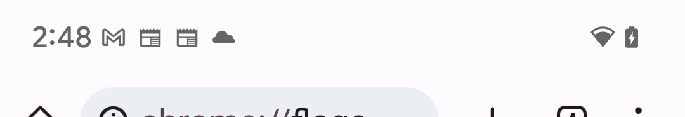
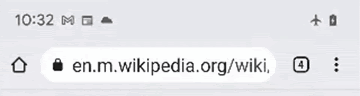

# Overview
## Status Bar Color Controller

The [StatusBarColorController]
(chrome/android/java/src/org/chromium/chrome/browser/ui/system/StatusBarColorController.java)
is a centralized component used to manipulate the status bar color, so that the status
bar always matches the color of the element below it, including toolbar, custom tab top
bar, offline indicator, tab switcher, and scrim, while the navbar color is not controlled here.

## Summary of Color Control Rules

- If the device is a tablet, apply the tab strip background.

On phones:

- In ChromeTabbedActivity,

-- If Chrome is presenting a status indicator above the toolbar, match the status indicator
color when it is present. (Currently only Offline Indicator is used.)

-- If Chrome is presenting a themed tab, match the theme color.

-- If Chrome’s toolbar is animating a color change due to focus/unfocus/theme change,
match the color in animation.

-- If Chrome is showing/hiding the tab switcher, toolbar will match the toolbar color in 
alpha animation.

-- If no case is matched or the device is in dark mode, use the default color
ColorUtils.getDefaultThemeColor.

- If Chrome or other apps opens a Custom Tab, the intended UX is

-- If there was a color in the Intent, use that color.

-- Otherwise, if there is a suitable tab, use the color from that.

-- Otherwise use the default.

- If we are running TWA(Trusted Web Activity) or WebAPK, the intended UX is:

-- If the user is on the verified origin, use the webpage's theme-color.

-- Otherwise, if there is a color provided in the Intent, use that color.

-- Otherwise, use the default color.

- In all cases, use the color calculated from the previous step, and apply the scrim
color darkening factor.

## Input Signals

- Toolbar color change: The toolbar color change has 3 cases: website theme color
change, url focus change, and tab switcher show/hide animation.

  --- When the toolbar starts or ends the url focus change animation,
  UrlExpansionObserver will send color-changing signal and UrlFocusChangeListener
  will receive a signal as an observer to inform the StatusBarColorController to change
  color. The StatusBarColorController uses the information provided by these callbacks
  to calculate the correct color.
  --- When toolbar changes color due to website theme changes, ToolbarColorObserverManager
  will collect the toolbar color update, and inform the StatusBarColorController
  throughout the animation, invoking the color update for status bar in real time, and
  thus synchronizing the status bar and toolbar color during toolbar animation.
  --- When toolbar's alpha value changes as the user shows/hides tab switcher,
  ToolbarColorObserverManager will calculate the status bar color by applying current
  toolbar color onto default tab switcher background color with tab switcher animation's
  alpha value, and inform the StatusBarColorController throughout the animation, invoking
  the color update for status bar in real time, and thus synchronizing the status bar and
  toolbar color during tab switcher animation.

- Offline indicator(status indicator): Offline indicator is a persistent bar that appears
below the status bar to denote the connectivity status. StatusBarColorController
observes the offline indicator color through the
StatusIndicatorCoordinator.StatusIndicatorObserver interface and updates the
status bar color to match the offline indicator, including during transition animations.
  -- When the device goes offline, the status bar color transitions to black, then the
offline indicator appears.
  -- When the device goes back online, the offline indicator (and consequently the
status bar) transitions to colorPrimary (see [dynamic_colors.md]
(https://source.chromium.org/chromium/chromium/src/+/main:docs/ui/android/dynamic_colors.md)
then to the omnibox color before disappearing.

- CCT (Chrome Custom Tab): When the user accesses a Chrome Custom Tab by
opening links outside of Chrome Tabbed Activity(for example, open a link from the
Google app results, or go to menu -> Setting -> About -> Legal -> Privacy Policy),
StatusBarColorController should use the color in the intent if available, otherwise
use the default status bar color.

- PWA (Progressive Web App): The user can create a Progressive Web App as an app
for themed websites, which will appear as a clickable icon on the Android launcher.
When the user open the PWA, StatusBarColorController should use the webpage's
theme-color if the user is on the verified origin, use intent color if there is a color
provided in the Intent, or use default color.

- Incognito mode switch: The status bar should match the dark toolbar color if the
user enters Incognito mode from regular browsing mode.

- Scrim: When the user opens an dialog or bottom sheet, a scrim will darken the
content, allowing the user to focus on the dialog. The status bar color should reflect
the darkened color of the UI.

## Corner cases and caveats

- When the device is in dark mode, the website theme color is not applied to toolbar
or status bar.

- Not all PWA/CCT sites behave the same way. A good example is how Chrome's Open
Source or Legal Information pages are presented, in which CCTs is opened from Chrome.
And the status bar will keep the default color in this case.