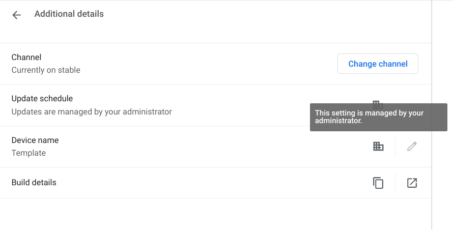

# Device Name

## Overview
This feature allows users to name their Chromebook. The name is set in both DHCP and Bluetooth.

Unmanaged users are allowed to name their Chromebook as long as they are logged into the
account registered as device owner. As for enterprise users, it depends on the policy set by their
administrator. The administrator has the option to allow managed users to change their device name.
In the case that they are not allowed, the administrator can set a template that is used as the
device name or may prefer to not set a template in which case the default name (“ChromeOS”) is used.

## Architecture

### Backend
The backend logic is mainly implemented in the following classes:

#### DeviceNamePolicyHandler
* Exposes an API which provides clients with the current device name policy, i.e., set by
administrator, configurable by user, or non-configurable by user (set to default name), which is
computed based on the values of the two abovementioned policies set in `CrosSettings`.

* If template is set, it will get the machine statistics (machine name, location, serial number,
asset ID) from StatisticsProvider to generate the hostname if those are part of the template (e.g. `
Google${MACHINE_NAME}`).

* Provides an observer interface with a pure virtual `OnHostnamePolicyChanged()` function which
notifies observers when the policy and/or hostname has changed.

* Device name is controlled by the following policies:
    * `DeviceHostnameTemplate` policy allows the admin to choose the hostname for the user.

    * `DeviceHostnameUserConfigurable` policy decides whether the managed user can choose the
     hostname but only if the template policy is not set.

#### DeviceNameStore
* Stores the name persistently (in `PrefService`) when it is set by settings.

* Exposes an API which provides clients with the ability to set the device name and to get the
device metadata, i.e. name and state. The state refers to whether the name can be modified or
prohibited by policy or prohibited because the user is not the device owner.

* Note: If the device name can be modified, we use `IsValidDeviceName()` function from `
DeviceNameValidator` class to check whether it is valid before setting it. Valid names must be
between 1 and 15 characters inclusive and contain only letters, numbers or hyphens.

* Observes `DeviceNamePolicyHandler` for changes in policy and/or hostname. On change, we recompute
the device name metadata, and attempt to update the existing name. If the attempt is successful, we
set it in the device’s local state (`PrefService`) and also call the `SetName()` function of the `
DeviceNameApplier` class.

* Observes `ProfileManager` for changes in the current profile such that we recompute the device
name state whenever the owner privileges of the profile changes.
* Provides an observer interface with a pure virtual `OnDeviceNameMetadataChanged()` function which
notifies observers when the device name metadata changes.

#### DeviceNameApplier

* Exposes one API function, `SetDeviceName()`, which uses `NetworkStateHandler` and `
BluetoothAdapter` to set the name via DHCP and Bluetooth respectively. If calls to the `
BluetoothAdapter` fail, we retry them with an exponential backoff.

### Middleware
The backend and frontend communicate to each other through the `DeviceNameHandler` on the C++ side
and `DeviceNameBrowserProxy` on the JS side.

#### DeviceNameHandler
* Handles messages from `DeviceNameBrowserProxy` related to getting and setting the device name.

* Observes `DeviceNameStore` for changes in the device name metadata.

* When the device name metadata changes or when it receives a message from the proxy that it is
ready to receive the device name, it fires the `WebUIListener` with the device name metadata found
in the `DeviceNameStore`.

* When it receives a message from the proxy to update the device name, it calls `SetDeviceName()`
function of DeviceNameStore and resolves the callback with the result of the update.

#### DeviceNameBrowserProxy
* Provides a `NotifyReadyForDeviceName()` function which sends a message to the  `DeviceNameHandler`
when the Detailed Build Info page loads.

* Provides an `attemptSetDeviceName(name)` function that sends a message to the `DeviceNameHandler`
to attempt setting the new name entered by the user. The message is resolved with the result of
this attempt.

### Frontend
The frontend work for this feature is done mostly in the Detailed Build Info page and Edit Hostname
Dialog.

#### Detailed Build Info page
* Contains the device name setting option.

* If the device name cannot be changed because of forbidden policies (either because the
administrator set a template name or set policy that prohibits the user from changing the name), an
enterprise icon shows up on the side and the edit button is disabled.

* If the device name cannot be changed because the active user is not the device owner, an owner
icon shows up on the side and the edit button is disabled.

#### Edit Hostname Dialog
* Here, the user can enter a new device name in the text input field. Directly below that, we add
an input info box informing the user what type of input is valid and the current count of the name (
e.g. 5/15).

* If the input contains any invalid characters or the minimum/maximum number of characters is not
respected, the input info box turns red and the done button is disabled. If the user attempts to
enter more than the maximum limit, the input is truncated.

* Note: if the user types an emoji, it is removed from the input and does not appear in the text
field.

## Admin UI Console
In the Admin console, the administrator has the option to either allow or disallow managed users to
specify the device name. Picking the “allow” option will set the `DeviceHostnameUserConfigurable`
policy to true, else it is set to false.

If the administrator picks the “disallow” option, another setting option will appear and the
administrator can decide to set a template for the name, which will set the `DeviceHostnameTemplate`
policy. If a template is set (e.g `Google${MACHINE_NAME}`), it will be used as the device name.
Otherwise, the default name “ChromeOS” is used.

## Additional details
This feature is compatible with Nearby Share. When NearbyShare is used, the device name that is
visible to nearby devices is the one set in NearbyShare. After NearbyShare is used, the device name
is changed back to the one that was originally set by the user in this feature.

The name will be successfully set regardless of whether Bluetooth or Wi-Fi is turned off when the
name is changed.