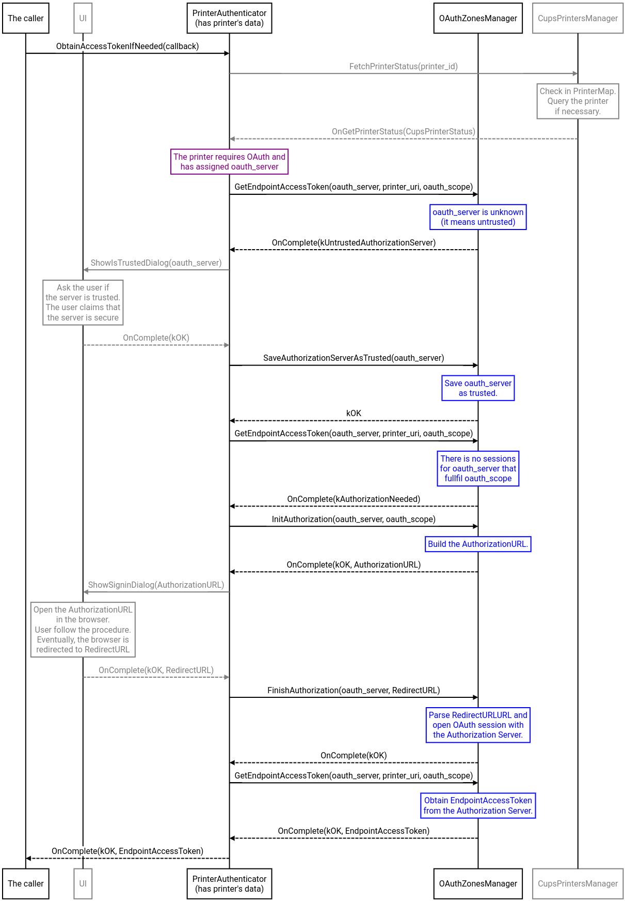

# OAuth 2 for IPP Printers

Some printers may require an access token to allow a user to use them.
The access token is issued by the Authorization Server when the user
successfully completes the required authorization procedure (e.g. enter
credentials). Only the client side of the protocol is implemented here.
See the following links for more context (internal only):
 * [the general concept and the protocol](http://go/oauth-for-ipp)
 * [the design doc of the Client](http://go/oauth-for-ipp-client)
 * [the feature bug](https://bugs.chromium.org/p/chromium/issues/detail?id=1220197)

## API

The API consists of the following entities:
 * class `AuthorizationZonesManager`
 * class `AuthorizationZonesManagerFactory`
 * enum `StatusCode`

The description of the API can be found in the corresponding header files:
 * [authorization_zones_manager.h](https://source.chromium.org/chromium/chromium/src/+/main:chrome/browser/ash/printing/oauth2/authorization_zones_manager.h)
 * [status_code.h](https://source.chromium.org/chromium/chromium/src/+/main:chrome/browser/ash/printing/oauth2/status_code.h)

The sequence diagram at the end of this document shows an example use
of the API.

## Internal classes

All the following classes are hidden behind the aforementioned API and should
not be used directly:
 * `AuthorizationServerData` - implements Metadata Request and Registration
   Request
 * `AuthorizationServerSession` - implements First Token Request and Next Token
   Request
 * `AuthorizationZone` - manage all sessions with single Authorization Server
 * `HttpExchange` - low-level support for all OAuth 2 requests
 * `IppEndpointTokenFetcher` - implements Token Exchange Request
 * `ProfileAuthServersSyncBridge` - synchronize the list of trusted
   Authorization Servers with the user's profile
 * `FakeAuthorizationServer` - used only in unit tests.

## Helper

The class `PrinterAuthenticator` provides a single method allowing to obtain
an access token for a given printer.
It uses the API from `AuthorizationZonesManager` and the `SigninDialog` UI.
The class `PrinterAuthenticator` is described in
[printer_authenticator.h](https://source.chromium.org/chromium/chromium/src/+/main:chrome/browser/ash/printing/printer_authenticator.h).
The sequence diagram below shows example interactions between the instance of
the class `PrinterAuthenticator` and the API defined in
`AuthorizationZonesManager`.

