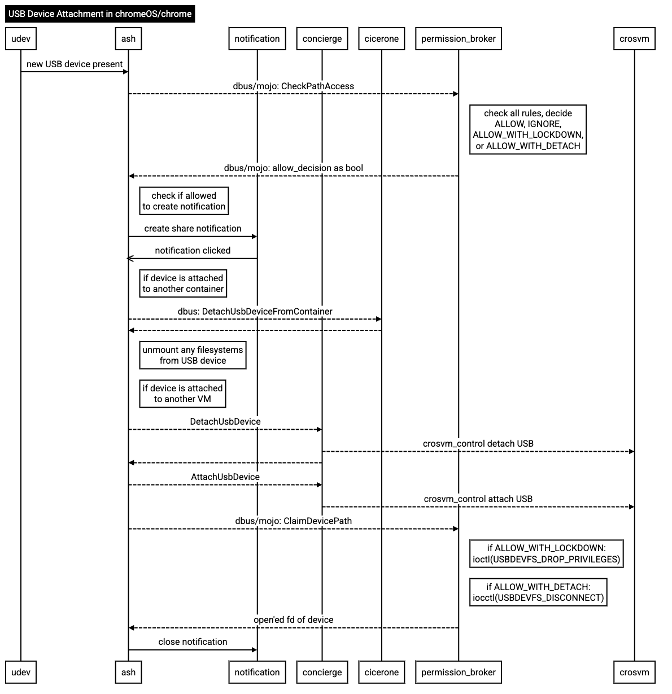

chrome/browser/ash/usb
======================

This directory contains the CrosUsbDetector, whose job it is to deal with devices that are plugged
into a chromeOS device - notifications of which come from the UsbDeviceManager Mojo service.

Once a new device has been detected, CrosUsbDetector will first query permission_broker to see if
the device is allowed - either via device policy or via the rules which can allow or deny devices
based on various characteristics. CrosUsbDetector furthermore makes a decision if a user-facing
notification (of the form 'Share with Android/Linux') should be shown, or if the device will be made
silently available via the settings pages.

If a user elects to share a device (in this case via the notification, as the settings flow is
handled elsewhere), the flow is roughly: AttachUsbDeviceToGuest() -> UnmountFilesystems() ->
OnUnmountFilesystems() -> AttachAfterDetach() -> OnAttachUsbDeviceOpened() -> DoVmAttach() ->
OnUsbDeviceAttachFinished(). A more thorough depiction of the flow can be seen below:

Things to note:
- permission_broker is actually asked twice if it is ok with a device being shared, once upon new
  device detection and then once more upon the request to share it / pass it through.
- CrosUsbDetector also keeps a list of USB classes which it does not wish to be passed through, and
  these are used to create an interface mask that permission_broker uses to drop those interfaces when
  passing the device through.
