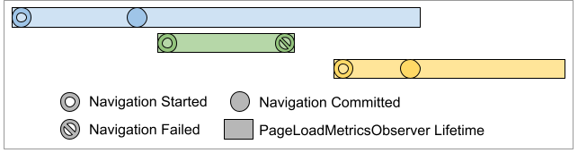

# Tracking Page Load Metrics In Chrome: Implementing a PageLoadMetricsObserver

Page load metrics can be tracked in chromium by implementing the
[`PageLoadMetricsObserver`](/components/page_load_metrics/browser/page_load_metrics_observer.h)
interface, which provides callbacks that indicate when various paint, document,
and user interaction events happen during the course of a page load.

This document provides a detailed guide to implementing a `PageLoadMetricsObserver`.
For a quick introduction, you may wish to read the [implementation basics](#implementation-basics)
section below, browse the [`PageLoadMetricsObserver`](/components/page_load_metrics/browser/page_load_metrics_observer.h)
interface, and look over [existing `PageLoadMetricsObserver` implementations](/chrome/browser/page_load_metrics/observers/).
You can refer [`AssertPageLoadMetricsObserver`](/components/page_load_metrics/browser/observers/assert_page_load_metrics_observer.h) for context and assumptions that callbacks can be rely on.

`PageLoadMetricsObserver`s can track [web vitals](https://web.dev/vitals/) like time to [Largest Contentful Paint](https://web.dev/lcp) and other per-page metrics such as time to first user input in [UMA](/tools/metrics/histograms/README.md) or [UKM](https://chromium.googlesource.com/chromium/src/+/refs/heads/main/services/metrics/ukm_api.md).

You can implement a `PageLoadMetricsObserver` to:

* Filter per-page metrics to a subset of page loads
  relevant to you or your team. Example: [`DataSaverSiteBreakdownMetricsObserver`](data_saver_site_breakdown_metrics_observer.cc)
* Track new page load related metrics not already included in the core page load metrics.
  Example: [`HttpsEngagementPageLoadMetricsObserver`](https_engagement_metrics/https_engagement_page_load_metrics_observer.cc)
* Provide page load metrics to another Chrome component.
  Example: [`AndroidPageLoadMetricsObserver`](android_page_load_metrics_observer.cc)

[TOC]

If you have additional questions or needs not covered in this document,
please contact speed-metrics-dev@chromium.org.

## Key Concepts: Navigations, provisional loads, committed loads
The rest of this document assumes familiarity with the page load lifecycle in
Chrome. Key concepts are explained briefly here:

* A page load, or just “load”, is considered “provisional” during the period
  from when its navigation starts (roughly, when the request is sent) until the
  navigation either fails or commits.
* A navigation “commits” when the first response bytes (post-redirect, if any)
  are processed in the renderer. A load is considered “committed” during the
  period starting when its navigation commits, until another navigation in the
  frame commits and replaces it, or until the hosting frame is destroyed.
* A navigation fails when the response is not successfully received over the
  network. For example, a navigation may fail because hostname resolution fails,
  or because establishing a connection to the server fails, among other reasons.
* There can be at most one committed load in a frame at any given time.
* However, a committed load can be placed in the Back/Forward Cache (BFCache),
  whereupon it is frozen, and another load can commit in the same frame, while
  the original committed load is still 'live' (but frozen). Note that not every
  page is eligible to be placed in the BFCache.
* There is typically at most one provisional load in a frame at any given time,
  though there can be two provisional page loads in a frame in uncommon cases.

For more detailed information, see the comments in the navigation section of
[`WebContentsObserver`](https://source.chromium.org/chromium/chromium/src/+/main:content/public/browser/web_contents_observer.h?q=file:web_contents_observer.h%20%22%2F%2F%20Navigation%20---%22&ss=chromium),
as well as the navigation-related entries in
[Truths and Not Truths](https://docs.google.com/document/d/1UyF1sBxXmRC0MQ7MBcQdkFWJ4IgJQMw_t8qWzjtpY0g/edit).

## PageLoadMetricsObserver lifetime

Page load metrics are tracked by implementing the `PageLoadMetricsObserver`
interface. A new instance of each `PageLoadMetricsObserver` implementation is
instantiated for each page load. `PageLoadMetricsObserver` instances are created
and owned by the page load metrics infrastructure. A `PageLoadMetricsObserver`’s
lifetime starts when a main frame navigation is initiated, and ends when one of
the following cases is encountered:

* The hosting `WebContents` (a `WebContents` is essentially a browser tab) is destroyed
* The navigation fails to commit
* Another navigation in the frame commits and replaces the committed load, for page loads that committed, but are not eligible to enter the Back/Forward cache.
* The page is placed in the Back/Forward Cache, and the `PageLoadMetricsObserver` in question responds to the resulting `OnEnterBackForwardCache` callback with `STOP_OBSERVING`.
* The page is placed in the Back/Forward Cache, and is evicted without being restored.

### Example: `PageLoadMetricsObserver` lifetimes, for a WebContents with 3 page loads

Above, we show example `PageLoadMetricsObserver` (PLMO) lifetimes for a
`WebContents` with three main-frame navigations, shown in blue, green, and
yellow, with time starting on the left, and ending on the right.
* The PLMO for the first navigation in the `WebContents`, in blue, is
  instantiated when its navigation starts, and is destroyed when the next
  navigation in the `WebContents` commits (the yellow load).
* The PLMO for the second navigation, in green, is instantiated when its
  navigation starts, and is destroyed when its navigation fails to commit.
  Because the green navigation fails to commit, the lifetime of the PLMO for the
  blue load is not affected by this navigation.
* The PLMO for the third navigation, in yellow, is instantiated when its
  navigation starts, and is destroyed when the `WebContents` is closed. The
  commit of the yellow navigation causes the PLMO for the previously committed
  load, in blue, to be destroyed.

`PageLoadMetricsObserver` lifetimes within a `WebContents` often overlap. In
particular, if there is a committed load in a `WebContents`, the lifetime of its
associated `PageLoadMetricsObserver` overlaps with the lifetime of subsequent
navigations, for the period from the subsequent load’s navigation start until
the next navigation commits. We see this for the blue and yellow loads in the
example above.

### `PageLoadMetricsObserver` callback life cycle

* A `PageLoadMetricsObserver` (PLMO) implementation is instantiated when a
  navigation starts. At this time, the `OnStart` callback is invoked.
* `OnRedirect` may be invoked one or more times, for each server-side redirect.
  Note that content-triggered redirects, such as meta refreshes or a JS-based
  navigations, are separate distinct page loads, and do not cause `OnRedirect`
  to be invoked.
* When the navigation finishes:
  * If the navigation commits:
    * If it does not meet the additional filtering criteria applied at commit
      time, no subsequent callbacks are invoked, and the PLMO is destroyed
    * Otherwise, `OnCommit` is invoked
  * If the navigation did not commit successfully, `OnFailedProvisionalLoad` is
    invoked, and the PLMO is destroyed.
* Finally, for page loads that committed, the `OnComplete` callback is invoked
  just before the PLMO is destroyed (due to e.g. a new page load committing, the
  associated `WebContents` being destroyed, etc).

Returning to the example above, callbacks are invoked in the following order:

* Blue navigation starts. `PageLoadMetricsObserver`s for the blue load are
  instantiated, and `OnStart` is invoked on them.
* Blue navigation commits. `OnCommit` is invoked for the blue load’s PLMOs.
* Green navigation starts. PLMOs for the green load are instantiated, and
  `OnStart` is invoked for them.
* Green navigation fails to commit. `OnFailedProvisionalLoad` is invoked for the
  green load’s PLMOs. PLMOs for the green navigation are then destroyed.
* Yellow navigation starts. PLMOs for the yellow navigation are instantiated,
  and `OnStart` is invoked on them.
* Yellow navigation commits. `OnComplete` is invoked for the blue load’s PLMOs.
  `OnCommit` is then invoked for the yellow load’s PLMOs.
* The hosting tab is destroyed. `OnComplete` is invoked for the yellow load’s PLMOs.

Additionally, the following callbacks may be invoked during the lifetime of a
`PageLoadMetricsObserver`:

* At any time (either before or after commit):
  * `OnHidden` and `OnShown` are invoked as the associated `WebContents` is
    hidden or shown (e.g. when the user switches tabs).
  * On Android, if the Chrome application is backgrounded, the
    `FlushMetricsOnAppEnterBackground` callback is invoked to signal to
    observers that any metrics buffered in memory should be persisted. Once
    `FlushMetricsOnAppEnterBackground` is invoked, the application may be killed
    without subsequent notification. Note that `FlushMetricsOnAppEnterBackground`
    may be invoked multiple times for a single page load if Chrome transitions
    from the foreground to background to foreground to background without being
    killed. Note that this callback is only invoked if the entire Chrome
    application is backgrounded. It is not invoked if the user e.g. switches
    between tabs within Chrome.
  * `OnLoadedResource` is invoked as each resource on the page finishes loading.
* After the load commits:
  * Page load timing callbacks, such as `OnFirstContentfulPaint` are invoked as
    the associated page load timing events occur.
  * `OnUserInput` is invoked as user input events are received.
  * `OnLoadingBehaviorObserved` is invoked as certain page loading behaviors are
    observed. See the section on loading behaviors below for additional information.
  * `OnEnterBackForwardCache` is invoked if the page will enter the Back/Forward
    cache. Observers may return `STOP_OBSERVING` from this callback if they do
    not wish to continue logging after a page has entered the BFCache, and this
    is the default implementation for `PageLoadMetricsObserver` (it will also
    call `OnComplete` at this time).
  * `OnRestoreFromBackForwardCache` is invoked when the page is restored from
    the Back/Forward cache. This callback is invoked with a `NavigationHandle`
    which will have a different navigation ID to the original page load's.
    Whether metrics should be logged using this new navigation ID, or the
    original page load's ID, depends on the desired interpretation of the
    metrics.

## Which page loads are tracked by `PageLoadMetricsObserver`s?

Only provisional loads that meet the following criteria are tracked:

* Main frame page loads (page load timing and metadata updates are collected for
  child frames and reported to observers for the main frame, as long as the main
  frame meets all other tracking criteria)
* By default, pages with HTTP or HTTPS URLs. Different schemes can be tracked
  by overriding `PageLoadMetricsObserver::ShouldObserveScheme()`.
* Non-New Tab Page URLs (on desktop, the NTP may be served over HTTPS. These
  loads are not tracked)
* Non same-page navigations (e.g. navigations using pushState, or using a
  #fragment within the same document are not tracked).

In addition, when a load commits, additional criteria are applied at commit time.
Only page loads that meet the earlier provisional criteria, as well as the
following criteria at commit time, are tracked after commit:

* Page loads that do not result in displaying a Chrome-generated error page
  (e.g. the ‘There is no Internet connection’ page is not tracked)
* Pages with successful HTTP status codes (4xx and 5xx responses are not tracked)
* HTML or XHTML pages

Note that the provisional criteria is applied again at commit time, as navigation
attributes such as the URL may have changed between the time a provisional load
is started and the time it commits.

Loads that finish and received HTTP response headers but did not commit do _not_
invoke the `OnFailedProvisionalLoad` callback. These are special case
navigations, such as downloads and HTTP 204/205 responses, which complete
successfully but do not result in a committed load.

If a page load is filtered due to the above criteria, no subsequent callbacks
will be invoked for the associated `PageLoadMetricsObservers` for that page load.

Because not every load meets the commit-time criteria, some
`PageLoadMetricsObserver`s will see calls to `OnStart` and `OnRedirect` but no
other callbacks.

We intend to allow teams to add custom `PageLoad` UMA metrics that relax these
constraints as needed. For instance, we could add support for tracking just NTP
loads, or chrome:// URLs. If you are interested in tracking metrics using a
different set of constraints, please reach out to speed-metrics-dev@chromium.org.

## Best practices

### Implementation basics
* If your new observer has no outside dependencies, and does not require
  embedder support, then header, implementation, and unit tests for new
  observers should be added to the
  [components/page_load_metrics/browser/observers/](/components/page_load_metrics/browser/observers/)
  directory. Otherwise, it should be added to the
  [chrome/browser/page_load_metrics/observers/](/chrome/browser/page_load_metrics/observers/)
  directory.
* You may wish to add browser tests to [page_load_metrics_browsertest.cc](/chrome/browser/page_load_metrics/page_load_metrics_browsertest.cc).
* Instantiate your observer in the `PageLoadMetricsEmbedder::RegisterObservers`
  method in [page_load_metrics_initialize.cc](/chrome/browser/page_load_metrics/page_load_metrics_initialize.cc).
* Add definitions for any new histograms into a file in [tools/metrics/histograms/metadata/](/tools/metrics/histograms/metadata/).
  If your histograms are specific to page load, you can add them to
  [page/histograms.xml](/tools/metrics/histograms/metadata/page/histograms.xml)
* Send your change to OWNERS for review.
* Reach out to speed-metrics-dev@chromium.org at any time if you have questions.

See https://chromium-review.googlesource.com/c/chromium/src/+/2294392 for an
example end-to-end change that adds a new `PageLoadMetricsObserver`.

### Filtering out backgrounded pages

By default, page loads that spend time in the background during the period
between navigation start and an event occurring are not included in core page
load metrics. Backgrounded pages are often throttled and thus their metrics can
be less useful/actionable for understanding page load performance.

For instance, the `PageLoad.PaintTiming.NavigationToFirstContentfulPaint` UMA
only includes samples for page loads that were in the foreground for the entire
period from navigation to first contentful paint. Page loads that were in the
background for any period of time between navigation start and first contentful
paint are excluded.

Thus, it is recommended that observers not record samples for metrics that occur
when a page load is in the background.

An observer that does not want to track any metrics for events that occur after
the page has been backgrounded can implement `OnHidden` to return `STOP_OBSERVING`,
and OnStart to return `STOP_OBSERVING` if the `started_in_foreground` parameter
is false.

Observers that track some background metrics can determine if an event happened
completely in the foreground using the `WasStartedInForegroundOptionalEventInForeground`
method. See existing page load metrics observer implementations for examples.

Observers that wish to track metrics for pages that spend time in the background
can log metrics for those cases by checking that
`WasStartedInForegroundOptionalEventInForeground` returns false, and using a
separate histogram with a `.Background` suffix. For example,
`PageLoad.PaintTiming.NavigationToFirstContentfulPaint.Background` includes page
loads that were in the background at some point in time between navigation start
and first contentful paint. In practice, we have not found `.Background`
histograms to be very useful, other than to track the percentage of page loads
that spend time in the background. Observers are discouraged from logging
background histograms unless there is a clear reason to do so.

### Choosing UMA histogram names

Most observers add their histograms under the `PageLoad.Clients.*` prefix. For
example, `PageLoad.Clients.DataReductionProxy.PaintTiming.NavigationToFirstContentfulPaint`
tracks `PageLoad.PaintTiming.NavigationToFirstContentfulPaint` for the subset of
page loads loaded through the data reduction proxy. It is recommended that
observers add metrics under `PageLoad.Clients`, as this allows other UMA users
to more easily discover these metrics while browsing metrics with the
`PageLoad.*` prefix.

If your metrics are not likely to be useful to other UMA users interested in
page load metrics, you may wish to use a different naming scheme for your
metrics. If you have questions, reach out to speed-metrics-dev@chromium.org.

### Avoiding data loss by flushing metrics when Chrome is backgrounded
On the Android platform, once the Chrome application goes into the background,
it may be killed without subsequent notification. To avoid data loss, observers
that buffer metric information in memory may wish to implement the
`FlushMetricsOnAppEnterBackground` callback to persist metrics when Chrome goes
into the background.

Considerations
* Observers that implement the `OnComplete` callback should consider also
  implementing the `FlushMetricsOnAppEnterBackground` callback.
* Observers that implement `FlushMetricsOnAppEnterBackground` may also receive
  an `OnComplete` callback.
* `FlushMetricsOnAppEnterBackground` may be invoked multiple times for a single
  page load if Chrome transitions from the foreground to background to foreground
  to background without being killed.

## `PageLoadMetricsObserver` examples

### Performing additional filtering of page loads

Observers that wish to avoid tracking metrics for some page loads can do so by
returning `ObservePolicy::STOP_OBSERVING` from observer callbacks that return an
`ObservePolicy`. For example, an observer that wishes to only track metrics for
page loads that match certain criteria at commit, such as the hostname of the
committed URL, can implement the `OnCommit` callback. If an observer returns
`STOP_OBSERVING`, no subsequent callbacks will be invoked on the observer.

[SignedExchangePageLoadMetricsObserver](/chrome/browser/page_load_metrics/observers/signed_exchange_page_load_metrics_observer.cc)
is an observer that performs page load filtering in the OnCommit callback,
tracking only page loads for signed exchanges.

Considerations
* You should get approval from Chrome privacy team before tracking page loads filtered by URL.

### Tracking page loads with certain attributes in Blink (loading behaviors)

`PageLoadMetricsObserver`s that want to track pages with certain attributes known in Blink, for example, whether the page is service worker controlled or whether the page loaded a parser blocking script inserted via `document.write`, can do so using loading behaviors in the `WebLoadingBehaviorFlag` Blink public enum.

To track pages with a certain loading behavior, a `PageLoadMetricsObserver` can implement the `OnLoadingBehaviorObserved` callback, or check the `metadata.behavior_flags` field of the `PageLoadExtraInfo` structure that is passed to various `PageLoadMetricsObserver` callbacks.

[`ServiceWorkerPageLoadMetricsObserver`](service_worker_page_load_metrics_observer.cc) is an observer that tracks metrics for page loads that are controlled by a service worker, as indicated by the `WebLoadingBehaviorServiceWorkerControlled` loading behavior flag.

Considerations

* Loading behaviors may be observed part way through a page load, potentially after events interesting to your observer. For example, the `WebLoadingBehaviorDocumentWriteBlock` loading behavior may be observed after first contentful paint occurs.
* Observers that wish to log timing events for page loads where the loading event is observed after events interesting to your observer need to add logging logic in both the callback for that event, as well as in the `OnLoadingBehaviorObserved` callback.
* Observers that only want to log histograms for page loads where events occurred after the given loading behavior was observed (in other words, page loads where the timing of the event may have been affected by the given loading behavior), should only log in the associated timing callback, and not log in `OnLoadingBehaviorObserved`. [`DocumentWritePageLoadMetricsObserver`](document_write_page_load_metrics_observer.cc) is an observer that uses this logging strategy.

If your observer wants to track a new loading behavior, you can add it to the `WebLoadingBehaviorFlag` enum and add instrumentation in Blink to notify the page load metrics infrastructure when the new loading behavior is observed. See the changes to `FrameLoader.cpp` in [this change](https://codereview.chromium.org/1871393002) for an example change that adds instrumentation to track a new loading behavior.

### Tracking aborted page loads

Observers can track aborted page loads. A page load abort occurs when some event occurs that causes the page load to be terminated. Note that page load abort tracking is somewhat experimental and is subject to change.

Aborts can occur before or after commit. Observers can track aborts that happen before commit by implementing the OnFailedProvisionalLoad callback, and aborts that happen after commit by implementing the OnComplete callback. The current convention is to log aborts that occur before commit using the ‘.BeforeCommit’ histogram suffix, and after commit using a suffix such as ‘.AfterCommit.BeforePaint’.

To determine whether an abort occurred, observers should check whether the abort_type field of the PageLoadExtraInfo structure has a value other than ABORT_NONE. The time until the page load was aborted is available in the time_to_abort field of the PageLoadExtraInfo structure.

### Aggregating statistics across multiple page loads

Some observer implementers may wish to track statistics aggregated across multiple page loads. Since a `PageLoadMetricsObserver`’s lifetime is bound to a single page load, a separate object with a longer lifetime must be used to track these statistics.

[`HttpsEngagementPageLoadMetricsObserver`](https_engagement_metrics/https_engagement_page_load_metrics_observer.cc) is an observer that tracks statistics aggregated across page loads. The observer forwards information about a page load to the [`HttpsEngagementService`](https_engagement_metrics/https_engagement_service.h), which is responsible for aggregating statistics and logging aggregated metrics.
