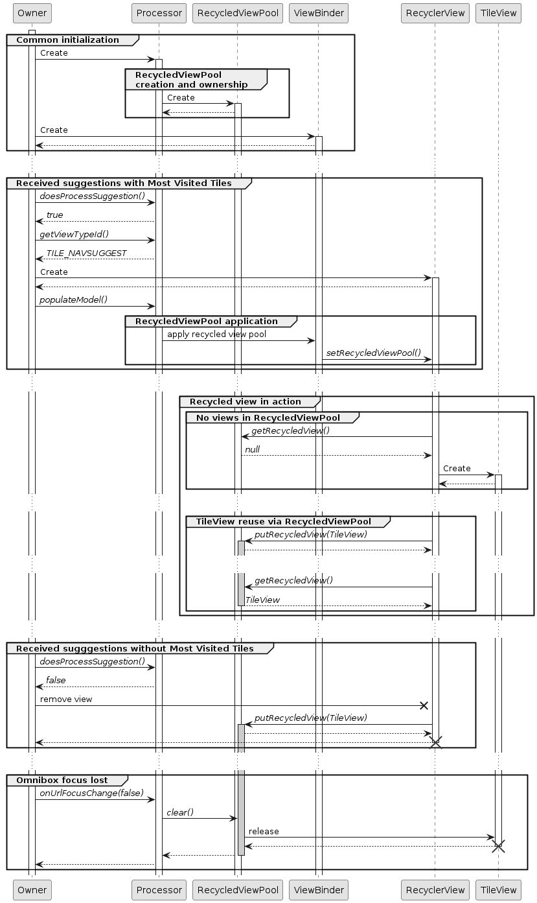

# Overview
## Most Visited Tiles
The most visited tiles in omnibox suggestions are used to show the recently
visited websites. And it will be destroyed every time the user adds input to
the omnibox and creates itself every time when the user clears all input.

The recycled view in most visited tiles does not change very often as it will
refresh its content after the user exits the omnibox and visits other websites,
and it has a hard limit of 10 elements declared at the source of data.

We would like to eliminate the repetitive destroy/creation process by creating
a recycled view pool for the most visited tiles in omnibox suggestions, whose
lifetime we can control.

## Recycled View Pool Design
The components in the omnibox repo related with this change are the following:

* MostVisitedTilesProcessor: it will create the model for the most visited tiles
  element, which include title, icons, etc.

* BaseCarouselSuggestionViewBinder: it will pass the parameters including the
  tiles, title, and recycled view pool etc from the MostVisitedTilesProcessor and
  send to the BaseCarouselSuggestionView to render.

* BaseCarouselSuggestionView: it holds the actual view for the most visited tiles.

* MostVisitedTilesRecyclerPool: this is the recycled view pool to be assigned to
  the most visited tile to store and reuse its elements.

### Component Interaction with Recycled View Pool
* MostVisitedTilesProcessor: it should create the recycled view pool as private
  parameter during its initialization, and pass onto BaseCarouselSuggestionViewBinder.

* BaseCarouselSuggestionViewBinder: it should pass the MostVisitedTileRecycledViewPool to the
  BaseCarouselSuggestionView to render.

* BaseCarouselSuggestionView: it should accept the MostVisitedTileRecycledViewPool from
  BaseCarouselSuggestionViewBinder and pass it to the recycler view inside.

* MostVisitedTileRecycledViewPool: it should be created when MostVisitedTilesProcessor is
  initialized, cleared when user unfocused on the omnibox (MostVisitedTilesProcessor will
  call onUrlFocus function).