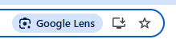

# Page Actions

The Page Action system provides URL bar-based UI entry points to more general
browser Actions. The bookmark star button is an example.



A browser action is an action a user can take in the context of a browser
window. An
[ActionItem](https://source.chromium.org/chromium/chromium/src/+/main:ui/actions/actions.h)
is a definition describing how that action is invoked, along with its default
text label and icon. These actions can be invoked from various parts of the
browser UI, one of which is the page actions present in the URL bar.

The Page Action framework provides the means of displaying a page action in a
convenient and consistent way.

## Step-by-step guide

This section describes how to leverage the Page Action framework to add a new
icon or chip to the toolbar. At a high level, the implementation of a page
action looks like:

*   Adding an ActionItem to the existing set of browser actions, if necessary.
*   Registering the ActionItem with the page action system.
*   Accessing a tab’s PageActionController from feature code to request that a
    page action be shown.
*   Optionally, setting a specific text label or icon to override the Action’s
    defaults.

### Create or choose an existing browser action

Chrome action IDs are defined
[here](https://source.chromium.org/chromium/chromium/src/+/main:chrome/browser/ui/actions/chrome_action_id.h),
and browser-specific actions are defined
[here](https://source.chromium.org/chromium/chromium/src/+/main:chrome/browser/ui/browser_actions.cc).
There, the default visual parameters of the action are specified (icon, text
label, tooltip, etc), as well as the callback executed when the action is
invoked. Note that this portion of the implementation is not page action
specific, but may be created solely to support a page action.

The action can do anything, but page actions often spawn bubble dialogs anchored
to the URL bar. Examples include
[translation](https://source.chromium.org/chromium/chromium/src/+/main:chrome/browser/ui/browser_actions.cc;l=483-491;drc=94f1628ce2f95f4d605109e8e1931c4e11b9e4e5),
[zoom](https://source.chromium.org/chromium/chromium/src/+/main:chrome/browser/ui/browser_actions.cc;l=327-344;drc=94f1628ce2f95f4d605109e8e1931c4e11b9e4e5)
and
[memory saver](https://source.chromium.org/chromium/chromium/src/+/main:chrome/browser/ui/browser_actions.cc;l=306-325;drc=94f1628ce2f95f4d605109e8e1931c4e11b9e4e5).

### Register the Page Action

Include the Action in the set of Page Actions
[here](https://source.chromium.org/chromium/chromium/src/+/main:chrome/browser/ui/views/page_action/action_ids.h).
This makes the framework aware of your ActionItem.

**Note:** The order of this array defines the order that page actions will
appear in the UI.

### Add Page Action specific properties

Page Actions have extra properties beyond the underlying ActionItem, described
in an additional set of descriptors
[here](https://source.chromium.org/chromium/chromium/src/+/main:chrome/browser/ui/views/page_action/page_action_properties_provider.cc).
These include:

*   A histogram name and new
    [PageActionIconType](https://source.chromium.org/chromium/chromium/src/+/main:chrome/browser/ui/page_action/page_action_icon_type.h)
    for metrics collection.
*   An optional Element Identifier to target the page action icon in UI tests.

NOTE: During the migration from the legacy framework to the current one, any new
page actions will need to update
[IsPageActionMigrated](https://source.chromium.org/chromium/chromium/src/+/main:chrome/browser/ui/page_action/page_action_icon_type.cc;l=71)
to return `true` for their new `PageActionIconType`.

### Control the page action

Within feature code, use the PageActionController to show and control your page
action.

Page Action state is tab-specific, and each tab has a PageActionController that
can be used by other features. Hence, implementing feature-specific logic as a
TabFeature is convenient in this model. A feature-specific TabFeature object can
then be instantiated with a reference to the PageActionController, as seen in
this
[example](https://source.chromium.org/chromium/chromium/src/+/main:chrome/browser/ui/tabs/tab_features.cc;l=206-208;drc=f0cb0ae3f9b142a11fdc5efc77e27a5d53b6b6cf).

If the feature is browser-scoped, it can access a tab’s controller through the
tab interface:

```c++
bwi->GetActiveTabInterface()->GetTabFeatures()->page_action_controller();
```

From there, controlling the page action is done through the
[PageActionController](https://source.chromium.org/chromium/chromium/src/+/main:chrome/browser/ui/views/page_action/page_action_controller.h)
interface. Showing or hiding the page action is a simple call:

```c++
page_action_controller_->Show(kActionFooFeature);
...
page_action_controller_->Hide(kActionFooFeature);
```

Optionally, a feature can request that an expanded “chip” be shown rather than
just the icon. Note that the framework limits the page action UI to one chip at
a time, so this request is not necessarily granted. When displayed, the chip
sits in the leftmost position within the set of page actions.

This image shows three page actions, with Google Lens in expanded chip state:


To request expanded chip state, use the controller’s `ShowSuggestionChip()` and
`HideSuggestionChip()`. Suggestion chip state only matters if the page action is
shown. For example:

```c++
// Show feature suggestion chip.
page_action_controller_->Show(kActionFooFeature);
page_action_controller_->ShowSuggestionChip(kActionFooFeature);

// Reduce to icon-only state.
page_action_controller_->HideSuggestionChip(kActionFooFeature);

// Hide the page action entirely.
page_action_controller_->Hide(kActionFooFeature);
```

### Dynamically customize the text and icon

If the page action requires a different image or text than the default specified
in the ActionItem, page action logic can override the defaults. Similarly, if a
page action needs to change the icon or text dynamically based on feature state,
the same overrides may be used. See
[OverrideImage()](https://source.chromium.org/chromium/chromium/src/+/main:chrome/browser/ui/views/page_action/page_action_controller.h;l=99;drc=f0cb0ae3f9b142a11fdc5efc77e27a5d53b6b6cf)
and similar methods on the controller interface. The overrides can be cleared if
needed via the corresponding Clear calls.

Example: The Zoom page action shows different icons depending on whether the
zoom level is more or less than 100%.

### Observing the state of the page action

Typically, a feature can “set and forget” its page action. However, the feature
may wish to observe the actual state of its page action (for example, to see if
its requested chip was able to show). The framework provides an
[observation](https://source.chromium.org/chromium/chromium/src/+/main:chrome/browser/ui/views/page_action/page_action_observer.h)
mechanism to watch this state. An example usage is
[here](https://source.chromium.org/chromium/chromium/src/+/main:chrome/browser/ui/views/translate/translate_page_action_controller.h;l=16-18;drc=f0cb0ae3f9b142a11fdc5efc77e27a5d53b6b6cf).

### Log metrics

By registering the histogram and page action icon types in the previous steps,
the new page action will automatically log usage alongside other page actions.
Additional feature-specific metrics logging can be added if needed to feature
code.

### Testing

In unit tests, use a
[MockPageActionController](https://source.chromium.org/chromium/chromium/src/+/main:chrome/browser/ui/views/page_action/test_support/mock_page_action_controller.h).

In interactive UI tests, UI can be exercised by targeting the appropriate Page
Action Icon element, specified in the Page Action properties described earlier.

**Note:** Interactive UI tests will typically target page action icons or
expanded chips. The Location Bar view hierarchy containing the page actions
contains some legacy layout code, which sometimes causes visibility flapping
when showing an icon or chip. To avoid flakiness in tests, leverage the
[PageActionInteractiveTestMixin](https://source.chromium.org/chromium/chromium/src/+/main:chrome/browser/ui/views/page_action/test_support/page_action_interactive_test_mixin.h)
in your tests, and use the
[WaitForPageActionButtonVisible](https://source.chromium.org/chromium/chromium/src/+/main:chrome/browser/ui/views/page_action/test_support/page_action_interactive_test_mixin.h?q=symbol%3A%5CbPageActionInteractiveTestMixin%3A%3AWaitForPageActionButtonVisible%5Cb%20case%3Ayes)
verb to wait for the action to show.

## Tips and caveats

### Bubble implementation

If the feature is utilizing a new bubble, its existence could be managed by a
small
[controller](https://source.chromium.org/chromium/chromium/src/+/main:chrome/browser/ui/performance_controls/memory_saver_bubble_controller.cc)
class, to handle action invocations and create the required bubble. Note that
this controller feeds bubble visibility state back into the ActionItem object
(see [toggling](#page-action-bubble-toggling)).

### Page action bubble toggling

When a page action click spawns a bubble on the location bar, re-clicking the
same page action should dismiss the bubble. This requires a link between the
page action framework and the bubble. Most of this is managed by the framework,
but the bubble must advertise its presence to the ActionItem (see
[bubbles](#bubble-implementation)). The Page Action uses this state to ensure
the bubble is properly toggled when handling clicks.

### Transient suggestion chips

Some legacy page actions have suggestion chips that show temporarily (eg. show
for 10 seconds when the page action appears, then shrink back down to an icon).
The new framework does not natively support this capability, beyond the ability
to request a chip. Note that a request to show a chip does not guarantee its
visibility.

**Recommendation:** Don’t use transient chips going forward.
