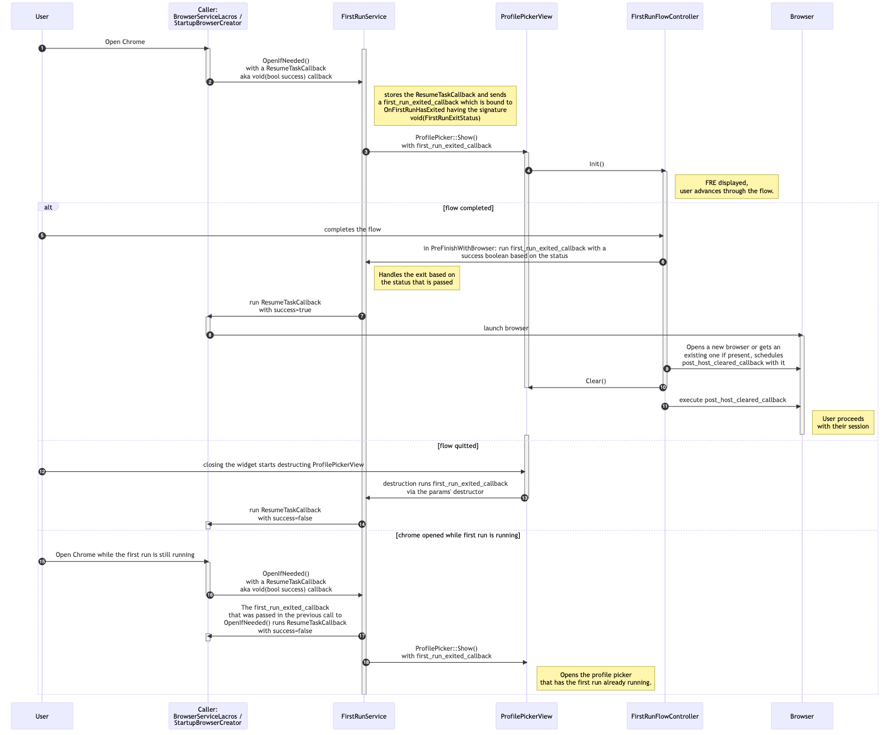
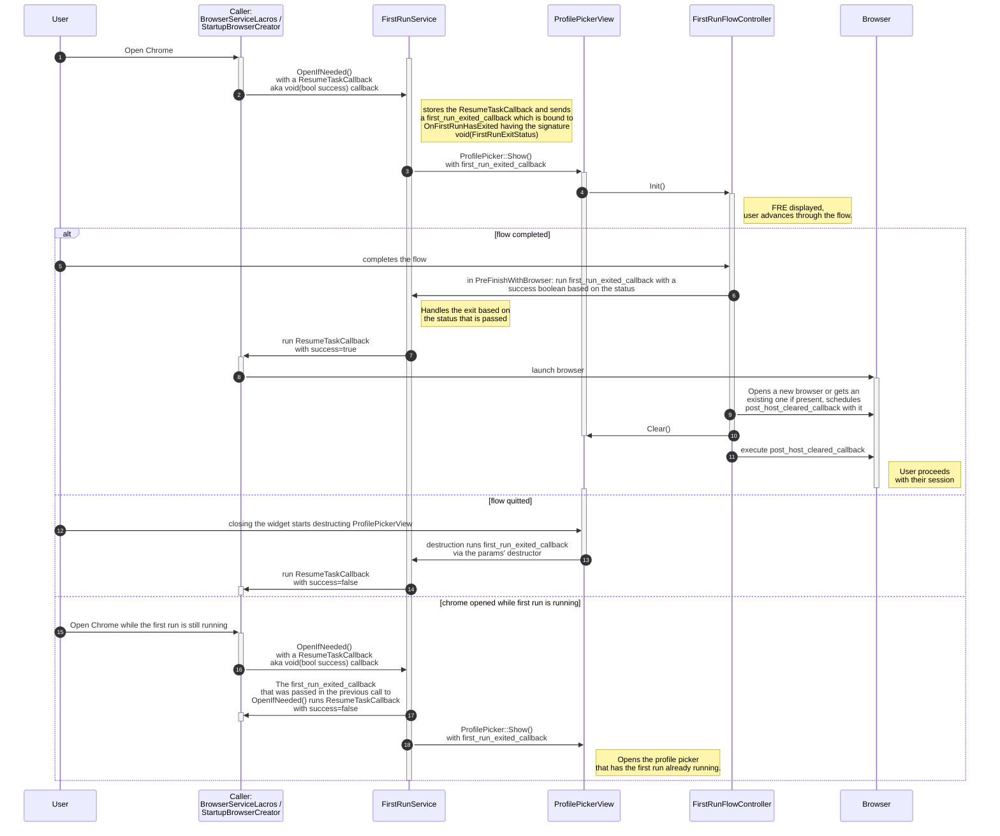

# On Profile Management

Profile Management refers to the various flows around profile creation and
setting up a user's identity in their profile. The profile picker
([`ProfilePickerView`](profile_picker_view.h)) is the main surface for this.

Many steps, states and asynchronous operations are involved in these UIs, and
to pass context around we rely on a lot of callbacks. This is an overview of the
main callbacks used in the profile management flow, highlighted here through the
first run experience flow.

Diagram source:

