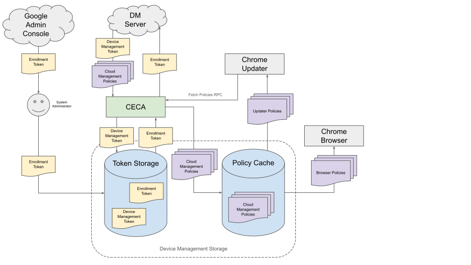

# Chrome Enterprise Companion App

## Background

Chrome Enterprise Companion App (CECA) is an elevated daemon for MacOS and
Windows that handles enterprise device management features which are not
feasible to implement in the browser.

Originally, this project was developed to separate Chrome Browser Enterprise
Cloud Management functionality from the ChromiumUpdater (//chrome/updater),
allowing the development of related features to be decoupled from this high-risk
surface.

## Overview

CECA is a program that performs enrollment and policy fetching for cloud-managed
Chrome browsers.

## Design

Once installed, CECA operates as a daemon and is interacted with via the IPC
interface it exposes.  The server process hosts an engine that conducts most of
the work, it is interacted with by client processes that issue commands to it.

CECA is installed system-wide and is launched by the Chromium Updater. When
launched, the application attempts to acquire a single cross-process lock. If
acquired, the application begins accepting incoming IPC connections and
servicing RPCs from client processes. The application runs until it is requested
to shut down via RPC.

## RPC Interface

CECA’s functionality is driven by RPCs from client processes. Mojo provides the
IDL, C++ bindings, and underlying IPC system. The interface definition is
located in the mojom/ subdirectory.

CECA listens for incoming Mojo invitations on a platform-dependent interface
(i.e. a named pipe on Windows, a mach port on Mac, or a socket on Linux).
Clients are able to locate this interface via a statically defined name. Upon
receiving an invitation, CECA may accept or reject it. If accepted, a Mojo
connection is established and clients may perform RPCs. This process is
abstracted by //components/named_mojo_ipc_server.

### IPC Security

Although the scope of the RPC interface is limited, as CECA is an elevated
process (running as SYSTEM on Windows, root on Mac and Linux), it is prudent
that only authorized callers are allowed. The IPC interface is protected
differently on each platform. On Windows, a security descriptor is configured on
the interface’s named pipe allowing only access from SYSTEM. On Mac, an
audit_token is used to verify that the caller has the same euid as the server.
On Linux, the credentials of the calling process are read via SO_PEERCRED and
the caller’s UID is compared to the server’s.

## Policy Agent Functionality

CECA’s main functionality is to act as a policy agent for Chrome Browser
Enterprise Cloud Management. This consists of two primary responsibilities:
machine enrollment and policy fetching.

### Background

Chrome Browser Enterprise Cloud Management allows system administrators to
configure policies which control the behavior of the Chromium Updater and
Browser. Administrators are provided enrollment tokens which can be used to
authenticate a device as being managed by that organization. A policy agent uses
the enrollment token to register the device with the Device Management Server
(DM server). Upon enrollment, the DM Server provides the policy agent with a
Device Management Token (DM token) that identifies the device and the
organization it belongs to in future communication.

After enrollment, policy agents may request policies from DM Server,
authenticating themselves via the DM token.

### Implementation

CECA acts as a policy agent for the Chromium Updater and Chrome Browser. When
the Chromium Updater performs its scheduled periodic tasks, it will request a
policy fetch from CECA, launching the daemon if it is not already running. CECA
will determine if the device is already enrolled via the presence of a DM token
in storage. If not enrolled, CECA will look for an enrollment token in storage
and attempt registration before continuing with the request. Next, CECA requests
policies from DM Server, serializing the responses to a policy cache on disk
which is subsequently read from by the Chromium Updater and Chrome Browser.

### Device Management Storage

The enrollment token, DM token, and fetched policies are persisted on device.
Token storage and the policy cache are collectively referred to as DM storage
and are abstracted by device_management_storage/. The storage is implemented as
follows:

#### Windows

The enrollment token is searched in the order:

1. The `EnrollmentToken` `REG_SZ` value from
`HKLM\Software\Policies\{COMPANY_SHORTNAME}\CloudManagement`

1. The `CloudManagementEnrollmentToken` `REG_SZ` value from
`HKLM\Software\Policies\{COMPANY_SHORTNAME}\{BROWSER_NAME}`

1. The `CloudManagementEnrollmentToken` `REG_SZ` value from
`{CLIENTSTATE}\{UpdaterAppID} (the runtime enrollment token)`

1. The `CloudManagementEnrollmentToken` `REG_SZ` value from
`{CLIENTSTATE}\{430FD4D0-B729-4F61-AA34-91526481799D}` (the legacy runtime
enrollment token)

The DM token is stored in:

* The `dmtoken` `REG_BINARY` value at path:
`HKLM\Software\WOW6432Node\{COMPANY_SHORTNAME}\Enrollment\`

* The `dmtoken` `REG_BINARY` value at path:
`HKLM64\Software\{COMPANY_SHORTNAME}\{BROWSER_NAME}\Enrollment\`. This is for
backward compatibility.

The `EnrollmentMandatory` REG_DWORD value is also read from `HKLM\Software\Policies\{COMPANY_SHORTNAME}\CloudManagement`.

#### Mac

The enrollment token is searched in the order:

1. Managed Preference value with key `CloudManagementEnrollmentToken` in domain
`{MAC_BROWSER_BUNDLE_IDENTIFIER}`.

2. Managed Preference value with key `EnrollmentToken` in domain
`{MAC_BROWSER_BUNDLE_IDENTIFIER}`.

File `/Library/{COMPANY_SHORTNAME}/{BROWSER_NAME}/CloudManagementEnrollmentToken`.

The DM token is stored in:
`/Library/Application Support/{COMPANY_SHORTNAME}/CloudManagement`.

#### Linux

The enrollment token is stored in:
`/opt/{COMPANY_SHORTNAME}/{PRODUCT_FULLNAME}/CloudManagementEnrollmentToken`

The DM token is stored in:
`/opt/{COMPANY_SHORTNAME}/{PRODUCT_FULLNAME}/CloudManagement`

## Installation

CECA bundles an installer into its executable which can be invoked via the
`--install` command-line flag. When the installer launches, it instructs the
currently running server process to shutdown via RPC, if one is running. It then
acquires the cross-process lock before copying itself to the installation
directory.

On Windows the application is distributed for both x86 and x86_64. If an
existing installation for a different architecture is present, the installer
will remove it before installing itself. The application is installed to
`%PROGRAMFILES%` or `%PROGRAMFILESX86%` under
`{COMPANY_SHORTNAME}\{PRODUCT_FULLNAME}`. E.g.
`C:\Program Files\Google\ChromeEnterpriseCompanion`.

On Mac the application is distributed via a PKG installer which bundles the
application binary and a postinstall script which launches CECA with the
`--install` flag. The application is installed to
`/Library/Application Support/{COMPANY_SHORTNAME}/{PRODUCT_FULLNAME}`.

On Linux the application is installed to
`/opt/{COMPANY_SHORTNAME_LOWERCASE}/{PRODUCT_FULLNAME_DASHED_LOWERCASE}`.

CECA similarly bundles an uninstaller via the `--uninstall` command-line flag.
When the Chromium Updater is uninstalled, CECA is too.

## Networking

CECA requires networking for its communication with the DM server and
transmission of telemetry. For compatibility with existing code in
//components/policy/, the Chromium network stack is used.

Special care is taken to ensure that CECA can navigate through mandatory proxy
configurations. On Windows, the logged-in user is guessed via the owner of
`explorer.exe` and impersonated for the lifetime of the networking thread. On
Mac, the logged-in user is guessed via querying the System Configuration dynamic
store for console users and networking is delegated to a subprocess launched in
their bootstrap namespace (i.e. via `launchctl asuser`).

## Event Logging

CECA records information about the health of the service and transmits it to a
remote logging endpoint over HTTPS. This information is used to monitor and
improve the application. The information transmitted is defined by
`enterprise_companion_event.proto`. Upon the first logging transmission, the
server will respond with a logging cookie which identifies the device in future
transmissions. This cookie is persisted in a file named `logging_cookie` in the
application’s install directory.

## Crash Reporting

CECA uses Crashpad for crash reporting. Each CECA process spawns a crash handler
child process. CECA may upload its crash reports if and only if the Chromium
Updater is permitted to send usage stats. CECA may attach its log file to the
crash reports it uploads. Each crash handler process is capable of uploading
crashes.

## Testing

CECA defines a unit test target (`enterprise_companion_tests`) and an
integration test target (`enterprise_companion_integration_tests`). Running the
unit tests does not require any special permissions and the suites may be run
concurrently. The integration tests must be run by an elevated user (an
Administrator on Windows, root on Mac or Linux) and are executed serially.

The integration tests operate on a CECA binary instrumented for testing. The
application-under-test binary’s target is `enterprise_companion_test`. The test
binary allows for global constants to be overridden via an `overrides.json` file
placed in the installation directory. This allows the integration tests to
provide values such as the DM server URL, event logger timeout, and named pipe
security descriptor. Additionally, the test binary allows alternative
cryptographic keys to be used for validating responses from the DM server, thus
allowing the integration tests to correctly mock responses.

