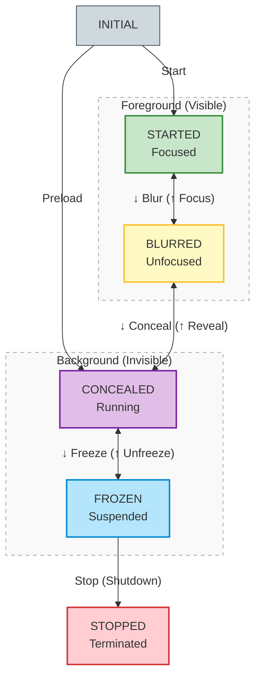

# Application Lifecycle and Platform Interface

Cobalt implements a strict, linear application lifecycle built on the
**Starboard Platform Interface** (`starboard/event.h` and `starboard/system.h`).
This interface defines the contract between the underlying device platform (OS
and window manager), the Cobalt browser runtime, and the web application for
managing visibility, input focus, hardware graphics resources, background
execution, and termination.

For a deep dive into Cobalt's internal multi-process state machine and Mojo
synchronization across browser and renderer threads, see
[Cobalt Multi-Process Lifecycle Coordination Internals](lifecycle_internals.md).

## Table of Contents

- [Lifecycle State Machine](#lifecycle-state-machine)
- [Platform Event and Resource Contract](#platform-event-and-resource-contract)
  - [SbEventHandle vs. SbSystemRequest](#sbeventhandle-vs-sbsystemrequest)
  - [Shared `starboard::Application` Event Pipeline (`SbSystemRequest*` -> `Application::*` -> `SbEventHandle`)](#shared-starboardapplication-event-pipeline-sbsystemrequest---application---sbeventhandle)
  - [Living Room Scenario Mapping](#living-room-scenario-mapping)
- [Implementing the Platform Interface](#implementing-the-platform-interface)
  - [1. Startup and Preloading (`SbEventStartData` & `QueueApplication`)](#1-startup-and-preloading-sbeventstartdata--queueapplication)
  - [2. Deep Links (`SbEventStartData::link` & `kSbEventTypeLink`)](#2-deep-links-sbeventstartdatalink--ksbeventtypelink)
  - [3. Foregrounding, Backgrounding, and Reference Signal Mappings](#3-foregrounding-backgrounding-and-reference-signal-mappings)
- [Lifecycle States Reference](#lifecycle-states-reference)
  - [Started](#started)
  - [Blurred](#blurred)
  - [Concealed](#concealed)
  - [Frozen](#frozen)
  - [Stopped](#stopped)

## Lifecycle State Machine

The lifecycle progresses linearly across five states after initial launch
(`INITIAL`). A platform can dispatch the event for the target state it wants to
reach, and Cobalt automatically ensures that any intermediate states are
sequenced in linear progression:



Cobalt supports two levels of an application being foregrounded:
- **Started:** The application is visible and has active input focus.
- **Blurred:** The application is visible (or partially obscured by a system
  overlay), but does not have input focus.

Cobalt supports two levels of an application being backgrounded:
- **Concealed:** The application is not visible (in effect operating as a
  background service), but its program execution can continue.
- **Frozen:** The application is not visible and its program execution can also
  be halted.

## Platform Event and Resource Contract

Platform lifecycle events (`SbEventType`), startup data (`SbEventStartData`),
and `SbEventHandle()` are declared in
[`starboard/event.h`](../../starboard/event.h), and `SbSystemRequest*()`
functions are declared in [`starboard/system.h`](../../starboard/system.h):

```c
// From starboard/event.h:
typedef enum SbEventType {
  kSbEventTypePreload,
  kSbEventTypeStart,
  kSbEventTypeBlur,
  kSbEventTypeFocus,
  kSbEventTypeConceal,
  kSbEventTypeReveal,
  kSbEventTypeFreeze,
  kSbEventTypeUnfreeze,
  kSbEventTypeStop,
  kSbEventTypeLink,
  // ...
} SbEventType;

typedef struct SbEventStartData {
  char** argument_values;
  int argument_count;
  const char* link;
} SbEventStartData;

SB_IMPORT void SbEventHandle(const SbEvent* event);

// From starboard/system.h:
SB_EXPORT void SbSystemRequestBlur();
SB_EXPORT void SbSystemRequestFocus();
SB_EXPORT void SbSystemRequestConceal();
SB_EXPORT void SbSystemRequestReveal();
SB_EXPORT void SbSystemRequestFreeze();
SB_EXPORT void SbSystemRequestStop(int error_level);
```

### SbEventHandle vs. SbSystemRequest

`SbEventHandle()` and `SbSystemRequest*()` operate in opposite directions across
the Starboard boundary and have distinct return-time contracts:

1.  **`SbEventHandle(const SbEvent*)` — Platform → Cobalt (System-Initiated Event Delivery):**
    -   **Who calls it:** Implemented by Cobalt (`SB_IMPORT`) and called by the
        platform whenever the OS or window manager transitions the application.
    -   **Calling Thread:** `kSbEventTypeStart` (or `kSbEventTypePreload`),
        `kSbEventTypeFreeze`, and `kSbEventTypeStop` **must** be invoked from the
        same thread (the main thread), because `Start`/`Preload` binds Cobalt's
        main task runner to the calling thread, and `Freeze` and `Stop`
        synchronously wait on (and `Stop` tears down) that thread's task
        environment. Other events (`Blur`, `Focus`, `Conceal`, `Reveal`,
        `Unfreeze`, `Link`) are thread-safe and may be called from any thread.
        Platforms using `starboard::Application` / `starboard::QueueApplication`
        can safely invoke `Application::Get()->Blur()`, `Conceal()`, `Freeze()`,
        `Unfreeze()`, `Reveal()`, `Focus()`, `Stop()`, or `Link()` from **any**
        thread, as `QueueApplication` dispatches all `SbEventHandle()` calls on
        the main thread.
    -   **Linear Progression Handled by Cobalt:** The platform can dispatch the
        `SbEventType` for the target state it wants to reach, and Cobalt
        automatically sequences any required intermediate transitions in linear
        order (`Started <-> Blurred <-> Concealed <-> Frozen -> Stopped`).
    -   **Return-Time State Contract:** When `SbEventHandle()` returns for
        `kSbEventTypeConceal`, `kSbEventTypeFreeze`, or `kSbEventTypeStop` (or
        when the `EventHandledCallback` passed to `Application::Conceal(context, cb)`
        / `Freeze(context, cb)` fires), **Cobalt has synchronously completed the
        transition to that target state** (including calling `SbWindowDestroy()`
        and releasing all GPU resources on `Conceal`, and flushing persistent
        storage on `Freeze`). Only **after** `SbEventHandle()` returns may the
        platform revoke graphics access (`Conceal`/`Freeze`) or
        suspend/terminate the OS process (`Freeze`/`Stop`). Because each
        synchronous transition step waits for internal acknowledgments (up to a
        2-second timeout per step), platform lifecycle watchdogs should allow at
        least ~2–4 seconds before force-killing the process.

2.  **`SbSystemRequest*()` — Cobalt → Platform (Application-Initiated Requests & Platform Triggers):**
    -   **When Cobalt calls them:** Cobalt never changes its own lifecycle state
        directly and never calls `SbSystemRequest*()` *during* a state
        transition. Instead, while running in **Started**, Cobalt calls
        **`SbSystemRequestConceal()`** or **`SbSystemRequestStop(error_level)`**
        *before* any transition begins when the application itself wants to
        minimize or exit (for example, when the user backs out of the web app
        via `h5vcc.system` exit strategies or cancels a fatal platform error
        dialog). Cobalt currently never calls `SbSystemRequestBlur()`,
        `SbSystemRequestFocus()`, `SbSystemRequestReveal()`, or
        `SbSystemRequestFreeze()` in production use.
    -   **What platforms use them for:**
        -   *Handling self-minimize / self-exit (`Conceal` & `Stop`):* Because
            an in-app exit is initiated by JavaScript rather than an OS hardware
            key, the platform's implementation of `SbSystemRequestConceal()` or
            `SbSystemRequestStop()` notifies the native OS window manager / TV
            launcher to background or close the app and queues the corresponding
            `SbEvent`(s) (`Application::Get()->Conceal()` / `Stop()`) to be
            dispatched back to `SbEventHandle()`.
        -   *Platform-internal thread/signal entry points (`Focus`, `Blur`, `Reveal`, `Freeze`):*
            Platforms also use `SbSystemRequest*()` as thread-safe C entry
            points from OS signal handlers or listener threads (such as
            `SIGCONT` and `SIGUSR1` in
            `starboard/shared/signal/suspend_signals.cc`, or checking
            `loader_app::IsPendingRestart()` and registering a post-freeze
            `SIGSTOP` callback in
            `starboard/shared/signal/system_request_freeze.cc`).
    -   **Return-Time State Contract:** `SbSystemRequest*()` only queues the
        request with the platform/event loop and **returns immediately**. When
        `SbSystemRequest*()` returns, **Cobalt's state has not changed yet** and
        it may continue running and processing earlier queued events. Neither
        Cobalt nor the platform may assume the state transition has occurred
        until the resulting `SbEvent` is dequeued, dispatched to
        `SbEventHandle()`, and `SbEventHandle()` returns.

| Lifecycle State | Entry `SbEventType` (`SbEventHandle`) | `SbSystemRequest` Function | Platform Window, Graphics & Media (`SbWindow` / `EGLSurface` / `SbPlayer`) | Web Visibility & Focus |
| :--- | :--- | :--- | :--- | :--- |
| **Started** | `kSbEventTypeStart`<br>`kSbEventTypeFocus` | `SbSystemRequestFocus` | `SbWindow` visible & active; `EGLSurface` and `SbPlayer` active; receives input events (`kSbEventTypeInput`) | `visibilityState: "visible"`<br>`hasFocus(): true` |
| **Blurred** | `kSbEventTypeBlur`<br>`kSbEventTypeReveal` | `SbSystemRequestBlur`<br>`SbSystemRequestReveal` | `SbWindow` visible; `EGLSurface` retained for fast refocus; input disabled | `visibilityState: "visible"`<br>`hasFocus(): false` |
| **Concealed** | `kSbEventTypePreload`<br>`kSbEventTypeConceal`<br>`kSbEventTypeUnfreeze` | `SbSystemRequestConceal` | No `SbWindow`, `EGLSurface`, or GPU resources held; background CPU/network execution allowed | `visibilityState: "hidden"`<br>`hasFocus(): false` |
| **Frozen** | `kSbEventTypeFreeze` | `SbSystemRequestFreeze` | No `SbWindow`, GPU, `EGLSurface`, or `SbPlayer` resources held; persistent storage synced to disk; program execution suspended | `visibilityState: "hidden"`<br>`hasFocus(): false` |
| **Stopped** | `kSbEventTypeStop` | `SbSystemRequestStop` | No resources held; all threads terminated and process exited | N/A (Terminated) |

### Shared `starboard::Application` Event Pipeline (`SbSystemRequest*` -> `Application::*` -> `SbEventHandle`)

On platforms built on `starboard::Application` / `starboard::QueueApplication`
([`starboard/shared/starboard/application.cc`](../../starboard/shared/starboard/application.cc)),
the `SbSystemRequest*()` functions in
`starboard/shared/starboard/system_request_*.cc` are implemented as thread-safe
wrappers that forward directly to the singleton `starboard::Application::Get()`
instance. Calling `SbSystemRequest*()` (or calling `Application::Get()->*()`
directly from platform code) enqueues an `Application::Event` via `Inject()`.
The main Starboard run loop (`Application::RunLoop()`) then dequeues the event
on the main thread, sequences any required intermediate state transitions
(`DispatchAndDelete()`), and dispatches each resulting `SbEvent` to Cobalt via
`SbEventHandle()`:

| C Request Function (`starboard/system.h`) | `starboard::Application` Method (`application.cc`) | Intermediate Events Sequenced (if needed) | Dispatched `SbEventType` (`SbEventHandle`) | Target State |
| :--- | :--- | :--- | :--- | :--- |
| *(Startup only)* | `Application::DispatchStart()` | — | `kSbEventTypeStart` | `Started` |
| *(Startup only)* | `Application::DispatchPreload()` | — | `kSbEventTypePreload` | `Concealed` |
| `SbSystemRequestFocus()` | `Application::Focus(ctx, cb)` | `kSbEventTypeUnfreeze` -> `kSbEventTypeReveal` | `kSbEventTypeFocus` | `Started` |
| `SbSystemRequestBlur()` | `Application::Blur(ctx, cb)` | — | `kSbEventTypeBlur` | `Blurred` |
| `SbSystemRequestReveal()` | `Application::Reveal(ctx, cb)` | `kSbEventTypeUnfreeze` | `kSbEventTypeReveal` | `Blurred` |
| `SbSystemRequestConceal()` | `Application::Conceal(ctx, cb)` | `kSbEventTypeBlur` | `kSbEventTypeConceal` | `Concealed` |
| *(Platform internal)* | `Application::Unfreeze(ctx, cb)` | — | `kSbEventTypeUnfreeze` | `Concealed` |
| `SbSystemRequestFreeze()` | `Application::Freeze(ctx, cb)` | `kSbEventTypeBlur` -> `kSbEventTypeConceal` | `kSbEventTypeFreeze` | `Frozen` |
| `SbSystemRequestStop(err)` | `Application::Stop(err)` | `kSbEventTypeBlur` -> `kSbEventTypeConceal` -> `kSbEventTypeFreeze` | `kSbEventTypeStop` | `Stopped` |
| *(Deep link)* | `Application::Link(url)` | *(None — no state change)* | `kSbEventTypeLink` | *(Unchanged)* |

### Living Room Scenario Mapping

| TV / Device Scenario | Direction | Starboard Event / Function | Resulting State |
| :--- | :--- | :--- | :--- |
| **Normal App Launch** | Platform → Cobalt | `kSbEventTypeStart` (with `SbEventStartData*`) | `Started` |
| **Boot / Background Warmup (Preload)** | Platform → Cobalt | `kSbEventTypePreload` (with `SbEventStartData*`) | `Concealed` |
| **System Overlay / Dialog / Volume Toast** | Platform → Cobalt | `kSbEventTypeBlur` (and `kSbEventTypeFocus` when dismissed) | `Blurred` → `Started` |
| **Home Button / App Switch (Background Running)** | Platform → Cobalt | `kSbEventTypeConceal` (Cobalt automatically sequences `Blur` → `Conceal`) | `Concealed` |
| **Standby / Suspend-to-RAM / Low-Power Background** | Platform → Cobalt | `kSbEventTypeFreeze` (Cobalt automatically sequences `Blur` → `Conceal` → `Freeze`) | `Frozen` |
| **Wake Preloaded or Backgrounded App to Foreground** | Platform → Cobalt | `kSbEventTypeFocus` (Cobalt automatically sequences `Unfreeze` → `Reveal` → `Focus`) | `Started` |
| **Wake with Deep Link (Voice Search / Content Tile)** | Platform → Cobalt | `kSbEventTypeLink` (`const char*` URL) **+** `kSbEventTypeFocus` | `Started` (navigated to link) |
| **User Exits App via Back Button on Home Screen** | Cobalt → Platform | Cobalt calls `SbSystemRequestConceal()` (minimize) or `SbSystemRequestStop(0)` (close); platform then notifies window manager and dispatches `Conceal` or `Stop` | `Concealed` or `Stopped` |
| **Graceful Process Shutdown** | Platform → Cobalt | `kSbEventTypeStop` (Cobalt automatically sequences `Blur` → `Conceal` → `Freeze` → `Stop`) | `Stopped` |

## Implementing the Platform Interface

### 1. Startup and Preloading (`SbEventStartData` & `QueueApplication`)

When launching Cobalt, the platform dispatches either `kSbEventTypeStart`
(foreground launch into **Started**) or `kSbEventTypePreload` (background launch
into **Concealed**; see [Application Preload](preload.md)).

-   **`SbEventStartData` Requirement for Both `Start` and `Preload`:**
    Both `kSbEventTypeStart` and `kSbEventTypePreload` require `event->data` to
    point to a populated `SbEventStartData` structure containing command-line
    `argument_count`, `argument_values`, and an optional initial `link` URL. If
    `event->data` is `NULL` on `kSbEventTypePreload` or `kSbEventTypeStart`,
    Cobalt receives `argc = 0` and drops all command-line flags and startup
    URLs.
-   **`starboard::QueueApplication` Startup Hooks:**
    When subclassing `starboard::QueueApplication`
    ([`starboard/shared/starboard/queue_application.h`](../../starboard/shared/starboard/queue_application.h)),
    `Application::CreateInitialEvent()` automatically constructs and populates
    `SbEventStartData` for both `kSbEventTypePreload` and `kSbEventTypeStart`.
    In `Application::RunLoop()`, `IsPreloadImmediate()` is checked **before**
    `IsStartImmediate()`:

```cpp
// In starboard::Application::RunLoop():
if (IsPreloadImmediate()) {
  DispatchPreload(CurrentMonotonicTime());
} else if (IsStartImmediate()) {
  DispatchStart(CurrentMonotonicTime());
}
```

Because `Application::IsStartImmediate()` defaults to `true`, a platform
subclass of `starboard::QueueApplication` can enable `--preload` support using
`Application::HasPreloadSwitch()`, which is implemented to return `true` if the
`--preload` switch (`kPreloadSwitch`) was on the command-line:

```cpp
class MyPlatformApplication : public starboard::QueueApplication {
  // ...
  bool IsStartImmediate() override { return !HasPreloadSwitch(); }
  bool IsPreloadImmediate() override { return HasPreloadSwitch(); }
};
```

-   **Immediate Preload (`Concealed`):** `IsPreloadImmediate()` returns `true`
    (e.g., when `HasPreloadSwitch()` returns `true` because `--preload` was
    passed on the command-line). `RunLoop()` calls `DispatchPreload()` to send
    `kSbEventTypePreload` with `SbEventStartData`, Cobalt appends
    `launch=preload` to the initial application URL, and `SbWindowCreate()` is
    not called until the application is revealed.
-   **Immediate Foreground Start (Default):** `IsPreloadImmediate()` returns
    `false` and `IsStartImmediate()` returns `true`. `RunLoop()` calls
    `DispatchStart()` to send `kSbEventTypeStart` with `SbEventStartData`.
-   **Deferred Asynchronous Start:** Both `IsPreloadImmediate()` and
    `IsStartImmediate()` return `false`. No initial event is dispatched
    automatically; the platform implementation calls `DispatchStart()` or
    `DispatchPreload()` once asynchronous platform initialization completes.

### 2. Deep Links (`SbEventStartData::link` & `kSbEventTypeLink`)

Platforms can pass a target content URL (deep link) to Cobalt either at initial
launch or while the application is already running (see
[Cobalt Deep Links](deep_links.md) for full details on the Web API and delivery
semantics):

1.  **At Initial Launch (`kSbEventTypeStart` or `kSbEventTypePreload`):**
    Set `SbEventStartData::link` to the null-terminated deep link URL string
    (or call `starboard::Application::Get()->SetStartLink(url)` before
    `DispatchStart()` / `DispatchPreload()`).
2.  **While Running in Any State (`Concealed`, `Frozen`, `Blurred`, or `Started`):**
    Dispatch `kSbEventTypeLink` with `event->data` pointing to a null-terminated
    `const char*` deep link string (or call
    `starboard::Application::Get()->Link(url)`).
    -   **No Lifecycle Transition Side-Effect:** `kSbEventTypeLink` **only**
        delivers the deep link URL to the web application
        (`window.h5vcc.runtime.ondeeplink` / `addEventListener('deeplink', ...)`);
        it **does not** change Cobalt's lifecycle state or foreground the
        application on its own.
    -   **Foregrounding with a Deep Link:** When a deep link is meant to bring a
        preloaded (`Concealed`) or suspended (`Frozen`) Cobalt instance to the
        foreground, the platform **must separately dispatch `kSbEventTypeFocus`**
        alongside `kSbEventTypeLink`.

### 3. Foregrounding, Backgrounding, and Reference Signal Mappings

-   **Window Lifetime Across Backgrounding (`SbWindowDestroy` & `SbWindowCreate`):**
    When Cobalt backgrounds into **Concealed**, it operates as a non-visible
    background service and performs no rendering, so it has no use for a native
    application window. During the transition to **Concealed**, Cobalt releases
    all GPU resources and informs the platform that it no longer needs the
    native window by calling `SbWindowDestroy()`. When foregrounding (`Reveal`),
    Cobalt requests a new native window by calling `SbWindowCreate()`. Calls to
    `SbWindowDestroy()` by themselves are not a signal of intent to exit.
-   **Foregrounding from Preload or Background (`Concealed` / `Frozen` -> `Started`):**
    To bring a preloaded or backgrounded application to the foreground, the
    platform dispatches `kSbEventTypeFocus` (or calls `SbSystemRequestFocus()`),
    and Cobalt automatically sequences `Unfreeze` / `Reveal` before `Focus`. On
    Linux reference platforms (`starboard/shared/signal/suspend_signals.cc`),
    sending `SIGCONT` to the process invokes `SbSystemRequestFocus()`.
-   **Bounding Preload Execution (`Concealed` -> `Frozen`):**
    If the platform only grants a limited time budget for background preloading,
    it can dispatch `kSbEventTypeFreeze` (or call `SbSystemRequestFreeze()`) to
    suspend the preloaded application into the **Frozen** state. On Linux
    reference platforms, sending `SIGUSR1` to the process triggers
    `SbSystemRequestFreeze()`, which suspends OS threads with `SIGSTOP` once the
    `Freeze` transition completes (`FreezeDone`).
-   **Graceful Termination (`-> Stopped`):**
    To cleanly shut down the application, the platform dispatches
    `kSbEventTypeStop` (or calls `SbSystemRequestStop(0)`), and Cobalt
    automatically sequences any intermediate transitions (`Blur` -> `Conceal` ->
    `Freeze` -> `Stop`) before exiting. On Linux reference platforms, sending
    `SIGPWR` or `SIGTERM` triggers `SbSystemRequestStop(0)`.
    -   **Stopping from `Frozen` when using `suspend_signals.cc` (`SIGPWR` before `SIGCONT`):**
        Because `starboard/shared/signal/system_request_freeze.cc` halts OS
        process execution with `raise(SIGSTOP)` after entering **Frozen**,
        stopping a `SIGSTOP`-suspended process directly from **Frozen** requires
        sending **`SIGPWR` before `SIGCONT`**. When the kernel delivers both
        pending signals upon waking, `SIGPWR` (`SbSystemRequestStop`) is queued
        ahead of `SIGCONT` (`SbSystemRequestFocus`), ensuring Cobalt transitions
        directly from **Frozen** to **Stopped** without briefly foregrounding
        (`Unfreeze` -> `Reveal` -> `Focus`) first.
-   **Optional `starboard::Application` Freeze/Unfreeze Callbacks (`OnSuspend` & `OnResume`):**
    [`starboard/shared/starboard/application.cc`](../../starboard/shared/starboard/application.cc)
    provides optional convenience virtual callbacks on `starboard::Application`—`Application::OnSuspend()`
    and `Application::OnResume()`—which are invoked right before dispatching
    `kSbEventTypeFreeze` and `kSbEventTypeUnfreeze` to Cobalt
    (`SbEventHandle()`). These callbacks can be overridden if a platform needs
    to prepare for halting or restarting program execution, but they are
    optional and are usually not needed or used.

## Lifecycle States Reference

### Started

The application is running in the foreground, visible, and has active input
focus (`document.visibilityState === "visible"`, `document.hasFocus() === true`).

-   **Platform Contract:** The native `SbWindow` and `EGLSurface` graphics
    surfaces are mapped and active. The platform routes keyboard, pointer, and
    remote control input events (`kSbEventTypeInput`) to the application.
-   **Transitions:** Entered on initial launch via `kSbEventTypeStart` or from
    **Blurred** via `kSbEventTypeFocus`. Transitions to **Blurred** via
    `kSbEventTypeBlur` (for example, when the top-level window loses focus or a
    system overlay appears).

### Blurred

The application remains visible (`document.visibilityState === "visible"`), or
partially obscured by a system dialog/overlay, but has lost input focus
(`document.hasFocus() === false`).

-   **Platform Contract:** The application does not receive input events, but
    retains its native `SbWindow` and `EGLSurface` so it can return to
    **Started** immediately without reallocating graphics surfaces. Cobalt
    initiates an asynchronous flush of Cookies and LocalStorage when entering
    **Blurred**.
-   **Web Application Signals:** The `blur` event is dispatched on `window` /
    `document` upon entering **Blurred**, and `focus` is dispatched when
    returning to **Started**.
-   **Transitions:** Entered from **Started** (`kSbEventTypeBlur`) or
    **Concealed** (`kSbEventTypeReveal`). Transitions to **Started**
    (`kSbEventTypeFocus`) or **Concealed** (`kSbEventTypeConceal`).

### Concealed

The application is hidden in the background (`document.visibilityState ===
"hidden"`, `document.hasFocus() === false`) and receives no input, in effect
operating as a background service that can continue executing with minimized
resource usage.

-   **Platform Contract:** While in **Concealed**, Cobalt performs no rendering
    and holds no GPU, `EGLSurface`, or native `SbWindow` resources. During the
    transition into **Concealed**, Cobalt releases all GPU resources and calls
    `SbWindowDestroy()`, and calls `SbWindowCreate()` when subsequently
    foregrounded (`kSbEventTypeReveal`). Calls to `SbWindowDestroy()` by
    themselves are not a signal of intent to exit. Memory reclamation is also
    triggered to minimize background RAM footprint. Only after `SbEventHandle()`
    returns may the platform revoke graphics access. To terminate the process,
    the platform should dispatch the `kSbEventTypeStop` event.
-   **Web Application Signals:** The `visibilitychange` event is dispatched on
    `document` (`document.visibilityState` becomes `"hidden"`). The web
    application stops media playback (`SbPlayer`) and releases heavy resources;
    on subsequent `Reveal` (`visibilitychange` to `"visible"`), resources and
    playback are reinitialized.
-   **Transitions:** Entered at startup via `kSbEventTypePreload`, from
    **Blurred** via `kSbEventTypeConceal`, or from **Frozen** via
    `kSbEventTypeUnfreeze`. Transitions to **Blurred** (`kSbEventTypeReveal`) or
    **Frozen** (`kSbEventTypeFreeze`).

### Frozen

The application is hidden in the background (`document.visibilityState ===
"hidden"`, `document.hasFocus() === false`), receives no input, and its program
execution can be halted.

-   **Platform Contract:** Cobalt freezes page execution, holds no `SbWindow` or
    GPU/`EGLSurface` resources, releases `SbPlayer` hardware media decoder
    resources, suspends background services (including the Evergreen updater),
    and synchronously flushes all persistent storage (Cookies and LocalStorage
    in `kSbSystemPathCacheDirectory` / `kSbSystemPathFilesDirectory`) to disk
    before `SbEventHandle(kSbEventTypeFreeze)` returns. Once
    `SbEventHandle(kSbEventTypeFreeze)` returns, the platform may suspend OS
    threads (e.g., `SIGSTOP`) or forcefully terminate the process at any time
    without data loss.
-   **Web Application Signals:** The Page Lifecycle `freeze` event
    (`document.onfreeze`) is dispatched when entering **Frozen**, and `resume`
    (`document.onresume`) is dispatched when transitioning back to
    **Concealed** via `kSbEventTypeUnfreeze`.
-   **Transitions:** Entered from **Concealed** (`kSbEventTypeFreeze`).
    Transitions to **Concealed** (`kSbEventTypeUnfreeze`) or **Stopped**
    (`kSbEventTypeStop`).

### Stopped

The application has shut down the browser runtime, terminated all threads, and
exited (`kSbEventTypeStop`, entered from **Frozen**).
