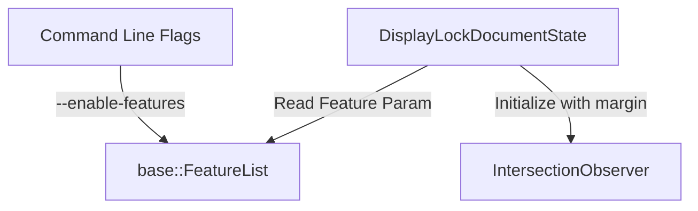

# DESIGN-0001: Configurable Display Lock Viewport Margin

## Context

We need to reduce the memory footprint of Cobalt on TV devices. Currently, `content-visibility: auto` keeps elements layout-clean and painted if they are within 150% of the viewport. We want to reduce this margin.

## Goals

*   Allow runtime configuration of the Display Lock viewport margin.
*   Support values down to 0% (only render what is strictly inside the viewport).

## Non-Goals

*   Dynamically changing the margin *after* the `IntersectionObserver` has been initialized (it's fine to require page reload or re-initialization, which happens on navigation/creation).

## Decisions

### 1. Introduce Blink Feature and Param
We will define a new `base::Feature` and `base::FeatureParam` in Blink.

*   **Feature**: `kConfigureDisplayLockMargin`
*   **Param**: `kDisplayLockMarginPercentage` (double, default 150.0)

This allows us to control it via command line:
`--enable-features=ConfigureDisplayLockMargin:margin_percentage/20.0`

### 2. Modify `DisplayLockDocumentState`
We will modify the initialization of the internal `IntersectionObserver` in `DisplayLockDocumentState` to use this feature parameter.

## Architecture



### Proposed Code Changes (Conceptual)

In `third_party/blink/common/features.h`:
```cpp
CC_BASE_EXPORT BASE_DECLARE_FEATURE(kConfigureDisplayLockMargin);
CC_BASE_EXPORT extern const base::FeatureParam<double> kDisplayLockMarginPercentage;
```

In `third_party/blink/common/features.cc`:
```cpp
BASE_FEATURE(kConfigureDisplayLockMargin,
             "ConfigureDisplayLockMargin",
             base::FEATURE_DISABLED_BY_DEFAULT);
const base::FeatureParam<double> kDisplayLockMarginPercentage{
    &kConfigureDisplayLockMargin, "margin_percentage", 150.0};
```

In `third_party/blink/renderer/core/display_lock/display_lock_document_state.cc`:
```cpp
#include "third_party/blink/public/common/features.h"

// ...

IntersectionObserver& DisplayLockDocumentState::EnsureIntersectionObserver() {
  if (!intersection_observer_) {
    double margin_percent = kViewportMarginPercentage; // Default 150.0
    if (base::FeatureList::IsEnabled(features::kConfigureDisplayLockMargin)) {
      double config_margin = features::kDisplayLockMarginPercentage.Get();
      if (config_margin >= 0.0) {
        margin_percent = config_margin;
      }
    }

    intersection_observer_ = IntersectionObserver::Create(
        *document_,
        // ...
        IntersectionObserver::Params{
            .margin = {Length::Percent(margin_percent)},
            // ...
        });
  }
  return *intersection_observer_;
}
```

## Deployment & Rollback

This change is guarded by the `kConfigureDisplayLockMargin` feature flag.
*   **Rollback**: Disable the feature flag (it is disabled by default).
