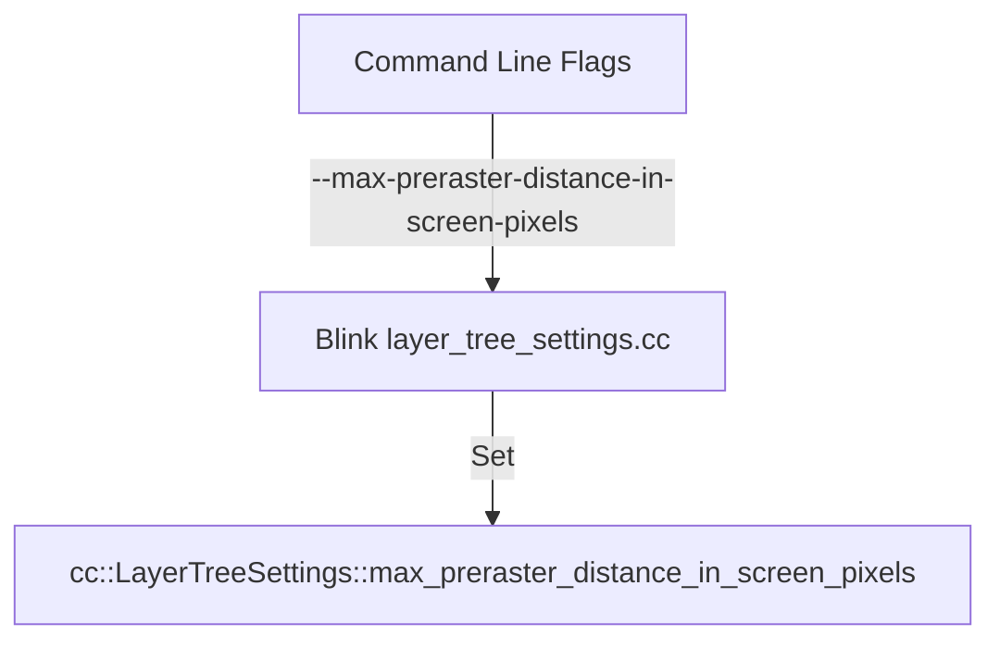

# DESIGN-0002: Configurable Max Preraster Distance

## Context

To reduce GPU memory usage on TV devices, we want to limit how far ahead the compositor pre-rasterizes tiles. The default of 1000px is too large for our needs.

## Goals

*   Allow configuring `max_preraster_distance_in_screen_pixels` at runtime.
*   Support disabling pre-rasterization (setting it to 0).

## Non-Goals

*   Changing the setting dynamically after the compositor has been initialized.

## Decisions

### 1. Introduce Command Line Switch
We will introduce a new command line switch to control this setting. This is simpler than a Feature/Param if we just want a direct override.

*   **Switch**: `--max-preraster-distance-in-screen-pixels=value`

### 2. Modify Blink's `layer_tree_settings.cc`
We will modify `third_party/blink/renderer/platform/widget/compositing/layer_tree_settings.cc` to parse this switch and apply it to `cc::LayerTreeSettings`.

## Architecture



### Proposed Code Changes (Conceptual)

In `cc/base/switches.h` (or blink equivalent, but `cc/base/switches.h` is where compositor switches often live if they are shared, or we can just define it locally in blink):
Let's define it in `cc/base/switches.h` for cleaner integration if we want, or just use a literal string in Blink to minimize changes.
Actually, defining it in `cc/base/switches.h` is better.

In `cc/base/switches.h`:
```cpp
CC_BASE_EXPORT extern const char kMaxPrerasterDistanceInScreenPixels[];
```

In `cc/base/switches.cc`:
```cpp
const char kMaxPrerasterDistanceInScreenPixels[] = "max-preraster-distance-in-screen-pixels";
```

In `third_party/blink/renderer/platform/widget/compositing/layer_tree_settings.cc`:
```cpp
#include "cc/base/switches.h"
#include "base/strings/string_number_conversions.h"

// ... In GenerateTemplatesSettings or similar:

  if (cmd.HasSwitch(cc::switches::kMaxPrerasterDistanceInScreenPixels)) {
    std::string value_str = cmd.GetSwitchValueASCII(
        cc::switches::kMaxPrerasterDistanceInScreenPixels);
    int value;
    if (base::StringToInt(value_str, &value) && value >= 0) {
      settings.max_preraster_distance_in_screen_pixels = value;
    } else {
      LOG(WARNING) << "Invalid value for "
                   << cc::switches::kMaxPrerasterDistanceInScreenPixels
                   << ": " << value_str;
    }
  }
```

## Deployment & Rollback

This change is safe as it defaults to the existing behavior (1000px) if the switch is not present.
*   **Rollback**: Remove the command line switch from the launch configuration.
