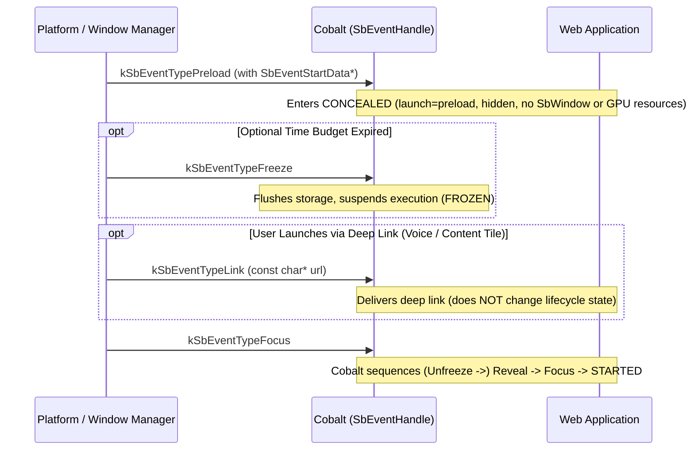

# Application Preload

Preloading allows Cobalt to start and initialize in the background (`Concealed`
state) without displaying any user interface. This enables a
"background-to-foreground" transition that appears instantaneous to the user
when they eventually choose to launch the application. For an overview of the
full Starboard state machine and platform contract, see
[Application Lifecycle and Platform Interface](lifecycle.md).

## Table of Contents

- [Starboard Platform Interface](#starboard-platform-interface)
  - [1. Starting in Preload Mode (`kSbEventTypePreload` & `SbEventStartData`)](#1-starting-in-preload-mode-ksbeventtypepreload--sbeventstartdata)
  - [2. Deferred Graphics & Splash Screen Resources](#2-deferred-graphics--splash-screen-resources)
  - [3. Waking to Foreground (`kSbEventTypeFocus` & Deep Links)](#3-waking-to-foreground-ksbeventtypefocus--deep-links)
  - [4. Bounding Preload Execution & Linux Reference Signals (`suspend_signals.cc`)](#4-bounding-preload-execution--linux-reference-signals-suspend_signalscc)
- [Web Application Behavior](#web-application-behavior)
  - [Best Practices](#best-practices)
- [Verification and Testing](#verification-and-testing)
  - [Unit Testing](#unit-testing)
  - [Integration Testing](#integration-testing)

## Starboard Platform Interface

Preloading is managed through the Starboard Platform Interface
([`starboard/event.h`](../../starboard/event.h) and
[`starboard/system.h`](../../starboard/system.h)).



### 1. Starting in Preload Mode (`kSbEventTypePreload` & `SbEventStartData`)

-   **Dispatching `kSbEventTypePreload`:** To launch Cobalt in preload mode, the
    platform dispatches `kSbEventTypePreload` as the initial event to
    `SbEventHandle()` instead of `kSbEventTypeStart`. This initializes Cobalt in
    the **Concealed** (hidden background) state.
-   **`SbEventStartData` Requirement:** Like `kSbEventTypeStart`,
    `kSbEventTypePreload` requires `event->data` to point to a valid
    `SbEventStartData` structure (`argument_count`, `argument_values`, and
    optional initial `link`). Passing `event->data = NULL` causes Cobalt to boot
    with `argc = 0`, dropping all command-line flags and startup URLs.
-   **`starboard::QueueApplication` Integration:**
    In the shared Starboard application framework
    ([`starboard/shared/starboard/application.cc`](../../starboard/shared/starboard/application.cc)),
    `Application::CreateInitialEvent()` automatically populates
    `SbEventStartData` for both `kSbEventTypePreload` and `kSbEventTypeStart`.
    In `Application::RunLoop()`, `IsPreloadImmediate()` is evaluated before
    `IsStartImmediate()`:

```cpp
class MyPlatformApplication : public starboard::QueueApplication {
  // ...
  bool IsStartImmediate() override { return !HasPreloadSwitch(); }
  bool IsPreloadImmediate() override { return HasPreloadSwitch(); }
};
```

`Application::HasPreloadSwitch()` returns `true` if the `--preload` command-line
switch (`kPreloadSwitch`) was passed, causing `RunLoop()` to call
`DispatchPreload()` and send `kSbEventTypePreload`.

### 2. Deferred Graphics & Splash Screen Resources

While preloaded in the **Concealed** state, Cobalt operates as a non-visible
background service and performs no rendering, so it has no use for a native
application window:
-   **Native Window (`SbWindowCreate` & `SbWindowDestroy`) and Graphics Deferral:**
    While in **Concealed**, Cobalt defers creating the native window
    (`SbWindowCreate()`) and allocating `EGLSurface` and hardware media decoder
    (`SbPlayer`) resources until the application is foregrounded
    (`kSbEventTypeReveal` or `kSbEventTypeFocus`). Similarly, if a foregrounded
    application is later concealed (`kSbEventTypeConceal`), Cobalt releases all
    GPU resources and informs the platform that it no longer needs the window by
    calling `SbWindowDestroy()`, and will request a new window via
    `SbWindowCreate()` when revealed again. Calls to `SbWindowDestroy()` by
    themselves are not a signal of intent to exit.
-   **Splash Screen Skip:** Cobalt skips creating the splash screen when
    launched via `kSbEventTypePreload`, further reducing the background memory
    footprint.

### 3. Waking to Foreground (`kSbEventTypeFocus` & Deep Links)

-   **Foregrounding (`Concealed` / `Frozen` -> `Started`):**
    To bring a preloaded application to the foreground, the platform dispatches
    `kSbEventTypeFocus` (or calls `SbSystemRequestFocus()`). Cobalt
    automatically sequences the required intermediate transitions (`Unfreeze` ->
    `Reveal` -> `Focus`) so that a native window is created via
    `SbWindowCreate()`, `EGLSurface` resources are initialized, and input focus
    is granted.
-   **Waking with a Deep Link (`kSbEventTypeLink`):**
    If the user launches the preloaded application via a content tile, voice
    search, or remote shortcut pointing to a specific URL (see
    [Cobalt Deep Links](deep_links.md)):
    1.  The platform dispatches `kSbEventTypeLink` with `event->data` set to the
        null-terminated `const char*` URL string (or calls
        `starboard::Application::Get()->Link(url)`).
    2.  **Important:** `kSbEventTypeLink` **has no lifecycle transition
        side-effect**—it delivers the deep link to the web application, but does
        **not** reveal or focus the application on its own.
    3.  To make the application visible and interactive when delivering the deep
        link, the platform **must also dispatch `kSbEventTypeFocus`** (or
        `kSbEventTypeReveal` followed by `kSbEventTypeFocus`).

### 4. Bounding Preload Execution & Linux Reference Signals (`suspend_signals.cc`)

-   **Freezing After Preload (`Concealed` -> `Frozen`):**
    If the platform grants a limited time budget for background preloading, it
    can dispatch `kSbEventTypeFreeze` (or call `SbSystemRequestFreeze()`) once
    the budget expires. When `SbEventHandle(kSbEventTypeFreeze)` returns, all
    cookies/storage are flushed to disk and background execution can be halted
    in the **Frozen** state. In
    [`starboard/shared/starboard/application.cc`](../../starboard/shared/starboard/application.cc),
    the convenience virtual callbacks `Application::OnSuspend()` and
    `Application::OnResume()` are invoked right before dispatching
    `kSbEventTypeFreeze` and `kSbEventTypeUnfreeze` to Cobalt, allowing a
    Starboard platform to perform platform-specific actions to prepare for
    halting or restarting program execution.
-   **Linux Reference Signal Mappings (`starboard/shared/signal/suspend_signals.cc`):**
    On Linux reference platforms, lifecycle transitions can be triggered via
    POSIX signals:
    -   `SIGCONT` -> `SbSystemRequestFocus()` (wakes a preloaded/frozen instance
        to **Started**).
    -   `SIGUSR1` -> `SbSystemRequestFreeze()` (transitions to **Frozen** and,
        in `starboard/shared/signal/system_request_freeze.cc`, suspends OS
        threads via `raise(SIGSTOP)` once `Freeze` completes).
    -   `SIGPWR` / `SIGTERM` -> `SbSystemRequestStop(0)` (cleanly transitions to
        **Stopped** and exits).
    -   **Stopping from `Frozen` (`SIGPWR` before `SIGCONT`):** When
        `suspend_signals.cc` is used and the process is halted by `SIGSTOP` in
        the **Frozen** state, stopping the application directly from **Frozen**
        requires sending **`SIGPWR` before `SIGCONT`**. Sending `SIGPWR` first
        ensures `SbSystemRequestStop(0)` is queued before `SIGCONT`
        (`SbSystemRequestFocus()`), allowing the application to exit directly
        from **Frozen** to **Stopped** without briefly foregrounding first.

## Web Application Behavior

When an application is preloaded (`kSbEventTypePreload`), it starts in the
**Concealed** state and standard Web APIs reflect this hidden state:

-   `document.visibilityState` is `"hidden"`.
-   `document.hidden` is `true`.
-   `document.hasFocus()` is `false`.
-   The query parameter `launch=preload` is automatically appended to the initial
    application URL (`window.location.search` includes `launch=preload`),
    allowing the web application to detect that it was launched in background
    preload mode.

### Best Practices

-   Avoid starting audio or video playback or heavy graphical animations while in
    the hidden state.
-   Listen for `visibilitychange` and `focus` events on `document` / `window` to
    detect when the application transitions from preloaded (`Concealed`) to
    visible (`Blurred`) and interactive (`Started`).

## Verification and Testing

For a deep dive into Cobalt's internal multi-process implementation of
`kSbEventTypePreload` (`AppEventDelegate`, `AppEventRunner`,
`ShellBrowserMainParts`, and `CobaltLifecycleManager`), see
[Cobalt Multi-Process Lifecycle Coordination Internals](lifecycle_internals.md).

### Unit Testing

Application preload and lifecycle transitions are covered by unit tests in
`cobalt_unittests` and `cobalt_shell_unittests`:

-   **`AppEventDelegateTest`** (`cobalt/app/app_event_delegate_unittest.cc`):
    Verifies that Starboard events (`Start`, `Preload`, `Reveal`, `Conceal`,
    `Freeze`, `Unfreeze`, `Blur`, `Focus`, `Stop`, `Link`) are sequenced into
    valid linear state transitions.
-   **`AppEventRunnerTest`** (`cobalt/app/app_event_runner_unittest.cc`):
    Verifies `AppEventRunner` execution for `OnStart` (including
    `SbEventStartData` and `Preload`), `OnReveal`, `OnConceal`, `OnFreeze`,
    `OnUnfreeze`, `OnBlur`, `OnFocus`, and `OnStop`.
-   **`LifecycleTest`** (`cobalt/shell/browser/lifecycle_unittest.cc`): Verifies
    window creation and visibility state propagation during preload, revelation,
    and redundant signals.
-   **`SplashScreenTest`** (`cobalt/shell/browser/splash_screen_unittest.cc`):
    Verifies that splash screen creation is skipped during preloading.

### Integration Testing

An end-to-end integration test is provided in `cobalt/tools/test_preload.sh`:

1.  Launches Cobalt in preload mode (`--preload`).
2.  Uses the Chrome DevTools Protocol (CDP) to verify that:
    -   `document.visibilityState` is initially `"hidden"`.
    -   `document.hasFocus()` is initially `false`.
    -   `window.location.search.includes('launch=preload')` is `true`.
3.  Sends `SIGCONT` to reveal and focus the application.
4.  Verifies via CDP that `document.visibilityState` transitions to `"visible"`
    and `document.hasFocus()` transitions to `true`.
5.  Sends `SIGPWR` to verify clean shutdown.
