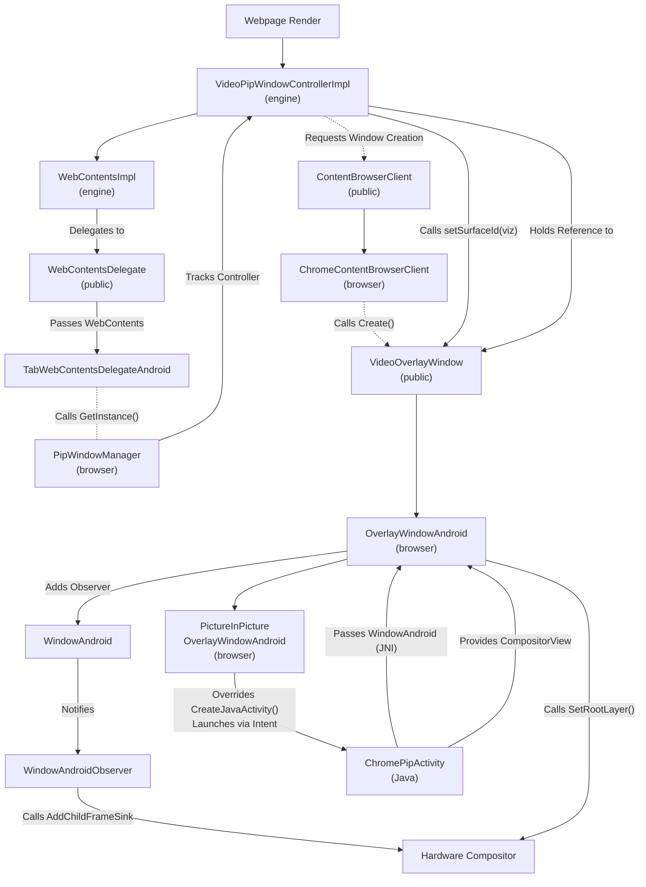
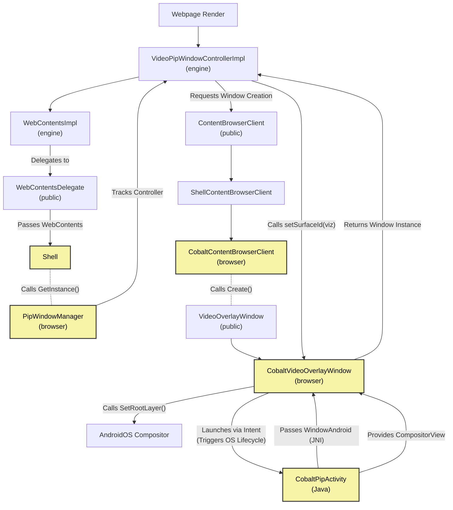

# Picture in Picture function in Chromium versus in Cobalt

This document explains the architectural differences in the Picture-in-Picture (PiP) implementation between upstream Chromium and Cobalt.

**Note:** Currently, Cobalt only supports Video Picture-in-Picture specifically tailored for **Android TV**.

## Architectural Flow Diagrams

Below are the detailed flow diagrams illustrating how the PiP initialization and window management pipelines differ between Cobalt and Chromium.

*   **Nodes (Boxes)** represent Architectural Components, Classes, or Entities.
*   **Edges (Arrows)** represent function calls, data passing, or lifecycle relationships.

### Figure 1: Chromium Architecture

### Figure 2: Cobalt Architecture (Android TV)

---

## Core Architectural Differences

In a modern browser architecture, PiP must coordinate between the web engine (content), the browser UI layer, and the native operating system's window manager. While Chromium builds a universal, highly decoupled PiP engine that supports everything from Desktop PCs to Mobile phones, Cobalt implements a streamlined, tightly integrated version optimized strictly for Android TV.

There are three main architectural differences between the two implementations, which are visually highlighted in the diagrams above:

### 1. `PictureInPictureWindowManager`: Full-Featured vs. Minimal Stub
*   **Chromium**: The `PictureInPictureWindowManager` is a massive, highly complex singleton. It manages both Video PiP and Document PiP, tracks multiple concurrent `WebContents`, observes window destruction events, calculates complex bounding boxes and aspect ratios, and bridges the gap between the web page and the native OS window manager across Windows, Mac, Linux, and Android.
*   **Cobalt**: The `PictureInPictureWindowManager` has significantly less implementation. Because Cobalt only supports Android TV (where the OS strictly controls the single PiP window via the Activity lifecycle), Cobalt's manager is heavily stripped down. It acts mostly as a basic pass-through delegator to the `VideoPictureInPictureWindowController`, omitting all the complex multi-window, resizing, and Document PiP logic found in Chromium.

### 2. Simplified Window Management and Graphics Compositing
*   **Chromium**: The `OverlayWindowAndroid` implementation is built for complex, multi-tasking environments. First, it is packed with phone and tablet logic (touch gestures for dragging, pinch-to-zoom, tap-to-expand). Second, for graphics compositing, it utilizes an asynchronous **Observer Pattern** (`WindowAndroidObserver`). Because a mobile OS frequently suspends apps, resizes windows, or detaches hardware compositors during multitasking, Chromium must carefully wait for `OnAttachCompositor` before calling `AddChildFrameSink()` to safely route the video.
*   **Cobalt**: `CobaltVideoOverlayWindow` is drastically simplified for the TV form factor. First, it drops all phone/tablet touch logic in favor of TV remote controls. Second, it completely drops the `WindowAndroidObserver` pattern. Because TVs run a single foreground app without complex background multi-tasking, Cobalt can rely on the compositor being stable. It fetches the `WindowAndroid` via JNI and synchronously calls `AddChildFrameSink()` and `SetRootLayer()` directly, bypassing the complex observer lifecycle management.

### 3. Consolidation of Overlay Window Classes
*   **Chromium**: Chromium utilizes an inheritance-based architecture to handle overlays:
    1.  **`OverlayWindowAndroid`**: This base class does the heavy lifting. It implements the basic functions of the `VideoOverlayWindow` interface (play, pause, close) and handles the low-level Viz FrameSink and Android hardware compositing mechanics.
    2.  **`PictureInPictureOverlayWindowAndroid`**: Inherits from `OverlayWindowAndroid` but is highly specialized; its sole responsibility is to override `CreateJavaActivity()` to launch the specific Android Activity used for mobile PiP.
*   **Cobalt**: Cobalt consolidates this inheritance tree into a single, flattened class: `CobaltVideoOverlayWindow`. It implements the public interface, fires the JNI intents to the Java Activity, and directly executes the low-level Viz compositing calls all in one monolithic design.
