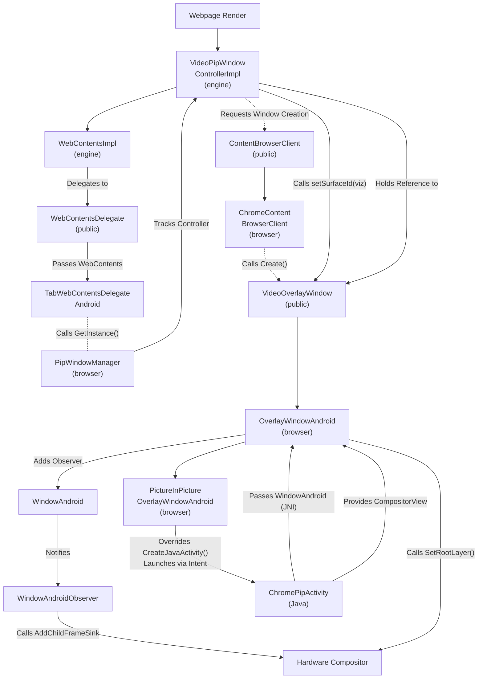
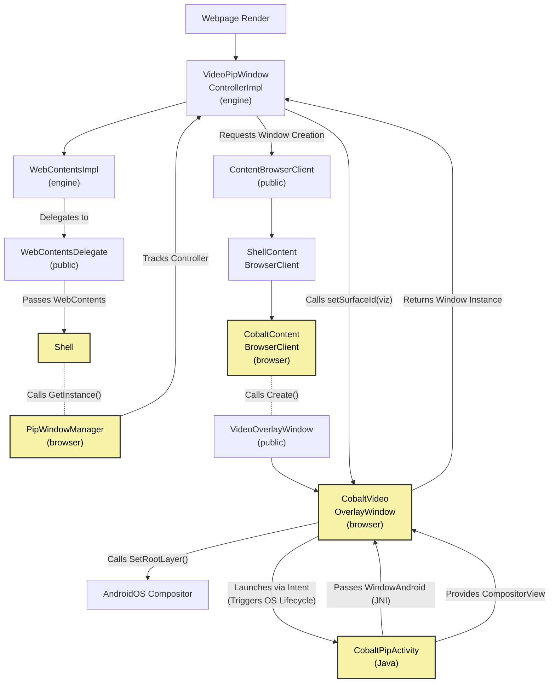

# Comparison of Picture-in-Picture functionality on Chromium vs on Cobalt

This document explains the architectural differences in the Picture-in-Picture (PiP) implementation between upstream Chromium and Cobalt. Currently, Cobalt only supports Video PiP for **Android TV**.

## Architectural Flow Diagrams

*   **Nodes** represent Architectural Components, Classes, or Entities.
*   **Edges** represent function calls, data passing, or lifecycle relationships.

### Figure 1: PiP on Chromium for ATV

```mermaid
flowchart TD
    %% ==================== TOP ENTRY ====================
    Webpage["`Webpage Render`"] --> VideoPipControllerImpl["`VideoPipWindow
ControllerImpl
(engine)`"]

    %% ==================== MIDDLE BRANCHES (Strictly Left to Right) ====================
    %% Left Branch: WebContents & Window Manager
    VideoPipControllerImpl --> WebContentsImpl["`WebContentsImpl
(engine)`"]
    WebContentsImpl -- "Delegates to" --> WebContentsDelegate["`WebContentsDelegate
(public)`"]
    WebContentsDelegate -- "Passes WebContents" --> TabWebContentsDelegateAndroid["`TabWebContentsDelegate
Android`"]
    TabWebContentsDelegateAndroid -."Calls GetInstance()" .- PipWindowManager["`PipWindowManager
(browser)`"]
    PipWindowManager -- "Tracks Controller" ---> VideoPipControllerImpl

    %% Middle Branch: Browser Clients
    VideoPipControllerImpl -. "Requests Window Creation" .-> ContentBrowserClient["`ContentBrowserClient
(public)`"]
    ContentBrowserClient --> ChromeContentBrowserClient["`ChromeContent
BrowserClient
(browser)`"]
    ChromeContentBrowserClient -. "Calls Create()" .-> VideoOverlayWindow["`VideoOverlayWindow
(public)`"]

    %% Right Branch: Windows & IPC
    VideoPipControllerImpl -- "Calls setSurfaceId(viz)" --> VideoOverlayWindow
    VideoPipControllerImpl -- "Holds Reference to" --> VideoOverlayWindow

    %% ==================== BOTTOM LAYER (Android / JNI) ====================
    VideoOverlayWindow ---> OverlayWindowAndroid["`OverlayWindowAndroid
(browser)`"]
    OverlayWindowAndroid --> PictureInPictureOverlayWindowAndroid["`PictureInPicture
OverlayWindowAndroid
(browser)`"]

    %% The Observer Pattern
    OverlayWindowAndroid -- "Adds Observer" --> WindowAndroid["`WindowAndroid`"]
    WindowAndroid -- "Notifies" --> OnAttachCompositor["`WindowAndroidObserver`"]
    OnAttachCompositor -- "Calls AddChildFrameSink" --> HardwareCompositor["`Hardware Compositor`"]

    %% Java Activity Launching
    PictureInPictureOverlayWindowAndroid -- "Overrides CreateJavaActivity()<br>Launches via Intent" --> ChromePipActivity["`ChromePipActivity
(Java)`"]

    %% JNI Callbacks back to Base Class
    ChromePipActivity -- "Passes WindowAndroid (JNI)" ---> OverlayWindowAndroid
    ChromePipActivity -- "Provides CompositorView" ---> OverlayWindowAndroid

    OverlayWindowAndroid -- "Calls SetRootLayer()" --> HardwareCompositor
```

### Figure 2: PiP on cobalt for ATV

```mermaid
flowchart TD
    %% --- TOP ENTRY ---
    Webpage["`Webpage Render`"] --> VideoPipControllerImpl["`VideoPipWindow
ControllerImpl
(engine)`"]

    %% --- MIDDLE BRANCHES (Delegation) ---
    VideoPipControllerImpl --> WebContentsImpl["`WebContentsImpl
(engine)`"]
    WebContentsImpl -- "Delegates to" --> WebContentsDelegate["`WebContentsDelegate
(public)`"]
    WebContentsDelegate -- "Passes WebContents" --> Shell["`Shell`"]:::Style
    Shell -."Calls GetInstance()" .- PipWindowManager["`PipWindowManager
(browser)`"]:::Style
    PipWindowManager -- "Tracks Controller" ---> VideoPipControllerImpl

    %% --- THE BROWSER CLIENT (Interception) ---
    VideoPipControllerImpl -- "Requests Window Creation" --> ContentBrowserClient["`ContentBrowserClient
(public)`"]
    ContentBrowserClient --> ShellContentBrowserClient["`ShellContent
BrowserClient`"]
    ShellContentBrowserClient --> CobaltContentBrowserClient["`CobaltContent
BrowserClient
(browser)`"]:::Style
    CobaltContentBrowserClient -. "Calls Create()" .- VideoOverlayWindow["`VideoOverlayWindow
(public)`"]

    VideoOverlayWindow --> CobaltVideoOverlayWindow["`CobaltVideo
OverlayWindow
(browser)`"]:::Style
    CobaltVideoOverlayWindow -- "Returns Window Instance" ---> VideoPipControllerImpl

    %% --- THE ASYNC RACE CONDITION ---
    %% Pipeline A: The Video Texture
    VideoPipControllerImpl -- "Calls setSurfaceId(viz)" --> CobaltVideoOverlayWindow

    %% Pipeline B: The Android UI
    CobaltVideoOverlayWindow -- "Launches via Intent<br>(Triggers OS Lifecycle)" --> CobaltPipActivity["`CobaltPipActivity
(Java)`"]:::Style
    CobaltPipActivity -- "Passes WindowAndroid (JNI)" ---> CobaltVideoOverlayWindow
    CobaltPipActivity -- "Provides CompositorView" ---> CobaltVideoOverlayWindow

    %% --- THE BRIDGE ---
    CobaltVideoOverlayWindow -- "Calls SetRootLayer()" --> AndroidOS["`AndroidOS Compositor`"]

    classDef Style fill:#F7F4A8,stroke:#333,stroke-width:2px,color:black
```

---

## Core Architectural Differences

### 1. `PictureInPictureWindowManager`: Full-Featured vs. Minimal Stub
*   **Chromium**: The `PictureInPictureWindowManager` is a massive, highly complex singleton. It manages both Video PiP and Document PiP, tracks multiple concurrent `WebContents`, observes window destruction events, calculates complex bounding boxes and aspect ratios, and bridges the gap between the web page and the native OS window manager across Windows, Mac, Linux, and Android.
*   **Cobalt**: The `PictureInPictureWindowManager` has significantly less implementation. Because Cobalt only supports Android TV for now(where the OS strictly controls the single PiP window via the Activity lifecycle), Cobalt's manager is heavily stripped down. It acts mostly as a basic pass-through delegator to the `VideoPictureInPictureWindowController`, omitting all the complex multi-window, resizing, and Document PiP logic found in Chromium.

### 2. Graphics Compositing and Window Lifecycle
*   **Chromium**: The `OverlayWindowAndroid` implementation is built for complex, multi-tasking mobile environments. It is packed with phone/tablet gesture controls (dragging, pinch-to-zoom) and utilizes the `WindowAndroidObserver` pattern to dynamically handle compositor attachment/detachment, ensuring safe graphics routing (`AddChildFrameSink`) during frequent OS-level lifecycle events.
*   **Cobalt**: `CobaltVideoOverlayWindow` also implements the `WindowAndroidObserver` pattern to safely manage the compositor lifecycle (adding/removing the child frame sink on attach/detach), ensuring robust video routing. However, it is simplified by omitting all mobile-specific touch gestures and complex multi-window layout calculations, as it is optimized strictly for TV remote interaction.

### 3. Consolidation of Overlay Window Classes
*   **Chromium**: Chromium utilizes an inheritance-based architecture to handle overlays:
    1.  **`OverlayWindowAndroid`**: This base class does the heavy lifting. It implements the basic functions of the `VideoOverlayWindow` interface (play, pause, close) and handles the low-level Viz FrameSink and Android hardware compositing mechanics.
    2.  **`PictureInPictureOverlayWindowAndroid`**: Inherits from `OverlayWindowAndroid` but is highly specialized; its sole responsibility is to override `CreateJavaActivity()` to launch the specific Android Activity used for mobile PiP.
*   **Cobalt**: Cobalt consolidates this inheritance tree into a single, flattened class: `CobaltVideoOverlayWindow`. It implements the public interface, fires the JNI intents to the Java Activity, and directly executes the low-level Viz compositing calls all in one monolithic design.
