Project: /youtube/cobalt/_project.yaml
Book: /youtube/cobalt/_book.yaml

# Cobalt Multi-Process Lifecycle Coordination Internals

This document provides a comprehensive, high-fidelity systems architecture guide describing how Cobalt coordinates process lifecycle transitions (such as Startup, Conceal, Freeze, Resume, and Stop) in a multi-process, asynchronous environment.

---

## 1. The Starboard Application Lifecycle

Cobalt's multi-process lifecycle is built directly on top of the **Starboard Application Lifecycle** specification defined in [`starboard/event.h`](file:///usr/local/google/home/jfoks/cobalt.main3/src/starboard/event.h). Starboard defines a strict linear state machine for applications to manage resource consumption, background capabilities, and clean shutdowns on diverse platforms:

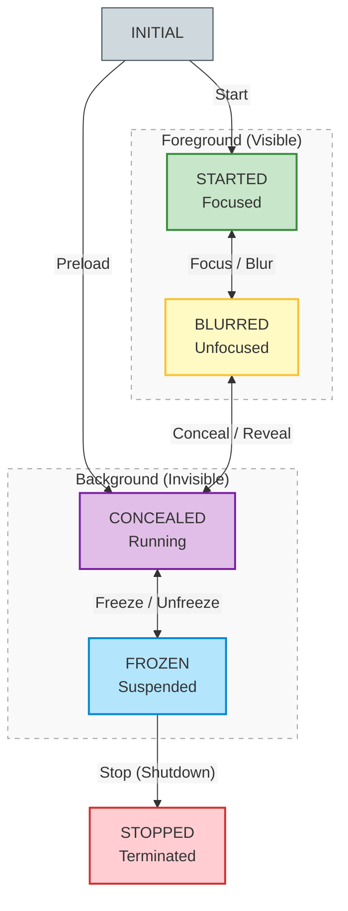

### Starboard State Specification:
*   **`STARTED`** (`kSbEventTypeStart`): The application is in the foreground, visible, and has focus. It is expected to perform all normal operations (video playback, UI animations) and is expected to receive user keyboard and remote control input.
*   **`BLURRED`** (`kSbEventTypeBlur`): The application is still visible but has lost focus (e.g., obscured by a system dialog or on its way to shutdown). Foreground activities like rendering and animations should be paused, and the application must not receive or process keyboard/remote control input.
*   **`CONCEALED`** (`kSbEventTypeConceal` / `kSbEventTypePreload`): The application is fully invisible but can still run background tasks (audio playback, network fetching, low-priority synchronization) with reduced CPU/memory allocations.
*   **`FROZEN`** (`kSbEventTypeFreeze`): The application is invisible and periodic background work is completely stopped. It **must release all GPU, graphics, and video resources**, and flush storage writes to disk. The application can be forcefully killed by the OS in this state at any time.
*   **`STOPPED`** (`kSbEventTypeStop`): The application is cleanly terminated, freeing all remaining resources.

All Starboard-compliant platforms guarantee that applications traverse these states linearly (e.g., an application must go through `BLURRED` and `CONCEALED` to reach `FROZEN` before stopping or being killed). Cobalt's architecture is designed to enforce this exact linear progression, synthesizing intermediate states when the OS dispatches events out-of-order or skips them.

---

## 2. High-Level Architecture

Cobalt separates lifecycle coordination into a strict **three-tier boundary model** to preserve architectural layering, avoid circular dependencies, and guarantee flakeless state progression:

1.  **Pure State Sequencing** (`AppEventDelegate`): A generic, 100% side-effect-free C++ state machine that translates OS events into a linear sequence of states, synthesizing intermediate transitions when necessary to prevent skipped states.
2.  **Synchronous Thread-Blocking Execution** (`AppEventRunnerImpl`): A platform-specific orchestrator that translates state directives into physical actions (Aura window visibility, Cookies and LocalStorage flushes). It **synchronously sleeps the main UI thread** inside a whitelisted nested `base::RunLoop` until the platform actions are fully completed.
3.  **Viewport Mojo Observation** (`CobaltLifecycleManager`): A browser-side viewport state manager that binds to renderer-side Mojo pipes (`CobaltLifecycleController`) to aggregate visible layout ACKs across multiple blink frames and broadcast completion events.


### Non-Destructive Platform Window and Views Widget Preservation

During background deactivation transitions (Conceal and Freeze), Cobalt implements a **non-destructive state preservation model**:
*   **The Design**: The platform `Window` object and the Chromium `views::Widget` hierarchy **are kept fully alive in memory** in the background, while only the physical EGL graphics surfaces and hardware compositor planes are destroyed and released back to the TV operating system.
*   **System Rationale (Why we preserve the Views Layout Tree)**:
    1.  **Near-Instant Wake-up**: Re-instantiating the entire Views widget hierarchy, re-allocating Aura render tree hosts, and re-executing styling and layout passes upon resume would simply be unnecessarily slow. Keeping the tree alive allows us to simply re-bind the graphics plane and paint the pre-existing layout instantly.
    2.  **Interactive State Preservation**: Keeps user scroll positions, active remote control focus, modal overlays, and half-filled form states perfectly preserved, preventing user disorientation upon wake-up.
    3.  **Renderer-Layout Synchronization**: In a Web-runtime browser like Cobalt, the Renderer context (DOM trees, active JavaScript states, active media playback structures, and Mojo IPC pipes) must be kept alive in the background during suspension. If the Renderer's DOM tree remains alive, but we destroy the underlying Views Layout representation, the DOM elements would become completely desynchronized from their visual layout blocks. Re-aligning a fresh Views tree against an existing DOM tree is highly complex, prone to memory leaks, and breaks event-routing pipelines. Keeping both layers alive in memory guarantees absolute synchronization across the browser process, enabling flawless resume transitions.

---

## 3. Architectural Coordination Flowchart

This block chart illustrates how the Browser and Renderer processes coordinate lifecycle transitions under our wait-state encapsulation model:

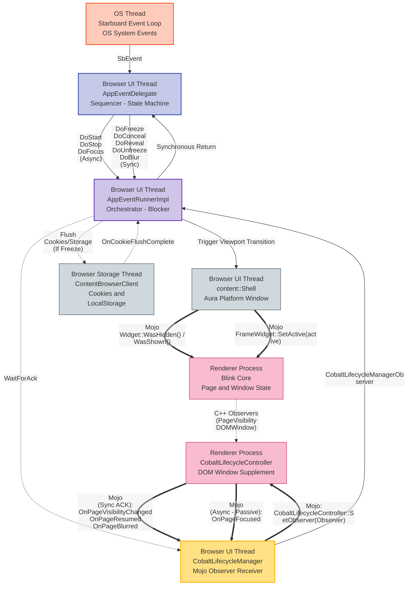

---

## 4. Transition Sequence Diagrams

### A. Conceal Transition
This sequence diagram illustrates how the browser blocks the UI thread synchronously while waiting for Mojo visibility layout ACKs from the Renderer Process:


### B. Freeze Transition
This sequence diagram illustrates how the same unified runner blocks the UI thread synchronously while waiting for a local Cookies and LocalStorage flush:

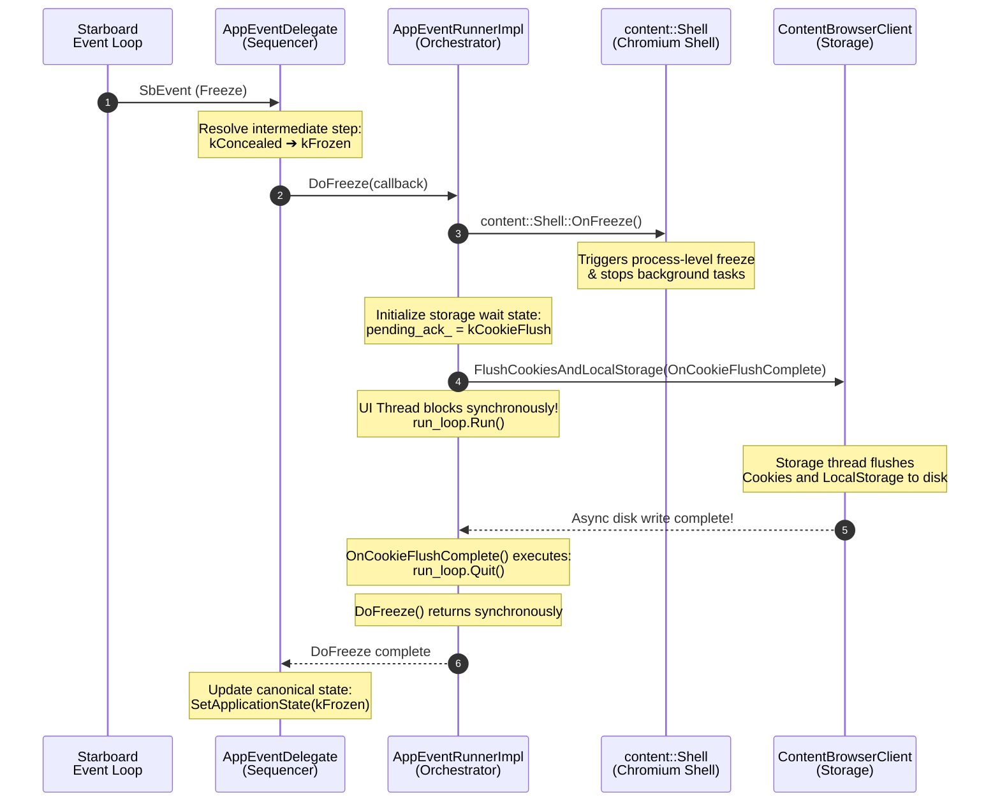

### C. Unfreeze Transition
This sequence diagram illustrates how the browser blocks the UI thread synchronously while waiting for Mojo frame resume ACKs from the Renderer Process:

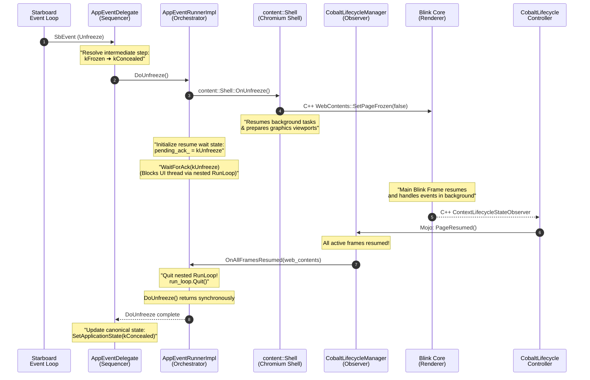

### D. Reveal Transition
This sequence diagram illustrates how the browser blocks the UI thread synchronously while waiting for Mojo frame visible layout ACKs, and triggers the visual `WasShown()` viewport before returning:

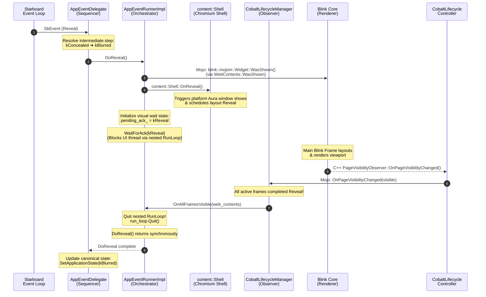

### E. Startup Transition
This sequence diagram illustrates how Cobalt initializes the browser process and starts the main loop on initial startup, setting up Mojo observation channels when the main frame becomes ready:

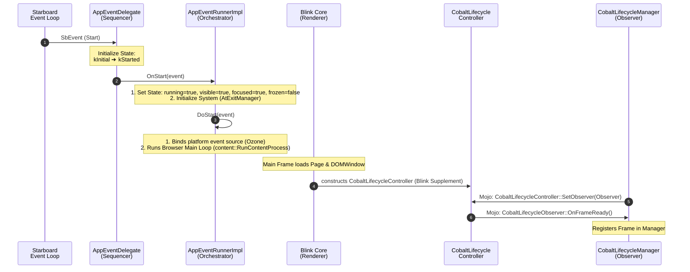

### F. Focus and Blur Transitions
These sequence diagrams illustrate the asynchronous, non-blocking focus and blur transitions, showing the downward Mojo activation calls and passive Mojo observation return loops:

#### 1. Focus Transition
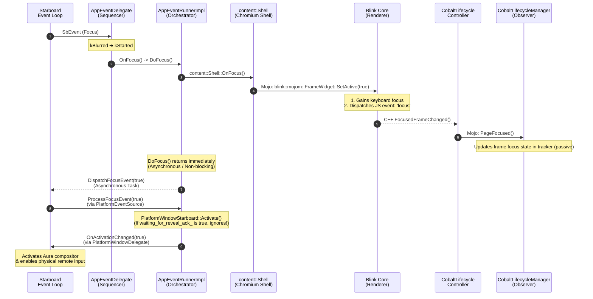

#### 2. Blur Transition
This sequence diagram illustrates how the browser blocks the UI thread synchronously while waiting for Mojo blur ACKs from the Renderer Process, in parallel with an asynchronous storage flush:

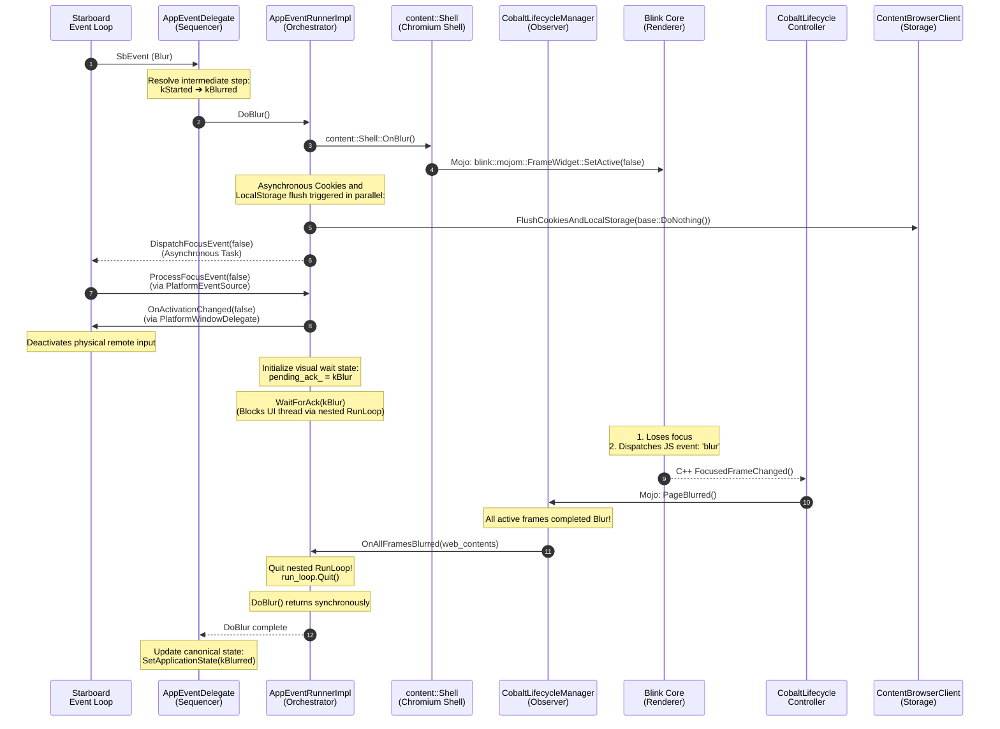

### G. Stop Transition
This sequence diagram illustrates how the browser process cleanly shuts down all renderer contexts, WebContents, and system-level resources upon receiving the Starboard stop event:

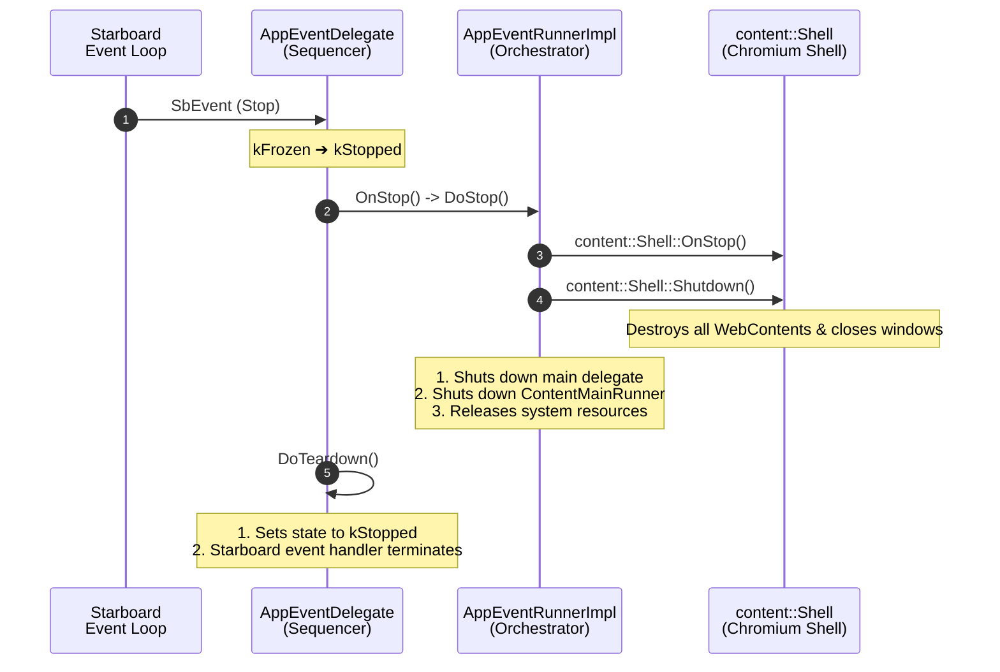

---

## 5. Multi-Step Transition Synthesis Examples

These high-level sequence diagrams illustrate how the pure sequencer (`AppEventDelegate`) and the modular orchestrator (`AppEventRunnerImpl`) coordinate to resolve complex, multi-state transitions.

By design, these diagrams **end at the `AppEventRunnerImpl` boundary**, focusing on how the sequencer synthesizes multiple intermediate transition steps linearly, and how the runner orchestrates blocking vs. non-blocking calls.

### A. Focus Event Received While Frozen
This diagram shows how a single OS `Focus` event received while the application is completely frozen triggers three sequential, linear activating steps: **Unfreeze ➔ Reveal ➔ Focus**.

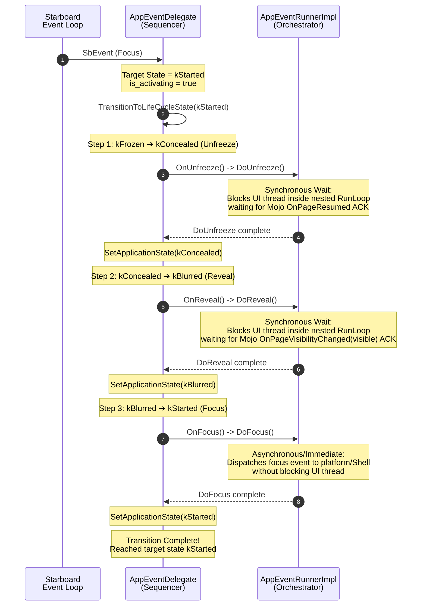

### B. Freeze Event Received While Started
This diagram shows how a single OS `Freeze` event received while the application is running with active focus triggers three sequential, linear deactivating steps: **Blur ➔ Conceal ➔ Freeze**.

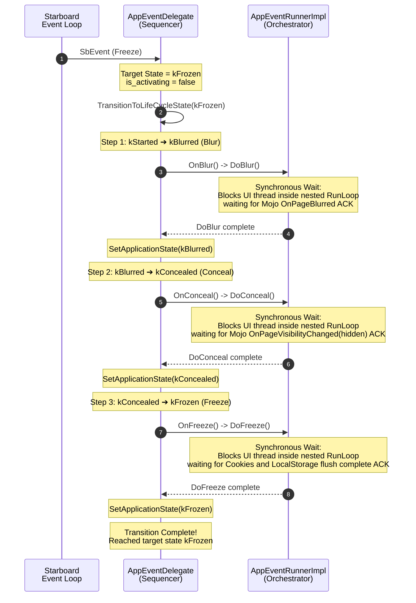

---

## 6. Re-Entrant Event Handling and Target Redirects

Because deactivation transitions (such as Blur, Conceal, and Freeze) synchronously block the UI Main Thread in a nested `base::RunLoop`, it is highly common for new system events to arrive re-entrantly *before* the current active transition step fully completes.

### Concurrency Safety Architecture:
*   **Lock Release During Waiting**: The `AppEventDelegate` locks its state machine mutex (`lock_`) *only* when updating state or calculating steps. During the actual transition execution (`DoBlur`, `DoConceal`), the mutex **is fully unlocked**.
*   **Re-Entrant Thread Safety**: When a new OS event arrives during a blocking wait, `HandleEvent` is executed re-entrantly on the same thread. Since the mutex is unlocked, it successfully acquires `lock_` without deadlocking!
*   **Dynamic Target Redirection**: If a transition is already active (`is_transitioning_ == true`), the sequencer simply **updates `target_state_`** to the new event's target and returns immediately without spawning a new loop.
*   **Linear Resolution**: Once the active blocking step receives its Mojo ACK and exits the nested loop, the sequencer updates the completed state, compares it with the *newly redirected target*, and seamlessly executes the next step in the new target's direction.

### A. Deactivation Redirect: Conceal Received During Active Blur
This diagram illustrates how an incoming `Conceal` event received during an active, blocking `Blur` transition dynamically redirects the target state, resulting in the seamless execution of `Conceal` immediately after `Blur` completes:

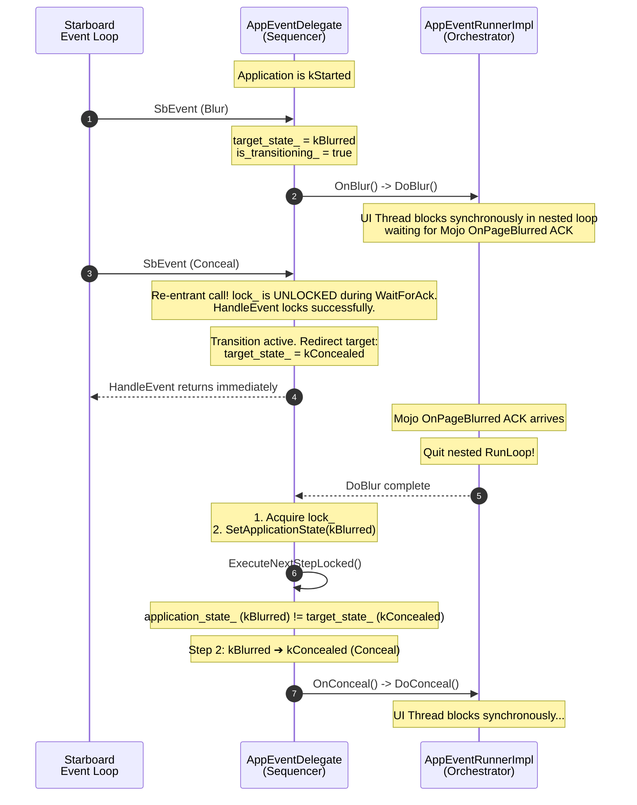

### B. Reversal Redirect: Conceal Received During Active Reveal
This diagram illustrates a direction reversal: an incoming `Conceal` event is received during an active `Reveal` (activating) transition. The sequencer completes the active step first (to prevent broken rendering states), then immediately detects the reversal and executes `Conceal` to return the application to `kConcealed`:

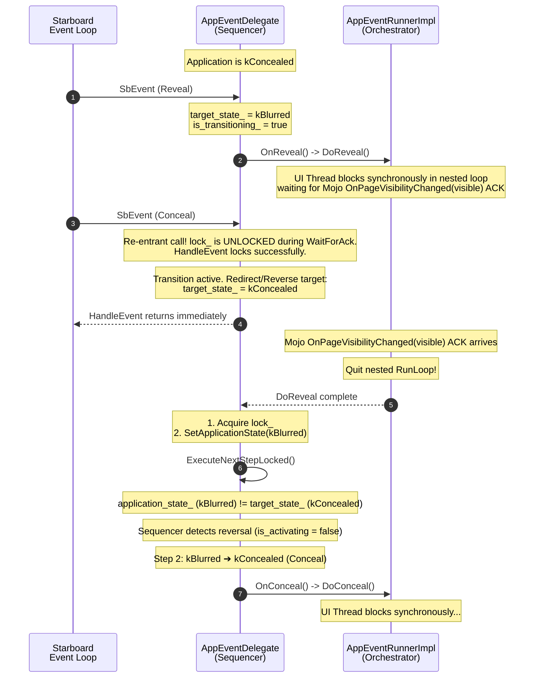

---

## 7. Detailed Coordination Steps

1.  **OS Event Dispatch**: The Starboard OS event loop dispatches a system event (e.g., `Freeze`) to `AppEventDelegate`.
2.  **Transition Sequencing**: `AppEventDelegate` locks the state machine and resolves the immediate next intermediate step (e.g., `kConcealed -> kFrozen`) via `GetNextState()`.
3.  **Synchronous Trigger**: The delegate calls `AppEventRunnerImpl`'s corresponding transition wrapper synchronously (e.g., `DoFreeze(callback)`).
4.  **Wait-State Injection**: The runner caches any test mock callback, sets the active wait type (`pending_ack_ = kCookieFlush`), and calls its unified blocking helper `WaitForAck()`.
5.  **UI Main Thread Sleep**: Inside `WaitForAck()`, the runner authorizes synchronous waits, triggers the transition work (either registering Mojo layout ACKs in `CobaltLifecycleManager` OR launching local Cookies and LocalStorage flushes in `ContentBrowserClient`), and **synchronously sleeps the UI thread inside a nested `base::RunLoop`**.
6.  **Mojo/Storage Completion**:
    *   *Mojo Viewports*: As the Blink frame renders, it sends visibility changes over Mojo (`CobaltLifecycleObserver`). `CobaltLifecycleManager` aggregates these frame signals and broadcasts completion (e.g., `OnAllFramesConcealed`) back to the runner.
    *   *Disk Storage*: Once the Cookies and LocalStorage storage thread finishes writing files to disk, the storage client executes the runner's local callback `OnCookieFlushComplete()`.
7.  **Nested Loop Quit**: The runner's callback handler receives the completion signal and calls `run_loop.Quit()`, waking up the sleeping UI thread.
8.  **State Finalization**: The nested loop exits, `WaitForAck()` returns, the runner transition wrapper returns synchronously to `AppEventDelegate`, and the delegate immediately updates its canonical state (`SetApplicationState(kFrozen)`), safely triggering the next sequential step.

---

## 8. Starboard Thread Restrictions Whitelisting

To prevent UI janks and deadlocks, Chromium strictly disallows any synchronous blocking wait primitives on the **Browser UI Main Thread** by default:

*   **The Starboard Pump Constraint**: On Starboard-based platforms, Cobalt implements **`base::MessagePumpUIStarboard`** which blocks using **`base::WaitableEvent`** under the hood when running nested `base::RunLoop` blocks. This immediately triggers Chromium's thread-restriction assertions (`DCHECK`) and aborts the process!
*   **The Resolution**: We utilize **`base::ScopedAllowBaseSyncPrimitivesOutsideBlockingScope`** inside `WaitForAck()` to authorize the thread to block during critical, unavoidable OS deactivation events.
*   **Layering Whitelist**: To prevent arbitrary developer abuse, Chromium whitelists instantiation of this Scoped helper using a strict **`friend class`** list in **`base/threading/thread_restrictions.h`**. Since `AppEventRunnerImpl` is our high-level modular shell orchestrator, we whitelist it inside the base library and guard the addition cleanly using **`#if BUILDFLAG(IS_COBALT)`**:

```cpp
#if BUILDFLAG(IS_COBALT)
  // Cobalt's platform deactivation lifecycle transitions (Reveal, Conceal,
  // Freeze, Unfreeze, Blur) synchronously block the UI Main Thread using a nested
  // base::RunLoop to guarantee atomic, linear state progression. Since
  // Starboard's custom base::MessagePumpUIStarboard blocks using
  // base::WaitableEvent under the hood, we must explicitly whitelist the modular
  // platform shell runner here to authorize main-thread sync waiting.
  friend class cobalt::AppEventRunnerImpl;
#endif  // BUILDFLAG(IS_COBALT)
```
