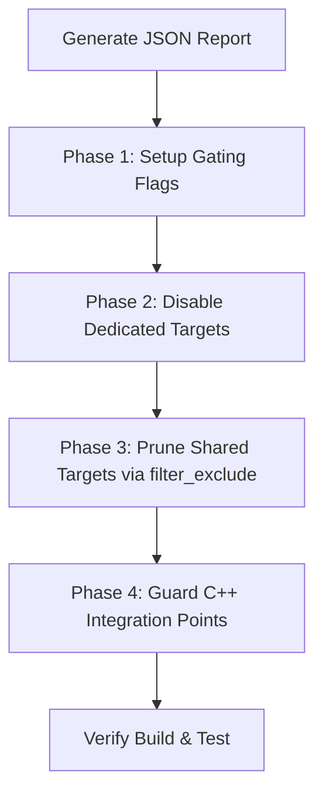

# Skill: Surgical Feature Removal in Cobalt/Chrobalt

This skill guides an AI coding agent through the step-by-step process of disabling or removing a feature in the Cobalt/Chrobalt codebase to optimize binary size. It utilizes the JSON automation report from `analyze_feature_disable_difficulty.py` to execute a structured, error-free eradication plan.

---

## 1. High-Level Workflow Overview

The feature removal process follows a four-phase methodology:



---

## 2. Detailed Execution Plan

### Phase 1: Setup Gating Flags (GN & C++ Preprocessor)

Before modifying the C++ build graph, establish the feature flags that will control compilation.

#### Rule A: Choose the appropriate Build Flag
* **Small Features (< 500 KB size savings)**: Use the existing global `is_cobalt` flag directly in `BUILD.gn` files to guard changes.
* **Large Features (> 500 KB size savings)**: Declare a dedicated custom build argument inside `third_party/blink/public/public_features.gni`:
  ```gni
  declare_args() {
    # If true, enables the <feature_name> module.
    enable_<feature_name> = !is_cobalt
  }
  ```

#### Rule B: Expose the Flag to C++ Preprocessor
Expose your custom argument as a C++ preprocessor macro by adding it to the `buildflag_header` declaration in `third_party/blink/public/common/BUILD.gn` (or the corresponding `public` BUILD file):
```gn
buildflag_header("buildflags") {
  flags = [
    ...
    "ENABLE_<FEATURE_NAME>=$enable_<feature_name>",
  ]
}
```
This will generate `buildflags.h` defining the macro `BUILDFLAG(ENABLE_<FEATURE_NAME>)`.

> [!TIP]
> **Smart Header Inclusion Rules**:
> 1. **Do NOT blindly add `#include "third_party/blink/public/common/buildflags.h"`** to every `.cc` or `.h` file you modify.
> 2. **Check for Transitive Inclusion**: If the file already transitively includes `buildflags.h` (e.g., through a core header like `third_party/blink/public/common/features.h` or its own corresponding `.h` header file), you can use `BUILDFLAG(ENABLE_<FEATURE_NAME>)` directly without adding the `#include` statement.
> 3. **Verify First**: Apply the preprocessor gating (`#if BUILDFLAG(...)`) and try running `gn gen` and compile. Only add the explicit `#include` statement if the compilation fails with an undeclared/undefined macro error.
>
> If an include is required:
> ```cpp
> #include "third_party/blink/public/common/buildflags.h"
> #if BUILDFLAG(ENABLE_<FEATURE_NAME>)
> ...
> #endif
> ```

---

### Phase 2: Disable Dedicated Targets (GN Graph Level)

Dedicated targets are completely specialized to the feature. They are identified in the JSON report with `"type": "DEDICATED"`.

To prevent massive line-by-line code conflicts with upstream Chromium branches, **never** delete a dedicated target directly from the existing `deps` or `public_deps` list of parent targets. Instead, use GN's list subtraction operator (`-=`).

1. Search for the target name (e.g. `//content/services/auction_worklet:auction_worklet`) in the `BUILD.gn` files.
2. Find which parent targets include it under their `deps` or `public_deps`.
3. Add a conditional subtraction block at the bottom of the parent target:
   ```gn
   if (!enable_<feature_name>) {
     deps -= [ "//content/services/auction_worklet" ]
   }
   ```

---

### Phase 3: Prune Shared Targets via `filter_exclude`

Shared targets compile both feature-specific files and core codebase files. They are identified in the JSON report with `"type": "SHARED"`.

To prevent massive line-by-line code conflicts with upstream Chromium branches, **never** delete files manually from the `sources` list of a shared target. Instead, use GN's **`filter_exclude`** function.

1. Identify the `"matched_files"` list in the shared target section of the JSON report.
2. Open the home `BUILD.gn` of that target.
3. Add a filter to prune those sources when the feature is disabled:
   ```gn
   if (!enable_<feature_name>) {
     # Omit feature-specific sources dynamically
     _filtered_sources = filter_exclude(sources, [ "feature_dir/*" ])
     sources = []
     sources = _filtered_sources
   }
   ```
4. If the target compiles auto-generated Web IDL bindings (e.g., inside `third_party/blink/renderer/bindings/`), apply a similar filter to `static_idl_files_in_modules` using the matching directory prefix (e.g. `[ "//third_party/blink/renderer/modules/feature_dir/*" ]`).

---

### Phase 4: Guard C++ Integration Points (Surgical Preprocessor Edits)

The JSON report lists all direct C++ includes of feature headers under the `"cpp_integration_audit"` block of each target.

For each entry in the audit:
1. Open the C++ source file listed under `"file"`.
2. Locate the matching `#include` statement listed in `"referenced_headers"`.
3. Wrap the include using preprocessor macros, only adding the `#include "third_party/blink/public/common/buildflags.h"` statement if it is not already transitively included in the file:
   ```cpp
   #if BUILDFLAG(ENABLE_<FEATURE_NAME>)
   #include "content/browser/interest_group/interest_group_manager_impl.h"  // nogncheck
   #endif  // BUILDFLAG(ENABLE_<FEATURE_NAME>)
   ```
   > [!IMPORTANT]
   > Always append **`// nogncheck`** to gated includes that refer to headers compiled in gated targets. This prevents the GN build-system dependency-checker from raising untracked header errors. Refer to the **Smart Header Inclusion Rules** in Phase 1 to avoid redundant buildflag header inclusions.

4. Locate all usages of classes, methods, or variables defined in that header within the file.
5. Wrap those usages with the same preprocessor block:
   ```cpp
   #if BUILDFLAG(ENABLE_<FEATURE_NAME>)
     GetInterestGroupManager()->DoSomething();
   #else
     // Provide a fallback, dummy response, or do nothing.
   #endif  // BUILDFLAG(ENABLE_<FEATURE_NAME>)
   ```
   > [!IMPORTANT]
   > **Trailing Preprocessor Comments**: Always add a trailing comment to the closing macro statements for clarity, e.g., `#endif  // BUILDFLAG(ENABLE_<FEATURE_NAME>)`. Do not leave `#endif` uncommented.

6. **Check for V8 IDL Bindings**: If the C++ integration point resides inside `v8_script_value_serializer_for_modules.cc` or another serialization class, make sure to wrap both serialization registration and serialization method bodies.

---

### Phase 5: Address Static Analysis Tool Limitations (Manual Auditing)

Because the static analysis tool relies strictly on production C++ symbol databases, the agent **must** execute the following manual audits to prevent compile-time or runtime crashes:

#### 1. Audit Web IDL & V8 generated bindings
If the feature exposes any APIs to JavaScript (defined in `.idl` files), you must filter them out:
1. Open `third_party/blink/renderer/bindings/idl_in_modules.gni`.
2. Locate `static_idl_files_in_modules` and apply the negative filter block to exclude the feature's IDL directory:
   ```gn
   if (!enable_<feature_name>) {
     _filtered_static_idl =
         filter_exclude(
             static_idl_files_in_modules,
             [ "//third_party/blink/renderer/modules/<feature_dir>/*" ])
     static_idl_files_in_modules = []
     static_idl_files_in_modules = _filtered_static_idl
   }
   ```
3. Check `third_party/blink/renderer/bindings/bindings.gni` and add exclusion patterns (e.g. `*<feature_name>*`) to `cobalt_bindings_exclude_patterns`.

#### 2. Audit Unit Test targets
Unit test and mocking files are compiled into separate test executables, which are invisible to the production build graph:
1. Locate files matching `*test.cc` or `*unittest.cc` inside the feature directory.
2. Open the parent directory's `BUILD.gn` containing the corresponding test target (typically `source_set("unit_tests")` or `source_set("modules_testing")`).
3. Subtract these source files and test support dependencies under the negative condition:
   ```gn
   if (!enable_<feature_name>) {
     _filtered_sources = filter_exclude(sources, [ "<feature_dir>/*" ])
     sources = []
     sources = _filtered_sources

     deps -= [
       "//third_party/blink/renderer/modules/<feature_dir>:test_support"
     ]
   }
   ```

#### 3. Audit Transitive GN Dependencies
Some parent targets might depend on the feature target to inherit compilation configurations, even if they do not directly `#include` its headers in C++:
1. Run `gn refs` manually on your command line to find all targets referencing the feature:
   ```bash
   gn refs out/android-arm_gold //third_party/blink/renderer/modules/<feature_dir>
   ```
2. Review the returned parent targets. **Only apply list subtraction (`deps -= [...]` or `public_deps -= [...]`) in parent targets that EXPLICITLY list the feature target in their own target definition blocks.**
3. If a parent target transitively inherits the dependency through another middleman target, do **not** add a subtraction block there. The dependency will be cleanly severed automatically once you disable it in the direct parent target.

---

#### 4. Audit Mojo IPC Benders
If the feature utilizes Mojo IPC interface definitions (found in `.mojom` files), both processes communicate using auto-generated headers rather than direct implementation headers.
1. Locate all `.mojom` files in the feature's directory.
2. Search the codebase for references to the generated interface classes (e.g. `mojom::AdAuctionService` or its binder registration).
3. Locate where the interfaces are registered in the Mojo interface binder map (e.g., `content/browser/browser_interface_binders.cc` or `third_party/blink/renderer/modules/modules_initializer.cc`).
4. Wrap both the include statement and the registry mapping block:
   ```cpp
   #if BUILDFLAG(ENABLE_<FEATURE_NAME>)
     frame.GetInterfaceRegistry()->AddInterface(
         WTF::BindRepeating(&<FeatureName>Tracker::BindToFrame, ...));
   #endif  // BUILDFLAG(ENABLE_<FEATURE_NAME>)
   ```

---

## 3. Build & Verification Checklist

After applying the gating, run these verification steps to ensure correctness:

### Step 1: Generate the GN configuration
Run GN generation to verify that the build graph resolves cleanly without circular dependencies or untracked headers:
```bash
gn gen out/android-arm_gold
```

### Step 2: Perform a local compile
Compile the target binary using `autoninja`. **If compilation, linkage, or header checking raises errors, surgically troubleshoot them** (by adding missing macro guards, routing fallbacks, or gating headers) and repeat compiling until it succeeds completely:
```bash
autoninja -C out/android-arm_gold cobalt_apk
```

### Step 3: Assert size savings
Compare the resulting binary size of the shared object with the baseline to verify that the proportional size savings match the expectations computed by the SuperSize tool.

---

## 4. Architectural Lessons & Troubleshooting Guidelines for Future Feature Removals

Based on technical challenges faced during past surgical removals, future removals must adhere to these critical rules to prevent complex compilation and linker crashes:

### Rule 1: The Mojo Typemap Paradox (SHARED Targets)
* **Problem**: Mojo C++ bindings use **typemaps** to map Mojom types to existing production C++ structs (e.g., mapping `blink.mojom.InterestGroup` to `blink::InterestGroup`). Completely excluding these production C++ structs from `common` SHARED libraries causes `mojom_platform` compilation to fail.
* **Instruction**: Never strip production C++ data structs from SHARED targets if they are referenced in Mojo typemaps. Keep minimal, inert C++ struct definitions inside the common library while completely severing their active handlers, tests, and business logic.

### Rule 2: Gate DevTools Auto-Attachers & Observers
* **Problem**: Auto-attachers or observers (such as `FrameAutoAttacher`) often inherit from tracker classes in the excluded feature directories, causing compilation to crash because the base classes are missing.
* **Instruction**: Always check if the feature defines a manager, observer, or tracker inside the DevTools directory. Gird both the class inheritance (multiple inheritance blocks), declarations, and corresponding implementation callbacks (e.g. `AuctionWorkletCreated`) inside preprocessor gates.

### Rule 3: Sever Mojo Exposed Binders
* **Problem**: Renderer processes expose Mojo services to the browser at startup. If the service implementation is excluded, the exposed binder list will cause unresolved symbol linker errors.
* **Instruction**: Always check where the service is exposed to the browser (e.g., `browser_exposed_renderer_interfaces.cc` or `ExposeInterfacesToBrowser`). Wrap both the include statements and the binders registration blocks inside the preprocessor gates:
  ```cpp
  #if BUILDFLAG(ENABLE_<FEATURE>)
    binders->Add<...>(...);
  #endif
  ```

### Rule 4: Stub Mojo-Overridden Methods Instead of Removing
* **Problem**: If a Mojo interface (like `LocalFrameHost`) defines a method belonging to the feature, trying to remove its declaration from `RenderFrameHostImpl` will break the Mojo C++ interface override contracts.
* **Instruction**: Keep the method declaration intact, but **guard the method body** so it does nothing or safely reports a bad message when the feature is disabled:
  ```cpp
  void RenderFrameHostImpl::SomeFeatureMethod(...) {
  #if BUILDFLAG(ENABLE_<FEATURE>)
    // Production implementation...
  #else
    mojo::ReportBadMessage("Feature is disabled.");
  #endif
  }
  ```
