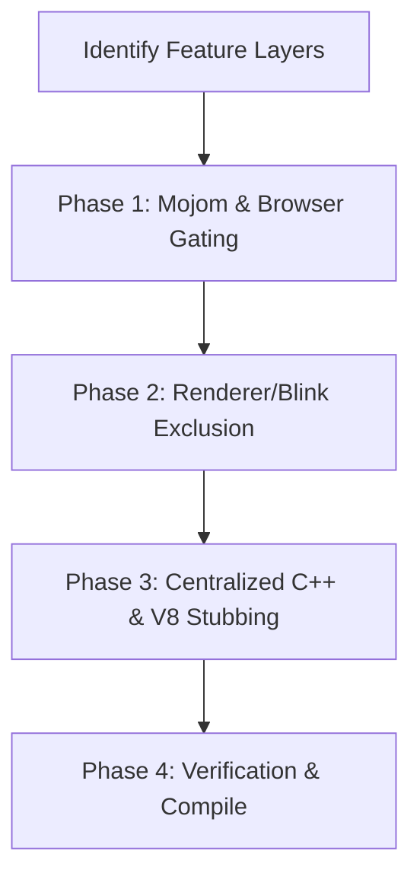

# Skill: Hybrid Feature Removal in Cobalt

This skill guides an AI coding agent through the step-by-step process of cleanly removing or disabling a feature (e.g., WebNN, WebGPU, WebXR) in the Cobalt/Chrobalt codebase using the optimal hybrid approach (Surgical Gating + Centralized Stubbing).

---

### Core Philosophy: The Hybrid Architecture

To minimize merge conflicts with upstream Chromium while maintaining binary size savings and security, Cobalt uses a **hybrid separation of concerns**:

1. **Browser & IPC Boundary Layer ➔ Surgical Gating**
   * Mojo interfaces and browser-side Binder registrations are completely compiled out using preprocessor guards (`#if !BUILDFLAG(IS_COBALT)`) and Mojom attribute gates (`[EnableIfNot=is_cobalt]`).
   * *Rationale*: Prevents large autogenerated serialization code bloat, blocks renderer sandbox escapes, and correctly reports feature status for JS feature detection.
   * *Implementation*: For detailed guidelines on implementing surgical gating, gating build flags, and using preprocessor guards, follow the standards in [surgical_feature_gating_rules.md](surgical_feature_gating_rules.md).
2. **Renderer & Blink Layer ➔ Centralized Stubbing**
   * Blink directories are subtracted from compilation (using GN `sub_modules -= [...]`) and generated V8 binding source files are excluded (using `bindings.gni` `filter_exclude`).
   * Linker references from unmodified core code are resolved via centralized stub files (e.g., `modules/cobalt_modules_stubs.cc`).
   * *Rationale*: Core Blink files are untouched, preventing merge conflicts during upstream updates.



---

### Why Centralized Stubbing is Avoided for Mojo/IPC Boundaries (and where it can be applied)

While centralized C++ stubbing is a powerful way to avoid merge conflicts in core files, it **must not** be used at Mojo/IPC boundary layers. However, it **can** be used for pure C++ interfaces in browser/content/common layers if no Mojom/IPC is involved.

#### 1. Why Gating (Not Stubbing) is Required for Mojo/IPC Boundaries:
* **The Mojom Compiler Constraint (Virtual Method Contract)**:
  Mojo interfaces compiled from `.mojom` files generate abstract C++ base classes. If we stub the browser-side receiver in C++, any upstream changes to the `.mojom` file (like adding a method) will immediately break our stub's compilation. Gating the Mojom file directly avoids this contract.
* **Mojom Serialization Binary Size**:
  If we keep the `.mojom` files in the build and only stub the C++ receiver, the Mojo compiler still generates and links all the heavy serialization, deserialization, and validation code (hundreds of KB). Gating the Mojom files is required to reclaim this space.
* **IPC Security & Sandbox**:
  Stubbing leaves IPC routes registered and open in the browser's `BinderMap`. Gating ensures they are completely unregistered, reducing the attack surface.

#### 2. Where Stubbing Can Be Applied Outside the Renderer (Blink):
* **Pure C++ Interfaces in Browser/Content**:
  If the feature's integration with the browser or content layer is a pure C++ dependency (such as a factory function, custom provider, or static helper) and **no Mojo/IPC or IDL bindings are involved**, you can create C++ stubs (e.g. returning `nullptr` or a dummy implementation) in a stubs file or a gated implementation file.
* **Benefits**:
  Just like in Blink, this avoids polluting core C++ files (e.g. `browser_main_loop.cc` or `content_browser_client.cc`) with preprocessor macros, making upstream merges much cleaner.

---

### Detailed Step-by-Step Instructions

#### Phase 1: Mojom & Browser Gating (Surgical Gating)

> [!IMPORTANT]
> When applying preprocessor guards or adding build flags for surgical gating, follow the exact step-by-step procedures and rules (including IWYU, Mojo overrides, and DevTools observers) documented in [surgical_feature_gating_rules.md](surgical_feature_gating_rules.md).

1. **Gate Mojom Compilation**:
   * Open the `.mojom` file defining the service (e.g., `services/webnn/public/mojom/webnn_context_provider.mojom`).
   * Use the `is_cobalt` Mojom attribute to conditionally exclude the imports or methods:
     ```protobuf
     [EnableIfNot=is_cobalt]
     import "services/webnn/public/mojom/webnn_context.mojom";

     interface GpuService {
       [EnableIfNot=is_cobalt, RuntimeFeature=webnn.mojom.features.kWebMachineLearningNeuralNetwork]
       BindWebNNContextProvider(pending_receiver<webnn.mojom.WebNNContextProvider> receiver, int32 client_id);
     }
     ```
2. **Gate Browser Binder Registrations**:
   * Open `content/browser/browser_interface_binders.cc`.
   * Find the binder registrations for the feature.
   * Wrap the includes and mapping logic using `#if !BUILDFLAG(IS_COBALT)`:
     ```cpp
     #if !BUILDFLAG(IS_COBALT)
     #include "services/webnn/public/mojom/webnn_context_provider.mojom.h"
     #endif

     ...
     #if !BUILDFLAG(IS_COBALT)
     map->Add<webnn::mojom::WebNNContextProvider>(
         base::BindRepeating(&BindWebNNContextProviderForRenderFrame));
     #endif
     ```
3. **Gate Feature Initializers**:
   * Locate the service implementation initializers in the browser/service process (e.g., in `components/viz/service/gl/gpu_service_impl.cc` or `content/browser/browser_main_loop.cc`).
   * Wrap member variables, includes, and initialization blocks in `#if !BUILDFLAG(IS_COBALT)`.

---

#### Phase 2: Renderer & Blink Exclusion (Centralized Stubbing)

1. **Exclude the Blink Module in GN**:
   * Open `third_party/blink/renderer/modules/BUILD.gn`.
   * Find the `sub_modules` list under the `component("modules")` target.
   * Dynamically subtract the module folder when building for Cobalt:
     ```gn
     if (is_cobalt) {
       sub_modules -= [ "//third_party/blink/renderer/modules/<feature_name>" ]
     }
     ```
2. **Exclude IDL Files in `idl_in_modules.gni`**:
   * Open `third_party/blink/renderer/bindings/idl_in_modules.gni`.
   * Apply a negative filter to `static_idl_files_in_modules` and its testing list to stop the IDL parser from generating bindings:
     ```gn
     if (!enable_<feature_name>) {
       _filtered_idl = filter_exclude(static_idl_files_in_modules, [ "//third_party/blink/renderer/modules/<feature_name>/*" ])
       static_idl_files_in_modules = []
       static_idl_files_in_modules = _filtered_idl

       _filtered_testing_idl = filter_exclude(static_idl_files_in_modules_for_testing, [ "//third_party/blink/renderer/modules/<feature_name>/*" ])
       static_idl_files_in_modules_for_testing = []
       static_idl_files_in_modules_for_testing = _filtered_testing_idl
     }
     ```
3. **Exclude Generated V8 Bindings**:
   * Open `third_party/blink/renderer/bindings/bindings.gni`.
   * Append your wildcard exclusion patterns directly to the main variable `cobalt_bindings_exclude_patterns` (which targets both compilation and bindings list verification):
     ```gn
     if (!enable_<feature_name>) {
       cobalt_bindings_exclude_patterns += [
         "*<feature_prefix>*",
         "*v8_<feature_prefix>*",
       ]
     }
     ```
   * Open `third_party/blink/renderer/bindings/modules/v8/BUILD.gn`.
   * Ensure the target `blink_modules_sources("v8")` filters its source list against `cobalt_bindings_exclude_patterns` (this is normally configured globally, but verify it is present).

4. **Web IDL Modularity (The Partial IDL Interface Pattern)**:
    * **Problem**: Web IDL does not support preprocessor macros. If a core IDL file (e.g., `navigator.idl` or `window.idl`) references a type inside a gated module, removing the module will crash the IDL parser due to an "undefined type" error.
    * **Solution**: Do not edit the core IDL file. Instead, refactor the method/attribute declaration out of the core IDL file and declare it as a `partial interface` inside a new IDL file inside your gated module folder. When the module is excluded, the partial interface (and thus the core dependency) is discarded automatically with zero merge-conflict surface in the core IDL files.


---

#### Phase 3: Centralized C++ & V8 Stubbing

1. **Dead Code Analysis (Is Stubbing Necessary?)**:
   * **Crucial Rule**: If the feature has **no C++ references from the core Blink codebase** (like `ad_auction` which only implements Web APIs and has no layout/core hooks), you do **not** need to add C++ stubs. The GN target exclusion and IDL filtering are sufficient.
   * Only proceed with stubbing if you encounter compilation or linker errors from core files (e.g. `navigator.cc` referencing getters, or `canvas` contexts referencing `GPUCanvasContext`).
2. **Locate the Stubs File**:
   * The stubs live in: [third_party/blink/renderer/modules/cobalt_modules_stubs.cc](../../../third_party/blink/renderer/modules/cobalt_modules_stubs.cc).
3. **Stub the V8 Wrappers**:
   * For every V8 wrapper class that was excluded but is still referenced in V8 initialization databases or global registries, add a `STUB_V8_WRAPPER` definition:
     ```cpp
     // Inside cobalt_modules_stubs.cc
     STUB_V8_WRAPPER(V8<FeatureName>)
     STUB_V8_WRAPPER(V8<SubClassName>)
     ```
4. **Stub C++ Entry Points**:
   * Implement dummy implementations for any core integration headers (like `Navigator` getters or factory creators):
     ```cpp
     // Stub out the entry point of the module returning nullptr
     <FeatureClass>* Navigator<FeatureName>::<methodName>(NavigatorBase& navigator) {
       return nullptr;
     }
     ```
5. **Trace and Verify Call Sites (Null-Safety)**:
   * **Crucial Rule**: Because stubbed entry points often return `nullptr` (or dummy/no-op implementations), you **must trace upstream** through all function calls that consume the stub's return value.
   * Verify that every call site in the core codebase (which remains active in Cobalt) properly null-checks the returned pointer or handles the dummy state safely.
   * For example, if `NavigatorWebNN::webnn(navigator)` is stubbed to return `nullptr`, ensure that core code calling `webnn(...)` does not dereference the pointer without checking (e.g., `webnn(navigator)->doSomething()` would crash; it must be protected by a null check).
6. **Platform/Dawn Stubs (If third-party library is excluded)**:
   * If a third-party C library (like Dawn) is removed, add stub implementations of its C functions in [third_party/blink/renderer/platform/graphics/gpu/cobalt_webgpu_stubs.cc](../../../third_party/blink/renderer/platform/graphics/gpu/cobalt_webgpu_stubs.cc) to prevent unresolved platform link errors.

---

#### Phase 4: Verification & Compile

1. **Verify GN Graph Generation**:
   * Run GN to ensure the build graph resolves without unresolved dependencies:
     ```bash
     gn gen out/android-arm_gold
     ```
2. **Perform Compile**:
   * Run compile to verify no missing symbols or compiler warnings occur:
     ```bash
     autoninja -C out/android-arm_gold cobalt_apk
     ```
3. **Address Linker Errors**:
   * If the linker complains about missing symbols (e.g., `undefined reference to blink::V8<Class>::wrapper_type_info_`), identify the symbol and append a stub declaration/definition to `cobalt_modules_stubs.cc`.

---

## Phase 5: Code Review Checklist (PR Audit Guidelines)

When reviewing a PR that implements hybrid feature removal and centralized stubbing, the reviewer (human or AI) **must** verify the following points:

### 1. Separation of Concerns (Hybrid Check)
- [ ] Verify that Mojom files and browser interface binders are completely **gated out** using preprocessor macros and Mojom attributes (`[EnableIfNot=is_cobalt]`).
- [ ] Verify that Renderer/Blink layer files are **subtracted from compilation** via GN (`sub_modules -=`), and bindings are **filtered out** via `bindings.gni`.
- [ ] Verify that core C++ Blink files (e.g., `Navigator.cc`, `HTMLCanvasElement.cc`) are **NOT** modified with `#if !BUILDFLAG(IS_COBALT)` to exclude the feature. All C++ compiler/linker dependencies from core Blink must be resolved via centralized stubbing.

### 2. Blink Module Exclusion & Web IDL Modularity
- [ ] Verify that the module's sub-folder is dynamically subtracted from `sub_modules` in `third_party/blink/renderer/modules/BUILD.gn`.
- [ ] Verify that IDL files are filtered out dynamically using `filter_exclude` in `third_party/blink/renderer/bindings/idl_in_modules.gni`.
- [ ] Verify that generated V8 bindings are dynamically excluded using `cobalt_bindings_exclude_patterns` in `third_party/blink/renderer/bindings/bindings.gni`.
- [ ] **Modularity Check**: Verify that no core Blink IDL files (e.g., `shared_storage_worklet_global_scope.idl`) are modified. Any additions to core IDLs must be declared as a `partial interface` in a new IDL file within the gated module directory.

### 3. Centralized C++ & V8 Stubbing
- [ ] Check if the module has no C++ integration references from the core Blink codebase. If there are no references, verify that **no stubs** are added (stubs are only required to resolve compilation/linker errors).
- [ ] Verify that stub V8 wrapper class definitions are added using `STUB_V8_WRAPPER` in [third_party/blink/renderer/modules/cobalt_modules_stubs.cc](../../../third_party/blink/renderer/modules/cobalt_modules_stubs.cc).
- [ ] Verify that stubbed C++ entry points (like `Navigator` getters or factory creators) return `nullptr` or dummy values.
- [ ] **Null-Safety Check**: Verify that all callers of the stubbed entry points (specifically when returning `nullptr` or dummy objects) are traced and confirmed to be null-safe, ensuring they do not dereference null pointers or cause crashes.
- [ ] If a third-party C library (like Dawn/WebGPU) is compiled out, verify that Dawn/WebGPU platform stub functions are declared in [third_party/blink/renderer/platform/graphics/gpu/cobalt_webgpu_stubs.cc](../../../third_party/blink/renderer/platform/graphics/gpu/cobalt_webgpu_stubs.cc) (or equivalent platform-level stubs file).
