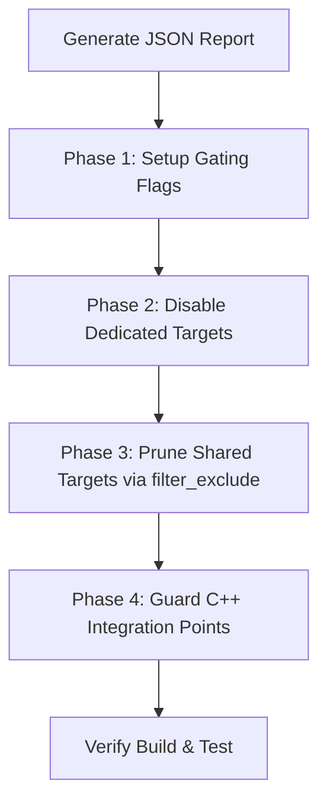

# Skill: Surgical Feature Removal in Cobalt/Chrobalt

This skill guides an AI coding agent through the step-by-step process of disabling or removing a feature in the Cobalt/Chrobalt codebase to optimize binary size. It utilizes the JSON automation report from `analyze_feature_disable_difficulty.py` to execute a structured, error-free eradication plan.

---

> [!IMPORTANT]
> **Core Philosophy: Surgical Minimality & Upstream Friendliness**
> The paramount principle of feature removal in Cobalt/Chrobalt is that **every change must be as minimal and upstream-friendly as possible to avoid future merge conflicts**.
> 1. **Never delete code or headers unnecessarily**: Only gate or prune feature-specific files. Keep core/shared files (e.g., standard Chromium C++ files, standard headers) fully intact and untouched.
> 2. **Never break transitive include assumptions**: Avoid removing standard C++ headers that are not strictly owned by the excluded feature. Upstream merges assume core files import their expected core headers.
> 3. **Utilize dynamic pruning over static edits**: Use `bindings.gni` dynamic exclude patterns and GN `filter_exclude` rather than editing static lists like `generated_in_modules.gni` to keep downstream maintenance completely conflict-free.

---

## 1. High-Level Workflow Overview

The feature removal process follows a four-phase methodology:



---

## 2. Detailed Execution Plan

### Phase 1: Setup Gating Flags (GN & C++ Preprocessor)

Before modifying the C++ build graph, establish the feature flags that will control compilation.

#### Rule A: Choose the appropriate Build Flag
* **Small Features (< 500 KB size savings)**: Use the existing global `is_cobalt` flag directly in `BUILD.gn` files to guard changes.
* **Large Features (> 500 KB size savings)**: Declare a dedicated custom build argument inside `third_party/blink/public/public_features.gni`:
  ```gni
  declare_args() {
    # If true, enables the <feature_name> module.
    enable_<feature_name> = !is_cobalt
  }
  ```

#### Rule B: Expose the Flag to C++ Preprocessor
Expose your custom argument as a C++ preprocessor macro by adding it to the `buildflag_header` declaration in `third_party/blink/public/common/BUILD.gn` (or the corresponding `public` BUILD file):
```gn
buildflag_header("buildflags") {
  flags = [
    ...
    "ENABLE_<FEATURE_NAME>=$enable_<feature_name>",
  ]
}
```
This will generate `buildflags.h` defining the macro `BUILDFLAG(ENABLE_<FEATURE_NAME>)`.

> [!IMPORTANT]
> **Strict Header Inclusion (Include What You Use - IWYU)**:
> 1. **Always explicitly include the buildflags header**: If you modify any C++ source (`.cc`) or header (`.h`) file to add a feature gating preprocessor macro (`#if BUILDFLAG(ENABLE_<FEATURE>)`), you **must** explicitly include the generated buildflags header at the top of the file:
>    ```cpp
>    #include "third_party/blink/public/common/buildflags.h"
>    ```
> 2. **Why transitive includes are prohibited**: While the buildflags header might be transitively (indirectly) included on some platforms (e.g., compiling successfully on Android), different target platforms (like Linux) or upstream header cleanup refactorings will frequently omit that indirect include, breaking compilation. Explicitly including the header ensures cross-platform robustness and 100% upgrade-resiliency.

---

### Phase 2: Disable Dedicated Targets (GN Graph Level)

Dedicated targets are completely specialized to the feature. They are identified in the JSON report with `"type": "DEDICATED"`.

To prevent massive line-by-line code conflicts with upstream Chromium branches, **never** delete a dedicated target directly from the existing `deps` or `public_deps` list of parent targets. Instead, use GN's list subtraction operator (`-=`).

1. Search for the target name (e.g. `//content/services/auction_worklet:auction_worklet`) in the `BUILD.gn` files.
2. Find which parent targets include it under their `deps` or `public_deps`.
3. Add a conditional subtraction block at the bottom of the parent target:
   ```gn
   if (!enable_<feature_name>) {
     deps -= [ "//content/services/auction_worklet" ]
   }
   ```

---

### Phase 3: Prune Shared Targets via `filter_exclude`

Shared targets compile both feature-specific files and core codebase files. They are identified in the JSON report with `"type": "SHARED"`.

To prevent massive line-by-line code conflicts with upstream Chromium branches, **never** delete files manually from the `sources` list of a shared target. Instead, use GN's **`filter_exclude`** function.

1. Identify the `"matched_files"` list in the shared target section of the JSON report.
2. Open the home `BUILD.gn` of that target.
3. Add a filter to prune those sources when the feature is disabled:
   ```gn
   if (!enable_<feature_name>) {
     # Omit feature-specific sources dynamically
     _filtered_sources = filter_exclude(sources, [ "feature_dir/*" ])
     sources = []
     sources = _filtered_sources
   }
   ```

    > [!WARNING]
    > **The Mojo Typemap Paradox (SHARED Targets)**:
    > Mojo C++ bindings use **typemaps** to map Mojom types to existing production C++ structs (e.g., mapping `blink.mojom.InterestGroup` to `blink::InterestGroup`). Completely excluding these production C++ structs from `common` SHARED libraries causes `mojom_platform` compilation to fail.
    > **Instruction**: Never strip production C++ data structs from SHARED targets if they are referenced in Mojo typemaps. Keep minimal, inert C++ struct definitions inside the common library while completely severing their active handlers, tests, and business logic.

---

### Phase 4: Guard C++ Integration Points (Surgical Preprocessor Edits)

The JSON report lists all direct C++ includes of feature headers under the `"cpp_integration_audit"` block of each target.

For each entry in the audit:
1. Open the C++ source file listed under `"file"`.
2. Locate the matching `#include` statement listed in `"referenced_headers"`.
3. Wrap the include using preprocessor macros, ensuring the buildflags header is explicitly included at the top of the file as per the **Strict Header Inclusion (IWYU)** rule in Phase 1:
   ```cpp
   #if BUILDFLAG(ENABLE_<FEATURE_NAME>)
   #include "content/browser/interest_group/interest_group_manager_impl.h"  // nogncheck
   #endif  // BUILDFLAG(ENABLE_<FEATURE_NAME>)
   ```
   > [!IMPORTANT]
   > Always append **`// nogncheck`** to gated includes that refer to headers compiled in gated targets. This prevents the GN build-system dependency-checker from raising untracked header errors. Refer to the **Strict Header Inclusion (IWYU)** rule in Phase 1 to ensure the buildflags header is always explicitly included.

4. Locate all usages of classes, methods, or variables defined in that header within the file.
5. Wrap those usages with the same preprocessor block:
   ```cpp
   #if BUILDFLAG(ENABLE_<FEATURE_NAME>)
     GetInterestGroupManager()->DoSomething();
   #else
     // Provide a fallback, dummy response, or do nothing.
   #endif  // BUILDFLAG(ENABLE_<FEATURE_NAME>)
   ```
   > [!IMPORTANT]
   > **Trailing Preprocessor Comments**: Always add a trailing comment to the closing macro statements for clarity, e.g., `#endif  // BUILDFLAG(ENABLE_<FEATURE_NAME>)`. Do not leave `#endif` uncommented.

6. **Check for V8 IDL Bindings**: If the C++ integration point resides inside `v8_script_value_serializer_for_modules.cc` or another serialization class, make sure to wrap both serialization registration and serialization method bodies.

#### Advanced C++ Gating Rules

*   **Gate DevTools Auto-Attachers & Observers**: Auto-attachers or observers (such as `FrameAutoAttacher`) often inherit from tracker classes in the excluded feature directories, causing compilation to crash because the base classes are missing. Always check if the feature defines a manager, observer, or tracker inside the DevTools directory. Gird the class inheritance (multiple inheritance blocks), declarations, and corresponding implementation callbacks inside preprocessor gates.
*   **Sever Mojo Exposed Binders**: Renderer processes expose Mojo services to the browser at startup. If the service implementation is excluded, the exposed binder list will cause unresolved symbol linker errors. Always check where the service is exposed to the browser (e.g., `browser_exposed_renderer_interfaces.cc` or `ExposeInterfacesToBrowser`). Wrap both the include statements and the binders registration blocks inside the preprocessor gates:
    ```cpp
    #if BUILDFLAG(ENABLE_<FEATURE>)
      binders->Add<...>(...);
    #endif
    ```
*   **Stub Mojo-Overridden Methods Instead of Removing**: If a Mojo interface (like `LocalFrameHost`) defines a method belonging to the feature, trying to remove its declaration from `RenderFrameHostImpl` will break the Mojo C++ interface override contracts. Keep the method declaration intact, but **guard the method body** so it does nothing or safely reports a bad message when the feature is disabled:
    ```cpp
    void RenderFrameHostImpl::SomeFeatureMethod(...) {
    #if BUILDFLAG(ENABLE_<FEATURE>)
      // Production implementation...
    #else
      mojo::ReportBadMessage("Feature is disabled.");
    #endif
    }
    ```

---

### Phase 5: Address Static Analysis Tool Limitations (Manual Auditing)

Because the static analysis tool relies strictly on production C++ symbol databases, the agent **must** execute the following manual audits to prevent compile-time or runtime crashes:

#### 1. Audit Web IDL & V8 generated bindings
If the feature exposes any APIs to JavaScript (defined in `.idl` files), you must filter them out from both the **input IDL graph** and the **expected bindings list** to satisfy the bindings generator's strict bi-directional validation contracts (Rule 1: every expected source must be generated, Rule 2: every generated source must be expected).

Follow these instructions:
1. Open `third_party/blink/renderer/bindings/idl_in_modules.gni`.
2. Locate `static_idl_files_in_modules` and apply the negative filter block to exclude the feature's IDL directory (stops files from being compiled into the Web IDL database, preventing their generation):
   ```gn
   if (!enable_<feature_name>) {
     _filtered_static_idl =
         filter_exclude(
             static_idl_files_in_modules,
             [ "//third_party/blink/renderer/modules/<feature_dir>/*" ])
     static_idl_files_in_modules = []
     static_idl_files_in_modules = _filtered_static_idl
   }
   ```
3. Open `third_party/blink/renderer/bindings/bindings.gni`. Define your V8 generated source exclusion patterns conditionally based on your feature build flag under `cobalt_bindings_exclude_patterns`. **Never** edit the static manifest `generated_in_modules.gni` directly as it is auto-generated and will cause merge conflicts or get overwritten:
   ```gn
   # In third_party/blink/renderer/bindings/bindings.gni
   cobalt_bindings_exclude_patterns = []
   ...
   if (!enable_<feature_name>) {
     cobalt_bindings_exclude_patterns += [
       "*_feature_pattern_1_*",
       "*_feature_pattern_2_*",
     ]
   }
   ```
   > [!IMPORTANT]
   > Make sure to list **all** wildcard variations matching any V8 binding files generated for the feature (e.g. checking for dictionaries, interfaces, unions, and enumerations) to prevent the `check_generated_file_list` validator from throwing unlisted source errors.
4. Verify that the parent targets in `third_party/blink/renderer/bindings/BUILD.gn` and `third_party/blink/renderer/bindings/modules/v8/BUILD.gn` apply the exclusions generically:
   ```gn
   if (cobalt_bindings_exclude_patterns != []) {
     _filtered_sources = filter_exclude(sources, cobalt_bindings_exclude_patterns)
     sources = []
     sources = _filtered_sources
   }
   ```

   > [!TIP]
   > **Web IDL Modularity & Cross-Module Dependencies (The Partial IDL Interface Pattern)**:
   > If a core, shared IDL file (like `shared_storage_worklet_global_scope.idl` in `modules/shared_storage/`) directly declares a method or attribute referencing a type defined in a gated feature directory (like `StorageInterestGroup` inside the gated `modules/ad_auction/` directory), excluding the feature IDLs will immediately crash the IDL parser due to an "undefined type" error.
   > **Instruction**: Never statically delete the method from the core IDL, as it breaks compilation when the feature flag is set to `true`. Instead, refactor the method out of the core IDL file and declare it as a **`partial interface`** inside a **new IDL file located inside the feature's gated directory** (e.g., `modules/ad_auction/shared_storage_worklet_global_scope_interest_groups.idl`):
   > ```webidl
   > [
   >   Global=SharedStorageWorklet,
   >   Exposed=SharedStorageWorklet
   > ]
   > partial interface SharedStorageWorkletGlobalScope {
   >   [
   >     RuntimeEnabled=InterestGroupsInSharedStorageWorklet,
   >     CallWith=ScriptState,
   >     RaisesException
   >   ] Promise<sequence<StorageInterestGroup>> interestGroups();
   > };
   > ```
   > This completely severs the cross-module compile-time dependency. When the feature flag is `false`, the feature directory (and thus the partial interface) is excluded, letting the core IDL compile cleanly. When the flag is `true`, both compile and merge perfectly.

#### 2. Audit Unit Test targets
Unit test and mocking files are compiled into separate test executables, which are invisible to the production build graph:
1. Locate files matching `*test.cc` or `*unittest.cc` inside the feature directory.
2. Open the parent directory's `BUILD.gn` containing the corresponding test target (typically `source_set("unit_tests")` or `source_set("modules_testing")`).
3. Subtract these source files and test support dependencies under the negative condition:
   ```gn
   if (!enable_<feature_name>) {
     _filtered_sources = filter_exclude(sources, [ "<feature_dir>/*" ])
     sources = []
     sources = _filtered_sources

     deps -= [
       "//third_party/blink/renderer/modules/<feature_dir>:test_support"
     ]
   }
   ```

#### 3. Audit Transitive GN Dependencies
Some parent targets might depend on the feature target to inherit compilation configurations, even if they do not directly `#include` its headers in C++:
1. Run `gn refs` manually on your command line to find all targets referencing the feature:
   ```bash
   gn refs out/android-arm_gold //third_party/blink/renderer/modules/<feature_dir>
   ```
2. Review the returned parent targets. **Only apply list subtraction (`deps -= [...]` or `public_deps -= [...]`) in parent targets that EXPLICITLY list the feature target in their own target definition blocks.**
3. If a parent target transitively inherits the dependency through another middleman target, do **not** add a subtraction block there. The dependency will be cleanly severed automatically once you disable it in the direct parent target.


## 3. Build & Verification Checklist

After applying the gating, run these verification steps to ensure correctness:

### Step 1: Generate the GN configuration
Run GN generation to verify that the build graph resolves cleanly without circular dependencies or untracked headers:
```bash
gn gen out/android-arm_gold
```

### Step 2: Perform a local compile
Compile the target binary using `autoninja`. **If compilation, linkage, or header checking raises errors or warnings, surgically troubleshoot them**:
* **Address Compiler Warnings**: Gating/removing C++ business logic often leaves helper functions, static functions, or constants unused, triggering strict `-Wunused-function` or `-Wunused-variable` compiler warnings. **Always resolve these warnings** by extending the preprocessor gating blocks (`#if BUILDFLAG(...)`) to enclose the unused static helpers or variables cleanly. Never leave compiler warnings unresolved, as production compiles treat warnings as errors.
* Repeat compiling until it succeeds completely and cleanly:
```bash
autoninja -C out/android-arm_gold cobalt_apk
```

### Step 3: Assert size savings
Compare the resulting binary size of the shared object with the baseline to verify that the proportional size savings match the expectations computed by the SuperSize tool.

---

## 4. Code Review Checklist (PR Audit Guidelines)

When reviewing a PR that disables or removes a feature in Cobalt/Chrobalt using surgical gating, the reviewer (human or AI) **must** verify the following points to ensure safety, merge-ability, and correctness:

### 1. Build Flag Selection
- [ ] Verify if the feature's expected size savings are $> 500\text{ KB}$.
  - If yes, verify a custom build argument (e.g., `enable_<feature_name>`) is declared inside [public_features.gni](../../../third_party/blink/public/public_features.gni).
  - If no ($< 500\text{ KB}$), verify the global `is_cobalt` build flag is used directly.

### 2. C++ Preprocessor Expose & IWYU
- [ ] Verify that any new custom build arguments are added to the `buildflag_header("buildflags")` target in [third_party/blink/public/common/BUILD.gn](../../../third_party/blink/public/common/BUILD.gn) (or equivalent).
- [ ] **Strict IWYU Check**: For every C++ file (`.cc`, `.h`) modified to include `#if BUILDFLAG(ENABLE_<FEATURE_NAME>)`, verify that the buildflags header is explicitly and directly included:
  ```cpp
  #include "third_party/blink/public/common/buildflags.h"
  ```
  *Never allow relying on transitive/indirect includes of this header.*

### 3. GN target pruning
- [ ] For **Dedicated Targets**: Verify that targets are subtracted using the `deps -=` operator inside conditional blocks. *Never delete/remove lines directly from the static dependencies list.*
- [ ] For **Shared Targets**: Verify that files are pruned using `filter_exclude` on the `sources` list rather than editing the list statically.
- [ ] For **Mojo Typemaps**: Ensure production C++ data structures mapped by Mojo are **not** stripped if referenced in Mojom typemaps.

### 4. C++ Integration Gating
- [ ] Verify that `#include` statements for feature headers in core C++ files are gated with `#if BUILDFLAG(ENABLE_<FEATURE_NAME>)`.
- [ ] Ensure gated includes of gated targets have **`// nogncheck`** appended.
- [ ] Verify that all class/method usages are cleanly gated.
- [ ] Verify that all closing `#endif` statements are documented with a trailing comment (e.g., `#endif  // BUILDFLAG(ENABLE_<FEATURE_NAME>)`).
- [ ] Verify that no `-Wunused-function` or `-Wunused-variable` warnings are introduced by the gating (i.e. ensure unused helper functions or variables are also gated).

### 5. Web IDL & bindings Modularity
- [ ] Verify that any core IDL files (e.g., `navigator.idl`) are **not** modified. If the feature adds attributes/methods to core classes, verify they are implemented as a `partial interface` inside the feature's gated directory.
- [ ] Verify that `idl_in_modules.gni` uses `filter_exclude` under the conditional flag to exclude IDL files from the build.
- [ ] Verify that `bindings.gni` uses `cobalt_bindings_exclude_patterns` to exclude the generated V8 files instead of editing the static `generated_in_modules.gni` file.

### 6. Mojo IPC Binders and Overrides
- [ ] Verify that Mojo binder registrations in [browser_interface_binders.cc](../../../content/browser/browser_interface_binders.cc) are gated.
- [ ] Verify that Mojo-overridden interface methods are stubbed (i.e., return dummy value or call `mojo::ReportBadMessage`) rather than removed, preserving the Mojo class contracts.

### 7. Unit Tests
- [ ] Verify that unit test files (`*test.cc`, `*unittest.cc`) and test support targets are filtered out from the test targets (such as `source_set("unit_tests")`) under the negative condition.
