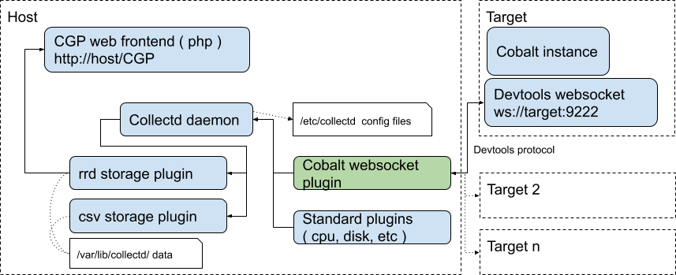

### Collectd monitoring setup for Cobalt

A python plugin that sends Cobalt CVals to [Collectd](https://collectd.org/)
metrics collection daemon. The values are retrieved via WebSocket connection
from Cobalt built-in Chrome DevTools protocol.



Graphs are available from any Collectd frontend, configuration for
[CGP](https://github.com/pommi/CGP) is included.

**Note**: Currently the plugin only monitors one target, multi-target
connection will be added soon.

### Installation

There is a small installation shell script `install.sh` included, that is
tested to work on Raspberry Pi Raspbian Jessie and desktop Ubuntu. To
install and configure, simply run `sudo ./install.sh` from the checkout
directory.

If you intend to run `collectd` and the CGP web frontend  on a Linux
target like Raspberry Pi, please first copy the plugin directory to a
convenient location on the target and run the install script from its shell.

Note that it is also possible to configure the plugin to connect from host to
remote target like Pi, however this is useful if the rest of the `collectd`
data streams are sent to a host in a [networked configuration](https://collectd.org/wiki/index.php/Networking_introduction)
and not detailed here.

**Note**: The script also enables RRD and CSV data outputs, RRD is required
for CGP to display the data and CSV is useful for post-processing.

After installation, CGP web dashboard will be available at
http://localhost/CGP

**Note**: Although `collectd` is a system daemon that always runs, the data
from the Cobalt plugin on the web dashboard will not appear before any data
is actually sampled. To do this quickly after the installation, start a
Cobalt instance and restart the `collectd` daemon ( see below ), otherwise
data sampling frequency gets automatically throttled by `collectd`.

### Troubleshooting

By default, `collectd` outputs log messages to `syslog`. If there is a
configuration problem, restarting `collectd` daemon and checking syslog usually
indicates the cause

```
    sudo service collectd restart
    tail -n 100 /var/log/syslog | egrep collectd
```

Verifying that Cobalt DevTools is listening can be done by shell command

```
   netstat -an | egrep "^tcp .*LISTEN"
```

If the configured port ( 9222 by default ) is listening, the connection
should work. To manually verify that the plugin can connect to WebSocket
and retrieve data, simply run `python cobalt.py` if connecting to localhost
or `python cobalt.py --host <IP> --port 9222` if connecting to a remote target.
