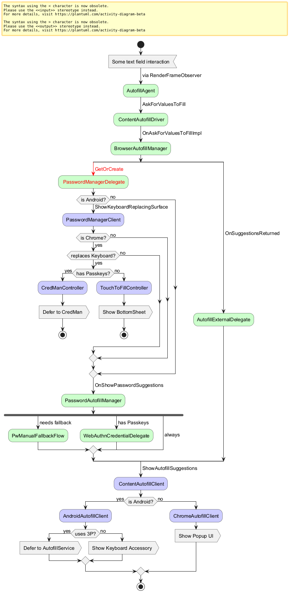

# Component Autofill Integrators

Interfaces in this folder are used for dependency injection from directories
that depend on `//components/autofill`.

## Class relationship of integrators to the BrowserAutofillManager

The following diagram describes how the `BrowserAutofillManager` uses different
delegates to compose suggestions from various sources into the autofill
dropdown.

Eventually, the `PasswordAutofillManager` shouldn't need to implement the
`AutofillSuggestionDelegate` because the BrowserAutofillManager will request and
dispatch suggestions through the delegate.

## Creation of a delegate for the BrowserAutofillManager

As shown in the diagram below, a new delegate is created when the underlying
feature is initialized. The integrator allows the `BrowserAutofillManager` to
request a delegate when it's required instead of needing to inject it early on.

## BrowserAutofillManager composes suggestions from delegates

As shown in the diagram below, the `BrowserAutofillManager` will request for
each delegate whether suggestions are available. Each delegate assembles
information from the available feature sources and forwards a collection of
suggestion to the `BrowserAutofillManager`. The latter orders suggestions and
sends them out for display.

For some specific surfaces (and in the transitioning period), the
`BrowserAutofillManager` delegates the suggestion handling to the specific
delegate entirely. E.g. on Android, the password delegate handles the showing
of a keyboard-replacing surface when the `BrowserAutofillManager` invokes it:

