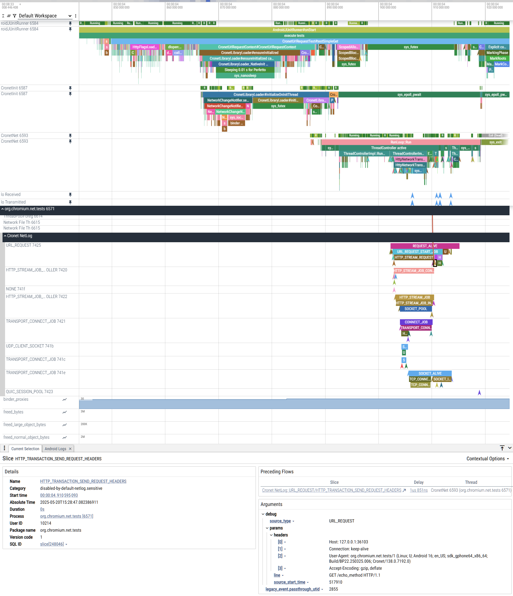

# Tracing Cronet

Cronet is deeply integrated with the [Perfetto](https://perfetto.dev/) tracing
framework. Using Perfetto, you can:

- Trace app-facing Cronet **API calls** and callbacks
- Get insights into **Chromium call stacks**, e.g. network thread operation
- Visualize [NetLogs](/net/docs/net-log.md), which provide deep insights into
  the operation of the **Chromium network stack** (e.g. DNS, TLS, IPv4/IPv6/Happy
  Eyeballs, TCP, QUIC, socket pools, sockets, packets, etc.) and make it
  possible to see the plaintext **contents of HTTP requests and responses**
- Correlate all of the above with other **events happening elsewhere** in the
  app (e.g. app business logic) and on the system/device (e.g. modem activity)

This makes Perfetto a very powerful swiss-army knife for all your Cronet
inspection, troubleshooting, debugging, and optimization needs.

Cronet tracing is usable out-of-the-box on every variant of Cronet across every
release channel, including production builds running in production apps on
production devices, as long as the Cronet version is recent enough. There is no
need to rebuild Cronet nor the app.

[TOC]

## Example trace

[Open this example trace in Perfetto](https://ui.perfetto.dev/#!/?s=4e7888dbaf280973305ff55cf514c833adccbef9)



## Getting started

There are two ways to gather a Cronet-focused trace:

 - Using the **Android System Tracing** feature built into the Android system UI;
   - The easiest method. Only usable on recent versions of Android.
 - Or using **Perfetto tools**.
   - Requires adb access. More flexible and produces more detailed traces.

### Using the Android System Tracing app (Traceur)

*** note
Using this method, events from Cronet native code and NetLog will only be
included in the trace if your Android version is recent enough for Traceur to
[use track events](https://r.android.com/2852485) in its Perfetto trace config.
This is true for Android 15+, and some versions of Android 14.
***

To capture a trace using this method, follow the [Android instructions on how
to capture a system trace](https://developer.android.com/topic/performance/tracing/on-device).

To ensure Cronet events are recorded, make sure that:

 - The *Trace debuggable applications* setting is on so that Cronet Android
   trace API (ATrace) events are captured.
 - The *webview* category is enabled so that Cronet track events (native code
   and NetLog) are captured.

### Using Perfetto tools

To record a trace using Perfetto, refer to the [Perfetto Android Quick Start
guide](https://perfetto.dev/docs/quickstart/android-tracing).

#### Recommended config

The following [Perfetto trace config](https://perfetto.dev/docs/concepts/config)
provides a good starting point for gathering a Cronet-focused trace:

```
# Trace for up to 1 minute. Adjust to taste.
duration_ms: 60000

data_sources {
  config {
      # Most Chromium code below the Cronet app-facing API uses the Perfetto
      # Track Event framework for tracing. This includes Chromium native call
      # stacks and NetLogs.
      name: "track_event"
      track_event_config {
        # Uncomment to record unredacted NetLogs, potentially revealing
        # credentials and other private information.
        # Note for this to work, you will also need to follow the instructions
        # in "Gathering unredacted NetLogs" below.
        #   enabled_categories: "disabled-by-default-netlog.sensitive"
      }
  }
  # Only collect track events from Cronet, as opposed to other Chromium products
  # (e.g. WebView) that may be running at the same time. Uncomment if you want
  # to collect events from those too.
  # You can also use this to restrict the events to a single app. For example:
  #   producer_name_filter: "cronet-com.google.android.googlequicksearchbox"
  producer_name_regex_filter: "cronet-.*"
}

data_sources {
  config {
    name: "linux.ftrace"
    ftrace_config {
      # Cronet Java code, including the app-facing higher layers (close to the
      # Cronet API), uses the Android Trace APIs (ATrace) for tracing.
      # You may wish to restrict this to the app you are interested in.
      atrace_apps: "*"

      # Required to get correct thread names.
      ftrace_events: "task/task_newtask"
      ftrace_events: "task/task_rename"

      # Trace ActivityManager. Useful to get insights into app initialization.
      atrace_categories: "am"

      # Trace the standard C library. Particularly useful to get insights into
      # Cronet native shared library (.so) loading (dlopen) performance. Also
      # provides insights into pthreads.
      atrace_categories: "bionic"

      # Trace the Java VM. Notably provides insights into Java class loading,
      # Java threads. Note this may also spam you with Java GC events.
      atrace_categories: "dalvik"

      # Surfaces IPCs.
      atrace_categories: "aidl"
      atrace_categories: "binder_driver"

      # Trace the Android OS network stack. Provides insights into a variety of
      # networking components such as WiFi, cellular, app network access policy,
      # firewall rules, etc. Can go as deep as providing detailed events about
      # cellular modem operation (RIL), such as data setup and signal strength.
      atrace_categories: "network"

      # ------------------------------------------------------------------------
      # Note the below settings add a lot of high-frequency events to the trace.
      # You may want to comment them out if you want smaller, possibly more
      # readable traces and are not interested in highly detailed system
      # performance information.

      # Surfaces which threads are running on which CPU at any given time.
      # Useful for troubleshooting CPU contention.
      ftrace_events: "sched/sched_switch"

      # Surfaces the reason why a thread became schedulable (e.g. a mutex being
      # unlocked). Useful for troubleshooting lock contention.
      ftrace_events: "sched/sched_wakeup"
      ftrace_events: "sched/sched_wakeup_new"
      ftrace_events: "sched/sched_waking"

      # Surfaces thread terminations.
      ftrace_events: "sched/sched_process_exit"
      ftrace_events: "sched/sched_process_free"

      # Surfaces system calls. Useful for surfacing mutex waits and individual
      # socket send/receive calls.
      ftrace_events: "raw_syscalls/sys_enter"
      ftrace_events: "raw_syscalls/sys_exit"

      # ------------------------------------------------------------------------
    }
  }
}

data_sources {
  config {
    name: "android.statsd"
    statsd_tracing_config {
      # Log Cronet telemetry atoms; see
      # org.chromium.net.telemetry.CronetStatsLog.
      # These can be used to troubleshoot Cronet telemetry, and the atom data
      # itself can provide insights into Cronet operation.
      # These will show up under "System" > "Statsd Atoms" in the Perfetto UI.
      push_atom_id: ATOM_CRONET_ENGINE_CREATED
      push_atom_id: ATOM_CRONET_TRAFFIC_REPORTED
      push_atom_id: ATOM_CRONET_ENGINE_BUILDER_INITIALIZED
      push_atom_id: ATOM_CRONET_INITIALIZED
    }
  }
}

data_sources {
  config {
    # Surfaces individual network packets being sent or received at the OS
    # level. Provides insights below the Cronet socket layer. This will show
    # up under "System" > "Network" in the Perfetto UI, and as counters under
    # process tracks.
    name: "android.network_packets"
    network_packet_trace_config {
      poll_ms: 250
    }
  }
}

data_sources {
  config {
    name: "linux.process_stats"
    process_stats_config {
        scan_all_processes_on_start: true
        record_thread_names: true
    }
  }
}

data_sources {
  config {
    # Include the logcat in the trace.
    # Note that, sadly, this only works on userdebug/eng Android system
    # images, not production devices. See https://crbug.com/126721497.
    name: "android.log"
  }
}

data_sources {
  config {
    # Gather the list of packages installed on the device, along with their
    # versions. This can be found in the "Info and stats" section in the
    # Perfetto UI.
    name: "android.packages_list"
  }
}

buffers {
    size_kb: 65536
}
```

## Gathering unredacted NetLogs

[NetLogs](/net/docs/net-log.md) are included in the trace by default. However,
for privacy and security reasons, Cronet NetLog tracing operates in "heavily
redacted" mode, where most of the metadata is stripped out. Notably, this means
the resulting trace will not contain IP addresses, hostnames, URLs, HTTP
headers, request/response bodies, TLS certificate details, etc.

If this is a problem, it is possible to configure Cronet to trace unredacted,
unstripped NetLogs that will include the above information.

*** aside
If you feel that a particular field is safe enough to be included in redacted
NetLogs, but isn't, feel free to propose it for inclusion in the
[allowlist](/net/log/net_log_heavily_redacted_allowlist.h).
***

### Requirements

Cronet can only be configured to trace unredacted NetLogs if the following
conditions are met:

- The Android device is running a [userdebug or eng system
  image](https://source.android.com/docs/setup/build/building#choose-a-target),
  **OR** the app running Cronet is [marked as
  debuggable](https://developer.android.com/guide/topics/manifest/application-element#debug).
  - It is not possible to collect an unredacted NetLog from a production app
    running on a production device.
- You have adb access to the device.

### Enabling unredacted Cronet NetLog tracing

*** note
**WARNING: DO NOT DO THIS ON A DEVICE THAT HANDLES REAL USER DATA.** In this
mode the trace will include the equivalent of plaintext HTTP requests and
responses. Unredacted NetLogs collected from an app handling real user data will
likely contain extremely sensitive data, such as personal information, private
keys, and plaintext passwords.
***

To enable unredacted NetLog tracing, run:

```
adb shell setprop debug.cronet.trace_netlog everything
```

Then restart the app. This setting will persist until the next device reboot.

You will also need to explicitly enable the
`disabled-by-default-netlog.sensitive` track event category in your trace config
(see above), otherwise no NetLog events will be logged while the above setting
is active.

## Early events getting dropped

Due to a [Perfetto limitation](https://crbug.com/324031921), events logged using
the Perfetto SDK very shortly (single-digit milliseconds) after Cronet library
initialization are liable to get dropped.

If you suspect this is preventing you from seeing the events you are looking
for, use the following setting to delay Cronet initialization. This will
hopefully allow Perfetto enough time to initialize.

```
adb shell setprop debug.cronet.init_trace_sleep 10ms
```
