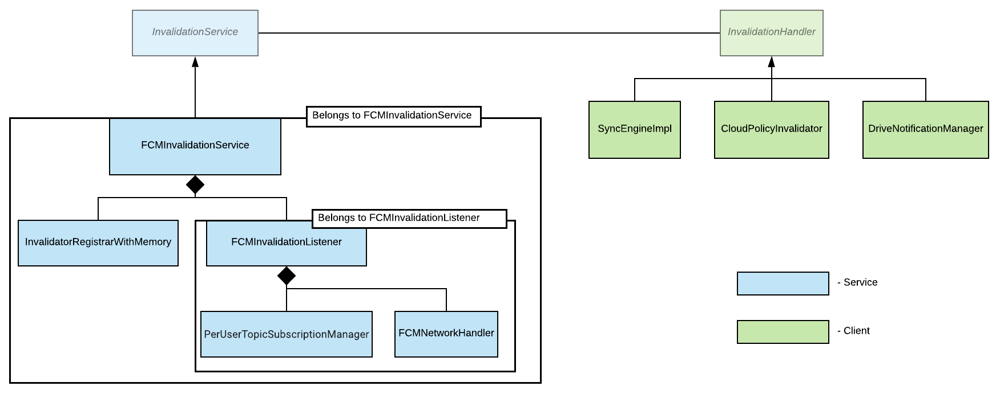

# Invalidations Component

## Introduction
Let's start with an example.  On Chrome OS there exists a concept called
"policy" - one can think of them as dynamic flags that change Chrome's
behaviour.  They are changed on the Admin Panel from where they get propagated
to Chrome OS devices.  There is a scheduled "poll job" that fetches those
policies every N hours, but preferably we would like to have the latest policy
in matter of minutes/seconds.  We could shorten the polling interval to 1
minute, but that would put a very high unnecessary load on the servers.  To
solve this problem we introduce a concept called "invalidation" where the server
notifies the devices when their policy changes and then they fetch the new
policy - note that this way the devices only fetch the policy when needed.

Invalidation Service - the word comes from cache invalidation. Imagine you have
a database which has some objects in it. Cache is just a quick access copy of
those objects. When an object changes in the database so should the copy of that
object in cache.

If we consider the client device as a cache then whenever some object changes in
the server, so should the copy of this object in the client device. All the
invalidation related interaction between client device and server is done
through Invalidation Service.

An **Invalidation** (a message to invalidate some object) is sent and received
using a publish/subscribe service. In practice, this is Firebase Cloud Messaging
(FCM, see
[firebase.google.com/docs/cloud-messaging](https://firebase.google.com/docs/cloud-messaging)
or [go/fcm](http://go/fcm)) and Fandango (see
[go/fandango](http://go/fandango)).

In general the whole thing looks as follows:

***

## Terminology

* **InstanceID**: An identifier for "a specific app installed on a specific
  device". The term comes from GMSCore on Android. Here, an "app" is a client of
  invalidations, such as Sync, Drive, or Policy. It's just a mostly random
  string of 8 bytes, created by Chrome.
* **Registration**: As in "registering with FCM"; means making an InstanceID
  known to the FCM server. The result of registering is an **InstanceID token**
  (note that this is different from an InstanceID).
* **Topic**: A "namespace" or "channel" of messages that clients can subscribe
  to. For Sync, they correspond to data types. A topic can be either private
  (i.e. GAIA-keyed) or public. For private topics, a unique ID derived from the
  user's GAIA ID is appended to the topic name to make it unique (though this
  is an implementation detail which is hidden from clients).
* **Subscription**: As in "subscribing to a topic", i.e. telling the server that
  this client (identified by InstanceID token) is interested in a given topic.
* **ProjectID** (aka **SenderID**): An ID from the Google Cloud Platform console
  that identifies a client of invalidations (such as Sync, Drive, or Policy).
  E.g. for Sync its value is kInvalidationGCMSenderId. Note that (as opposed to
  InstanceID) this is constant across all users and Chrome instances.

***

## Classes

### InvalidationHandler

An **InvalidationHandler** is a client (receiver) of Invalidations. Every
feature that wants to receive Invalidations needs to implement an
InvalidationHandler and register it with InvalidationService (see below).
InvalidationHandler has the following methods (the list is not exhaustive):

* **OnIncomingInvalidation** is called from InvalidationService to notify
about incoming Invalidation messages.
* **GetOwnerName** must return a unique name for this InvalidationHandler.

***

### InvalidationService

**InvalidationService** is the main entry point for clients of the Invalidations
system. This is where an InvalidationHandler registers/unregisters itself, and
where it registers the Topics it is interested in. When a message arrives,
InvalidationService calls OnIncomingInvalidation for the receiving
InvalidationHandler.

InvalidationService provides the following methods (the list is not exhaustive):

* **RegisterInvalidationHandler** allows an InvalidationHandler to register
itself as a observer for Invalidations. InvalidationService will only
dispatch messages to registered handlers.
* **UpdateInterestedTopics** allows InvalidationHandler to change the set of
Topics it is interested in.
* **UnregisterInvalidationHandler** lets an InvalidationHandler unregister
itself again, after which it stops receiving Invalidations.

An InvalidationService instance is usually tied to a profile (via
**ProfileInvalidationProviderFactory**), but on ChromeOS there is also a
device-scoped instance, managed by **AffiliatedInvalidationServiceProvider**
(used for device policies, which must apply even before any user is signed in).

***

### FCMInvalidationService

**FCMInvalidationService** is the only real (non-test) implementation of
InvalidationService, using [FCM](http://go/fcm)+[Fandango](http://go/fandango)
as its publish/subscribe service. It delegates most of the work to
InvalidatorRegistrarWithMemory and FCMInvalidationListener.

***

### InvalidatorRegistrarWithMemory

**InvalidatorRegistrarWithMemory** maintains the mapping between Topics and
InvalidationHandlers. When a message arrives via FCMInvalidationListener,
InvalidatorRegistrarWithMemory dispatches that message (invalidation) to the
appropriate InvalidationHandler.

InvalidatorRegistrarWithMemory also persists the set of Topics per handler, to
avoid redundant re-subscriptions after every Chrome restart.

***

### FCMInvalidationListener

**FCMInvalidationListener** gets the list of interesting Topics from
FCMInvalidationService. It passes the Topics to PerUserTopicSubscriptionManager
(see below) for subscription/unsubscription, receives Invalidation messages from
FCMNetworkHandler, and passes Invalidations for the interesting Topics back to
FCMInvalidationService.

***

### PerUserTopicSubscriptionManager

**PerUserTopicSubscriptionManager** manages subscriptions to Topics, sending
subscription or unsubscriptions requests to the server as necessary. It persists
the set of subscribed Topics in prefs to avoid redundant re-subscriptions after
Chrome restarts.

***

### FCMNetworkHandler

**FCMNetworkHandler** is responsible for communication via GCM channel. It
provides the following functionality:

* Retrieves the InstanceID token required for the subscription. When this token
  is received, it is passed to PerUserTopicSubscriptionManager which subscribes
  to Topics with the given token.
* Receives messages from GCM driver and passes them up to
  FCMInvalidationListener, where they are converted to Invalidations.
