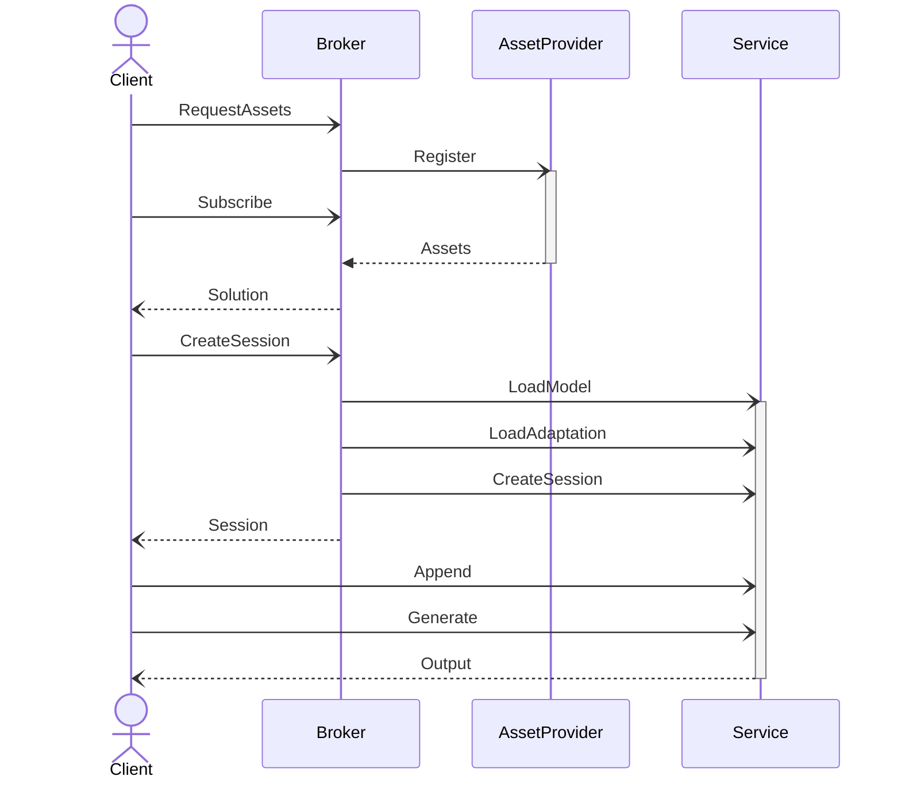
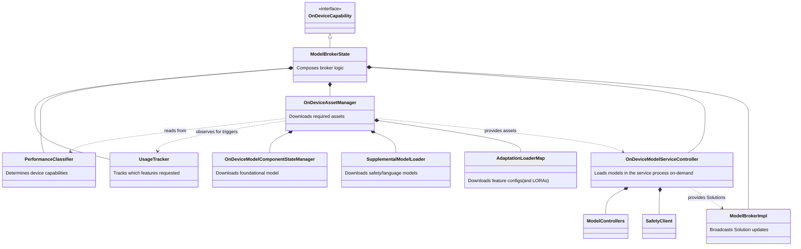
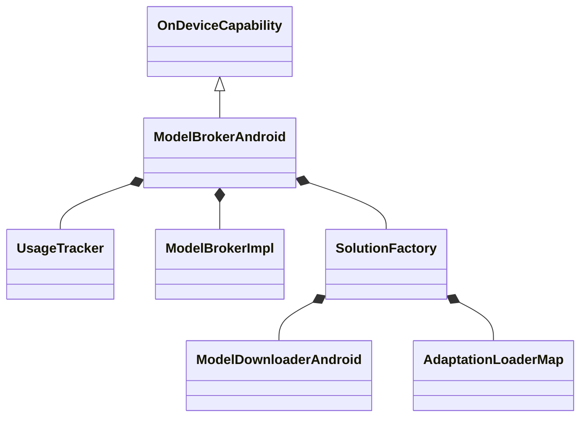
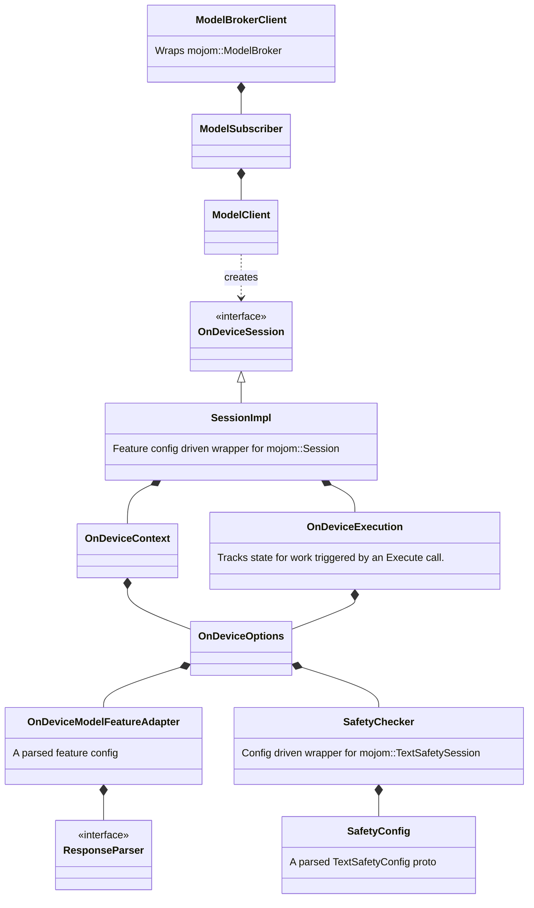

# On-Device Model Execution overview

This directory defines the OnDeviceCapability API, it's implementations,
and utility objects and methods for working with it.  This API allows the
use of shared on-device models, and the code here manages download of assets
and instantiation of shared model resources.

There are 4 major participants in the logic here:

1. The Client that wants to use the model. This directory also provides
wrapper objects that act on behalf of the Client. This code may run in
any process.

2. The Broker, which the client initiates usage with. This code runs in the
browser process, and there are different implementations on different platforms.

3. The AssetProviders, which the broker uses to download models and configs.
Different implementations use different providers.

4. The Service, which the broker direct to load models into memory.

# Desktop Broker

The desktop implementation use the on_device_model service utility process (see
//services/on_device_model) as it's Service and gets Assets from both
component updater and an optimization_guide::ModelProvider.  The main
implementation class is `ModelBrokerState`, which composes several parts.
This is instantiated as part of a GlobalFeature in the browser process.

Note: the diagram below shows how the classes *should* be organized, but they
don't quite match this yet. Notably OnDeviceAssetManager is different.

# Android Broker

The android implementation uses AICore as the Service, and as the AssetProvider.
It downloads additional assets from optimization_guide::ModelProvider.
The main class is ModelBrokerAndroid, which is analogous to ModelBrokerState.
Chrome will download and own feature configs that match the models found in AICore.

Android:

# Client

Several objects are provided for working with optimization_guide::mojom::ModelBroker
and on_device_model::mojom::Sessions mojo objects.  These objects act in the
"Client" space and generally provide state management and config-driven behaviors.

Client:

