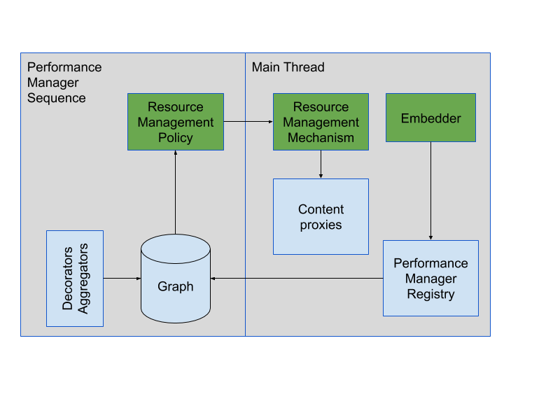

# Performance Manager Overview

[TOC]

# Overview

The Performance Manager supports data-driven, centralized resource management,
prioritization and planning for the Chrome browser. Over time, data-driven,
centralized resource management will supplant and/or supplement the heuristics
that can be found all over Chrome at present.

Here’s an overview picture of the intended architecture:

- The *Embedder* is responsible for notifying the 
  [Performance Manager Registry](embedder/performance_manager_registry.h) when
  content entities are created or their relationships change. The Performance Manager
  Registry maintains the structure of the Graph, which is a coarsely abstracted view of the state
  of the browser.
- Decorators populate the graph nodes with interesting properties and data, such as e.g. the results
  of CPU, memory and battery measurements and so on.
- Aggregators aggregate data in the graph, possibly across nodes. 
  As an example, the memory usage of all frame nodes could be summed up to their associated page
  node, to establish the total memory usage of the page.
- Resource Management Policies are observers of the graph, and use the graph structure as well as
  the properties of graph nodes to make policy decisions. 
- Resource Management Mechanisms are invoked by Resource Management Policy to implement policy
  decisions. 
  Note that while the mechanisms are depicted in the main thread, they can be hosted anywhere
  necessary or convenient, such as in a renderer process at the far end of a mojo::Remote<>.
- Content Proxies are a convenience feature to allow easy and safe access from nodes in the graph
  to the corresponding content entity for any task that needs to run on the main thread.

The graph lives on the Performance Manager Sequence, as do all graph observers and mutators.
The graph structure can be viewed in the graph tab of the `chrome://discards WebUI.`

In addition to the above, the Performance Manager also provides support for
users that need to occasionally query the graph to e.g. collect metrics.

# Details

## Graph

The performance manager exposes a simplified, coarse model of the browser’s
state as a [Graph](public/graph/graph.h) of [Nodes](public/graph/node.h),
where the nodes represent such things as:
1. [Page](public/graph/page_node.h): corresponds to a content::WebContents.
1. [Frame](public/graph/frame_node.h): corresponds to a frame in a 
   content::WebContents frame tree.
1. [Process](public/graph/process_node.h): corresponds to a content::RenderProcessHost or
   other type of process, such as e.g. the Browser or GPU process.
1. [Worker](public/graph/worker_node.h): corresponds to a web worker.

Nodes in the graph are connected with edges, such that e.g. each frame or worker
connects to its hosting process.
Frames are connected in a tree, and all frames in a tree connect to their 
corresponding page.
Other edge types may denote dependencies between nodes, such as e.g. a
MessagePort connection or the like. Different node types in the graph are
adorned with different sets of properties, each of which represents necessary
information about the particular node type.
The graph provides node lookup and retrieval, as well as an observer interface
for notification of addition and removal of nodes, as well as node property
changes.
The graph also provides a way for users to adorn nodes with private data by means of
[Node Attached Data](public/graph/node_attached_data.h).
It’s preferable to store data that’s used for intermediate results or for
private purposes in Node Attached Data rather than in Node properties.

## Public & Private APIs.

The graph exposes both a public and a private API. The private API is only
available to code in the component’s directory, whereas the public API can be
used by anyone in the browser process. The private API provides read-write
access to nodes and allows for node-intimate storage of node attached
properties. The public API provides read-only access to nodes, but otherwise the
two APIs are fairly similar. Where possible, using the public API is preferable,
as the public API is more stable, and doesn’t require the user to live in the
component.

Good examples where the public API is appropriate, is e.g. for periodically
collecting metrics by iteration over the graph, or where iterating over the
graph can yield a set of content entities for some operation. As an example,
finding the set of frames in a page that belong to the same browsing instance
would be easy to do by iterating over the graph.

## Decorators

Decorators set properties on the graph that are derived from data external to
the graph itself, such as e.g. performance measurement data.

A simple example Decorator might periodically measure the cumulative CPU usage
for each process Node in the Graph and adorn each node with the measured
cumulative CPU usage of the corresponding process.

Decorators can make data available to consumers by updating core properties of
a node or by exposing their own custom API. A common interface is to provide an
associated Data class, with a static accessor to retrieve a Data object from a
given Node. See
[PageLiveStateDecorator::Data](public/decorators/page_live_state_decorator.h)
for an example.

## Observers

Each node type provides an observer interface that callers can implement to
receive notifications when core node properties change. Data that is exposed
through a decorator or Node Attached Data may or may not provide change
notifications depending on the details of the decorator's API.

## Aggregators

Aggregators, like Decorators, set properties on the graph nodes. The difference is that
Aggregators work solely on data in the graph, to e.g. aggregate or distribute data from
one node to another.

A simple example Aggregator working with the simple example Decorator above might
compute the difference in cumulative CPU usage from the most recent measurement,
then distribute the difference across the Frame (and/or Worker) nodes associated
with each Process.
This would in turn allow summing up the cumulative CPU usage of each Frame and
Worker node to their associated Page node. This would yield the CPU usage of 
the entire Page (content::WebContents).

## Policies & Mechanisms

The intent is for all Resource Management Policies to use the graph and the data
therein to make policy decisions. The decisions are then implemented by invoking
some kind of Resource Management Mechanism. Making this a clean distinction
makes the implementation easier, more readable and more testable.

A simple example of a policy and a mechanism might be a policy for flushing some
kind of a cache after all frames in a process have been backgrounded or idle for
a set amount of time. This policy would register for the appropriate
notifications and likely maintain private state on a process node. When the
criteria for flushing is met, the policy invokes the mechanism by rendezvousing
to a process-associated mojo interface and invoking on it.

If the mojo interface is accessible through a content entity (e.g.
`content::WebContents` or `content::RenderFrameHost`), the mechanism invocation
is posted to the main thread where the relevant content proxy (e.g.
`WeakPtr<WebContents>` or `performance_manager::RenderFrameHostProxy`) makes it
easy and safe to retrieve the content entity on the main thread. Should the
corresponding content entity have been deleted after the task was posted, the
content proxy will simply return nullptr.
