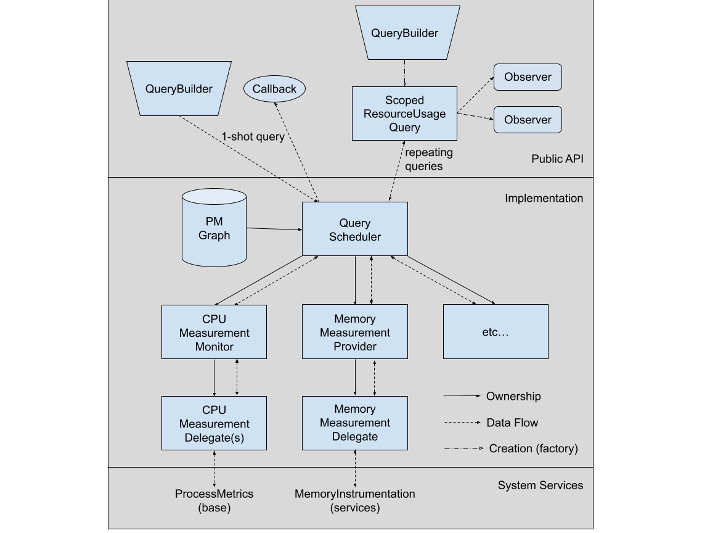

# Resource Attribution Overview

[TOC]

# Overview

The Resource Attribution component, part of Performance Manager, centralizes
data about the resources the browser uses and provides a unified interface to query
them. It will manage scheduling of resource measurements so that multiple
callers requesting information about the same resources don’t schedule redundant
measurements.

# API

The public interface is documented at bit.ly/resource-attribution-api.

* Public headers are in
  components/performance_manager/public/resource_attribution/.
* Public symbols are in the `resource_attribution` namespace.
* Private symbols that must be referenced from
  components/performance_manager/public/ (eg. in templates) are in the
  `resource_attribution::internal` namespace.

# Implementation

Here’s an overview picture of the architecture:

The important classes, from the bottom up, are:

* **Measurement Delegates** (`MemoryMeasurementDelegate`, `CPUMeasurementDelegate`, etc):

  Interface directly with OS or common Chrome functions to perform measurements.
  Can be replaced by test stubs to simulate measurements. *Measurement
  Providers* create delegates through factory classes as needed.

* **Measurement Providers** (`MemoryMeasurementProvider`,
  `CPUMeasurementMonitor`, etc):

  Own and control the *Measurement Delegates*. Convert measurements they return
  to a common format, aggregate and store them.

* **QueryScheduler**:

  Central rendezvous point for queries from the public API. Owns and controls
  the *Measurement Providers* and schedules measurements from them based on incoming
  queries. Filters and combines results from the providers into responses
  containing the data each query expects.

* **Public API classes** (`ResourceContext`, `QueryBuilder`, `QueryResult`,
  etc):

  Described at bit.ly/resource-attribution-api.