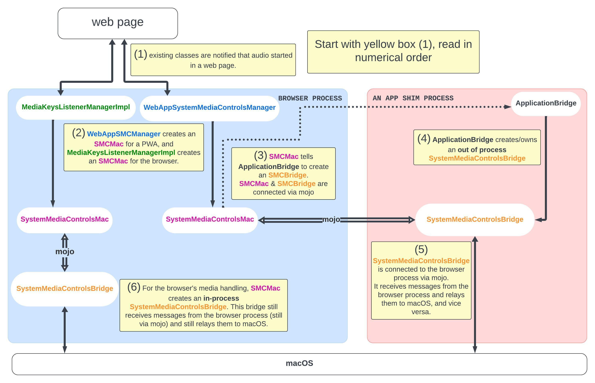

# Overview
This component is used to interface with Mac OS's MPNowPlayingInfoCenter and
related MediaPlayer API:
https://developer.apple.com/documentation/mediaplayer/mpnowplayinginfocenter

This includes an interface for MPRemoteCommandCenter, which can be used to
receive media-related user input (e.g. media keys and actions that are
available through the MPNowPlayingInfoCenter such as repeat and rating).
https://developer.apple.com/documentation/mediaplayer/mpremotecommandcenter

Note that these APIs are only available on Mac OS 10.12.2 or later.

This README.md primarily aims to overview the mac specific components of
System Media Controls.

For overview documentation see
`//content/browser/media/system_media_controls/README.md`

# Bridged system media controls

Starting in M130, desktop PWAs (dPWAs) have their own instanced System Media
Controls. In this folder, the mac specific implementation is implemented to
support PWA app shims communicating with MPNowPlayingInfoCenter and related
MediaPlayer APIs via SystemMediaControlsBridge.

dPWAs on macOS are hosted using an app shim process, an external process to
Chrome that communicates via mojo. This process helps with the dPWA's identity
on macOS - as to appear as a standalone application to macOS.

We leverage this app shim process to speak with macOS' media APIs so that dPWAs
show up as a separate app to Chromium playing media.

# Diagram

`system_media_controls_bridge.h` describes a class that can be instantiated
sometimes 'in-process' (with respect to the browser process) or 'out-of-process'
(within each dPWA app shim process). This allows us to write the code that
speaks to macOS once, but use it from within the browser process for the browser
singleton System Media Controls and reuse it any number of times from each app
shim process to represent an independent app playing audio.

To achieve this 'bridge' concept, `remote_cocoa/system_media_controls.mojom`
describes a communication interface that allows `SystemMediaControlsMac` to
speak with the `SystemMediaControlsBridge` without knowing whether its core
functionality (implemented by `...Bridge`) resides in or out of process.

In the scenario that an out of process bridge is required for dPWAs, we leverage
the existing ApplicationBridge interface with app shims to facilitate its
creation. See `//components/remote_cocoa/app_shim/application_bridge.h`.

# Other classes

`now_playing_info_center_delegate[_cocoa]` is used to pass information to macOS.

`remote_command_center_deleate[_cocoa]` is used to receive messages from macOS
such as a request to pause or play.

# Design docs

Design docs are available in the overview documentation here:
`//content/browser/media/system_media_controls/README.md`