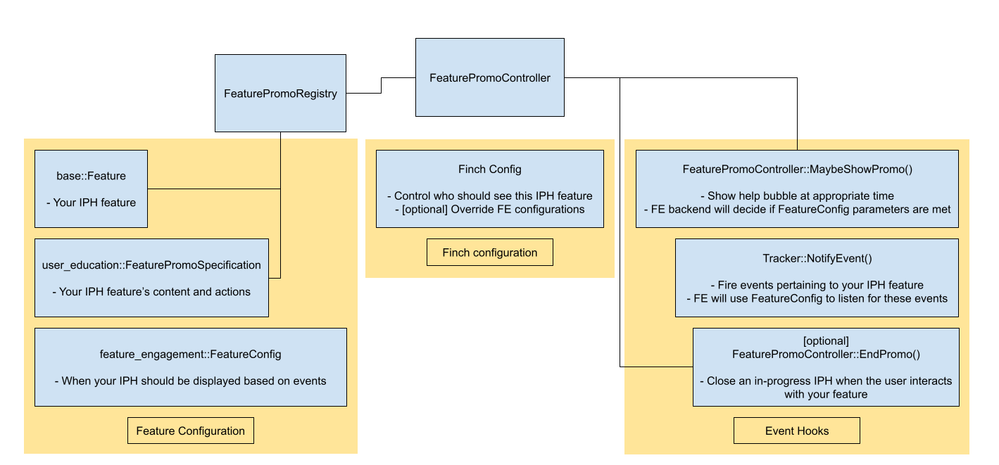

# User Education component library architecture

This library contains the code that will allow you to implement
**In-Product-Help (IPH)** and **Tutorials** in any framework, as well as display
the **"New" Badge** on menus and labels.

[TOC]

## Upstream dependencies

Familiarity with these libraries are strongly recommended; feel free to reach
out to their respective OWNERS if you have any questions.

  * [UI Interaction](/ui/base/interaction/README.md)
    * [ElementTracker](/ui/base/interaction/element_tracker.h) - supplies anchor
      points for help bubbles
    * [InteractionSequence](/ui/base/interaction/interaction_sequence.h) -
      describes the situations in which a Tutorial advances to the next step
  * [Feature Engagement](/components/feature_engagement/README.md) - used to
    evaluate triggering conditions for IPH and New Badge.

## Directory structure

 * [common](./common) - contains platform- and framework-agnostic APIs for
   working with `HelpBubble`s, **IPH**, and **Tutorials**.
 * [test](./test) - contains common code for testing user education primitives
 * [views](./views) - contains code required to display a `HelpBubble` in a
   Views-based UI, as well as **"New" Badge** primitives.
 * [webui](./webui/README.md) - contains code required to display a `HelpBubble`
   on a WebUI surface.

## Application integration

The necessary IPH services have already been implemented in Chrome. If
you are interested in extending User Education to another platform, see
the
[section](/components/user_education/platforms.md#Adding-User-Education-to-your-application)
on the platforms page.

*Note: The rest of this document introduces User Education concepts and
focuses on using existing services to create in-product help
experiences.*

# Programming API

## Help bubbles

The core presentation element for both IPH and Tutorials is the
[HelpBubble](./common/help_bubble.h). A `HelpBubble` is a blue bubble that
appears anchored to an element in your application's UI and which contains
information about that element. For example, a `HelpBubble` might appear
underneath the profile button the first time the user starts Chrome after
adding a second profile, showing the user how they can switch between profiles.

Different UI frameworks have different `HelpBubble` implementations; for
example, [HelpBubbleViews](./views/help_bubble_factory_views.h). Each type of
`HelpBubble` is created by a different
[HelpBubbleFactory](./common/help_bubble_factory.h), which is registered at
startup in the global
[HelpBubbleFactoryRegistry](./common/help_bubble_factory_registry.h). So for
example, Chrome registers separate factories for Views, WebUI, and a
Mac-specific factory that can attach a Views-based `HelpBubble` to a Mac
native menu.

When it comes time to actually show the bubble, the
`HelpBubbleFactoryRegistry` will need two things:
  * The `TrackedElement` the bubble will be anchored to
  * The [HelpBubbleParams](./common/help_bubble_params.h) describing the bubble

The `HelpBubbleFactoryRegistry` will search its registered factories for
one able to produce a help bubble in the framework that sees this
element. It can then create our help bubble with the given
`HelpBubbleParams`.

You will notice that this is an extremely bare-bones system. ***You are not
expected to call `HelpBubbleFactoryRegistry` directly!*** Rather, the IPH and
Tutorial systems use this API to show help bubbles.

<!-- Added because of inconsistencies in how different markdown engines handle
     hyphens in header names when generating anchors; some use '-' and some
     replace the hyphen with '_'. -->
<a name="iph-how-to"></a>
## In-Product Help (IPH)

In-Product Help is the simpler of the two ways to display help bubbles, and can
even be the entry point for a Tutorial.

IPH are:
 * **Spontaneous** - they are shown to the user when a set of conditions are
   met; the user does not choose to see them.
 * **Rate-limited** - the user will only ever see a specific IPH a certain
   number of times, and will only see a certain total number of different IPH
   per session.
 * **Simple** - only a small number of templates approved by UX are available,
   for different kinds of User Education journeys.

In the code, an IPH is described by a `FeaturePromo`. Your application
will provide
a [FeaturePromoController](./common/feature_promo_controller.h) with
a [FeaturePromoRegistry](./common/feature_promo_registry.h). In order to
add a new IPH, you will need to:

 1. Add the `base::Feature` corresponding to the IPH.
 2. Register the appropriate
    [FeaturePromoSpecification](./common/feature_promo_specification.h)
    describing your IPH journey ([Registering your
    IPH](#Registering-your-IPH)).
 3. If your IPH appears in a WebUI page,
    [instrument that page for help bubbles](./webui/README.md).
 4. [Configure the Feature Engagement backend](#configuring-the-feature-engagement-backend)
    for your IPH journey.
 5. [Add hooks into your code](#adding-hooks-for-your-iph) to show/hide your
    IPH and dispatch events.
 6. Enable the feature via a trade study or Finch.



In reality, you will likely never interact directly with the
`FeaturePromoController`. In Chrome, these methods are wrapped by the
`BrowserWindow`. You may access them by calling:

- `BrowserWindow::MaybeShowFeaturePromo()`
- `BrowserWindow::MaybeShowStartupFeaturePromo()`
- `BrowserWindow::CloseFeaturePromo()`
- `BrowserWindow::CloseFeaturePromoAndContinue()`

### Registering your IPH

You will want to create a `FeaturePromoSpecification` and register it with
`FeaturePromoRegistry::RegisterFeature()`. There should be a common function
your application uses to register IPH journeys during startup; in Chrome it's
[`MaybeRegisterChromeFeaturePromos()`](../../chrome/browser/ui/views/frame/browser_view.cc).

There are several factory methods on FeaturePromoSpecification for different
types of IPH:

  * **CreateForToastPromo** - creates a small, short-lived promo with no buttons
    that disappears after a short time.
    * These are designed to point out a specific UI element; you will not expect
      the user to interact with the bubble.
    * Because of this a screen reader message and accelerator to access the
      relevant feature are required; this will be used to make sure that screen
      reader users can find the thing the bubble is talking about.
  * **CreateForSnoozePromo** - creates a promo with "got it" and "remind me
    later" buttons and if the user picks the latter, snoozes the promo so it can
    be displayed again later.
  * **CreateForTutorialPromo** - similar to `CreateForSnoozePromo()` except that
    the "got it" button is replaced by a "learn more" button that launches a
    Tutorial.
  * **CreateForLegacyPromo (DEPRECATED)** - creates a toast-like promo with no
    buttons, but which does not require accessible text and has no or a long
    timeout. *For backwards compatibility with older promos; do not use.*

You may also call the following methods to add additional features to a bubble:
  * **SetBubbleTitleText()** - adds an optional title to the bubble; this will
    be in a larger font above the body text.
  * **SetBubbleIcon()** - adds an optional icon to the bubble; this will be
    displayed to the left (right in RTL) of the title/body.
  * **SetBubbleArrow()** - sets the position of the arrow relative to the
    bubble; this in turn changes the bubble's default orientation relative to
    its anchor.

These are advanced features
  * **SetInAnyContext()** - allows the system to search for the anchor element
    in any context rather than only the window in which the IPH is triggered.
  * **SetAnchorElementFilter()** - allows the system to narrow down the anchor
    from a collection of candidates, if there is more than one element matching
    the anchor's `ElementIdentifier`.

### Adding hooks for your IPH

Now that the IPH feature is created and configured, you will need to add
hooks into your code to interact with the FE backend.

You should attempt to show the IPH at an appropriate point in the code.
In Chrome, this would be a call to
`BrowserWindow::MaybeShowFeaturePromo()`, or if your promo should run
immediately at startup, `BrowserWindow::MaybeShowStartupFeaturePromo()`.

You will also add additional calls to
`feature_engagement::Tracker::NotifyEvent()` for events that should
affect whether the IPH should display.
  * These events should also be referenced in the Feature Engagement
    configuration (`FeatureConfig`).
  * This should include the user actually engaging with the feature
    being promo'd.
  * You can retrieve the tracker and send an event in Chrome via
`BrowserView::NotifyFeatureEngagementEvent()`.

Optionally: you may add calls to programmatically end the promo when the
user engages with your feature. In Chrome, you can use
`BrowserWindow::CloseFeaturePromo()` or
`BrowserWindow::CloseFeaturePromoAndContinue()`.

### Testing your IPH

It's important to test your IPH to make sure it works the way you expect. IPH
bubbles are instrumented with `ElementIdentifiers` for
[Kombucha Interaction Tests](/chrome/test/interaction/README.md) but you can
test them any way you like.

When testing an IPH it is important to ensure that the IPH is actually allowed
to run in the test environment (many test environments disable IPH by default).
See [Testing Feature Engagement Features](#testing-feature-engagement-features)
for a detailed explanation.

## Tutorials

Tutorials are the more complicated, in-depth way to display a series of help
bubbles. Often an IPH is an entry point to a Tutorial but Tutorials can also be
launched from e.g. a "What's New" or "Tips" page.

Tutorials are:
  * **Intentional** - the user must always opt-in to seeing a Tutorial.
  * **Repeatable** - the user may view a Tutorial any number of times, and may
    view any number of Tutorials.
  * **In-Depth** - a Tutorial can breadcrumb the user around the UI, requesting
    the user engage in any number of behaviors, and will respond to those
    actions.

Your application will provide a
[TutorialService](./common/tutorial_service.h) with a
[TutorialRegistry](./common/tutorial_registry.h). In order to add a new
Tutorial, you will need to:
  1. Declare a [TutorialIdentifier](./common/tutorial_identifier.h) in an
     accessible location.
  2. Register the `TutorialIdentifier` and
     [TutorialDescription](./common/tutorial_description.h)
     ([Defining and registering your tutorial](#Defining-and-registering-your-Tutorial)).
  3. If any Tutorial bubbles will appear in or attach to a WebUI page,
     [instrument that page for help bubbles](./webui/README.md).
  4. Create an entry point for the Tutorial, either by:
     * Directly calling `TutorialService::StartTutorial()`
     * Or registering an IPH using the `CreateForTutorialPromo()` factory
     method. This IPH will prompt the user to start your tutorial.

Notice that compared to an IPH, the tutorial itself does not require any
`base::Feature`, FE configuration, or Finch configuration. This is
because the tutorial is always initiated by the user. However, the IPH
that launches your tutorial will need to be implemented and configured
as outlined above ([In-Produce Help (IPH)](#in_product-help-iph)).

### Defining and registering your Tutorial

A [Tutorial](./common/tutorial.h) is a stateful, executable object that
"runs" the Tutorial itself; since they can't be reused, one needs to be
created every time the Tutorial is started.

A [TutorialDescription](./common/tutorial_description.h) is the template
from which a `Tutorial` is built. It describes each step your tutorial
will show the user, similar to the `FeaturePromoSpecification` used to
create an IPH. A `TutorialDescription` can be restarted, i.e. rebuilt
into a new `Tutorial`, if you choose to allow it.

There are only a few fields in a `TutorialDescription`:
  * **steps** - Contains a sequence of user actions, UI changes, and the help
    bubbles that will be shown in each step.
  * **histograms** - Must be populated if you want UMA histograms regarding user
    engagement with your Tutorial.
      * The preferred syntax is:
        ```
        const char kMyTutorialHistogramPrefix[] = "MyTutorial";
        
        tutorial_description.histograms =
            user_education::MakeTutorialHistograms<kMyTutorialHistogramPrefix>(
                tutorial_description.steps.size());
        ```
      * The `kMyTutorialHistogramPrefix` needs to be declared as a local
        `const char[]` and have a globally-unique value. This will appear in UMA
        histogram entries associated with your tutorial. If this value is
        duplicated the histogram behavior will be undefined.
      * Note that this cannot be done automatically by the TutorialRegistry as
        the UMA histograms won't work without the static declarations
        implemented by the `TutorialHistogramsImpl<>` template class (via C++
        template specialization magic).
  * **can_be_restarted** - If set to `true` the Tutorial will provide an option
    to restart on the last step, in case the user wants to see the Tutorial
    again.
    * Setting this to `false` (the default) will not prevent the user from
      triggering the Tutorial again via other means.

`TutorialDescription::Step` is a bit more complex. Steps may
either be created all at once with the omnibus constructor, or created with the
default constructor and then have each field set individually. The fields of the
struct are as follows:
  * Help bubble parameters:
    * **body_text_id** - Localized string ID. The result is placed into
      `HelpBubbleParams::body_text`. If not set, this Tutorial step is a "hidden
      step" and will have no bubble.
    * **title_text_id** - Localized string ID. The result is placed into
      `HelpBubbleParams::title_text`.
    * **element_id** - Specifies the UI element the step refers to. If this is
      not a hidden step, the bubble will anchor to this element. Mandatory
      unless `element_name` is set.
    * **arrow** - Specifies how the `HelpBubble` for this step will anchor to
      the target element.
  * Interaction sequence parameters; see 
    [InteractionSequence](/ui/base/interaction/interaction_sequence.h) for
    details:
    * **step_type** - Specifies the triggering condition of this step.
    * **event_type** - If `step_type` is `kCustomEvent`, specifies the custom
      event the step will transition on. Ignored otherwise.
    * **name_elements_callback** - Allows either the current element or some
      other element to be "named" for use later in the Tutorial. This allows a
      Tutorial to remember elements that may otherwise be ambiguous or not have
      an `ElementIdentifier` before the Tutorial runs.
    * **element_name** - Specifies that the step will target an element named
      via `name_elements_callback` in a previous step, rather than using
      `element_id`. The element must have been named and still be visible.
    * **transition_only_on_event** - When `step_type` is `kShown` or `kHidden`,
      causes this step to start only when a UI element actively becomes visible
      or loses visibility. Corresponds to
      `InteractionSequence::StepBuilder::SetTransitionOnlyOnEvent()`.
    * **must_remain_visible** - Overrides the default "must remain visible"
      state of the underlying `InteractionSequence::Step`. Should only be set if
      the Tutorial won't work properly otherwise.

Notes:
  * `TutorialDescription::Step` is copyable and a step can be added to the
    `steps` member of multiple related `TutorialDescription`s.
  * We are aware that the programming interface for `Step` is a little clunky;
    at some future point they will be moved to a builder pattern like
    `FeaturePromoSpecification`.
  * If you're not sure how to construct your Tutorial, reach out to one of the
    OWNERS of this library.

Once you have defined your Tutorial; call `AddTutorial()` on the
[TutorialRegistry](./common/tutorial_registry.h) provided by your application
and pass both your `TutorialIdentifier` and your `TutorialDescription`.

## "New" Badge

For implementation on adding a "New" Badge to Chrome, Googlers can refer to the
following document:
[New Badge How-To and Best Practices](https://goto.google.com/new-badge-how-to).

Note that, like IPH, "New" Badge may use a Feature Engagement configuration to
limit how often or how many times the user sees the badge. See
[this section](#configuring-the-feature-engagement-backend) for information on
how to configure the Feature Engagement backend for a New Badge.

### Testing your "New" Badge

You should test that your "New" Badge triggers when it is supposed to. If you
choose to limit when your badge displays, you will need to enable the
corresponding Feature Engagement feature so it can trigger in your test. See
[this section](#testing-feature-engagement-features) for more information.

## Open Page and Highlight

This functions like a mini-tutorial. It should always be triggered by a user
action. It opens a new internal page (typically a Settings page), either in a
new tab or in the current tab, scrolls to a particular element, and displays a
help bubble attached to that element.

This feature is implemented with a single function call at the desired entry
point;
[documentation can be found here](/chrome/browser/ui/user_education/show_promo_in_page.h).

## Configuring the Feature Engagement backend

The Feature Engagement (FE) backend does all the heavy-lifting when it
comes to showing your IPH or New Badge after you've chosen your trigger point in
your feature's code. All you need to do is configure how often your promo should
show and how it interacts with other IPH.

<!-- TODO(mickeyburks) Add examples for FeatureConfig usage -->

You will need to become familiar with the terminology in the
[FE docs](/components/feature_engagement/README.md).

There are two ways to specify the configuration your IPH or "New" Badge:
1. Using the
  [FeatureConfig API](/components/feature_engagement/public/feature_configurations.cc).
  This is the easiest option, as this configuration will be picked up by any
  Finch trial or test that enables the IPH feature.
   - If a field trial or test specifies different parameters, those will override
     the ones specified in FeatureConfig.
2. Field-trial-only. This means you will need to specify a configuration in:
    - Every Finch configuration that enables the IPH or New Badge.
    - [testing/variations/fieldtrial_testing_config.json](/testing/variations/fieldtrial_testing_config.json).
    - Any test that overrides any feature referenced by the fieldtrial in (b).

Obviously, (1) is preferred.

The biggest difference between New Badge and IPH is that "New" Badge should
typically have "blocking" and "blocked by" set to NONE (as New Badge is not
exclusive with other promotions). Whereas IPH should typically have ALL, as we
never want to show two IPH at the same time, and rarely even in the same browser
session.

### Testing Feature Engagement features

The `browser_tests` and `interactive_ui_tests` builds (and all test jobs that
are based on these builds) block the Feature Engagement features by default.
This is to prevent a random IPH from popping up during an unrelated test, either
stealing focus or changing the UI in a way that would cause the test to fail.

The test fixtures do not actually disable every IPH feature (they used to, but
that broke field trials). Instead, they set a global state that blocks all
Feature Engagement from triggering.

You can then selectively re-enable specific features:
 - Add a
   [`ScopedIphFeatureList`](/components/feature_engagement/test/scoped_iph_feature_list.h)
   to your test fixture class.
 - Either in the constructor or in `SetUp()` (before calling the base `SetUp()`
   method), call one of the `Init...()` methods.

There are several different ways to enable a feature:
 - `InitForDemo()` turns on the specified feature and makes it so that the IPH
   or New Badge _always_ triggers, even if the FE preconditions aren't met.
   Useful for testing the UI itself, or making sure the trigger point in code is
   correct.
 - `InitWithExistingFeatures()` does not enable or disable any features, but
   allows the specific IPH(s) to run if they are already enabled by default or
   via field trial. (experimental - let us know if this does not work)
 - `InitAndEnableFeatures()` turns on the listed feature flags (discarding any
   field trials that overlap with the enabled features) and allows any Feature
   Engagement features in the list to trigger.
 - `InitAndEnableFeaturesWithParameters()` turns on the listed feature flags
   (discarding any field trials that overlap with the enabled features) and
   allows any Feature Engagement features in the list to trigger. The specific
   configurations given in the list will be used.

Notes:

`ScopedIphFeatureList` works like `ScopedFeatureList`, and as such, allows you
to enable/disable any feature, not just Feature Engagement features.

Any time you do not specify a configuration when enabling a Feature Engagement
feature (or specify an empty configuration), the system will fall back to using
the configuration from `feature_configurations.cc`. This is useful for avoiding
duplicating code - but feel free to override a configuration if you need to.
