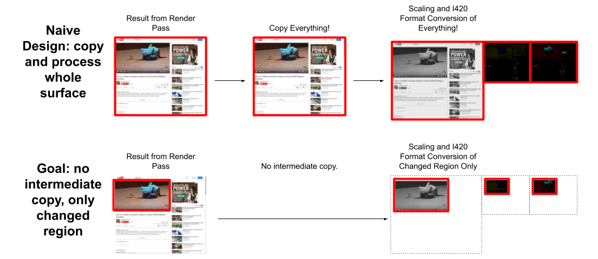
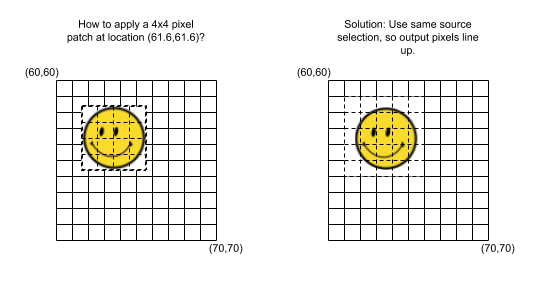

# [Supplemental Documentation: CopyOutputRequests](https://chromium.googlesource.com/chromium/src.git/+/refs/heads/main/components/viz/common/frame_sinks/README.md)

The [CopyOutputRequest](./copy_output_request.h) and
[CopyOutputResult](./copy_output_result.h) headers include rather detailed usage
information. However, that low-level description of a rather complex jumble of
"knobs" alone is insufficient. Developers need to understand the context
surrounding a CopyOutputRequest's use cases. The following information provides
design rationale and explains the intended usage and behaviors of
CopyOutputRequests.

## Goals

 * Minimize cost of making copies (GPU/CPU/memory utilization) by providing
   features that reduce the volume of data being processed and copied.

 * Incorporate high-quality scaling of the source.

 * Provide image format conversion within the GPU (currently, RGBA and
   I420/YUV).

 * Zero-copy interface for GPU readback and result access.

 * Support for [FrameSink Video
   Capture](../../service/frame_sinks/video_capture/) in VIZ.

The following diagram depicts an old, "big-stick" CopyOutputRequest processing
path, as well as the new, current implementation for comparison:

## Controls and Behaviors

With the scaling and image format conversion steps integrated into the
CopyOutputRequest processing, a client would provide the following request
properties:

 * A source selection region is made, in terms of the Surface's (or Layer's)
   coordinate system, using the `set_area()` method. The source selection
   defaults to the entire surface of (0,0)x[surfacewidth, surfaceheight], but
   it may also be set to any subregion within the surface.

 * A result scaling ratio that defines the scaling in both the horizontal and
   vertical directions, in terms of "from S source pixels to T result pixels."
   By default, there is no scaling (the scaling ratio is 1:1). The scale ratios
   are specified to the `SetScaleRatio()` method as pairs of integers (S
   width-by-height and T width-by-height). **Design note:** Floating-point
   values were explicitly not chosen to represent the scale ratio because the
   "patching" of damaged regions demands that request parameters are not
   "fuzzed" by insufficient precision or rounding error effects (users would see
   visible artifacts).

 * The result selection (in terms of the scaled output space) is specified using
   the `set_result_selection()` method. The valid region of the result selection
   is the rect (0,0)x[⌈source_selwidth * scalex⌉, ⌈source_selheight * scaley⌉].
   Note that all coordinates are constrained to be integer values, to avoid
   introducing alignment, rounding or other "fuzz" issues.

 * Result format: An RGBA-interleaved bitmap (SkBitmap), I420 Y+U+V image
   planes, or NV12 Y+UV image planes.

For efficient video capture, the above are used as follows: An issuer of
CopyOutputRequests "locks into" a target area within the Surface (usually the
whole Surface) and "locks into" a scale factor (the ratio between target area
and video frame size); but then varies the result selection of pixels that is
going to be produced for each successive video frame. For the first video frame,
all of the output must be produce (result selection in the request is set to the
entire valid region in the output space). Then, for successive video frames,
only the output pixels that are affected by changes in the source Surface need
to be produced. In other words, the result selection specifies the region of
pixels in the prior video frame that needs to be "patched" to produce a whole
up-to-date video frame.

## "Patching" CopyOutputRequests Example (e.g., for efficient video)

It is helpful to walk through an example sequence of CopyOutputRequests when
executing video capture, to better understand how everything comes together. In
this example, let's assume a source Surface is 800x450 in size, and the output
(for a video frame) is of size 640x360. Then, for the very first frame, all of
the source content needs to be copied+scaled and placed into the first video
frame. To do this, the source region in the request would be set to the rect
(0,0)x[800,450], the result selection would be set to the rect (0,0)x[640,360],
and the scaling ratio would be 800:640 (this ratio is automatically reduced to
the equivalent 5:4 internally).

Then, some time goes by and the source Surface content changes (a.k.a. "takes
damage") in the rect (77,77)x[401,200]. This will cause the video capture
control logic to trigger a "patching" CopyOutputRequest, in order to efficiently
acquire just the changed pixels. The source damage rect maps to the result rect
(61.6,61.6)x[320.8,160] in the output space of the video frame. However, since
partial pixels cannot be generated, this result selection rect must be expanded
to whole pixels in all directions: (61,61)x[322,161]. Thus, the second
CopyOutputRequest will have the same source selection rect as the first and the
same scaling ratio as the first, but with the result selection set to
(61,61)x[322,161]. When the CopyOutputResult is produced, its pixels will be
applied as a patch on top of the prior video frame, in order to produce the next
video frame.

Note that it is important to keep the source selection and scale ratio the same
in all "patching" CopyOutputRequests. If, instead, the source selection is
changed to Surface's damage rect (i.e., **not** using `set_result_selection()`),
the resulting scaled output pixels (the patch) wouldn't line up exactly with the
pixel boundaries in the prior video frame:

Finally, it's worth noting that whenever the source selection (offset or size)
changes, or the scale ratio changes; a full "refresh CopyOutputRequest"
consisting of all the source→output pixels must be made before any successive
"patching only" requests can be made.

Further background: [Design Doc: Dynamic Screen Capture in Chromium](https://docs.google.com/document/d/1YNYaP22fepgP_MXrFXytbo0LOyx29mdCKAsQ2TZAckg/edit?usp=sharing)

*NOTE:* The implementation of CopyOutputRequests is migrating to
[SkiaRenderer](../../service/display/skia_renderer.h) on all platforms (as of
M90 this is complete for Windows, Linux and Android).  This
[implementation](../../service/display_embedder/skia_output_surface_impl_on_gpu.cc)
computes the scale ratio differently from the previous implementation in
`GLRenderer`, which may result in a different alignment of the patch.

The `SkiaRenderer` API takes an integer `source_rect` to sample from and integer
destination size for the output. The ratio between that `source_rect` and
destination size might not be exactly the same as the scale factor specified by
the CopyOutputRequest due to integer rounding.

In the example above, the `SkiaRenderer` copies a source region of
(76,76)x[403,202] to patch a result rect of (61,61)x[322,161], resulting in an
effective scale of (0.799,0.797) instead of (0.8,0.8).

In practice this does not seem to impact quality significantly; see 
[crbug.com/1055939](https://crbug.com/1055939).
