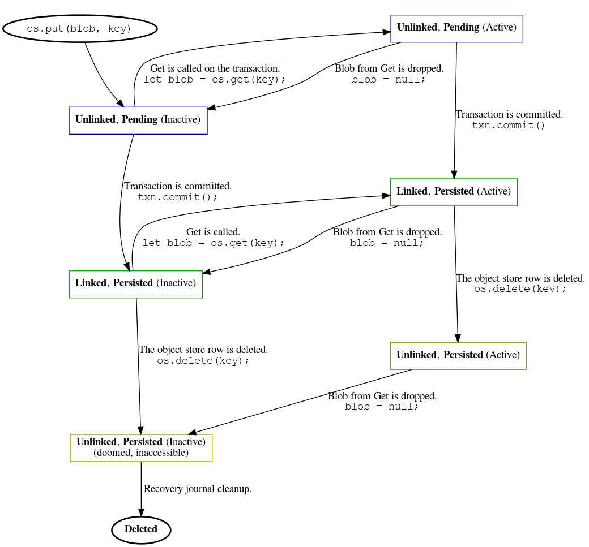

# IndexedDB

## Status
Note - this document is incomplete & under construction.

Currently this terminology in NOT reflected in the codebase yet.

## Common Terminology
### (IndexedDB) Backing Store
The backing store represents all IndexedDB data for an origin. This includes
all IndexedDB databases for that origin. A backing store has a dedicated
leveldb database where all data for that origin is stored.
### LevelDB Database
A leveldb database represents a leveldatabase database. Each backing store has
a unique leveldb database, located at:
`IndexedDB/<serialized_origin>.leveldb/`

### IndexedDB Database
An IndexedDB database represents a database in the IndexedDB API. The backing
store can contain many IndexedDB  databases. So a single LevelDB database has
multiple IndexedDB databases.

IndexedDB databases are identified by a unique auto-incrementing `int64_t`
`database_id`.

## Blob Storage
Blob are supported in IndexedDB to allow large values to be stored in IndexedDB
without needing to save them directly into leveldb (which doesn't work well
with large values). Blobs are a special type of "External Object", i.e. objects
where some other subsystem in chrome is involved in managing them.

### Blob States
Blob can be in the following states:

#### _Linked_ vs _Unlinked_
A **linked** blob is a blob that has a saved reference in the database by a
BlobEntryKey. If a blob has been deleted from the database, or if it has not
been written yet, it is **unlinked**.

#### _Persisted_ vs _Pending_
A **persisted** blob is stored on disk in the IndexedDB system. A **pending**
blob is backed by an external client, and has not been stored on disk in the
IndexedDB system.

When the database is in in-memory or 'incognito' mode, blobs are never written
to disk. This means they always stay **pending**.

#### _Active_ vs _Inactive_
An **active** blob has an active reference in some client. An **inactive** blob
has no client references.

#### State combinations, on-disk

|               | **Linked** | **Unlinked** |
| ------------: | :--------: | :----------: |
| **Persisted** | ✓          | Active: ✓ Inactive: 🛇 (well, ✓ but deleted soon) |
| **Pending**   | 🛇          | ✓            |

#### State combinations, in-memory (incognito)
Blobs are never persisted to disk in incognito mode.

|               | **Linked** | **Unlinked** |
| ------------: | :--------: | :----------: |
| **Persisted** | 🛇          | 🛇          |
| **Pending**   | ✓          | ✓            |

#### State Flow Diagram, on-disk

### Blob Terminology
#### Blob Number
A blob number is a `int64_t` number that is unique and auto-incrementing per
database in an origin. This is used to uniquely identify a blob in an IndexedDB
database.

#### Blob Key
A blob key is a `int64_t` `database_id` and a unique auto-incrementing
`int64_t` `blob_number`. The database metadata contains a
`BlobNumberGeneratorCurrentNumber` which is used to save the next blob key number
to use.

A blob key uniquely identifies a blob in an backing store.

####  Blob File
A blob file is the physical file stored on disk that represents a **persisted**
blob. It resides in the following directory:
`IndexedDB/<serialized_origin>.blob/<database_id>/<blob_number>`
Note that `database_id` + `blob_number` is a unique blob key.

A blob that has been **persisted** in the database is stored in a blob file.
This file is deleted when the blob is **unlinked** and **inactive**.
(Technically this is done by adding the corresponding blob key is added to the
recovery journal, which is processed every once in a while to delete unused
files).

There is a 1:1 mapping between a blob file and a blob key.

#### Blob Handle
This is-a `storage::BlobDataHandle` OR a `blink::BlobDataHandle` OR a
`mojo::Remote<storage::mojom::Blob>`.

Blob handles basically hold a reference to the given blob, which allows
IndexedDB (or a client) to keep the blob alive and/or read the blob.

#### Blob Info
A  blob info is one version of-a
[IndexedDBExternalObject](../indexed_db_external_object.h), and
basically contains all of the information needed to read a blob. This means it
has a blob handle if it is a **pending** blob, and/or the file information if
it is a **persisted** blob.

If the blob handle is present, that means this holds a reference to that blob
and keeps it alive in the blob system.

#### Blob Entry
A blob entry contains a vector of blob infos that are **persisted** in the
database. All of these blob infos, at least initially, do not have a blob
handle, and only contain the blob key & blob file information (like size, type,
time modified, etc).

A Blob Entry is a value that is saved into the database using a `BlobEntryKey`:

#### `BlobEntryKey`
A `BlobEntryKey` is used as a key in the leveldb database and contains the
`database_id`, `object_store_id`, and `user_object_store_data_key`. A
`BlobEntryKey` can be used to look up a blob entry in the database for the
given object store data key.

#### Recovery Journal
The recovery journal is a list of blob keys that are pending deletion. These
blob keys represent blobs that are in an **unlinked**, **inactive**, and
**persisted** state.

This is used to maintain consistency if a crash occurs or if there is an error
while committing a transaction. The recovery journal is "processed"
intermittently when there isn't an active transaction. Processing means that
every blob file referenced in the journal (by the blob key) is deleted, and the
journal is cleared.

The recovery journal is where all blob keys that are to-be-deleted by a
transaction are placed. (They are subsequently immediately deleted after the
transaction is committed, but this can fail / crash so they are placed in the
journal first).

#### Active Journal
This is used to keep track of all blobs that are in an  **unlinked**,
**active**, and **persisted** state. Blobs are added to this journal during the
second phase of an IndexedDB transaction's commit, and contains blobs that are
referenced by clients that would have otherwise been deleted (well, added to
the recovery journal) by the transaction. When the a client stops using the
given blob, then the key is added to the recovery journal and removed from the
active journal.