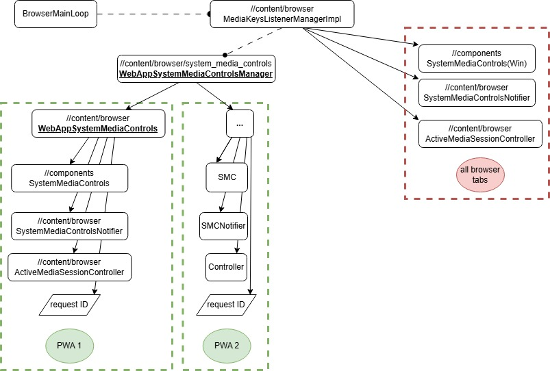

# Overview

System Media Controls (SMC) refers to the system across Chromium that allows
playing media to show up in OS surfaces. These OS surfaces typically display
what is playing and provide some controls for the user to control the playing
media directly.

System Media Controls as a result has associated components across the
//chrome/browser //content boundaries. This is required because SMC requires two
way communication between a renderer process, the browser process and the
operating system. For example, a web page may begin to play a new track which
needs to be reflected in the OS information display. In the reverse direction,
the user may ask to pause media from the OS, which travels to the browser
process, which then must be able to pause the media on the web page.

# Desktop Progressive Web Apps (dPWAs) & Instanced SMC

Normally, SMC is a singleton and all Chrome tabs and windows share an instance.
This works reasonably well and in most typical usages this is enough.

Since dPWAs strive to appear as standalone applications, it makes sense to make
dPWAs have their own SMC instances that allows them each to look like a separate
application is playing audio rather than just sharing the Chromium instance.

Instanced SMC achieves this by orchestrating an instance of SMC for each dPWA.
Each instance is able to communicate to the OS independently, and looks like a
separate standalone app - and is able to control the media playing for that
specific dPWA.

Instanced SMCs for dPWAs has been enabled on MacOS and Win since m130.

# How it works:

For the browser (i.e. not dPWAs), MediaKeysListenerManagerImpl creates the
singleton SMC object which is not stored inside the
`WebAppSystemMediaControlsManager`.

This singleton tracks whatever most recently active media is playing within the
browser, it will not track media playing in PWAs.

For dPWAs, `WebAppSystemMediaControlsManager` is the primary coordinator
class who holds all the instanced system media controls. It knows if a dPWA
already has an associated system media controls connection or whether it needs
to be created.

This manager in turn holds a collection of objects for each dPWA which is used
by that dPWA to communicate with the OS.

# Other significant classes

`//components/system_media_controls` contains a lot of the platform specific
code to implement this functionality.

code in `//content/browser/media` is used to be notified of events happening in
the renderer, some notable ones include:

- `active_media_session_controller.h` is used to control instances of playing
media. System Media Controls uses this to either track specific dPWAs playing
media or implement the browser singleton that follows the active media playing
in the browser.

- `system_media_controls_notifier.h` receives messages from media playing and
notifies the corresponding `SystemMediaControls` object in order to update the
OS.

# Design documents

- [Windows design document](https://docs.google.com/document/d/12dVKreUCjtZZaUqeh3VxGMsGPMC4POhK/edit?usp=sharing&ouid=113664513277886073058&rtpof=true&sd=true)
- [MacOS design document](https://docs.google.com/document/d/1k_JKoNNYDaABnJoe6OGE1ftAqhCPAy79/edit?usp=sharing&ouid=113664513277886073058&rtpof=true&sd=true)