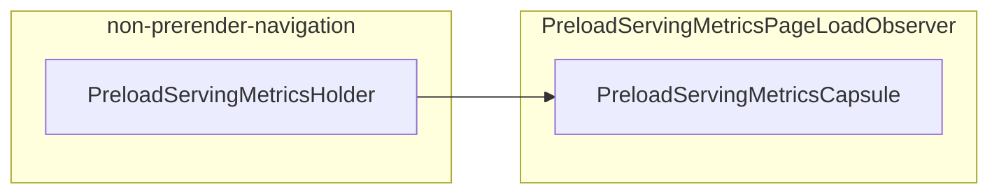
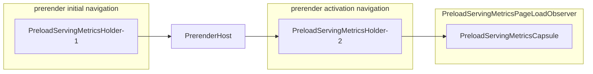

# PreloadServingMetrics: Logs/metrics related to preload serving

Design doc: https://docs.google.com/document/d/1bBhfhO7BotUB7Myy_8mtFF_4lI5N8hUyNayV_gI019Y

This document will become truth once the CL https://crrev.com/c/6884362 has
landed.
TODO(crrev.com/360094997): Remove the above.

## Goal

Enable collecting, recording, and analyzing serving metrics of preloads. For example:

- Continuously collect page load metrics for navigations under different
  conditions: without preloads, with prefetch used, and with prerender used.
  (E.g. to evaluate improvements of preload execution stacks.)
- Investigate the cause of regressions from new features by
  understanding what is happening during the serving phase.

## Overview

Logs/metrics are processed in three steps:

1. Log objects are recorded in each component of preloads.
2. During a navigation, log objects are collected and associated with that
   navigation.
3. At the end of the navigation, the collected logs are recorded as metrics
   (UMAs/UKMs) if certain conditions are met. (E.g. a prerender initial
   navigation is cancelled.)

## Logs

`PreloadServingMetrics` collects per-navigation, **serving-related** data about
preloads, and contains logs objects collected from several preloading components.

While `PreloadServingMetrics` must be **serving**-side metrics, it also collects
and uses non-serving-side data (e.g., data about prefetching or the initial
prerender navigation) insofar as it relates to the serving navigation.

(Some of the non-serving-side data contained in log objects are also used for
non-serving-side metrics outside `PreloadServingMetrics`.)

Examples:

- `PreloadServingMetrics`: Log of preloads associated with a navigation. May hold:
  - `PrefetchMatchMetrics` and
  - `PreloadServingMetrics` for prerender initial navigation (if the navigation
    is prerender activation navigation).
- `PrefetchMatchMetrics`: Log of prefetch matching. May hold
  `PrefetchContainerMetrics`.
- `PrefetchContainerMetrics`: Log of `PrefetchContainer`.
  - This contains data about the prefetching phase.
  - This is used for `PreloadServingMetrics`, only in the context of serving
    metrics (e.g., when the corresponding prefetch received the non-redirect
    header relative to the serving/navigation timing).
  - This is also used for metrics outside `PreloadServingMetrics` (including
    prefetching-side metrics).

The log objects are always:

- `struct`
- Passed by `std::unique_ptr<>`.
- Not movable.

Each log object is built by a related component, and becomes read-only outside
that component. For example, `PrefetchContainerMetrics` is built by
`PrefetchContainer`. It will be copied to a field of
`PrefetchMatchMetrics`, and read-only after the copy. See each log object's
comment to identify its builder component.

## Life of `PreloadServingMetrics` {#life-of-PreloadServingMetrics}

A `PreloadServingMetrics` object is created per-navigation and is owned by
`PreloadServingMetricsHolder` until navigation commit or failure.

After that, the ownership is moved to:

- `PrerenderHost` for committed prerender initial navigation.
  - The `PreloadServingMetrics` from the initial prerender navigation is then
    moved to the activation navigation's `PreloadServingMetrics` and processed
    along with it.
- `PreloadServingMetricsPageLoadMetricsObserver` (via
  `PreloadServingMetricsCapsule` that exposes `PreloadServingMetrics` to
  `//content` public) for committed non-prerender-initial navigation.
  - `PreloadServingMetricsPageLoadMetricsObserver` records UMAs/UKMs based on
    `PreloadServingMetrics`, when a navigation is committed and FCP is received.
- Discarded with recording UMAs/UKMs if it is a failed prerender initial navigation.
- Discarded without recording UMAs/UKMs otherwise.

Non-prerender navigation:

- If navigation is not committed, `PreloadServingMetrics` is not taken.

Prerender navigations:

- If the prerender initial navigation is not committed and fails,
  `PreloadServingMetrics` is taken by `PrerenderHost` and used to report
  metrics for failure.
- If the prerender initial navigation is committed but `PrerenderHost` is
  cancelled, the same applies.

## Test

Tests are managed in

- //content/browser/preloading/preload_serving_metrics_unittest.cc
  - Detailed checks of the correspondence between the `PreloadServingMetrics`
    structure and the recorded metrics.
- //content/browser/preloading/prerenderer_impl_browsertest.cc
  - End-to-end checks for basic scenarios.
- //chrome/browser/preloading/search_preload/search_preload_browsertest.cc
  - End-to-end checks that include `PreloadServingMetricsPageLoadMetricsObserver`.
