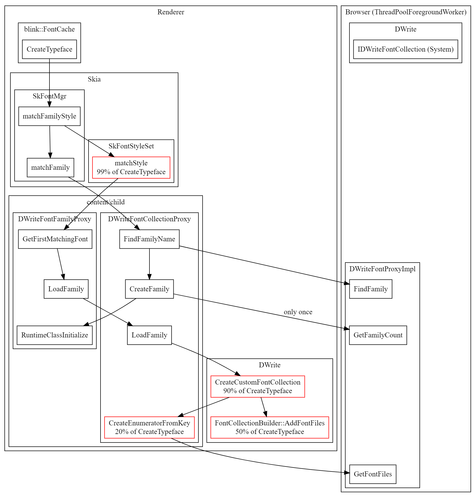

# DWriteFontProxy #

This directory contains Windows DirectWrite classes
that runs in the renderer process.

This README can be viewed in formatted form [here](https://chromium.googlesource.com/chromium/src/+/main/content/child/dwrite_font_proxy/README.md).

The `DWriteFontCollectionProxy` is a single-instance object.
It creates an instance of `DWriteFontFamilyProxy` for each font family
by making mojo calls to `DWriteFontProxyImpl` in the browser process.

Please see the following diagram for the call flows.

